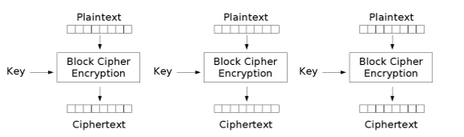
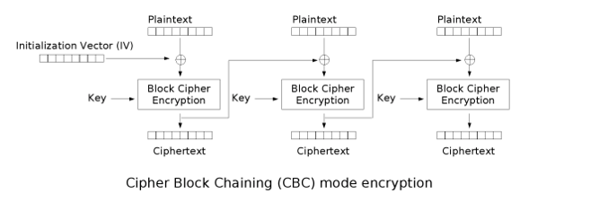

# 现代密码

## 对称加密

### 分组密码

又称块密码，将明文消息的二进制序列划分为固定大小的块，每块分别在密钥控制下变换成等长的二进制密文序列。

#### 工作模式

1. 前一个分组的加密结果会影响到下一个分组的加密结果。如 CBC 模式、CFB 模式、OFB 模式。

   

2. 前一个分组的加密结果和下一个分组独立。如 ECB 模式、CTR 模式。

   

## 非对称加密

### RSA

[RSA 加密算法 - 维基百科](https://zh.wikipedia.org/wiki/RSA%E5%8A%A0%E5%AF%86%E6%BC%94%E7%AE%97%E6%B3%95)

RSA加密算法是一种非对称加密算法。在公开密钥加密和电子商业中 RSA 被广泛使用。RSA 是 1977 年由罗纳德·李维斯特（Ron Rivest）、阿迪·萨莫尔（Adi Shamir）和伦纳德·阿德曼（Leonard Adleman）一起提出的。当时他们三人都在麻省理工学院工作。RSA 就是他们三人姓氏开头字母拼在一起组成的。

对极大整数做因数分解的难度决定了 RSA 算法的可靠性。换言之，对一极大整数做因数分解愈困难，RSA 算法愈可靠。假如有人找到一种快速因数分解的算法的话，那么用 RSA 加密的信息的可靠性就肯定会极度下降。但找到这样的算法的可能性是非常小的。今天只有短的 RSA 钥匙才可能被强力方式解破。到 2016 年为止，世界上还没有任何可靠的攻击 RSA 算法的方式。只要其钥匙的长度足够长，用 RSA 加密的信息实际上是不能被解破的。

#### 算法

**公钥与私钥的产生**

1. 随机选择两个大质数 $$p$$ 和 $$q$$，且二者不相等，计算 $$N=p \times q$$。
2. 根据欧拉函数，求得 $$r=\varphi (N)=\varphi (p)\varphi (q)=(p-1)(q-1)$$。
3. 选择一个小于 $$r$$ 的整数 $$e$$，使 $$e$$ 和 $$r$$ 互质。并求得 $$e$$ 关于 $$r$$ 的模反元素 ，命名为 $$d$$（求 $$d$$ 令 $$ed\equiv 1\ (mod\ r)$$）。
4. 将 $$p$$ 和 $$q$$ 的记录销毁。

此时，$$(N,e)$$ 是公钥，$$(N,d)$$ 是私钥。