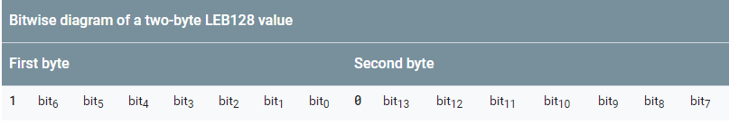
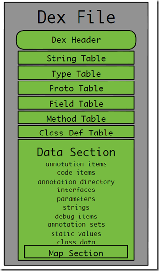
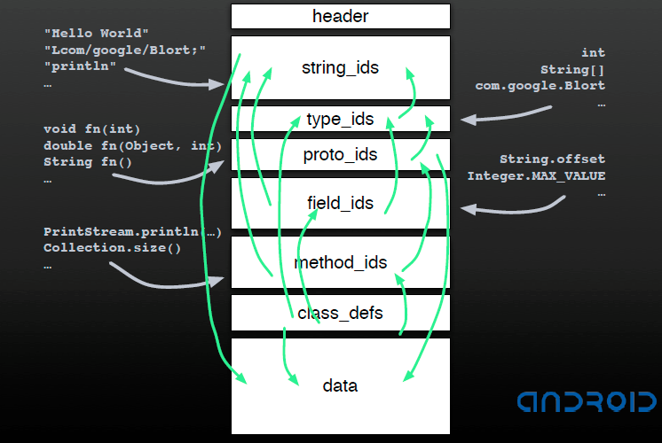

[EN](./dex.md) | [ZH](./dex-zh.md)
# DEX文件

## 基本介绍

Google 为 Android 中的 Java 代码专门设计了对应的可执行文件 DEX（Dalvik eXecutable File），适用于手机这样的内存低和处理器性能较差的移动平台。下面，我们就来主要介绍一下DEX文件的格式。

## DEX 文件格式

### 数据类型定义

在介绍 DEX  文件的具体结构之前，我们先来关注一下 DEX 文件中所使用的一些基础的数据类型。

| 名称        | 说明                         |
| --------- | -------------------------- |
| byte      | 8 位有符号整数                   |
| ubyte     | 8 位无符号整数                   |
| short     | 16 位有符号整数，采用小端字节序          |
| ushort    | 16 位无符号整数，采用小端字节序          |
| int       | 32 位有符号整数，采用小端字节序          |
| uint      | 32 位无符号整数，采用小端字节序          |
| long      | 64 位有符号整数，采用小端字节序          |
| ulong     | 64 位无符号整数，采用小端字节序          |
| sleb128   | 有符号 LEB128，可变长度（见下文）       |
| uleb128   | 无符号 LEB128，可变长度（见下文）       |
| uleb128p1 | 无符号 LEB128 加 `1`，可变长度（见下文） |

其中之所以会采用变长的数据类型是因为希望可以尽可能减少可执行文件的占用空间，比如说如果一个字符串的长度为5，那么我们其实只需要一个字节即可，但是我们又不希望直接使用`u1` 来进行定义相应类型，因为这样会把所有的字符串长度都限制在相应的范围内。

可变长度的类型其实都是基于 LEB128(Little-Endian Base) 类型的，可以用于表示 32 位大小的 int 数字，其根据所要表示的数字的大小来选择合适的长度。如下图所示，其中每个字节的最高位表示是否使用下一个字节，1 表示使用，0 表示不使用。故而每个字节其实只有 7 个有效的 bit 位用来表示相应的数字。如果有一个 LEB128 类型的变量使用了 5 个字节，并且第五个字节的最高位为 1 ，那说明出现了问题。



dalvik中读取无符号leb128类型的函数如下

```c++
DEX_INLINE int readUnsignedLeb128(const u1** pStream) {
    const u1* ptr = *pStream;
    int result = *(ptr++);      //取第一个字节
    if (result > 0x7f) {        //如果第1个字节大于0x7f,表示第一个字节最高位为1
        int cur = *(ptr++);     //第2个字节
        result = (result & 0x7f) | ((cur & 0x7f) << 7); //前两个字节
        if (cur > 0x7f) {
            cur = *(ptr++);
            result |= (cur & 0x7f) << 14;
            if (cur > 0x7f) {
                cur = *(ptr++);
                result |= (cur & 0x7f) << 21;
                if (cur > 0x7f) {
                    /*
                     * Note: We don't check to see if cur is out of
                     * range here, meaning we tolerate garbage in the
                     * high four-order bits.
                     */
                    cur = *(ptr++);
                    result |= cur << 28;
                }
            }
        }
    }
    *pStream = ptr;
    return result;
}
```

举个例子，假如我们要计算c0 83 92 25的uleb128值，如下

- 第一个字节的最高位为1，所以有第二个字节。result1 = 0xc0 & 0x7f=0x40
- 类似的，第二个字节对应的result2 = (0x83 & 0x7f)<<7 = 0x180
- 第三个字节对应的result3 = (0x92 & 0x7f) <<14 =  0x48000
- 第四个字节对应的result4 = (0x25)<<21 = 0x4a00000
- 该字节流对应的值为result1+result2+result3+result4 = 0x4a481c0

dalvik中读取有符号的LEB128类型的数字如下

```c++
 DEX_INLINE int readSignedLeb128(const u1** pStream) {
    const u1* ptr = *pStream;
    int result = *(ptr++);
    if (result <= 0x7f) {
        result = (result << 25) >> 25;   //符号扩展
    } else {
        int cur = *(ptr++);
        result = (result & 0x7f) | ((cur & 0x7f) << 7);
        if (cur <= 0x7f) {
            result = (result << 18) >> 18; //符号扩展
        } else {
            cur = *(ptr++);
            result |= (cur & 0x7f) << 14; //符号扩展
            if (cur <= 0x7f) {
                result = (result << 11) >> 11; //符号扩展
            } else {
                cur = *(ptr++);
                result |= (cur & 0x7f) << 21;
                if (cur <= 0x7f) {
                    result = (result << 4) >> 4;  //符号扩展
                } else {
                    /*
                     * Note: We don't check to see if cur is out of
                     * range here, meaning we tolerate garbage in the
                     * high four-order bits.
                     */
                    cur = *(ptr++);
                    result |= cur << 28;
                }
            }
        }
    }
    *pStream = ptr;
    return result;
}
```

举个例子，假如我们要计算d1 c2 b3 40的sleb128值，计算过程如下

- result1 = 0xd1 & 0x7f = 0x51
- result2 = (0xc2 & 0x7f) <<7  = 0x21000
- result3 = (0xb3 & 0x7f) <<14  =0xcc000
- result4 = (0x40)<< 21 = 0x8000000
- 最后结果(r1+r2+r3+r4)<< 4 >>4 = 0xf80ce151


uleb128p1类型主要是用表示无符号数，其适用于以下场景

- 要求数字的表示必须非负
- 当数字为0xffffffff时，其加上1就为0，这时候我们就只需要1个字节即可。
- **有待进一步思考。**

### DEX 文件概览

DEX文件的整体结构如下



主要包括三个部分

- 文件头，给出dex文件的基本属性。
- 索引区，给出相关数据的索引，其数据其实放在数据区。
- 数据区，存放真实的字符串，代码。

### DEX 文件头

DEX的文件头主要包含magic字段、alder32校验值、SHA-1哈希值、string_ids的个数以及偏移地址等，固定占用0x70个字节，数据结构如下

```c++
struct DexHeader {
    u1  magic[8];           /* includes version number */
    u4  checksum;           /* adler32 checksum */
    u1  signature[kSHA1DigestLen]; /* SHA-1 hash */
    u4  fileSize;           /* length of entire file */
    u4  headerSize;         /* offset to start of next section */
    u4  endianTag;
    u4  linkSize;
    u4  linkOff;
    u4  mapOff;
    u4  stringIdsSize;
    u4  stringIdsOff;
    u4  typeIdsSize;
    u4  typeIdsOff;
    u4  protoIdsSize;
    u4  protoIdsOff;
    u4  fieldIdsSize;
    u4  fieldIdsOff;
    u4  methodIdsSize;
    u4  methodIdsOff;
    u4  classDefsSize;
    u4  classDefsOff;
    u4  dataSize;
    u4  dataOff;
};
```

其中具体的描述如下

| 名称              | 格式                        | 说明                                       |
| --------------- | ------------------------- | ---------------------------------------- |
| magic           | ubyte[8] = DEX_FILE_MAGIC | 标识DEX文件，其中DEX_FILE_MAGIC ="dex\n035\0"   |
| checksum        | uint                      | 除 `magic` 和此字段之外的文件剩下内容的 adler32 校验和，用于检测文件损坏情况 |
| signature       | ubyte[20]                 | 除 `magic`、`checksum` 和此字段之外的文件的内容的 SHA-1 签名（哈希），用于对文件进行唯一标识 |
| file_size       | uint                      | 整个文件（包括文件头）的大小，以字节为单位                    |
| header_size     | uint = 0x70               | 文件头的大小，以字节为单位。                           |
| endian_tag      | uint = ENDIAN_CONSTANT    | 字节序标记，大端序或者小端序。                          |
| link_size       | uint                      | 如果此文件未进行静态链接，则该值为 `0`，反之为链接区段的大小，        |
| link_off        | uint                      | 如果 `link_size == 0`，则该值为 `0`； 反之，该偏移量是文件开头到到 `link_data` 区段的偏移量。 |
| map_off         | uint                      | 该偏移量必须非零，标识从文件开头到 `data` 区段的偏移量。         |
| string_ids_size | uint                      | 字符串标识符列表中的字符串数量                          |
| string_ids_off  | uint                      | 如果 `string_ids_size == 0`（不可否认是一种奇怪的极端情况），则该值为 `0`； 反之表示从文件开头到`string_ids`的偏移量。 |
| type_ids_size   | uint                      | 类型标识符列表中的元素数量，最大为 65535                  |
| type_ids_off    | uint                      | 如果 `type_ids_size == 0`（不可否认是一种奇怪的极端情况），则该值为 `0`； 反之表示从文件开头到 `type_ids` 区段开头的偏移量。 |
| proto_ids_size  | uint                      | 原型（方法）标识符列表中的元素数量，最多为 65535              |
| proto_ids_off   | uint                      | 如果 `proto_ids_size == 0`（不可否认是一种奇怪的极端情况），则该值为 `0`； 反之该偏移量表示文件开头到 `proto_ids` 区段开头的偏移量。 |
| field_ids_size  | uint                      | 字段标识符列表中的元素数量                            |
| field_ids_off   | uint                      | 如果 `field_ids_size == 0`，则该值为 `0`； 反之该偏移量表示文件开头到 `field_ids` 区段开头的偏移量。 |
| method_ids_size | uint                      | 方法标识符列表中的元素数量                            |
| method_ids_off  | uint                      | 如果 `method_ids_size == 0`，则该值为 `0`。反之该偏移量表示从文件开头到 `method_ids` 区段开头的偏移量。 |
| class_defs_size | uint                      | 类定义列表中的元素数量                              |
| class_defs_off  | uint                      | 如果 `class_defs_size == 0`（不可否认是一种奇怪的极端情况），则该值为 `0` ；反之该偏移量表示文件开头到 `class_defs` 区段开头的偏移量。 |
| data_size       | uint                      | `data` 区段的以字节为单位的大小，必须是 sizeof(uint) 的偶数倍，说明8字节对齐。 |
| data_off        | uint                      | 从文件开头到 `data` 区段开头的偏移量。                  |

### DEX 索引区

#### string id

StringIds 区段包含`stringIdsSize`个`DexStringId`结构，其结构如下：

```c++
struct DexStringId {
    u4 stringDataOff;   /* 字符串数据偏移，也就是数据区中各个 StringData 的文件偏移*/
};
```

可以看出DexStringId中存储的只是每一个字符串的相对偏移。此外，每一个偏移占据4个字节，字符串部分一共会占据4*stringIdsSize个字节。

在对应的偏移处，字符串是使用MUTF-8格式存储的，其开头存储了之前我们所说的LEB128类型的变量，表示字符串的长度，之后紧跟着的就是字符串，之后以\x00结尾，字符串的长度不包含\x00。

#### type id

type_ids 区索引了java代码中使用的所有类型（类、数组或基本类型），此列表必须按 `string_id` 索引进行排序，并且不能重复。

```c++
struct DexTypeId {
    u4 descriptorIdx;    /* 指向 DexStringId列表的索引 */
};
```

#### proto Id

Proto id字段主要是针对于 java 中的方法原型而设计的，这里面主要包含了一个方法声明的返回类型与参数列表，对于方法名尚未涉及。其主要包含以下三个数据结构

```c++
struct DexProtoId {
    u4 shortyIdx;       /* 返回类型+参数类型，简写，指向DexStringId列表的索引 */
    u4 returnTypeIdx;   /* 返回类型，指向DexTypeId列表的索引 */
    u4 parametersOff;   /* 参数类型，指向DexTypeList的偏移 */
}

struct DexTypeList {
    u4 size;             /* DexTypeItem的个数，即参数个数 */
    DexTypeItem list[1]; /* 指向DexTypeItem开始处 */
};

struct DexTypeItem {
    u2 typeIdx;           /* 参数类型，指向DexTypeId列表的索引，最终指向字符串索引 */
};
```

#### field id

field id区主要是针对于java中每个类的字段而设计的，主要涉及到以下数据结构

```c++
struct DexFieldId {
    u2 classIdx;   /* 类的类型，指向DexTypeId列表的索引 */
    u2 typeIdx;    /* 字段类型，指向DexTypeId列表的索引 */
    u4 nameIdx;    /* 字段名，指向DexStringId列表的索引 */
};
```

#### method id

method id区是直接为 java 中的方法而设计的，其包含了方法所在的类，方法的原型，方法的名字。

```c++
struct DexMethodId {
    u2 classIdx;  /* 类的类型，指向DexTypeId列表的索引 */
    u2 protoIdx;  /* 声明类型，指向DexProtoId列表的索引 */
    u4 nameIdx;   /* 方法名，  指向DexStringId列表的索引 */
};
```


#### class def

classDefsSize表明 class def 区域的大小，classDefsOff表明class def 区的偏移。

该区是为 java 中的类而设计的，包含以下的数据结构，相关信息如下

```c++
// 类的基本信息
struct DexClassDef {
    u4 classIdx;    /* 类的类型，指向DexTypeId列表的索引 */
    u4 accessFlags; /* 访问标志 */
    u4 superclassIdx;  /* 父类类型，指向DexTypeId列表的索引 */
    u4 interfacesOff; /* 接口，指向DexTypeList的偏移 */
    u4 sourceFileIdx; /* 源文件名，指向DexStringId列表的索引 */
    u4 annotationsOff; /* 注解，指向DexAnnotationsDirectoryItem结构 */
    u4 classDataOff;   /* 指向DexClassData结构的偏移 */
    u4 staticValuesOff;  /* 指向DexEncodedArray结构的偏移 */
};

// 类的字段与方法概况
struct DexClassData {
    DexClassDataHeader header; /* 指定字段与方法的个数 */
    DexField* staticFields;    /* 静态字段，DexField结构 */
    DexField* instanceFields;  /* 实例字段，DexField结构 */
    DexMethod* directMethods;  /* 直接方法，DexMethod结构 */
    DexMethod* virtualMethods; /* 虚方法，DexMethod结构 */

// 详细描述类的字段个数与方法个数
struct DexClassDataHeader {
    u4 staticFieldsSize;  /* 静态字段个数 */
    u4 instanceFieldsSize; /* 实例字段个数 */
    u4 directMethodsSize;  /* 直接方法个数 */
    u4 virtualMethodsSize; /* 虚方法个数 */
};

// 字段定义
struct DexField {
    u4 fieldIdx;    /* 指向DexFieldId的索引 */
    u4 accessFlags; /* 访问标志 */
};

// 方法定义
struct DexMethod {
    u4 methodIdx;   /* 指向DexMethodId的索引 */
    u4 accessFlags; /* 访问标志 */
    u4 codeOff;     /* 指向DexCode结构的偏移 */
};

// 代码概况
struct DexCode {
    u2 registersSize;   /* 使用的寄存器个数 */
    u2 insSize;         /* 参数个数 */
    u2 outsSize;        /* 调用其他方法时其它方法使用的寄存器个数，会在自己的调用栈申请，并压栈（猜测） */
    u2 triesSize;       /* Try/Catch个数 */
    u4 debugInfoOff;    /* 指向调试信息的偏移 */
    u4 insnsSize;       /* 指令集个数，以2字节为单位 */
    u2 insns[1];        /* 指令集 */
};
```

#### 小结

可以看出在索引区指向是比较复杂的，但同时也比较巧妙，这里给出Dalvik设计者在[Google Developer Day 2008 China](https://sites.google.com/site/developerdaychina/) 演讲中给出的例子。



### DEX 数据区

这里存的就是之前所说的各种数据了。

### DEX map section

DexHeader中的mapOff字段给出了DexMapList结构在DEX文件中的偏移。当Dalvik虚拟机解析DEX文件后的内容后，会将内容映射到DexMapList数据结构，可以说该结构描述了对应的DEX文件的整体概况。其具体代码如下

```c++
struct DexMapList {
    u4 size;               /* DexMapItem的个数，方便解析 */
    DexMapItem list[1];    /* 指向DexMapItem */
};

struct DexMapItem {
    u2 type;      /* kDexType开头的类型 */
    u2 unused;    /* 未使用，用于字节对齐 */
    u4 size;      /* 指定相应类型的个数 */
    u4 offset;    /* 指定相应类型的数据的文件偏移 */
};

/* type字段为一个枚举常量，通过类型名称很容易判断它的具体类型。 */
/* map item type codes */
enum {
    kDexTypeHeaderItem               = 0x0000,
    kDexTypeStringIdItem             = 0x0001,
    kDexTypeTypeIdItem               = 0x0002,
    kDexTypeProtoIdItem              = 0x0003,
    kDexTypeFieldIdItem              = 0x0004,
    kDexTypeMethodIdItem             = 0x0005,
    kDexTypeClassDefItem             = 0x0006,
    kDexTypeMapList                  = 0x1000,
    kDexTypeTypeList                 = 0x1001,
    kDexTypeAnnotationSetRefList     = 0x1002,
    kDexTypeAnnotationSetItem        = 0x1003,
    kDexTypeClassDataItem            = 0x2000,
    kDexTypeCodeItem                 = 0x2001,
    kDexTypeStringDataItem           = 0x2002,
    kDexTypeDebugInfoItem            = 0x2003,
    kDexTypeAnnotationItem           = 0x2004,
    kDexTypeEncodedArrayItem         = 0x2005,
    kDexTypeAnnotationsDirectoryItem = 0x2006,
};
```

## DEX实例

具体的可以自己找一个 apk，然后拿 010editor 的模板解析一下就可以看到相应的结果了。

## 参考阅读

- Android 软件安全与逆向分析
