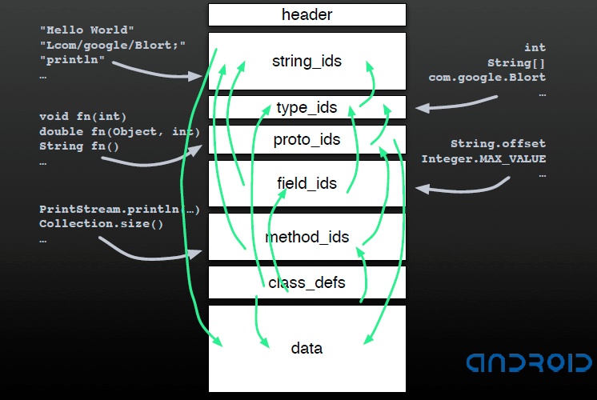

[EN](./dex.md) | [ZH](./dex-zh.md)
# DEX file


## basic introduction


Google has designed the corresponding executable file DEX (Dalvik eXecutable File) for Java code in Android, which is suitable for mobile platforms such as mobile phones with low memory and poor processor performance. Below, we will mainly introduce the format of the DEX file.


## DEX file format


### Data type definition


Before we introduce the specific structure of the DEX file, let&#39;s take a look at some of the basic data types used in the DEX file.


| Name | Description|
| --------- | -------------------------- |

| byte | 8-bit signed integer |
| ubyte | 8-bit unsigned integer |
| short | 16-bit signed integer in little endian |
| ushort | 16-bit unsigned integer in little endian |
| int | 32-bit signed integer in little endian |
| uint | 32-bit unsigned integer in little endian |
Long | 64-bit signed integer in little endian |
| ulong | 64-bit unsigned integer in little endian |
| sleb128 | Signed LEB128, variable length (see below) |
| uleb128 | Unsigned LEB128, variable length (see below) |
| uleb128p1 | Unsigned LEB128 plus `1`, variable length (see below) |


The reason why the variable length data type is used is because you want to minimize the footprint of the executable file. For example, if the length of a string is 5, then we only need one byte, but we don&#39;t I would like to use `u1` directly to define the corresponding type, as this will limit all string lengths to the corresponding range.


Variable-length types are actually based on the LEB128 (Little-Endian Base) type and can be used to represent 32-bit int numbers, which are chosen according to the size of the number to be represented. As shown in the figure below, the highest bit of each byte indicates whether the next byte is used, 1 means use, 0 means not used. Therefore, each byte actually has only 7 valid bits to indicate the corresponding number. If there is a variable of type LEB128 that uses 5 bytes and the highest bit of the fifth byte is 1, then there is a problem.


The function of reading unsigned leb128 type in dalvik is as follows


```c++

DEX_INLINE int readUnsignedLeb128(const u1** pStream) {

const u1 * ptr = * pStream;
Int result = *(ptr++); //take the first byte
If (result &gt; 0x7f) { //If the first byte is greater than 0x7f, the highest byte of the first byte is 1
Int cur = *(ptr++); //2nd byte
Result = (result &amp; 0x7f) | ((cur &amp; 0x7f) &lt;&lt; 7); //The first two bytes
        if (cur > 0x7f) {

cur = * (ptr ++);
            result |= (cur & 0x7f) << 14;

            if (cur > 0x7f) {

cur = * (ptr ++);
                result |= (cur & 0x7f) << 21;

                if (cur > 0x7f) {

                    /*

                     * Note: We don't check to see if cur is out of

                     * range here, meaning we tolerate garbage in the

                     * high four-order bits.

                     */

cur = * (ptr ++);
                    result |= cur << 28;

                }

            }

        }

    }

* pStream = ptr;
    return result;

}

```


For example, if we want to calculate the uleb128 value of c0 83 92 25, as follows


- The highest bit of the first byte is 1, so there is a second byte. Result1 = 0xc0 &amp; 0x7f=0x40
- Similarly, the second byte corresponds to result2 = (0x83 &amp; 0x7f)&lt;&lt;7 = 0x180
- The result of the third byte is result3 = (0x92 &amp; 0x7f) &lt;&lt;14 = 0x48000
- result4 of the fourth byte = (0x25)&lt;&lt;21 = 0x4a00000
- The value corresponding to this byte stream is result1+result2+result3+result4 = 0x4a481c0


The number of signed LEB128 types in dalvik is as follows


```c++

 DEX_INLINE int readSignedLeb128(const u1** pStream) {

const u1 * ptr = * pStream;
int result = * (ptr ++);
    if (result <= 0x7f) {

Result = (result &lt;&lt; 25) &gt;&gt; 25; //symbol expansion
    } else {

int cur = * (ptr ++);
        result = (result & 0x7f) | ((cur & 0x7f) << 7);

        if (cur <= 0x7f) {

Result = (result &lt;&lt; 18) &gt;&gt; 18; //symbol expansion
        } else {

cur = * (ptr ++);
Result |= (cur &amp; 0x7f) &lt;&lt; 14; //symbol expansion
            if (cur <= 0x7f) {

Result = (result &lt;&lt; 11) &gt;&gt; 11; //symbol expansion
            } else {

cur = * (ptr ++);
                result |= (cur & 0x7f) << 21;

                if (cur <= 0x7f) {

Result = (result &lt;&lt; 4) &gt;&gt; 4; //symbol expansion
                } else {

                    /*

                     * Note: We don't check to see if cur is out of

                     * range here, meaning we tolerate garbage in the

                     * high four-order bits.

                     */

cur = * (ptr ++);
                    result |= cur << 28;

                }

            }

        }

    }

* pStream = ptr;
    return result;

}

```


For example, if we want to calculate the sleb128 value of d1 c2 b3 40, the calculation process is as follows


- result1 = 0xd1 & 0x7f = 0x51

- result2 = (0xc2 & 0x7f) <<7  = 0x21000

- result3 = (0xb3 & 0x7f) <<14  =0xcc000

- result4 = (0x40)<< 21 = 0x8000000

- The final result (r1+r2+r3+r4)&lt;&lt; 4 &gt;&gt;4 = 0xf80ce151


The uleb128p1 type is mainly used to represent unsigned numbers, which is suitable for the following scenarios.


- Requires the representation of the number to be non-negative
- When the number is 0xffffffff, it is 0 by adding 1 to it. At this time, we only need 1 byte.
- ** Need to think further. **

### DEX File Overview


The overall structure of the DEX file is as follows


Mainly consists of three parts


- The file header gives the basic properties of the dex file.
- The index area, which gives an index of the relevant data, whose data is actually placed in the data area.
- Data area, storing the actual string, code.


### DEX file header


The file header of DEX mainly contains magic field, alder32 check value, SHA-1 hash value, number of string_ids and offset address, etc., which occupy 0x70 bytes, and the data structure is as follows:


```c++

struct DexHeader {

    u1  magic[8];           /* includes version number */

    u4  checksum;           /* adler32 checksum */

u1 signature [kSHA1DigestLen]; / * SHA-1 hash * /
    u4  fileSize;           /* length of entire file */

    u4  headerSize;         /* offset to start of next section */

U4 endianTag;
    u4  linkSize;

    u4  linkOff;

    u4  mapOff;

    u4  stringIdsSize;

    u4  stringIdsOff;

    u4  typeIdsSize;

u4 typeIdsOff;
u4 protoIdsSize;
u4 protoIdsOff;
    u4  fieldIdsSize;

    u4  fieldIdsOff;

    u4  methodIdsSize;

    u4  methodIdsOff;

    u4  classDefsSize;

    u4  classDefsOff;

u4 dataSize;
    u4  dataOff;

};

```


The specific description is as follows


| Name | Format | Description|
| --------------- | ------------------------- | ---------------------------------------- |

Magic | ubyte[8] = DEX_FILE_MAGIC | Identifies the DEX file, where DEX_FILE_MAGIC =&quot;dex\n035\0&quot; |
Checksum | uint | The adler32 checksum of the rest of the files except `magic` and this field, used to detect file corruption |
| signature | ubyte[20] | SHA-1 signature (hash) for the contents of files other than `magic`, `checksum` and this field, used to uniquely identify the file |
| file_size | uint | The size of the entire file (including the file header) in bytes |
| header_size | uint = 0x70 | The size of the file header, in bytes. |
Endian_tag | uint = ENDIAN_CONSTANT | Byte order mark, big endian or little endian. |
| link_size | uint | If this file is not statically linked, the value is `0`, otherwise the size of the link section, |
| link_off | uint | If `link_size == 0`, the value is `0`; otherwise, the offset is the offset from the beginning of the file to the `link_data` section. |
| map_off | uint | The offset must be non-zero, identifying the offset from the beginning of the file to the `data` section. |
| string_ids_size | uint | Number of strings in the list of string identifiers |
| string_ids_off | uint | If `string_ids_size == 0` (which is undeniably a strange extreme case), the value is `0`; otherwise it represents the offset from the beginning of the file to `string_ids`. |
| type_ids_size | uint | The number of elements in the type identifier list, up to 65535 |
| type_ids_off | uint | If `type_ids_size == 0` (which is undeniably a strange extreme case), the value is `0`; otherwise it represents the offset from the beginning of the file to the beginning of the `type_ids` section. |
| proto_ids_size | uint | Prototype (method) The number of elements in the list of identifiers, up to 65535 |
| proto_ids_off | uint | If `proto_ids_size == 0` (which is undeniably a strange extreme case), the value is `0`; otherwise the offset represents the offset from the beginning of the file to the beginning of the `proto_ids` section the amount. |
| field_ids_size | uint | Number of Elements in the Field Identifier List |
| field_ids_off | uint | If `field_ids_size == 0`, the value is `0`; otherwise the offset represents the offset from the beginning of the file to the beginning of the `field_ids` section. |
| method_ids_size | uint | Number of elements in the method identifier list |
| method_ids_off | uint | If `method_ids_size == 0`, the value is `0`. The offset, on the other hand, represents the offset from the beginning of the file to the beginning of the `method_ids` section. |
| class_defs_size | uint | Number of elements in the class definition list |
| class_defs_off | uint | If `class_defs_size == 0` (which is undeniably a strange extreme case), the value is `0`; otherwise the offset represents the offset from the beginning of the file to the beginning of the `class_defs` section the amount. |
| data_size | uint | The size of the `data` section in bytes, which must be an even multiple of sizeof(uint), indicating 8-byte alignment. |
| data_off | uint | The offset from the beginning of the file to the beginning of the `data` section. |


### DEX index area


#### string id


The StringIds section contains the `stringIdsSize` `DexStringId` structure, which has the following structure:


```c++

struct DexStringId {

U4 stringDataOff; /* String data offset, which is the file offset of each StringData in the data area */
};

```


It can be seen that only the relative offset of each string is stored in DexStringId. In addition, each offset occupies 4 bytes, and the string portion occupies 4*stringIdsSize bytes in total.


At the corresponding offset, the string is stored in the MUTF-8 format, which stores the variable of the LEB128 type we mentioned earlier, indicating the length of the string, followed by the string, followed by \ End of x00, the length of the string does not contain \x00.


#### type id


The type_ids section indexes all the types (classes, arrays, or primitive types) used in the java code. This list must be sorted by the `string_id` index and cannot be repeated.


```c++

struct DexTypeId {

U4 descriptorIdx; /* index to the list of DexStringIds*/
};

```


#### proto Id


The Proto id field is mainly designed for the method prototype in java. It mainly contains the return type and parameter list of a method declaration, which is not involved in the method name. It mainly contains the following three data structures


```c++

struct DexProtoId {

U4 shortyIdx; /* return type + parameter type, shorthand, index to the list of DexStringId */
U4 returnTypeIdx; /* return type, index to the DexTypeId list */
U4 parametersOff; /* parameter type, offset to DexTypeList*/
}


struct DexTypeList {

U4 size; /* The number of DexTypeItems, that is, the number of parameters */
DexTypeItem list[1]; /* points to the beginning of the DexTypeItem*/
};


struct DexTypeItem {

U2 typeIdx; /* parameter type, index to the list of DexTypeId, and finally point to the string index */
};

```


#### field id


The field id area is mainly designed for the fields of each class in java, mainly related to the following data structure.


```c++

struct DexFieldId {

U2 classIdx; /* The type of the class, pointing to the index of the DexTypeId list */
U2 typeIdx; /* field type, index to the list of DexTypeIds*/U4 nameIdx; /* field name, index to the DexStringId list */
};

```


#### method id


The method id area is designed directly for methods in java. It contains the class in which the method resides, the prototype of the method, and the name of the method.


```c++

struct DexMethodId {

U2 classIdx; /* The type of the class, pointing to the index of the DexTypeId list */
U2 protoIdx; /* declaration type, index to the DexProtoId list */
U4 nameIdx; /* method name, index to the DexStringId list */
};

```


#### class def


classDefsSize indicates the size of the class def area, and classDefsOff indicates the offset of the class def area.


This area is designed for classes in java and contains the following data structures. The related information is as follows


```c++

// basic information about the class
struct DexClassDef {

U4 classIdx; /* The type of the class, pointing to the index of the DexTypeId list */
U4 accessFlags; /* access flag*/
U4 superclassIdx; /* parent class type, index to the DexTypeId list */
U4 interfacesOff; /* interface, offset to DexTypeList*/
U4 sourceFileIdx; /* source file name, index to the DexStringId list */
U4 annotationsOff; /* annotation, pointing to the DexAnnotationsDirectoryItem structure */
U4 classDataOff; /* points to the offset of the DexClassData structure */
U4 staticValuesOff; /* points to the offset of the DexEncodedArray structure */
};


// Overview of the fields and methods of the class
struct DexClassData {

DexClassDataHeader header; /* Specify the number of fields and methods */
DexField* staticFields; /* static field, DexField structure */
DexField* instanceFields; /* instance field, DexField structure */
DexMethod* directMethods; /* Direct method, DexMethod structure */
DexMethod* virtualMethods; /* virtual method, DexMethod structure */


/ / Detailed description of the number of fields and the number of methods
struct DexClassDataHeader {

U4 staticFieldsSize; /* number of static fields */
U4 instanceFieldsSize; /* number of instance fields */
U4 directMethodsSize; /* number of direct methods */
U4 virtualMethodsSize; /* number of virtual methods */
};


// field definition
struct DexField {

U4 fieldIdx; /* index to DexFieldId*/
U4 accessFlags; /* access flag*/
};


// method definition
struct DexMethod {

U4 methodIdx; /* index to DexMethodId*/
U4 accessFlags; /* access flag*/
U4 codeOff; /* points to the offset of the DexCode structure */
};


// Code overview
struct DexCode {

U2 registersSize; /* Number of registers used */
U2 insSize; /* number of parameters */
U2 outsSize; /* The number of registers used by other methods when calling other methods will be applied in their own call stack and pushed (guessed) */
U2 triesSize; /* Try/Catch number*/
U4 debugInfoOff; /* points to the offset of the debug information */
U4 insnsSize; /* The number of instruction sets, in units of 2 bytes */
U2 insns[1]; /* instruction set*/
};

```


#### Summary


It can be seen that pointing in the index area is more complicated, but at the same time it is also clever. Here is the Dalvik designer in the [Google Developer Day 2008 China] (https://sites.google.com/site/developerdaychina/) speech. Give an example.





### DEX Data Area


What is stored here is the various data mentioned before.


### DEX map section


The mapOff field in DexHeader gives the offset of the DexMapList structure in the DEX file. When the Dalvik virtual machine parses the content of the DEX file, it maps the content to the DexMapList data structure. It can be said that the structure describes the overall profile of the corresponding DEX file. The specific code is as follows


```c++

struct DexMapList {

U4 size; /* The number of DexMapItem, easy to parse */
DexMapItem list[1]; /* points to DexMapItem */
};


struct DexMapItem {

U2 type; /* Type at the beginning of kDexType*/
U2 unused; /* not used for byte alignment*/
U4 size; /* specifies the number of corresponding types */
U4 offset; /* specifies the file offset of the corresponding type of data */
};


The /* type field is an enumeration constant, and it is easy to determine its specific type by type name. */
/* map item type codes */

enum {

    kDexTypeHeaderItem               = 0x0000,

    kDexTypeStringIdItem             = 0x0001,

    kDexTypeTypeIdItem               = 0x0002,

    kDexTypeProtoIdItem              = 0x0003,

    kDexTypeFieldIdItem              = 0x0004,

    kDexTypeMethodIdItem             = 0x0005,

    kDexTypeClassDefItem             = 0x0006,

    kDexTypeMapList                  = 0x1000,

    kDexTypeTypeList                 = 0x1001,

    kDexTypeAnnotationSetRefList     = 0x1002,

    kDexTypeAnnotationSetItem        = 0x1003,

    kDexTypeClassDataItem            = 0x2000,

    kDexTypeCodeItem                 = 0x2001,

    kDexTypeStringDataItem           = 0x2002,

    kDexTypeDebugInfoItem            = 0x2003,

    kDexTypeAnnotationItem           = 0x2004,

    kDexTypeEncodedArrayItem         = 0x2005,

    kDexTypeAnnotationsDirectoryItem = 0x2006,

};
```


## DEX instance


Specifically, you can find an apk yourself, and then you can see the corresponding result by parsing the template of 010editor.


## Reference reading


- Android software security and reverse analysis