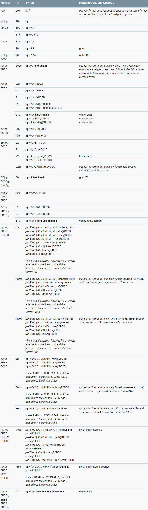
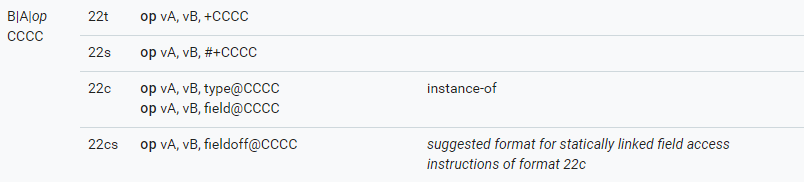

# Smali

## 介绍

在执行 Android Java 层的代码时，其实就是 Dalvik(ART) 虚拟机（使用 C或 C++ 代码实现）在解析 Dalvik 字节码，从而模拟程序的执行过程。

自然，Dalvik 字节码晦涩难懂，研究人员们给出了 Dalvik 字节码的一种助记方式：smali 语法。通过一些工具（如 apktool），我们可以把已有的 dex 文件转化为若干个 smali 文件（**一般而言，一个 smali 文件对应着一个类**），然后进行阅读。对于不同的工具来说，其转换后的 smali 代码一般都不一样，毕竟这个语法不是官方的标准。这里我们介绍比较通用的语法。值得注意的是，在smali 语法中，使用的都是寄存器，但是其在解释执行的时候，很多都会映射到栈中。

**感觉似乎这里给个例子比较合适！！！！！**

## 基本结构

一个 Smali 文件的基本信息如下

- 基本类信息
    - 前三行描述转换为该 Smali 文件的类的信息
    - 如果类实现了接口，对应的接口信息
- 如果类使用了注解，对应的注解信息
- 字段描述
- 方法描述

比较有意思的是，Smali 代码基本上还原了 java 代码中含义。它主要有以下两种类型的语句

- 声明语句用来声明 java 中自顶向下的类，方法，变量类型，以及每个方法中所要使用的寄存器的个数等信息。
- 执行语句来执行 java 中的每一行代码，包含方法的调用，字段的读写，异常的捕捉等操作。

整体来说，Smali 代码的可读性还是比较强的。

## 声明语句

在 smali 代码中，声明语句一般都是以 `.` 开始。

### 寄存器

目前，Dalvik 使用的寄存器都是 32 位，对于 64 位类型的变量，如 double 类型，它会使用两个相邻的 32 位寄存器来表示。

此外，我们知道 Dalvik 最多支持 65536 个寄存器(编号从 0~65535 )，但是 ARM 架构的 cpu 中只有 37 个寄存器。那 Dalvik 是怎么做的呢？其实，每个 Dalvik 虚拟机维护了一个调用栈，该调用栈用来支持虚拟寄存器和真实寄存器相互映射的。

#### 寄存器声明

在执行具体方法时，Dalvik 会根据  `.registers`  指令来确定该函数要用到的寄存器数目，虚拟机会根据申请的寄存器的数目来为该方法分配相应大小的栈空间，dalvik 在对这些寄存器操作时，其实都是在操作栈空间。

#### 寄存器命名规则

一个方法所申请的寄存器会分配给函数方法的参数 (parameter) 以及局部变量 (local variable) 。在 smali 中，一般有两种命名规则

- v 命名法
- p 命名法

假设方法申请了 m+n 个寄存器，其中局部变量占 m 个寄存器，参数占 n 个寄存器，对于不同的命名规则，其相应的命名如下

|   属性   |          v命名法          |        p命名法        |
| :------: | :-----------------------: | :-------------------: |
| 局部变量 |   $v_0,v_1,...,v_{m-1}$   | $v_0,v_1,...,v_{m-1}$ |
| 函数参数 | $v_m,v_{m+1},...,v_{m+n}$ | $p_0,p_1,...,p_{n-1}$ |

 一般来说我们更倾向于 p 命名法，因为其具有较好的可读性，可以方便地让我们知道寄存器属于哪一种类型。

而这其实也就是 smali 语法中常见的寄存器命名规则，p 开头的寄存器都是参数寄存器，v 开头的寄存器都是局部变量寄存器，两者的数量之和为方法申请的寄存器数量。

### 变量类型

在 Dalvik 字节码中，变量主要分为两种类型

| 类型   | 成员                                       |
| ---- | ---------------------------------------- |
| 基本类型 | boolean，byte，short，char，int，long，float，double，void（只用于返回值类型） |
| 引用类型 | 对象，数组                                    |

但是，我们在 smali 中其实并不需要把一个变量的类型的描述的全称全部放进去，我们只需要可以识别它即可，那我们可以怎么做呢？可以对它进行简写啊。dalvik 中简写方式如下

| java类型  | 类型描述符 |
| :-----: | :---: |
| boolean |   Z   |
|  byte   |   B   |
|  short  |   S   |
|  char   |   C   |
|   int   |   I   |
|  long   |   J   |
|  float  |   F   |
| double  |   D   |
|  void   |   V   |
|  对象类型   |   L   |
|  数组类型   |   [   |

其中对象类型可以表示Java代码中的所有类。比如说如果一个类在java代码中的以package.name.ObjectName（全名）的方式被引用，那么在Davilk中，其描述则是 `Lpackage/name/ObjectName;` ，其中

- L即上面所说的对象类型。
- 全名中的 `.` 被替换为 `/` 。
- 后面跟了一个 `;` 。

比如说在 `java.lang.String` ，其相应的形式为`Ljava/lang/String;`

> 注：所谓全名就是它的全程不仅仅是简写，比如String其实是java.lang.String。

数组类型可以表示java中的所有数组。其一般的构成形式由前向后依次分为两个部分

- **数组维数**个[，但数组的维数最多为255。
- 数据元素类型，这里的类型自然就不能是[了。

 比如说int数组 `int []` 在smali中的表示形式为 `[I ` 。

比如说数组类型 `String[][]` 在smali中的表示形式为 `[[Ljava/lang/String;` 。

### 字段

在 java 的类中，一般都会有成员变量，也称为其属性或者字段。java中的字段分为

- 普通字段，实例属性
- 静态字段，类属性，所有的类实例共享。

#### 普通字段

声明如下

```text
#instance fields
.field <访问权限修饰符> [非权限修饰符] <字段名>:<字段类型>
```

其中访问权限修饰符可以为

- public
- private
- protected

非权限修饰符可以为(**查明其用法!!!**)

- final
- volidate
- transient

举个例子，如下

```smali
# instance fields
.field private str1:Ljava/lang/String;
```

这里声明其实如下

```java
private java.lang.String str1;
```

#### 静态字段

一般表示如下

```smali
#static fields
.field <访问权限> static [修饰词] <字段名>:<字段类型>
```

这里我们就不介绍相应内容了，直接给出一个例子

```
# instance fields
.field public static str2:Ljava/lang/String;
```

其实声明如下

```java
public static java.lang.String str2;
```

### 方法

在 smali 代码中，方法一般的展现形式如下

```text
# 描述方法类型
.method <访问权限修饰符> [修饰符] <方法原型>
      <.locals>
      [.parameter]
      [.prologue]
      [.line]
      <代码逻辑>
      [.line]
      <代码逻辑>
.end
```

其中第一行以注释形式描述方法的类型，一般是反编译工具添加上去的，分为两种类型

- 直接方法，direct method
- 虚方法，virtual method

访问权限可能有有以下形式，与 java 中的一一对应

- public
- private
- protected

修饰符主要有以取值范围

- static，表明该方法是静态方法

方法原型一般为 `方法名(参数类型描述符)返回值类型描述符` 。与java方法中不一样的是，在 smali 的这个方法原型中不会有参数对应的名字的，对应参数的名字可能会在.parameter中进行指定。

.locals 会指定方法使用的局部变量。

.parameter 的个数与方法的使用的参数格式一致，每一条语句声明一个参数。如果方法是静态方法的话，我们会使用 p0 来表示this，即当前对象，否则的话，参数就正常用 p0 开始。

.prologue 指定程序的开始处。混淆过后的代码可能会没有这一说明。

.line 指定相应的代码在原 java 文件的行数。如果程序进行了混淆，一般就不会有这一行了。

**举个例子，，，，找个合适的例子!!!!!!**

### 类

#### 基本类信息

如下

```text
.class <访问权限修饰符> [非权限修饰符] <类名>
.super <父类名>
.source <源文件名称>
```

其中，`<>` 中的内容必须存在，`[]` 的内容是可选的。访问权限修饰符即所谓的 `public`，`protected`，`private`。而非权限修饰符则指的是`final`，`abstract`。举个例子

```smali
.class public final Lcom/a/b/c;
.super Ljava/lang/Object;
.source "Demo.java"
```

可以看出我们类的访问权限是`public`，非权限修饰符为`final`，类名为`com.a.b.c`，它继承了父类`java.lang.object`，对应的源文件为`Demo.java`。

#### 接口

如果一个类实现了某个接口，则会通过`.implements`进行，如下:

```
#interfaces
.implements <接口名称>
```

给个例子，一般来说，smali都会对其进行注释表明它是一个接口。

```smali
# interfaces
.implements Landroid/view/View$OnClickListener;
```

#### 类的类别

Java中允许在一个类中定义另外一个类，还允许多层嵌套，我们称类中的类为内部类。内部类主要有

- 成员内部类
- 静态嵌套类
- 方法内部类
- 匿名内部类

在smali中，每个类都会对应一个smali文件。

#### 类的引用

在smali代码中，我们会使用 this 来表示父类的引用，对于父类的中的子类，我们会根据其层数来进行引用，其格式为`this$[层数]` ，举个例子

```java
public class MainActivity extends Activity {   //this$0
   public class firstinner  //this$1
   {
      public class secondinner //this$2
      {
         public class thirdinner //this$3
         {

         }
      }
   }
}
```

比如说`thirdinner` 引用`firstinner` 其会使用`this$1` 来进行引用。而且，对于`this$x` 这样的字段都会被定义为`synthetic` 类型，表明这种字段是由编译器自动生成的，在源代码里并没有这样的字段。

此外，在smali中，每个类都会对应一个 smali 文件，这几个类对应的 smali 文件名分别为

```
MainActivity.smali
MainActivity$firstinner.smali
MainActivity$firstinner$secondinner.smali
MainActivity$firstinner$thirdinner.smali
```

### 注解

注解的格式如下

```smali
#annotations
.annotation [注解的属性] <注解范围>
    [注解字段=值]
    ...
.end
```

其中，如果注解范围是类的话，注解会直接出现在 smali 文件中。如果注解范围是方法或者字段的话，会包含在相应的方法或者字段的定义中。

## 执行语句

这里部分参考http://blog.csdn.net/wizardforcel/article/details/54730253。

### Dalvik指令格式

在介绍 smali 语法中的指令之前，我们先来看看 Dalvik 指令的基本格式。

Dalvik 中指令的格式主要包含两个方面：位描述，格式ID。目前 Dalvik 中基本上所有的指令如下图所示，其中第一列给出了指令按照位进行描述的格式，第二列是格式化 ID ，第三列表示相应的句法，第四列对其进行说明。



#### 位描述

在位描述中，Davik 中的每一类指令一般由如下的元素构成

- 一个op，8位指令码
- 若干个字符，每一个字符表示4位
- 若干个 `|` ，进行分割，方便阅读。
- 若干个 $\varnothing$ ，同样也是4个字符，表示该部分位为0。

此外，在上面的展现形式种，指令由一个或者多个空格分割的 16 位的 word 组成，其中每一个 word 可以包含上述的几个元素。

举个例子，指令 `B|A|op CCCC` 包含2个 word，一共 32 位。其中，第一个字的低 8 位是操作码，中间 4 位是A，高4位是B。第二个字是单独的16位的数值。

#### 格式ID

但是，正如表格里所展现的



这样的一种指令格式，根据ID的不同，仍然可以表示不同的指令含义。

一般来说，格式ID由若干个字符组成，一般来说包含3个字符

- 第一个数字表示word的数量

- 第二个

    - 数字的话，表示指令包含的寄存器的最大数量（这是因为有些指令可以包含不定个数的寄存器）
    - r的话，表示使用了一定范围内的寄存器(range)。

- 第三个字符表示指令使用到的额外数据的类型。如下表

  | Mnemonic | Bit Sizes | Meaning                                  |
  | -------- | --------- | ---------------------------------------- |
  | b        | 8         | immediate signed byte                    |
  | c        | 16, 32    | constant pool index                      |
  | f        | 16        | interface constants (only used in statically linked formats) |
  | h        | 16        | immediate signed hat (high-order bits of a 32- or 64-bit value; low-order bits are all `0`) |
  | i        | 32        | immediate signed int, or 32-bit float    |
  | l        | 64        | immediate signed long, or 64-bit double  |
  | m        | 16        | method constants (only used in statically linked formats) |
  | n        | 4         | immediate signed nibble                  |
  | s        | 16        | immediate signed short                   |
  | t        | 8, 16, 32 | branch target                            |
  | x        | 0         | no additional data                       |

- 如果存在第四个字符的话

  - s表示采用静态链接
  - i表示指令应该被内联处理。

#### 句法

其基本要求如下

- 指令以操作码op开始，后面直接跟上一个或者多个参数，参数间以逗号分隔。
- 指令的参数从指令第一部分开始，op位于低8位，高8位可以是一个8位的参数，也可以是两个4位的参数，还可以为空。如果指令超过16位，则后面部分依次作为参数。
- 参数`Vx`表示寄存器，如v0、v1等。这里之所以采用v而不用r是为了避免与实现该虚拟机架构的机器架构中的寄存器命名产生冲突。
- 参数 `#+X` 表示常量数字。
- 参数 `+X` 表示相对指令的地址偏移。
- 参数 `kind@X`  表示常量池索引值，其中kind表示常量池类型，可以是以下四种类型
    - string，字符串常量池索引
    - type，类型常量池索引
    - field，字段常量池索引
    - meth，方法常量池索引

以指令 `op vAA, type@BBBB` 为例，指令使用了1个寄存器vAA，一个32位的类型常量池索引。

### 指令特点

Dalvik指令在调用规范上大致模仿常见的架构和 C 样式的调用规范，如下

- 参数顺序为 Dest-then-source 。

- 利用后缀用来表明运算类型，从而消除歧义：

    - 正常的32 位运算不标记。
    - 正常地64 位运算以 `-wide` 为后缀。
    - 特定类型的运算码以其类型（或简单缩写）为后缀，这些类型包括：`-boolean`、`-byte`、`-char`、`-short`、`-int`、`-long`、`-float`、`-double`、`-object`、`-string`、`-class` 和 `-void`。

- 利用运算码部分后缀区分具有不同指令样式或者或选项的相同运算，这些后缀与主要名称之间以 `/` 分开，主要目的是使生成和解析可执行文件的代码中存在与静态常量的一对一映射关系，以便于降低让读者感到模糊不清的可能性。


  例如，在指令`move-wide/from16 vAA, vBBBB` 中

  - `move`为基础运算码，表示这是基本运算，用来移动寄存器的值。
  - `wide`为名称后缀，表示指令对64 位数据进行运算。
  - `from16`为运算码后缀，表示源为一个 16 位寄存器的引用变量。
  - `vAA`为目的寄存器，取值范围为 `v0` - `v255`。
  - `vBBBB`为源寄存器，取值范围为 `v0` - `v65535`。

### 具体指令

这里，我们具体介绍依次每一条指令的含义，并尽可能地对其进行分类。

#### 空指令

nop指令，无任何操作，一般用于对齐代码。

#### 数据定义指令

| op&id  | 语法                                       | 参数                                       | 说明                                       |
| ------ | ---------------------------------------- | ---------------------------------------- | ---------------------------------------- |
| 2 11n  | const/4 vA, #+B                          | `A:` 目标寄存器（4 位）           `B:` 有符号整数（4 位） | 将给定的值（符号扩展为 32 位）移到指定的寄存器中。              |
| 13 21s | const/16 vAA, #+BBBB                     | `A:` 目标寄存器（8 位）           `B:` 有符号整数（16 位） | 将给定的值（符号扩展为 32 位）移到指定的寄存器中。              |
| 14 31i | const vAA, #+BBBBBBBB                    | `A:` 目标寄存器（8 位）           `B:` 任意 32 位常量 | 将给定的值移到指定的寄存器中。                          |
| 15 21h | const/high16 vAA, #+BBBB0000             | `A:` 目标寄存器（8 位）           `B:` 有符号整数（16 位） | 将给定的值（右零扩展为 32 位）移到指定的寄存器中。              |
| 16 21s | const-wide/16 vAA, #+BBBB                | `A:` 目标寄存器（8 位）           `B:` 有符号整数（16 位） | 将给定的值（符号扩展为 64 位）移到指定的寄存器对中。             |
| 17 31i | const-wide/32 vAA, #+BBBBBBBB            | `A:` 目标寄存器（8 位）            `B:` 有符号整数（32 位） | 将给定的值（符号扩展为 64 位）移到指定的寄存器对中。             |
| 18 51l | const-wide vAA, #+BBBBBBBBBBBBBBBB       | `A:` 目标寄存器（8 位）           `B:` 任意双字宽度（64 位）常量 | 将给定的值移到指定的寄存器对中。                         |
| 19 21h | const-wide/high16 vAA, #+BBBB000000000000 | `A:` 目标寄存器（8 位）           `B:` 有符号整数（16 位） | 将给定的值（右零扩展为 64 位）移到指定的寄存器对中。             |
| 1a 21c | const-string vAA, string@BBBB            | `A:` 目标寄存器（8 位）           `B:` 字符串索引     | 将给定的字符串引用赋值给指定的寄存器中。                     |
| 1b 31c | const-string/jumbo vAA, string@BBBBBBBB  | `A:` 目标寄存器（8 位）            `B:` 字符串索引    | 将给定字符串引用（较大）赋值到指定的寄存器中。                  |
| 1c 21c | const-class vAA, type@BBBB               | `A:` 目标寄存器（8 位）           `B:` 类型索引      | 将给定类引用赋值到指定的寄存器中。如果指定的类型是原始类型，则将存储对原始类型的退化类的引用。 |

举个例子，如果java代码如下

```java
boolean z = true;
z = false;
byte b = 1;
short s = 2;
int i = 3;
long l = 4;
float f = 0.1f;
double d = 0.2;
String str = "test";
Class c = Object.class;
```

那么编译之后得到的代码如下

```smali
const/4 v10, 0x1
const/4 v10, 0x0
const/4 v0, 0x1
const/4 v8, 0x2
const/4 v5, 0x3
const-wide/16 v6, 0x4
const v4, 0x3dcccccd    # 0.1f
const-wide v2, 0x3fc999999999999aL    # 0.2
const-string v9, "test"
const-class v1, Ljava/lang/Object;
```

可以看出，根据数据类型大小的不同，会采用不同的语法。此外，我们可以看到float的字面值是0x3dcccccd，这其实就是0.1。关于浮点数在计算机中的存在形式，请自行网上搜索。此外，一般来说，smali会自动帮我们将string的id转换为其真正的字符串。

#### 数据移动

数据移动指令主要是将数据从一个寄存器或者内存中移动到另一处。

| op&id  | 语法                            | 参数                                  | 说明                              |
| ------ | ----------------------------- | :---------------------------------- | ------------------------------- |
| 01 12x | move vA, vB                   | `A:` 目标寄存器（4 位）`B:` 源寄存器（4 位）       | vA=vB                           |
| 02 22x | move/from16 vAA, vBBBB        | `A:` 目标寄存器（8 位）`B:` 源寄存器（16 位）      | vAA=vBBBB                       |
| 03 32x | move/16 vAAAA, vBBBB          | `A:` 目标寄存器（16 位）`B:` 源寄存器（16 位）     | vAAAA=VBBBB                     |
| 04 12x | move-wide vA, vB              | `A:` 目标寄存器对（4 位）`B:` 源寄存器对（4 位）     | vA，v(A+1)=vB，V(B+1)             |
| 05 22x | move-wide/from16 vAA, vBBBB   | `A:` 目标寄存器对（8 位）`B:` 源寄存器对(16 bit)  | vAA，v(AA+1)=vBBBB，V(BBBB+1)     |
| 06 32x | move-wide/16 vAAAA, vBBBB     | `A:` 目标寄存器对（16 位）`B:` 源寄存器对(16 bit) | vAAAA，v(AAAA+1)=vBBBB，V(BBBB+1) |
| 07 12x | move-object vA, vB            | `A:` 目标寄存器（4 位）`B:` 源寄存器（4 位）       | 对象引用赋值，vA=vB                    |
| 08 22x | move-object/from16 vAA, vBBBB | `A:` 目标寄存器（8 位）`B:` 源寄存器（16 位）      | 对象引用赋值，vAA=vBBBB                |
| 09 32x | move-object/16 vAAAA, vBBBB   | `A:` 目标寄存器（16 位）`B:` 源寄存器（16 位）     | 对象引用赋值，vAAAA=vBBBB              |
| 0a 11x | move-result vAA               | `A:` 目标寄存器（8 位）                     | 将函数调用返回值放到VAA寄存器中。              |
| 0b 11x | move-result-wide vAA          | `A:` 目标寄存器对（8 位）                    | 将函数调用返回值放到VAA寄存器中。              |
| 0c 11x | move-result-object vAA        | `A:` 目标寄存器（8 位）                     | 将函数调用返回对象引用VAA寄存器中。             |
| 0d 11x | move-exception vAA            | `A:` 目标寄存器（8 位）                     | 将捕获的异常保存到给定寄存器中。                |

其中，`move`系列指令以及`move-result` 用于处理小于等于 32 位的基本类型。

`move-wide`系列指令和`move-result-wide`用于处理64位类型，包括`long`和`double`类型。

`move-object`系列指令和`move-result-object`用于处理对象引用。

此外，后缀（`/from16`、`/16`）只影响字节码的位数和寄存器的范围，不影响指令的逻辑。

#### 数据转换指令

数据转换指令主要是将一种数据类型转换为另一种数据类型。目前已有的指令如下

| **指令**          | **说明**            |
| --------------- | ----------------- |
| neg-int         | 对整型数求补            |
| not-int         | 对整型数求反            |
| neg-long        | 对长整型数求补           |
| not-long        | 对长整型数求反           |
| neg-float       | 对单精度浮点型数求补        |
| neg-double      | 对双精度浮点型数求补        |
| int-to-long     | 将整型数转换为长整型        |
| int-to-float    | 将整型数转换为单精度浮点型数    |
| int-to-dobule   | 将整型数转换为双精度浮点数     |
| long-to-int     | 将长整型数转换为整型        |
| long-to-float   | 将长整型数转换为单精度浮点型    |
| long-to-double  | 将长整型数转换为双精度浮点型    |
| float-to-int    | 将单精度浮点数转换为整型      |
| float-to-long   | 将单精度浮点数转换为长整型数    |
| float-to-double | 将单精度浮点数转换为双精度浮点型数 |
| double-to-int   | 将双精度浮点数转换为整型      |
| double-to-long  | 将双精度浮点数转换为长整型     |
| double-to-float | 将双精度浮点数转换为单精度浮点型  |
| int-to-byte     | 将整型转换为字节型         |
| int-to-char     | 将整型转换为字符型         |
| int-to-short    | 将整型转换为短整型         |

举个例子`int-to-short v0,v1` 即将寄存器v1的值强制转换为short类型，并放入v0中。

#### 数学运算指令

数学算指令包括算术运算指令与逻辑运算指令。其中，算术运算指令包括加，减，乘，除，模，移位等运算，逻辑运算指令主要进行数值间与，或，非，抑或等运算。

数据运算指令有以下四类，其中运算符为binop。

| **指令**                     | **说明**                         |
| -------------------------- | ------------------------------ |
| binop vAA, vBB, vCC        | 将vBB寄存器与vCC寄存器进行运算，结果保存到vAA寄存器 |
| binop/2addr vA, vB         | 将vA寄存器与vB寄存器进行运算，结果保存到vA寄存器    |
| binop/lit16 vA, vB, #+CCCC | 将vB寄存器与常量 CCCC进行运算，结果保存到vA寄存器  |
| binop/lit8 vAA, vBB, #+CC  | 将vBB寄存器与常量CC进行运算，结果保存到vAA寄存器   |

后面3类指令比第1类指令分别多出了2addr，lit16，lit8后缀。但是，对于基础字节码相同的指令来说，其执行的运算操作是类似的。所以这里我们主要介绍第一类指令。除此之外，根据数据的类型不同会在基础字节码后面加上数据类型后缀，如`-int` 或 `-long` 分别表示操作的数据类型为整型与长整型。第一类指令的运算类型如下

| 运算类型      | **说明**             |
| --------- | ------------------ |
| add-type  | vBB + vCC          |
| sub-type  | vBB - vCC          |
| mul-type  | vBB * vCC          |
| div-type  | vBB / vCC          |
| rem-type  | vBB % vCC          |
| and-type  | vBB & vCC          |
| or-type   | vBB \| vCC         |
| xor-type  | vBB ^ vCC          |
| shl-type  | vBB << vCC ，有符号数左移 |
| shr-type  | vBB >> vCC，有符号数右移  |
| ushr-type | vBB >>> vCC，无符号数右移 |

其中基础字节码后面的-type可以是-int，-long， -float，-double。

举个例子，java源码为

```java
int a = 5, b = 2;
a += b;
a -= b;
a *= b;
a /= b;
a %= b;
a &= b;
a |= b;
a ^= b;
a <<= b;
a >>= b;
a >>>= b;
```

其对应的smali为

```smali
const/4 v0, 0x5
const/4 v1, 0x2
add-int/2addr v0, v1
sub-int/2addr v0, v1
mul-int/2addr v0, v1
div-int/2addr v0, v1
rem-int/2addr v0, v1
and-int/2addr v0, v1
or-int/2addr v0, v1
xor-int/2addr v0, v1
shl-int/2addr v0, v1
shr-int/2addr v0, v1
ushr-int/2addr v0, v1
```

#### 数组操作指令

数组操作指令中实现了获取数组长度，新建数组，数组赋值，数组元素取值与赋值等操作。

| **指令**                                   | **说明**                                   |
| ---------------------------------------- | ---------------------------------------- |
| array-length vA, vB                      | 获取给定vB寄存器中数组的长度并赋给vA寄存器，数组长度指的是数组中的元素个数。 |
| new-array vA, vB, type@CCCC              | 构造大小为vB的元素类型为type@CCCC的数组，并将引用赋给vA寄存器    |
| filled-new-array {vC, vD, vE, vF, vG},type@BBBB | 构造大小vA的元素类型为type@BBBB的数组并填充数组内容。vA寄存器是隐含使用的，除了指定数组的大小外还指定了参数的个数，vC~vG是使用到的参数寄存序列 |
| filled-new-array/range {vCCCC  ..vNNNN}, type@BBBB | 指令功能与filled-new-array {vC, vD, vE, vF, vG},type@BBBB相同，只是参数寄存器使用range后缀指定了取值范围 ，vC是第一个参数寄存器，N = A +C -1 |
| fill-array-data vAA, +BBBBBBBB           | 用指定的数据来填充数组，vAA寄存器为数组引用，引用必须为基础类型的数组，在指令后面会紧跟一个数据表 |
| new-array/jumbo vAAAA, vBBBB,type@CCCCCCCC | 指令功能与new-array vA,vB,type@CCCC相同，但是寄存器值与指令的索引取值范围更大（Android4.0中新增的指令） |
| filled-new-array/jumbo {vCCCC  ..vNNNN},type@BBBBBBBB | 指令功能与filled-new-array/range {vCCCC  ..vNNNN},type@BBBB相同，只是索引取值范围更大（Android4.0中新增的指令） |
| arrayop vAA, vBB, vCC                    | 对vBB寄存器指定的数组元素进行取值与赋值。vCC寄存器指定数组元素索引，vAA寄存器用来存放读取的或需要设置的数组元素的值。读取元素使用aget类指令，元素赋值使用aput类指定，根据数组中存储的类型指令后面会紧跟不同的指令后缀，指令列表如下：aget, aget-wide, aget-object, aget-boolean, aget-byte,aget-char, aget-short, aput, aput-wide, aput-object, aput-boolean, aput-byte, aput-char, aput-short。 |

我们可以定义数组如下

```java
int[] arr = new int[10];
```

其对应的smali如下

```smali
const/4 v1, 0xa
new-array v0, v1, I
```

如果我们直接在定义时，对数组进行初始化，如下

```smali
int[] arr = {1, 2, 3, 4, 5};
```

对应的smali如下

```smali
const/4 v1, 0x1
const/4 v2, 0x2
const/4 v3, 0x3
const/4 v4, 0x4
const/4 v5, 0x5
filled-new-array {v1, v2, v3, v4, v5}, I
move-result v0
```

在寄存器连续的情况下，还可以写成如下代码

```smali
const/4 v1, 0x1
const/4 v2, 0x2
const/4 v3, 0x3
const/4 v4, 0x4
const/4 v5, 0x5
filled-new-array-range {v1..v5}, I
move-result v0
```

#### 实例操作指令

实例操作指令主要实现了实例的类型转换，检查及新建等功能。

| **指令**                                   | **说明**                                   |
| ---------------------------------------- | ---------------------------------------- |
| check-cast vAA, type@BBBB                | 将vAA寄存器中的对象引用转换成type@BBBB类型，如果失败的话，抛出ClassCastException异常。如果类型B指定的是基本类型，对于非基本类型的A来说，运行时始终会失败 |
| instance-of vA, vB, type@CCCC            | 判断vB寄存器中的对象引用是否可以转换成指定的类型，如果可以，vA寄存器被赋值为1，否则vA寄存器被 赋值为0。 |
| new-instance vAA, type@BBBB              | 构造一个指定类型对象的新实例，并将对象引用赋值给vAA寄存器，类型符type指定的类型不能是数组类 |
| check-cast/jumbo vAAAA, type@BBBBBBBB    | 功能与check-cast vAA, type@BBBB相同，只是寄存器值与指令的索引取值范围更大（Android4.0中新增的指令） |
| instance-of/jumbo vAAAA, vBBBB, type@CCCCCCCC | 功能与instance-of vA, vB, type@CCCC相同，只是寄存器值与指令的索引取值范围更大（Android4.0中新增的指令） |
| new-instance/jumbo vAAAA, type@BBBBBBBB  | 功能与new-instance vAA, type@BBBB相同，只是寄存器值与指令的索引取值范围更大（Android4.0中新增的指令） |

比如，我们定义一个实例

```java
Object obj = new Object();
```

其对应的smali代码如下

```smali
new-instance v0, Ljava/lang/Object;
invoke-direct-empty {v0}, Ljava/lang/Object;-><init>()V
```

再比如我们可以进行如下的类型判断

```java
String s = "test";
boolean b = s instanceof String;
```

其对应的smali代码如下

```smali
const-string v0, "test"
instance-of v1, v0, Ljava/lang/String;
```

如果我们进行类型的强制转换

```java
String s = "test";
Object o = (Object)s;
```

其对应的smali代码如下

```smali
const-string v0, "test"
check-cast v0, Ljava/lang/Object;
move-object v1, v0
```

#### 字段操作指令

字段操作指令主要是对实例的字段进行读写操作。其中读操作使用get来标记，即vx=vy.field。写操作使用put来标记，即vy.field=vx。

其中对于java中的类来说，主要分为两种字段，普通字段，静态字段。对于普通字段采用操作指令前加i来标记，如iget，iput。对于静态字段采用在操作指令前加s来标记，如sput，sget。

此外，对于不同字段大小的操作会在指令的后面加上后缀来进行区别。如 iget-byte指令表示读取类型为字节的实例字段的值，iput-short指令表示设置的实例字段的类型为短整型。

普通字段操作指令有：

iget，iget-wide，iget-object，iget-boolean，iget-byte，iget-char，iget-short，

iput，iput-wide，iput-object，iput-boolean，iput-byte，iput-char，iput-short。

静态字段操作指令有：

sget，sget-wide，sget-object，sget-boolean，sget-byte，sget-char，sget-short，

sput，sput-wide，sput-object，sput-boolean，sput-byte，sput-char，sput-short。

如果我们编写如下代码

```java
int[] arr = new int[2];
int b = arr[0];
arr[1] = b;
```

其对应的smali如下

```smali
const/4 v0, 0x2
new-array v1, v0, I
const/4 v0, 0x0
aget-int v2, v1, v0
const/4 v0, 0x1
aput-int v2, v1, v0
```

如果我们想获得类com.example.test的静态int类型的字段staticField，其smali如下

```smali
sget v0, Lcom/example/Test;->staticField:I
```

#### 比较指令

比较指令实现了对两个寄存器的值（浮点型或长整型）进行比较的操作。

其格式为cmp(l/g)-kind vAA, vBB, vCC，其中vBB寄存器与vCC寄存器是需要比较的两个寄存器或寄存器对，比较的结果放到vAA寄存器。

- l-->less
- g--> great

目前的比较指令如下

| **指令**      | **说明**                                   |
| ----------- | ---------------------------------------- |
| cmpl-float  | 比较两个单精度浮点数。如果vBB寄存器大于vCC寄存器，结果为-1，相等则结果为0，小于的话结果为1 |
| cmpg-float  | 比较两个单精度浮点数。如果vBB寄存器大于vCC寄存器，则结果为1，相等则结果为0，小于的话结果为-1 |
| cmpl-double | 比较两个双精度浮点数。如果vBB寄存器对大于vCC寄存器对，则结果为-1，相等则结果为0，小于则结果为1 |
| cmpg-double | 比较两个双精度浮点数。如果vBB寄存器对大于vCC寄存器对，则结果为1，相等则结果为0，小于的话，则结果为-1 |
| cmp-long    | 比较两个长整型数。如果vBB寄存器大于vCC寄存器，则结果为1，相等则结果为0，小则结果为-1 |

#### 跳转指令

跳转指令实现了从当前地址跳转到指定的偏移处的操作。Dalvik指令集中有三种跳转指令

- goto，无条件跳转
- switch，分支跳转
- if，条件跳转

##### goto指令

如下

| 指令                | 含义                      |
| ----------------- | ----------------------- |
| goto +AA          | 无条件跳转到指定偏移处，偏移量AA不能为0   |
| goto/16 +AAAA     | 无条件跳转到指定偏移处，偏移量AAAA不能为0 |
| goto/32 +AAAAAAAA | 无条件跳转到指定偏移处             |

##### if指令

if指令中主要分为两种if-test与if-testz。`if-test vA,vB,+CCCC` 会比较vA与v，如果比较结果满足就跳转到CCCC指定的偏移处（相对当前偏移），偏移量CCCC不能为0。if-test类型的指令如下：

| 指令                   | 说明           |
| -------------------- | ------------ |
| `if-eq vA,vB,target` | 如果vA=vB，跳转。  |
| `if-ne vA,vB,target` | 如果vA!=vB，跳转。 |
| `if-lt vA,vB,target` | 如果vA<vB，跳转。  |
| `if-gt vA,vB,target` | 如果vA>vB，跳转。  |
| `if-ge vA,vB,target` | 如果vA>=vB，跳转。 |
| `if-le vA,vB,target` | 如果vA<=vB，跳转。 |

if-testz类型的指令如下

| 指令                | 说明          |
| ----------------- | ----------- |
| if-eqz vAA,target | 如果vA=0，跳转。  |
| if-nez vAA,target | 如果vA!=0，跳转。 |
| if-ltz vAA,target | 如果vA<0，跳转。  |
| if-gtz vAA,target | 如果vA>0，跳转。  |
| if-lez vAA,target | 如果vA<=0，跳转。 |
| if-gtz vAA,target | 如果vA>=0，跳转。 |

举个例子，java代码如下

```java
int a = 10
if(a > 0)
    a = 1;
else
    a = 0;
```

smali代码如下

```smali
const/4 v0, 0xa
if-lez v0, :cond_0 # if 块开始
const/4 v0, 0x1
goto :cond_1       # if 块结束
:cond_0            # else 块开始
const/4 v0, 0x0
:cond_1            # else 块结束
```

在只有if的情况下

```java
int a = 10;
if(a > 0)
    a = 1;
```

smali代码如下

```smali
const/4 v0, 0xa
if-lez v0, :cond_0 # if 块开始
const/4 v0, 0x1
:cond_0            # if 块结束
```

##### switch指令

如下

| 指令                          | 含义                                       |
| --------------------------- | ---------------------------------------- |
| packed-switch vAA,+BBBBBBBB | vAA寄存器为switch分支中需要判断的值，BBBBBBBB指向一个packed-switch-payload格式的偏移表，表中的值是有规律递增的。 |
| sparse-switch vAA,+BBBBBBBB | vAA寄存器为switch分支中需要判断的值，BBBBBBBB指向一个sparse-switch-payload格式的偏移表，表中的值是无规律的偏移表，表中的值是无规律的偏移量。 |

对于第一种递增式的switch，如下

```java
int a = 10;
switch (a){
    case 0:
        a = 1;
        break;
    case 1:
        a = 5;
        break;
    case 2:
        a = 10;
        break;
    case 3:
        a = 20;
        break;
}
```

对应的smali如下

```smali
const/16 v0, 0xa

packed-switch v0, :pswitch_data_0 # switch 开始

:pswitch_0                        # case 0
const/4 v0, 0x1
goto :goto_0

:pswitch_1                        # case 1
const/4 v0, 0x5
goto :goto_0

:pswitch_2                        # case 2
const/16 v0, 0xa
goto :goto_0

:pswitch_3                        # case 3
const/16 v0, 0x14
goto :goto_0

:goto_0                           # switch 结束
return-void

:pswitch_data_0                   # 跳转表开始
.packed-switch 0x0                # 从 0 开始
    :pswitch_0
    :pswitch_1
    :pswitch_2
    :pswitch_3
.end packed-switch                # 跳转表结束
```

对于非递增的switch，代码如下

```smali
int a = 10;
switch (a){
    case 0:
        a = 1;
        break;
    case 10:
        a = 5;
        break;
    case 20:
        a = 10;
        break;
    case 30:
        a = 20;
        break;
}
```

对应的smali如下

```smali
const/16 v0, 0xa

sparse-switch v0, :sswitch_data_0 # switch 开始

:sswitch_0                        # case 0
const/4 v0, 0x1
goto :goto_0

:sswitch_1                        # case 10
const/4 v0, 0x5

goto :goto_0

:sswitch_2                        # case 20
const/16 v0, 0xa
goto :goto_0

:sswitch_3                        # case 15
const/16 v0, 0x14
goto :goto_0

:goto_0                           # switch 结束
return-void

.line 55
:sswitch_data_0                   # 跳转表开始
.sparse-switch
    0x0 -> :sswitch_0
    0xa -> :sswitch_1
    0x14 -> :sswitch_2
    0x1e -> :sswitch_3
.end sparse-switch                # 跳转表结束
```


#### 锁指令

锁指令用于在多线程程序。包含以下两个指令

| **指令**            | **说明**    |
| ----------------- | --------- |
| monitor-enter vAA | 为指定的对象获取锁 |
| monitor-exit vAA  | 释放指定的对象的锁 |

#### 方法调用指令

方法调用指令实现了调用实例的方法的操作。其基础为invoke，在其基础上会根据调用方法的类别不同，如虚方法，父类方法等添加后缀，最后会选择性地使用range来指定寄存器范围。一般来说会分为两类

- invoke-kind {vC, vD, vE, vF, vG},meth@BBBB

- invoke-kind/range {vCCCC  .. vNNNN},meth@BBBB两类


  总体来说，一般有如下指令

| **指令**                                   | **说明**    |
| ---------------------------------------- | --------- |
| invoke-virtual 或 invoke-virtual/range    | 调用实例的虚方法  |
| invoke-super 或 invoke-super/range        | 调用实例的父类方法 |
| invoke-direct 或 invoke-direct/range      | 调用实例的直接方法 |
| invoke-static 或 invoke-static/range      | 调用实例的静态方法 |
| invoke-interface 或 invoke-interface/range | 调用实例的接口方法 |

Dalvik中直接方法是指类的所有实例构造器和`private`实例方法，对于`protected`或者`public`方法都叫做虚方法。

#### 异常指令

利用 throw vAA 指令抛出vAA寄存器中指定类型的异常。

##### try catch

首先，我们来看一下try catch，如下

```java
int a = 10;
try {
    callSomeMethod();
} catch (Exception e) {
    a = 0;
}
callAnotherMethod();
```

对应的smali如下

```smali
const/16 v0, 0xa

:try_start_0            # try 块开始
invoke-direct {p0}, Lnet/flygon/myapplication/SubActivity;->callSomeMethod()V
:try_end_0              # try 块结束

.catch Ljava/lang/Exception; {:try_start_0 .. :try_end_0} :catch_0

:goto_0
invoke-direct {p0}, Lnet/flygon/myapplication/SubActivity;->callAnotherMethod()V
return-void

:catch_0                # catch 块开始
move-exception v1
const/4 v0, 0x0
goto :goto_0            # catch 块结束
```

可以看到，`:try_start_0`和`:try_end_0`之间如果存在异常，则会向下寻找`.catch`（或者`.catch-all`）语句，符合条件时跳到标签的位置，这里是`:catch_0`，结束之后会有个`goto`跳回去。

##### try-finally

java代码如下

```java
int a = 10;
try {
    callSomeMethod();
} finally {
    a = 0;
}
callAnotherMethod();
```

其对应的smali代码如下

```smali
const/16 v0, 0xa

:try_start_0            # try 块开始
invoke-direct {p0}, Lnet/flygon/myapplication/SubActivity;->callSomeMethod()V
:try_end_0              # try 块结束

.catchall {:try_start_0 .. :try_end_0} :catchall_0

const/4 v0, 0x0         # 复制一份到外面
invoke-direct {p0}, Lnet/flygon/myapplication/SubActivity;->callAnotherMethod()V
return-void

:catchall_0             # finally 块开始
move-exception v1
const/4 v0, 0x0
throw v1                # finally 块结束
```

可以看出，由于`finally`中的逻辑无论有没有异常都会执行，所以代码里一共有两部分。

##### try-catch-finally

当我们同时使用catch与finally时，如下

```java
int a = 10;
try {
    callSomeMethod();
} catch (Exception e) {
    a = 1;
}
finally {
    a = 0;
}
callAnotherMethod();
```

其对应的smali代码如下

```smali
const/16 v0, 0xa

:try_start_0            # try 块开始
invoke-direct {p0}, Lnet/flygon/myapplication/SubActivity;->callSomeMethod()V
:try_end_0              # try 块结束

.catch Ljava/lang/Exception; {:try_start_0 .. :try_end_0} :catch_0
.catchall {:try_start_0 .. :try_end_0} :catchall_0

const/4 v0, 0x0         # 复制一份到外面

:goto_0
invoke-direct {p0}, Lnet/flygon/myapplication/SubActivity;->callAnotherMethod()V
return-void

:catch_0                # catch 块开始
move-exception v1
const/4 v0, 0x1
const/4 v0, 0x0         # 复制一份到 catch 块里面
goto :goto_0            # catch 块结束

:catchall_0             # finally 块开始
move-exception v2
const/4 v0, 0x0
throw v2                # finally 块结束
```

#### 返回指令

在java中我们会利用Return返回方法的执行结果。同样的，在Davilk中我们也需要return指令来返回方法运行结果。

| 指令                | 说明             |
| ----------------- | -------------- |
| return-void       | 什么也不返回         |
| return vAA        | 返回一个32位非对象类型的值 |
| return-wide vAA   | 返回一个64位非对象类型的值 |
| return-object vAA | 返回一个对象类型的引用    |

## java2smali

**！！从java代码到smali代码！！**

该例子来自于<u>http://blog.csdn.net/dd864140130/article/details/52076515</u>。

java代码如下

```java
public class MainActivity extends Activity implements View.OnClickListener {

    private String TAG = "MainActivity";
    private static final float pi = (float) 3.14;

    public volatile boolean running = false;

    @Override
    protected void onCreate(Bundle savedInstanceState) {
        super.onCreate(savedInstanceState);
        setContentView(R.layout.activity_main);
    }

    @Override
    public void onClick(View view) {
        int result = add(4, 5);
        System.out.println(result);

        result = sub(9, 3);

        if (result > 4) {
            log(result);
        }
    }

    public int add(int x, int y) {
        return x + y;
    }

    public synchronized int sub(int x, int y) {
        return x + y;
    }

    public static void log(int result) {
        Log.d("MainActivity", "the result:" + result);
    }


}
```

其对应的smali代码如下

```smali
#文件头描述
.class public Lcom/social_touch/demo/MainActivity;
.super Landroid/app/Activity;#指定MainActivity的父类
.source "MainActivity.java"#源文件名称

#表明实现了View.OnClickListener接口
# interfaces
.implements Landroid/view/View$OnClickListener;

#定义float静态字段pi
# static fields
.field private static final pi:F = 3.14f

#定义了String类型字段TAG
# instance fields
.field private TAG:Ljava/lang/String;

#定义了boolean类型的字段running
.field public volatile running:Z

#构造方法,如果你还纳闷这个方法是怎么出来的化,就去看看jvm的基础知识吧
# direct methods
.method public constructor <init>()V
    .locals 1#表示函数中使用了一个局部变量

    .prologue#表示方法中代码正式开始
    .line 8#表示对应与java源文件的低8行
    #调用Activity中的init()方法
    invoke-direct {p0}, Landroid/app/Activity;-><init>()V

    .line 10
    const-string v0, "MainActivity"

    iput-object v0, p0, Lcom/social_touch/demo/MainActivity;->TAG:Ljava/lang/String;

    .line 13
    const/4 v0, 0x0

    iput-boolean v0, p0, Lcom/social_touch/demo/MainActivity;->running:Z

    return-void
.end method

#静态方法log()
.method public static log(I)V
    .locals 3
    .parameter "result"#表示result参数

    .prologue
    .line 42
    #v0寄存器中赋值为"MainActivity"
    const-string v0, "MainActivity"
    #创建StringBuilder对象,并将其引用赋值给v1寄存器
    new-instance v1, Ljava/lang/StringBuilder;

    #调用StringBuilder中的构造方法
    invoke-direct {v1}, Ljava/lang/StringBuilder;-><init>()V

    #v2寄存器中赋值为ther result:
    const-string v2, "the result:"

    #{v1,v2}大括号中v1寄存器中存储的是StringBuilder对象的引用.
    #调用StringBuilder中的append(String str)方法,v2寄存器则是参数寄存器.
    invoke-virtual {v1, v2}, Ljava/lang/StringBuilder;->append(Ljava/lang/String;)Ljava/lang/StringBuilder;

    #获取上一个方法的执行结果,此时v1中存储的是append()方法执行后的结果,此处之所以仍然返回v1的    #原因在与append()方法返回的就是自身的引用
    move-result-object v1

    #继续调用append方法(),p0表示第一个参数寄存器,即上面提到的result参数
    invoke-virtual {v1, p0}, Ljava/lang/StringBuilder;->append(I)Ljava/lang/StringBuilder;

    #同上
    move-result-object v1

    #调用StringBuilder对象的toString()方法
    invoke-virtual {v1}, Ljava/lang/StringBuilder;->toString()Ljava/lang/String;

    #获取上一个方法执行结果,toString()方法返回了一个新的String对象,因此v1中此时存储了String对象的引用
    move-result-object v1

    #调用Log类中的静态方法e().因为e()是静态方法,因此{v0,v1}中的成了参数寄存器
    invoke-static {v0, v1}, Landroid/util/Log;->d(Ljava/lang/String;Ljava/lang/String;)I

    .line 43
    #调用返回指令,此处没有返回任何值
    return-void
.end method


# virtual methods
.method public add(II)I
    .locals 1
    .parameter "x"#第一个参数
    .parameter "y"#第二个参数

    .prologue
    .line 34

    #调用add-int指令求和之后将结果赋值给v0寄存器
    add-int v0, p1, p2

    #返回v0寄存器中的值
    return v0
.end method


.method public onClick(Landroid/view/View;)V
    .locals 4
    .parameter "view" #参数view

    .prologue
    const/4 v3, 0x4 #v3寄存器中赋值为4

    .line 23#java源文件中的第23行
    const/4 v1, 0x5#v1寄存器中赋值为5

    #调用add()方法
    invoke-virtual {p0, v3, v1}, Lcom/social_touch/demo/MainActivity;->add(II)I

    #从v0寄存器中获取add方法的执行结果
    move-result v0

    .line 24#java源文件中的24行
    .local v0, result:I

    #v1寄存器中赋值为PrintStream对象的引用out
    sget-object v1, Ljava/lang/System;->out:Ljava/io/PrintStream;

    #执行out对象的println()方法
    invoke-virtual {v1, v0}, Ljava/io/PrintStream;->println(I)V

    .line 26

    const/16 v1, 0x9#v1寄存器中赋值为9
    const/4 v2, 0x3#v2寄存器中赋值为3

    #调用sub()方法,{p0,v1,v2},p0指的是this,即当前对象,v1,v2则是参数
    invoke-virtual {p0, v1, v2}, Lcom/social_touch/demo/MainActivity;->sub(II)I
    #从v0寄存器中获取sub()方法的执行结果
    move-result v0

    .line 28
    if-le v0, v3, :cond_0#如果v0寄存器的值小于v3寄存器中的值,则跳转到cond_0处继续执行

    .line 29

    #调用静态方法log()
    invoke-static {v0}, Lcom/social_touch/demo/MainActivity;->log(I)V

    .line 31
    :cond_0
    return-void
.end method

.method protected onCreate(Landroid/os/Bundle;)V
    .locals 1
    .parameter "savedInstanceState" #参数savedInstancestate

    .prologue
    .line 17

    #调用父类方法onCreate()
    invoke-super {p0, p1}, Landroid/app/Activity;->onCreate(Landroid/os/Bundle;)V

    .line 18

    const v0, 0x7f04001a#v0寄存器赋值为0x7f04001a

    #调用方法setContentView()
    invoke-virtual {p0, v0}, Lcom/social_touch/demo/MainActivity;->setContentView(I)V

    .line 19
    return-void
.end method

#declared-synchronized表示该方法是同步方法
.method public declared-synchronized sub(II)I
    .locals 1
    .parameter "x"
    .parameter "y"

    .prologue
    .line 38

    monitor-enter p0#为该方法添加锁对象p0
     add-int v0, p1, p2
    #释放锁对象
    monitor-exit p0

    return v0
.end method
```

## 编译-smali2dex

给定一个  smali 文件，我们可以使用如下方式将 smali 文件编译为 dex 文件。

```shell
java -jar smali.jar assemble  src.smali -o src.dex
```

其中，smali.jar 来自于 <u>https://bitbucket.org/JesusFreke/smali/overview</u>。

## 运行 smali

在将 smali 文件编译成 dex 文件后，我们可以进一步执行

首先，使用 adb 将 dex 文件 push 到手机上

```shell
adb push main.dex /sdcard/
```

 其次使用如下命令执行

```shell
adb shell dalvikvm -cp /sdcard/main.dex main
```

 其中

-   这里我们使用 dalvikvm 命令。
-   -cp 指的是 classpath 路径，这里就是 /sdcard/main.dex。
-   main 指的是类名。

## 参考阅读

- Android 软件安全与逆向分析
- http://blog.csdn.net/wizardforcel/article/details/54730253
- http://blog.csdn.net/dd864140130/article/details/52076515
