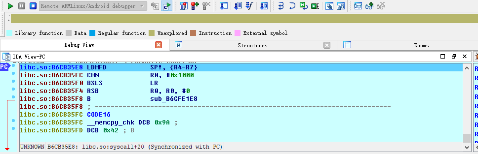
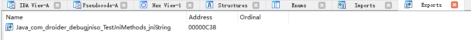

[EN](./ida_native_debug.md) | [ZH](./ida_native_debug-zh.md)
# IDA 动态调试原生层程序

这里我们会介绍如何调试以下种类的程序

- 基本的原生层程序，即简单的 C/C++ 程序。
- 原生 so 程序

## 必备工具

- **已经root的手机**
- IDA

## 基本原理

在使用 ida 动态调试原生层程序时，主要会使用到 android_server 程序。该程序会使用 ptrace 技术注入到要调试的程序中。

每一个进程都有一个 status 文件，其中有一字段 TracerPid 用来标识该进程是被哪个进程 ptrace 了。如果没有被其他进程 ptrace，那么就返回 0，否则返回对应进程的 pid。

## 基本环境搭建

无论是调试什么原生层程序，基本的环境搭建都是类似的，需要确保 IDA 与手机通信正常。

1. 上传 android_server 文件(在 ida 的 dbgsrv 文件夹下)，并修改相应权限使其可以执行

```shell
adb push android_server /data/local/tmp/
adb shell chmod 755 /data/local/tmp/android_server
```

2. 开启 android_server，其会监听 23946 端口(以 root 权限运行)

```shell
adb shell # 进入adb
su # 切换root
./data/local/tmp/android_server #启动android_server
```
3. 建立本地计算机 23496 端口与手机端口 23946 的通信。当 PC 有客户端连接 23946 端口时，其发送的信息都将被转发到手机的相应的端口，这时 android_server 就收到相应的数据，从而使得 IDA 可以调试程序。前面的 tcp 的端口指的是本地 PC 的端口，后面的指的是手机的端口。

```shell
adb forward tcp:23946 tcp:23946
```
注意：

> 其实这个连接建立的是 adb server 与与手机上 adbd 之间的通信。所以其通信大概是这个样子的
>
> IDA<-->adb server<--->adbd<---->android_server
>
> ​         电脑                   |             手机

**其中，第一步只需要执行一次，后面就不需要再次执行。而第 2-3 步每次都得执行，因此可以写成一个脚本，并将脚本的路径放在系统的 path 环境变量下，这样我们可以执行一个命令直接执行。**

## 基本原生程序调试-法1

基本原生程序指的是普通的编译为 arm 汇编的 c/c++ 程序。

### 添加程序

这里我们以<u>http://www.52pojie.cn/thread-554068-1-1.html</u>中的 debugnativeapp 为例子。

首先，我们需要把原生程序放到 android 设备中，并修改其权限，使其可以被执行。如下

```shell
adb push debugnativeapp /data/local/tmp/
adb shell chmod 755 /data/local/tmp/debugnativeapp
```

### 启动调试

根据原生层程序的位数选择相应的 ida，然后选择 Debugger-Run-RemoteArmLinux/Android debugger，如下界面


其中，重要的参数意义如下

- Application
  - 被调试程序在手机上的绝对路径。
- Directory
  - 被调试程序在手机中的目录
- Hostname
  - 即我们与哪个主机进行通信，这里我们直接和本地PC进行通信。

其中 Debug options 选择如下


主要是选择了三个 Events，使得我们的程序可以在入口点，线程启动时，library加载时自动停止。当然，也可以都进行选择。

启动程序后，如下


注：

> 1. 如果发现can not load plugin ，那可能是手机没有root。
>
> 2. 如果遇到以下问题，直接cancel就好。具体原因还不清楚。
>
>    
>
> 3. 如果遇到error: only position independent executables (PIE) are supported.一般是因为android手机的版本大于5，可以尝试
>
>    - 使用android_server的PIE版本
>    - 利用010Editor将可执行ELF文件的header中的elf header字段中的e_type改为ET_DYN(3)。

## so原生程序调试

对于 so 原生程序，我们可能会想这和普通原生程序有什么不一样的地方呢？自然是有的，so文件不能单独运行。一般是其它程序调用 so 文件中的基本某些函数。所以这里我们就不能直接采用上面 run 的方式了。一般来说，android 中 so 文件都是依赖于 apk 文件的。

这里我们以 <u>http://www.52pojie.cn/thread-554068-1-1.html</u> 中的 debugjniso.apk 为例子。

**首先，必须搭建基本调试环境。**

### 安装程序

首先，我们需要将 apk 安装到手机上。

```shell
adb install debugjniso.apk
```

### 调试模式启动app

其次，我们需要以**调试模式启动程序**，这样，才可以方便 IDA 来捕捉到相应的程序并对其进行 attach。

 ```shell
adb shell am start -D -n packagename/.MainActivity
 ```

### attach程序

启动 IDA pro，点击Debugger-Attach-RemoteArmLinux/Android debugger，Hostname 填 localhost，port 默认就是 23946 端口。其实就是我们本地电脑的监听端口。如下


点击 ok，启动调试

**注意：**

> 如果最后出现只有一个程序 /bin/sh 可以被 attach，那说明没有以 root 权限运行 android_server 程序。

利用 ctrl+f 快速定位并选择相应的进程，如下


然后ok确定即可。

这时我们可以看到我们已经 attach 成功了。



这时候我们再点击 Debugger-Debugger options，设置相关选项如下


意思类同于原生程序。

> 为什么这时候才选择要设下相应的断点，是因为如果在开始attach的时候就设置的话，到这里其实是没有的。大家可以试试。

### 恢复 app 执行

这时候，app 的界面是 wait for debugger，我们也已经 attach 上去了。这时候，就需要让程序继续运行了。

首先，我们打开 ddms 来选中我们要调试的进程。


这里其实相当于直接执行了

```shell
# 显示手机所有可供调试的用户进程
adb jdwp
# 在PC的xxx端口与手机的相应端口之间建立连接，方便通信
adb forward tcp:xxx jdwp:<pid>
```

之所以不使用命令去执行，是因为我们还得自己去确定我们的 apk 的进程号，这会比较麻烦。

这里给出一个基本的通信过程


此时，我们的电脑已经与手机的 app 虚拟机之间建立了通信。

同时，我们需要使用 jdb 在 java 层来将我们的 apk 应用 attach 到我们的电脑上，这里我们使用如下的命令。

```shell
jdb -connect com.sun.jdi.SocketAttach:hostname=localhost,port=xxx
```

其中 xxx 就是我们在 ddms 看到的 8700 端口，一般默认就是这个。执行之后

```shell
C:\Users\iromise
λ jdb.bat

jdb -connect com.sun.jdi.SocketAttach:hostname=127.0.0.1,port=8700
设置未捕获的java.lang.Throwable
设置延迟的未捕获的java.lang.Throwable
正在初始化jdb...
>
```

我们再次看一下我们的手机，


此时，应用已经又继续运行了，不再是之前的 wait for debugger 了。

### 确定原生函数地址

这里我们再次打开一个 ida，导入该 apk 的 so 库，然后在 export 中寻找我们的函数，如下



可以看出其偏移为 0xc38。

我们再在之前的调试的 IDA 中运行 F9 直到怎么按都不再运行，我们会看到程序断在 linker 处


此时，我们**点击 app 界面的设置标题按钮**（之所以要按这个，是因为在该函数中调用了原生 API），再次观察IDA，可以看出该 so 库已经被加载进入

```text
B3B05000: loaded /data/app/com.droider.debugjniso-1/oat/arm/base.odex
B39B9000: loaded /system/lib/hw/gralloc.msm8974.so
B39B2000: loaded /system/lib/libmemalloc.so
B39AA000: loaded /system/lib/libqdutils.so
B3B00000: loaded /data/app/com.droider.debugjniso-1/lib/arm/libdebugjniso.so
```

这时，我们利用 ctrl+s 定位到该库的起始地址处 0xB3B00000。然后根据

```text
绝对地址=基地址+相对偏移
```

得到 jnistring 的地址。

### 观察结果

按下 g，然后输入 `+0xC38` ，点击 ok 即可跳转至该函数

```assembly
libdebugjniso.so:B3B00C38 Java_com_droider_debugjniso_TestJniMethods_jniString
libdebugjniso.so:B3B00C38 LDR             R1, =(unk_B3B02148 - 0xB3B00C4C)
libdebugjniso.so:B3B00C3C STMFD           SP!, {R4,LR}
libdebugjniso.so:B3B00C40 LDR             R3, [R0]
libdebugjniso.so:B3B00C44 ADD             R1, PC, R1 ; unk_B3B02148
libdebugjniso.so:B3B00C48 MOV             LR, PC
```

我们在此函数的开始处 F2 下断点，然后再次F9执行程序，同时观看手机，就可以发现app的标题变成了`你好！Nativemethod` 。

到此，so 原生程序的基本调试步骤就结束了。

注：

> 如果中间出现了add map的对话框直接点击Cancel，然后apply即可。

### 注意事项

1.  当使用模拟器调试 apk 出现异常时，很有可能是应用检测了是否运行在模拟器环境下，考虑使用手机。
2.  当使用真机调试 apk 时，也有可能会遇到异常，卡在某一条指令上，这时我们可以手动执行这条指令，然后将 PC 设置为下一条指令的地址。

## 基本原生程序调试-法2

待补充。

## 多线程调试

# 参考阅读

- http://www.52pojie.cn/thread-554068-1-1.html
- https://www.kanxue.com/chm.htm?id=10296&pid=node1000944
