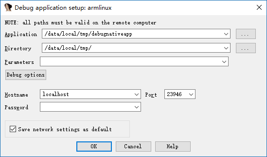
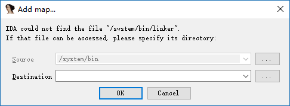
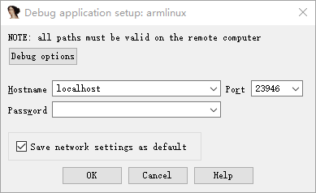
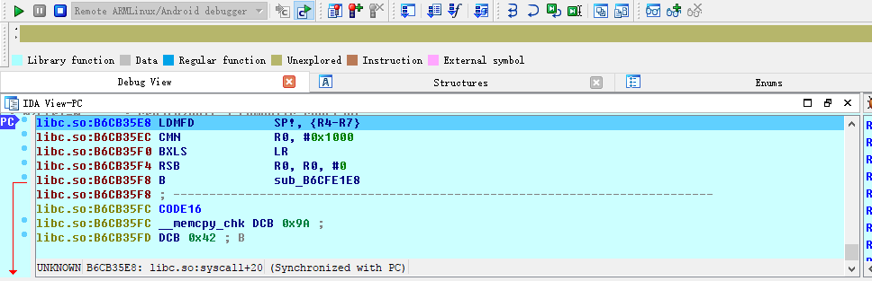
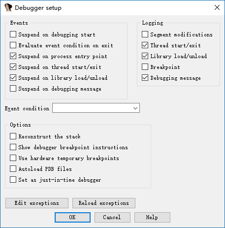
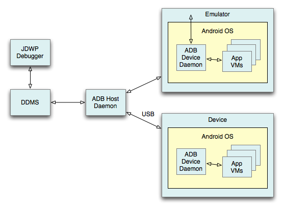
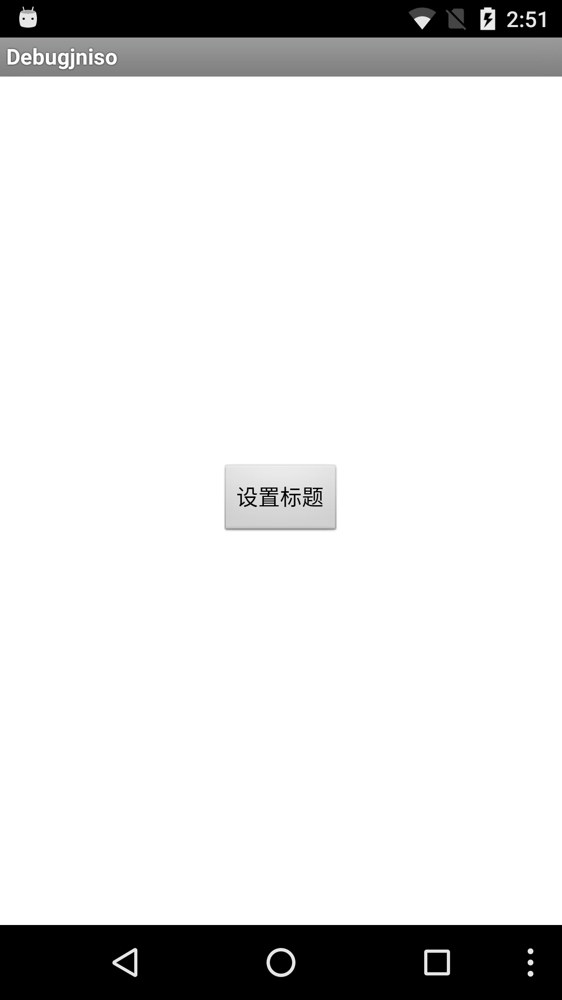
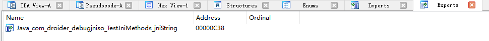
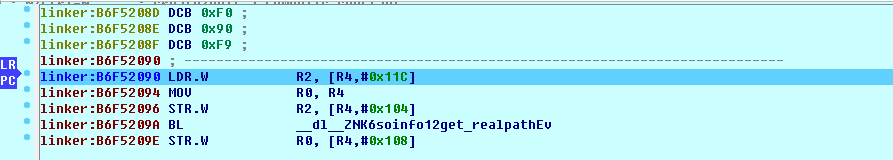

[EN](./ida_native_debug.md) | [ZH](./ida_native_debug-zh.md)
# IDA Dynamically Debugging Native Layer Programs


Here we will introduce how to debug the following types of programs.


- Basic native layer program, a simple C/C++ program.
- Native so program


## Essential Tools


- ** already rooted phone **
- IDA


## Fundamental


When using ida to dynamically debug native layer programs, the android_server program is mainly used. The program is injected into the program to be debugged using ptrace technology.


Each process has a status file with a field TracerPid that identifies which process the process is ptrace to. If it is not ptrace by other processes, it returns 0, otherwise it returns the pid of the corresponding process.


## Basic environment construction


No matter what native layer program is debugged, the basic environment is similar. You need to ensure that IDA communicates with the phone normally.


1. Upload the android_server file (under ida&#39;s dbgsrv folder) and modify the permissions to make it executable


```shell

adb push android_server /data/local/tmp/

adb shell chmod 755 /data/local/tmp/android_server

```


2. Open android_server, which will listen on port 23946 (running as root)


```shell

Adb shell # Enter adb
Su # switch root
./data/local/tmp/android_server #Start android_server
```

3. Establish communication between the local computer 23496 port and the mobile phone port 23946. When the PC has a client connection to port 23946, the information it sends will be forwarded to the corresponding port on the phone, and android_server will receive the corresponding data, allowing IDA to debug the program. The port of the previous tcp refers to the port of the local PC, and the latter refers to the port of the mobile phone.


```shell

adb forward tcp:23946 tcp:23946

```

note:


&gt; In fact, this connection establishes communication between the adb server and the adbd on the phone. So its communication is probably like this
>

> IDA<-->adb server<--->adbd<---->android_server

>

&gt; computer | mobile phone


** Among them, the first step only needs to be executed once, and you don&#39;t need to execute it again later. Steps 2-3 have to be executed each time, so you can write a script and place the script&#39;s path under the system&#39;s path environment variable so that we can execute a command directly. **


## Basic native program debugging - Method 1


A basic native program refers to a normal c/c++ program compiled into arm assembly.


### Adding a program


Here we take the debugnativeapp in <u>http://www.52pojie.cn/thread-554068-1-1.html</u> as an example.


First, we need to put the native program on the android device and modify its permissions so that it can be executed. as follows


```shell

adb push debugnativeapp /data/local/tmp/

adb shell chmod 755 /data/local/tmp/debugnativeapp

```


### Start debugging


Select the appropriate ida according to the number of bits in the native layer program, then select Debugger-Run-RemoteArmLinux/Android debugger, the following interface





Among them, the important parameters are as follows


- Application

- The absolute path of the program being debugged on the phone.
- Directory

- The directory of the debugged program in the phone
- Hostname

- That is, which host we communicate with, here we communicate directly with the local PC.


The Debug options are selected as follows


Mainly selected three events, so that our program can be automatically stopped at the entry point, when the thread starts, when the library is loaded. Of course, you can also choose.


After starting the program, as follows


Note:


&gt; 1. If you find that you can not load plugin, it may be that the phone does not have root.
>

&gt; 2. If you encounter the following problems, just cancel it. The specific reasons are not clear.
>

>    

>

&gt; 3. If you encounter error: only position independent executables (PIE) are supported. Generally because the version of android phone is greater than 5, you can try
>

&gt; - Use the PIE version of android_server
&gt; - Use 010Editor to change the e_type in the elf header field in the header of the executable ELF file to ET_DYN(3).


## so native program debugging


For so native programs, we might wonder what is different from ordinary native programs? Naturally there are, so files cannot be run separately. Usually some other programs call some basic functions in the so file. So here we can&#39;t directly use the above run method. In general, the so files in android are dependent on the apk file.


Here we take debugjniso.apk in <u>http://www.52pojie.cn/thread-554068-1-1.html</u> as an example.


** First, you must build a basic debugging environment. **


### Installer


First, we need to install the apk on the phone.


```shell

adb install debugjniso.apk

```


### Debug mode startup app


Secondly, we need to start the program in ** debug mode**, so that IDA can easily capture the corresponding program and attach it.


 ```shell

adb shell am start -D -n packagename/.MainActivity

 ```


### attach program


Start IDA pro, click Debugger-Attach-RemoteArmLinux/Android debugger, Hostname fills in localhost, port defaults to port 23946. In fact, it is the listening port of our local computer. as follows





Click ok to start debugging


**note:**


&gt; If only one program /bin/sh can be attached at the end, it means that the android_server program is not running with root privileges.


Use ctrl+f to quickly locate and select the corresponding process, as follows


Then ok OK.


At this point we can see that we have attached success.





At this time, we click Debugger-Debugger options again, and the related options are as follows:





The meaning is similar to the native program.


&gt; Why do you choose to set the corresponding breakpoint at this time? Because if you set it at the beginning of the attach, there is actually no such thing here. Everyone can try.


### Resume app execution


At this time, the interface of the app is wait for debugger, and we have attached it. At this time, you need to let the program continue to run.


First, we open ddms to select the process we want to debug.


This is actually equivalent to direct execution.


```shell

# Display all user processes available for debugging on the phone
adb jdwp

# Establish a connection between the xxx port of the PC and the corresponding port of the mobile phone to facilitate communication
adb forward tcp:xxx jdwp:<pid>

```


The reason why we don&#39;t use the command to execute is because we have to determine the process number of our apk ourselves, which is more troublesome.


Here is a basic communication process





At this point, our computer has established communication with the app&#39;s app virtual machine.


At the same time, we need to use jdb in the java layer to attach our apk application to our computer, here we use the following command.


```shell

jdb -connect com.sun.jdi.SocketAttach:hostname=localhost,port=xxx

```


Where xxx is the 8700 port we saw in ddms, the default is this. After execution


```shell

C:\Users\iromise

λ jdb.bat


jdb -connect com.sun.jdi.SocketAttach:hostname=127.0.0.1,port=8700

Set uncaught java.lang.Throwable
Set delayed uncaught java.lang.Throwable
Initializing jdb...
>

```


Let’s take a look at our mobile phone again.





At this point, the application has continued to run, no longer the previous wait for debugger.


### Determining the native function address


Here we open an ida again, import the sok of the apk, and then look for our function in export, as follows





It can be seen that the offset is 0xc38.


We then run F9 in the previous debug IDA until it is no longer running, we will see the program break at the linker





At this point, we ** click on the app&#39;s interface to set the title button ** (the reason to press this, because the native API is called in the function), observe the IDA again, you can see that the so library has been loaded into


```text

B3B05000: loaded /data/app/com.droider.debugjniso-1/oat/arm/base.odex

B39B9000: loaded /system/lib/hw/gralloc.msm8974.so

B39B2000: loaded /system/lib/libmemalloc.so

B39AA000: loaded /system/lib/libqdutils.so

B3B00000: loaded /data/app/com.droider.debugjniso-1/lib/arm/libdebugjniso.so

```


At this point, we use ctrl+s to locate 0xB3B00000 at the starting address of the library. Then according to


```text

Absolute address = base address + relative offset
```


Get the address of the jnistring.


### Observation results


Press g, then type `+0xC38` and click ok to jump to the function


```assembly

libdebugjniso.so:B3B00C38 Java_com_droider_debugjniso_TestJniMethods_jniString
libdebugjniso.so:B3B00C38 LDR             R1, =(unk_B3B02148 - 0xB3B00C4C)

libdebugjniso.so:B3B00C3C STMFD           SP!, {R4,LR}

libdebugjniso.so:B3B00C40 LDR R3, [R0]
libdebugjniso.so:B3B00C44 ADD             R1, PC, R1 ; unk_B3B02148

libdebugjniso.so:B3B00C48 MOV             LR, PC

```


We breakpoints at the beginning of this function, F2, and then execute the program again with F9. While watching the phone, we can see that the title of the app has changed to `Hello! Nativemethod`.


At this point, the basic debugging steps of the so native program are over.

Note:


&gt; If there is an add map dialog box in the middle, click Cancel, then apply.


### Precautions


1. When using the simulator to debug an apk exception, it is very likely that the application has detected whether it is running in the simulator environment, consider using a mobile phone.
2. When using the real machine debugging apk, it is also possible to encounter an exception, stuck in a certain instruction, then we can manually execute this instruction, and then set the PC to the address of the next instruction.


## Basic native program debugging - Method 2


To be added.


## Multithreaded debugging


# 参考阅读


- http://www.52pojie.cn/thread-554068-1-1.html

- https://www.kanxue.com/chm.htm?id=10296&pid=node1000944
