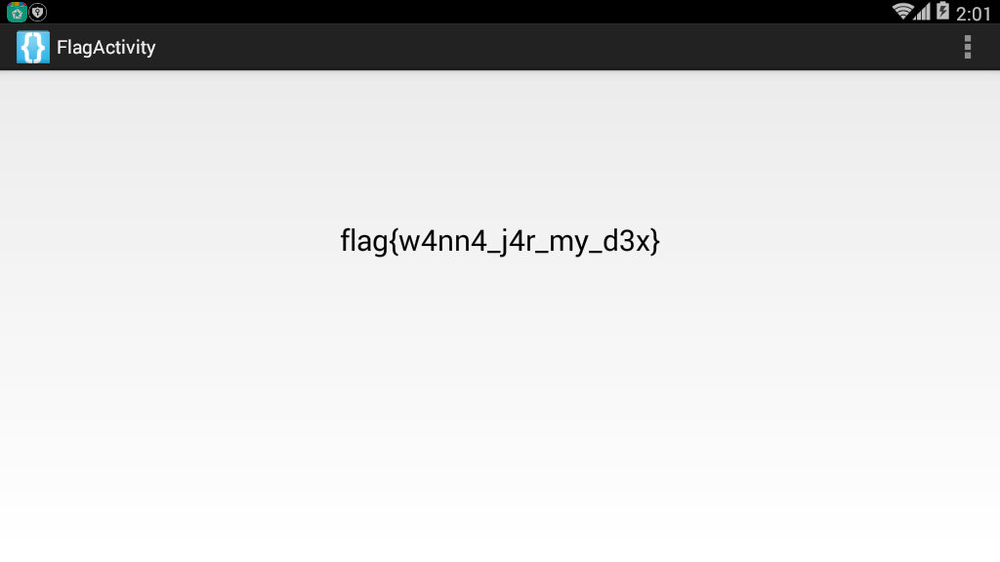
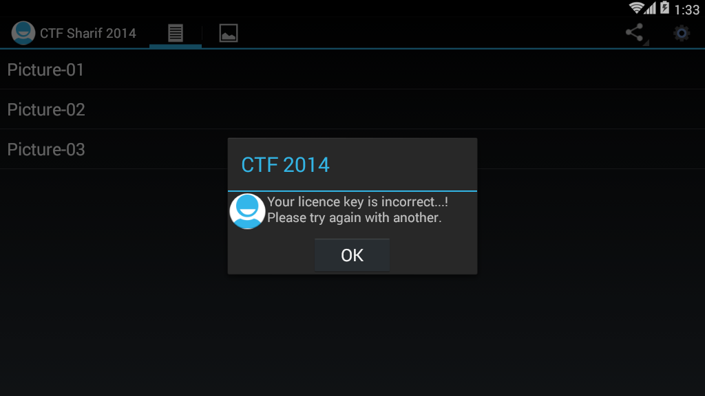

[EN](./java-example.md) | [ZH](./java-example-zh.md)
# 静态分析 java 层例子

## 2014 tinyCTF Ooooooh! What does this button do

### 确定文件类型

通过linux的file命令可以看出该文件是一个压缩包，解压打开发现它其实是一个apk文件。

### 安装apk

安装文件之后，查看一下


可以看出其就是输入一个字符串，然后应该会弹出结果。

### 查看程序

```java
    class C00721 implements OnClickListener {
        C00721() {
        }

        public void onClick(View view) {
            if (((EditText) MainActivity.this.findViewById(C0073R.id.passwordField)).getText().toString().compareTo("EYG3QMCS") == 0) {
                MainActivity.this.startActivity(new Intent(MainActivity.this, FlagActivity.class));
            }
        }
    }

```

在主程序中，可以发现，如果我们输入的字符串为EYG3QMCS就会执行flagActivity.class。那么我们输入一下，可以得到如下结果



即得到flag。

## 2014 ASIS Cyber Security Contest Finals Numdroid

### 判断文件类型

首先利用file判断一下文件类型，发现是个压缩包，解压缩一下，得到对应的文件，然后继续看一下，发现该文件是apk文件。

### 安装程序

安装一下程序。简单看一下页面，可以发现程序主要是输入密码，然后登陆。如果输入错的话会爆出“Wrong Password”的信息。


### 分析程序

根据相应的字符串来定位一下源程序中的关键函数。根据strings.xml可以发现该字符串的变量名为wrong，继而我们找到了如下代码。

```java
    protected void ok_clicked() {
        DebugTools.log("clicked password: " + this.mScreen.getText());
        boolean result = Verify.isOk(this, this.mScreen.getText().toString());
        DebugTools.log("password is Ok? : " + result);
        if (result) {
            Intent i = new Intent(this, LipSum.class);
            Bundle b = new Bundle();
            b.putString("flag", this.mScreen.getText().toString().substring(0, 7));
            i.putExtras(b);
            startActivity(i);
            return;
        }
        Toast.makeText(this, R.string.wrong, 1).show();
        this.mScreen.setText("");
    }

```

继续定位到Verify.isOk中。如下

```java
    public static boolean isOk(Context c, String _password) {
        String password = _password;
        if (_password.length() > 7) {
            password = _password.substring(0, 7);
        }
        String r = OneWayFunction(password);
        DebugTools.log("digest: " + password + " => " + r);
        if (r.equals("be790d865f2cea9645b3f79c0342df7e")) {
            return true;
        }
        return false;
    }

```

可以发现程序主要是取password的前7位进行OneWayFunction加密，然后与be790d865f2cea9645b3f79c0342df7e进行比较。如果相等就会返回true。这里我们再看一下OneWayFunction，如下

```java
    private static String OneWayFunction(String password) {
        List<byte[]> bytes = ArrayTools.map(ArrayTools.select(ArrayTools.map(new String[]{"MD2", "MD5", "SHA-1", "SHA-256", "SHA-384", "SHA-512"}, new AnonymousClass1(password)), new SelectAction<byte[]>() {
            public boolean action(byte[] element) {
                return element != null;
            }
        }), new MapAction<byte[], byte[]>() {
            public byte[] action(byte[] element) {
                int i;
                byte[] b = new byte[8];
                for (i = 0; i < b.length / 2; i++) {
                    b[i] = element[i];
                }
                for (i = 0; i < b.length / 2; i++) {
                    b[(b.length / 2) + i] = element[(element.length - i) - 2];
                }
                return b;
            }
        });
        byte[] b2 = new byte[(bytes.size() * 8)];
        for (int i = 0; i < b2.length; i++) {
            b2[i] = ((byte[]) bytes.get(i % bytes.size()))[i / bytes.size()];
        }
        try {
            MessageDigest digest = MessageDigest.getInstance("MD5");
            digest.update(b2);
            byte[] messageDigest = digest.digest();
            StringBuilder hexString = new StringBuilder();
            for (byte aMessageDigest : messageDigest) {
                String h = Integer.toHexString(aMessageDigest & MotionEventCompat.ACTION_MASK);
                while (h.length() < 2) {
                    h = "0" + h;
                }
                hexString.append(h);
            }
            return hexString.toString();
        } catch (NoSuchAlgorithmException e) {
            return "";
        }
    }
```

函数大概就是执行了几个hash值，但是自己去分析的话，太过于复杂，，由于本题的答案空间($10^7$)比较小，所以我们可以把verify类中的方法拿出来自己暴力跑一下。

### 构造程序

提取出java程序之后，在Verify类中添加main函数并修复部分错误，从而得到对应的答案。

这里对应的代码放在了example对应的文件夹中。

需要注意的是，这里如果对应的hash函数不存在的话，源程序会跳过对应的函数。我直接全部跑没有找到，然后去掉了一个不常见的MD2算法，从而得到了答案。这说明android应该是没有md2算法的。

输入之后得到如下


然后我们计算对应的MD值，从而获得flag为ASIS_3c56e1ed0597056fef0006c6d1c52463。

## 2014 Sharif University Quals CTF Commercial Application

### 安装程序

首先，安装程序，随便点了点按钮，在右上方点击按钮会让我们输入key


随便输入了下，发现程序直接报错，告诉我们不对，那么我们可以根据这些信息来进行定位关键代码。



### 定位关键代码

```java
    public static final String NOK_LICENCE_MSG = "Your licence key is incorrect...! Please try again with another.";
    public static final String OK_LICENCE_MSG = "Thank you, Your application has full licence. Enjoy it...!";

	private void checkLicenceKey(final Context context) {
        if (this.app.getDataHelper().getConfig().hasLicence()) {
            showAlertDialog(context, OK_LICENCE_MSG);
            return;
        }
        View inflate = LayoutInflater.from(context).inflate(C0080R.layout.propmt, null);
        Builder builder = new Builder(context);
        builder.setView(inflate);
        final EditText editText = (EditText) inflate.findViewById(C0080R.id.editTextDialogUserInput);
        builder.setCancelable(false).setPositiveButton("Continue", new OnClickListener() {
            public void onClick(DialogInterface dialogInterface, int i) {
                if (KeyVerifier.isValidLicenceKey(editText.getText().toString(), MainActivity.this.app.getDataHelper().getConfig().getSecurityKey(), MainActivity.this.app.getDataHelper().getConfig().getSecurityIv())) {
                    MainActivity.this.app.getDataHelper().updateLicence(2014);
                    MainActivity.isRegisterd = true;
                    MainActivity.this.showAlertDialog(context, MainActivity.OK_LICENCE_MSG);
                    return;
                }
                MainActivity.this.showAlertDialog(context, MainActivity.NOK_LICENCE_MSG);
            }
        }).setNegativeButton("Cancel", new C00855());
        builder.create().show();
    }
```

我们发现，其实 MainActivity.NOK_LICENCE_MSG就存储着报错的字符串信息，再继续读一下发现程序使用

```java
KeyVerifier.isValidLicenceKey(editText.getText().toString(), MainActivity.this.app.getDataHelper().getConfig().getSecurityKey(), MainActivity.this.app.getDataHelper().getConfig().getSecurityIv())
```

来进行验证，如果验证通过就会跳出成功信息。

### 详细分析

进而我们仔细分析一下这三个参数。

#### 参数1

参数1其实就是我们输入的字符串。

#### 参数2

是利用函数来获取getSecurityKey，我们简单阅读一下，可以发现程序在getConfig函数中设置了SecurityKey

```java
    public AppConfig getConfig() {
        boolean z = false;
        AppConfig appConfig = new AppConfig();
        Cursor rawQuery = this.myDataBase.rawQuery(SELECT_QUERY, null);
        if (rawQuery.moveToFirst()) {
            appConfig.setId(rawQuery.getInt(0));
            appConfig.setName(rawQuery.getString(1));
            appConfig.setInstallDate(rawQuery.getString(2));
            if (rawQuery.getInt(3) > 0) {
                z = true;
            }
            appConfig.setValidLicence(z);
            appConfig.setSecurityIv(rawQuery.getString(4));
            appConfig.setSecurityKey(rawQuery.getString(5));
            appConfig.setDesc(rawQuery.getString(7));
        }
        return appConfig;
    }
```

其中，函数首先进行了数据库访问，SELECT_QUERY如下

```java
    private static String DB_NAME = "db.db";
    private static String DB_PATH = "/data/data/edu.sharif.ctf/databases/";
    public static final String SELECT_QUERY = ("SELECT  * FROM " + TABLE_NAME + " WHERE a=1");
    private static String TABLE_NAME = "config";
```

同时，我们可以得到该数据库的路径。

在进一步分析，我们可以发现程序在这里首先获取了表config的首行，然后将iv设置为第四列的值，key设置为第5列的值。

```java
            appConfig.setSecurityIv(rawQuery.getString(4));
            appConfig.setSecurityKey(rawQuery.getString(5));
```

#### 参数3

其实，参数3类似于参数2。这里就不做说明了。

### 获取数据库文件

首先，我们需要将该apk文件装到手机上，然后利用如下指令获取

```shell
adb pull /data/data/edu.sharif.ctf/databases/db.db
```

进而使用电脑上可以查看sqlite的软件查看一下，这里我使用的是<u>http://sqlitebrowser.org/</u>。如下


这里，我们可以直接得到

```text
SecurityIv=a5efdbd57b84ca36
SecurityKey=37eaae0141f1a3adf8a1dee655853714
```

### 分析加密代码

```java
public class KeyVerifier {
    public static final String CIPHER_ALGORITHM = "AES/CBC/PKCS5Padding";
    public static final String VALID_LICENCE = "29a002d9340fc4bd54492f327269f3e051619b889dc8da723e135ce486965d84";

    public static String bytesToHexString(byte[] bArr) {
        StringBuilder stringBuilder = new StringBuilder();
        int length = bArr.length;
        for (int i = 0; i < length; i++) {
            stringBuilder.append(String.format("%02x", new Object[]{Integer.valueOf(bArr[i] & 255)}));
        }
        return stringBuilder.toString();
    }

    public static String encrypt(String str, String str2, String str3) {
        String str4 = "";
        try {
            Key secretKeySpec = new SecretKeySpec(hexStringToBytes(str2), "AES");
            Cipher instance = Cipher.getInstance(CIPHER_ALGORITHM);
            instance.init(1, secretKeySpec, new IvParameterSpec(str3.getBytes()));
            str4 = bytesToHexString(instance.doFinal(str.getBytes()));
        } catch (Exception e) {
            e.printStackTrace();
        }
        return str4;
    }

    public static byte[] hexStringToBytes(String str) {
        int length = str.length();
        byte[] bArr = new byte[(length / 2)];
        for (int i = 0; i < length; i += 2) {
            bArr[i / 2] = (byte) ((Character.digit(str.charAt(i), 16) << 4) + Character.digit(str.charAt(i + 1), 16));
        }
        return bArr;
    }

    public static boolean isValidLicenceKey(String str, String str2, String str3) {
        return encrypt(str, str2, str3).equals(VALID_LICENCE);
    }
}
```

可以看到程序首先使用了encrypt函数对三个字符串加密。其实就是利用上面所说的AES/CBC/PKCS5Padding方法加密，将str2作为key，将str3作为初始向量。那么我们可以很容易地添加解密函数如下

```java
	public static String decrypt(String input, String secretKey, String iv) {
		String encryptedText = "";
		try {
			SecretKeySpec secretKeySpec = new SecretKeySpec(hexStringToBytes(secretKey), "AES");
			Cipher cipher = Cipher.getInstance(CIPHER_ALGORITHM);
			cipher.init(2, secretKeySpec, new IvParameterSpec(iv.getBytes()));
			encryptedText = bytesToHexString(cipher.doFinal(hexStringToBytes(userInput)));
		} catch (Exception e) {
			e.printStackTrace();
		}
		return encryptedText;
	}
```

然后运行得到正常输入的product key

```text
fl-ag-IS-se-ri-al-NU-MB-ER
```

## 2015-0CTF-vezel

### 分析

首先，分析代码，如下

```
public void confirm(View v) {
    if("0CTF{" + String.valueOf(this.getSig(this.getPackageName())) + this.getCrc() + "}".equals(
            this.et.getText().toString())) {
        Toast.makeText(((Context)this), "Yes!", 0).show();
    }
    else {
        Toast.makeText(((Context)this), "0ops!", 0).show();
    }
}

private String getCrc() {
    String v1;
    try {
        v1 = String.valueOf(new ZipFile(this.getApplicationContext().getPackageCodePath()).getEntry(
                "classes.dex").getCrc());
    }
    catch(Exception v0) {
        v0.printStackTrace();
    }

    return v1;
}

private int getSig(String packageName) {
    int v4;
    PackageManager v2 = this.getPackageManager();
    int v5 = 64;
    try {
        v4 = v2.getPackageInfo(packageName, v5).signatures[0].toCharsString().hashCode();
    }
    catch(Exception v0) {
        v0.printStackTrace();
    }

    return v4;
}
```

可以看出我们想要的flag的分为两个部分

- String.valueOf(this.getSig(this.getPackageName()))
- this.getCrc()

其中第一部分，我们可以采用自己编写一个app来获取对应的值。第二部分我们可以直接将dex文件提取出来，利用网上的工具计算一下。

### hashcode

随便找了个（放在对应的example文件夹下）

```
package com.iromise.getsignature;

import android.content.pm.PackageInfo;
import android.content.pm.PackageManager;
import android.content.pm.Signature;
import android.support.v7.app.AppCompatActivity;
import android.os.Bundle;
import android.text.TextUtils;
import android.util.Log;
import android.widget.Toast;

public class MainActivity extends AppCompatActivity {

    private StringBuilder builder;

    public void onCreate(Bundle savedInstanceState) {
        super.onCreate(savedInstanceState);
        setContentView(R.layout.activity_main);
        PackageManager manager = getPackageManager();
        builder = new StringBuilder();
        String pkgname = "com.ctf.vezel";
        boolean isEmpty = TextUtils.isEmpty(pkgname);
        if (isEmpty) {
            Toast.makeText(this, "应用程序的包名不能为空！", Toast.LENGTH_SHORT);
        } else {
            try {
                PackageInfo packageInfo = manager.getPackageInfo(pkgname, PackageManager.GET_SIGNATURES);
                Signature[] signatures = packageInfo.signatures;
                Log.i("hashcode", String.valueOf(signatures[0].toCharsString().hashCode()));
            } catch (PackageManager.NameNotFoundException e) {
                e.printStackTrace();
            }
        }
    }
}

```

然后再ddms中过滤出hashcode

```
07-18 11:05:11.895 16124-16124/? I/hashcode: -183971537
```

**注：其实这个程序可以写成一个小的app，很多程序都会计算签名。**

### classes.dex crc32

随便找个在线网站获取一下`classes.dex`的CRC32值。

```text
CRC-32	46e26557
MD5 Hash	3217b0ad6c769233ea2a49d17885b5ba
SHA1 Hash	ec3b4730654248a02b016d00c9ae2425379bf78f
SHA256 Hash	6fb1df4dacc95312ec72d8b79d22529e1720a573971f866bbf8963b01499ecf8
```

需要注意的是，这里需要转成十进制

```
>>> print int("46E26557", 16)
1189242199
```

### flag

两部分算完合起来就是Flag

Flag：0ctf{-1839715371189242199}

## 2017 XMAN HelloSmali2

给的是一个 smali 文件，我们可以按照如下思路来做

利用 smali.jar 将 smali 汇编为 dex 文件。

```shell
java -jar smali.jar assemble  src.smali -o src.dex
```

使用 jadx 反编译 dex，如下

```java
package com.example.hellosmali.hellosmali;

public class Digest {
    public static boolean check(String input) {
        String str = "+/abcdefghijklmnopqrstuvwxyzABCDEFGHIJKLMNOPQRSTUVWXYZ0123456789";
        if (input == null || input.length() == 0) {
            return false;
        }
        int i;
        char[] charinput = input.toCharArray();
        StringBuilder v2 = new StringBuilder();
        for (char toBinaryString : charinput) {
            String intinput = Integer.toBinaryString(toBinaryString);
            while (intinput.length() < 8) {
                intinput = "0" + intinput;
            }
            v2.append(intinput);
        }
        while (v2.length() % 6 != 0) {
            v2.append("0");
        }
        String v1 = String.valueOf(v2);
        char[] v4 = new char[(v1.length() / 6)];
        for (i = 0; i < v4.length; i++) {
            int v6 = Integer.parseInt(v1.substring(0, 6), 2);
            v1 = v1.substring(6);
            v4[i] = str.charAt(v6);
        }
        StringBuilder v3 = new StringBuilder(String.valueOf(v4));
        if (input.length() % 3 == 1) {
            v3.append("!?");
        } else if (input.length() % 3 == 2) {
            v3.append("!");
        }
        if (String.valueOf(v3).equals("xsZDluYYreJDyrpDpucZCo!?")) {
            return true;
        }
        return false;
    }
}
```

简单看一下，其实是一个变种的 base64 加密，我们可以在网上找一个 base64 编码，然后设置一下就好了，这里使用的脚本来自于 http://www.cnblogs.com/crazyrunning/p/7382693.html。

```python
#coding=utf8
import string

base64_charset = '+/abcdefghijklmnopqrstuvwxyzABCDEFGHIJKLMNOPQRSTUVWXYZ0123456789'


def decode(base64_str):
    """
    解码base64字符串
    :param base64_str:base64字符串
    :return:解码后的bytearray；若入参不是合法base64字符串，返回空bytearray
    """
    # 对每一个base64字符取下标索引，并转换为6为二进制字符串
    base64_bytes = ['{:0>6}'.format(str(bin(base64_charset.index(s))).replace('0b', '')) for s in base64_str if
                    s != '=']
    resp = bytearray()
    nums = len(base64_bytes) // 4
    remain = len(base64_bytes) % 4
    integral_part = base64_bytes[0:4 * nums]

    while integral_part:
        # 取4个6位base64字符，作为3个字节
        tmp_unit = ''.join(integral_part[0:4])
        tmp_unit = [int(tmp_unit[x: x + 8], 2) for x in [0, 8, 16]]
        for i in tmp_unit:
            resp.append(i)
        integral_part = integral_part[4:]

    if remain:
        remain_part = ''.join(base64_bytes[nums * 4:])
        tmp_unit = [int(remain_part[i * 8:(i + 1) * 8], 2) for i in range(remain - 1)]
        for i in tmp_unit:
            resp.append(i)

    return resp

if __name__=="__main__":
    print decode('A0NDlKJLv0hTA1lDAuZRgo==')
```

结果如下

```shell
➜  tmp python test.py
eM_5m4Li_i4_Ea5y
```

## 题目

- GCTF 2017 Android1
- GCTF 2017 Android2
- ISG 2017 Crackme
- XMAN 2017 mobile3 rev1
