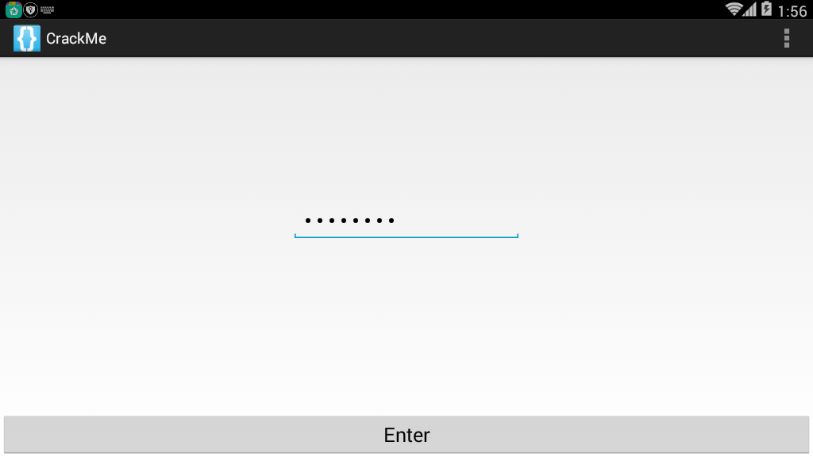
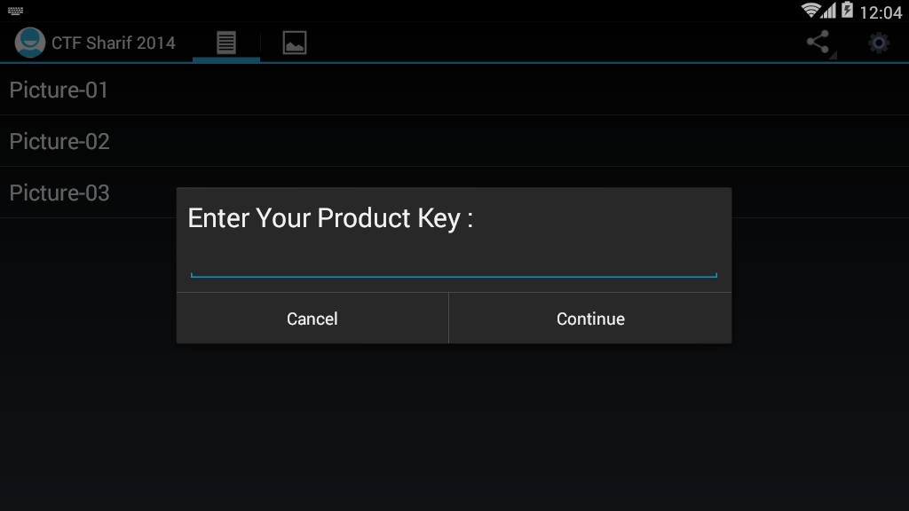

[EN](./java-example.md) | [ZH](./java-example-zh.md)
# static analysis java layer example


## 2014 tinyCTF Ooooooh! What does this button do


### Determining the file type


Through the linux file command, you can see that the file is a compressed package. Unzip it and find that it is actually an apk file.


### Install apk


After installing the file, check it out.





It can be seen that it is to enter a string, and then the result should pop up.


### Viewing the program


```java

    class C00721 implements OnClickListener {

        C00721() {

        }


        public void onClick(View view) {

            if (((EditText) MainActivity.this.findViewById(C0073R.id.passwordField)).getText().toString().compareTo("EYG3QMCS") == 0) {

                MainActivity.this.startActivity(new Intent(MainActivity.this, FlagActivity.class));

            }

        }

    }


```


In the main program, you can find that if we enter the string EYG3QMCS will execute flagActivity.class. Then we can enter the following results.


That is, get the flag.


## 2014 ASIS Cyber Security Contest Finals Numdroid


### Judging file type


First use file to determine the file type, found that it is a compressed package, unzip it, get the corresponding file, and then continue to look at it, found that the file is an apk file.


### Installer


Install the program. A quick look at the page, you can find that the program is mainly to enter a password, and then log in. If you make a mistake, the message &quot;Wrong Password&quot; will pop up.


###分析程序


Locate the key functions in the source program based on the corresponding string. According to strings.xml, we can find the variable name of the string is wrong, and then we found the following code.


```java

    protected void ok_clicked() {

        DebugTools.log("clicked password: " + this.mScreen.getText());

        boolean result = Verify.isOk(this, this.mScreen.getText().toString());

        DebugTools.log("password is Ok? : " + result);

        if (result) {

            Intent i = new Intent(this, LipSum.class);

            Bundle b = new Bundle();

            b.putString("flag", this.mScreen.getText().toString().substring(0, 7));

            i.putExtras(b);

            startActivity(i);

            return;

        }

        Toast.makeText(this, R.string.wrong, 1).show();

        this.mScreen.setText("");

    }


```


Continue to locate in Verify.isOk. as follows


```java

    public static boolean isOk(Context c, String _password) {

        String password = _password;

        if (_password.length() > 7) {

            password = _password.substring(0, 7);

        }

        String r = OneWayFunction(password);

        DebugTools.log("digest: " + password + " => " + r);

        if (r.equals("be790d865f2cea9645b3f79c0342df7e")) {

            return true;

        }

        return false;

    }


```


It can be found that the program mainly takes the first 7 bits of the password for OneWayFunction encryption, and then compares it with be790d865f2cea9645b3f79c0342df7e. Returns true if they are equal. Here we look at OneWayFunction again, as follows


```java

    private static String OneWayFunction(String password) {

        List<byte[]> bytes = ArrayTools.map(ArrayTools.select(ArrayTools.map(new String[]{"MD2", "MD5", "SHA-1", "SHA-256", "SHA-384", "SHA-512"}, new AnonymousClass1(password)), new SelectAction<byte[]>() {

            public boolean action(byte[] element) {

                return element != null;

            }

        }), new MapAction<byte[], byte[]>() {

            public byte[] action(byte[] element) {

                int i;

                byte[] b = new byte[8];

                for (i = 0; i < b.length / 2; i++) {

                    b[i] = element[i];

                }

                for (i = 0; i < b.length / 2; i++) {

                    b[(b.length / 2) + i] = element[(element.length - i) - 2];

                }

                return b;

            }

        });

        byte[] b2 = new byte[(bytes.size() * 8)];

        for (int i = 0; i < b2.length; i++) {

            b2[i] = ((byte[]) bytes.get(i % bytes.size()))[i / bytes.size()];

        }

        try {

            MessageDigest digest = MessageDigest.getInstance("MD5");

            digest.update(b2);

            byte[] messageDigest = digest.digest();

            StringBuilder hexString = new StringBuilder();

            for (byte aMessageDigest : messageDigest) {

                String h = Integer.toHexString(aMessageDigest & MotionEventCompat.ACTION_MASK);

                while (h.length() < 2) {

                    h = "0" + h;

                }

                hexString.append(h);
            }

            return hexString.toString();

        } catch (NoSuchAlgorithmException e) {

            return "";

        }

    }

```


The function probably executes several hash values, but if you analyze it yourself, it is too complicated. Because the answer space ($10^7$) of this question is relatively small, we can take the method in the verify class and violently run it. .


### Constructor


After extracting the java program, add the main function to the Verify class and fix some errors to get the corresponding answer.


The corresponding code here is placed in the folder corresponding to example.


It should be noted that if the corresponding hash function does not exist, the source program will skip the corresponding function. I ran all without finding it, then removed an unusual MD2 algorithm and got the answer. This shows that android should be without the md2 algorithm.


After input, you get the following


Then we calculate the corresponding MD value, so that the flag is ASIS_3c56e1ed0597056fef0006c6d1c52463.


## 2014 Sharif University Quals CTF Commercial Application


### Installer


First, install the program, just click the button, click on the button in the upper right will let us enter the key





Just enter it and find that the program reports an error directly, telling us that it is wrong, then we can use this information to locate the key code.


### Positioning key code


```java

    public static final String NOK_LICENCE_MSG = "Your licence key is incorrect...! Please try again with another.";

    public static final String OK_LICENCE_MSG = "Thank you, Your application has full licence. Enjoy it...!";


	private void checkLicenceKey(final Context context) {

        if (this.app.getDataHelper().getConfig().hasLicence()) {

            showAlertDialog(context, OK_LICENCE_MSG);

            return;

        }

        View inflate = LayoutInflater.from(context).inflate(C0080R.layout.propmt, null);

        Builder builder = new Builder(context);

        builder.setView(inflate);

        final EditText editText = (EditText) inflate.findViewById(C0080R.id.editTextDialogUserInput);

        builder.setCancelable(false).setPositiveButton("Continue", new OnClickListener() {

            public void onClick(DialogInterface dialogInterface, int i) {

                if (KeyVerifier.isValidLicenceKey(editText.getText().toString(), MainActivity.this.app.getDataHelper().getConfig().getSecurityKey(), MainActivity.this.app.getDataHelper().getConfig().getSecurityIv())) {

                    MainActivity.this.app.getDataHelper().updateLicence(2014);

                    MainActivity.isRegisterd = true;

                    MainActivity.this.showAlertDialog(context, MainActivity.OK_LICENCE_MSG);

                    return;

                }

                MainActivity.this.showAlertDialog(context, MainActivity.NOK_LICENCE_MSG);

            }

}). setNegativeButton (&quot;Cancel&quot;, new C00855 ());
        builder.create().show();

    }

```


We found that, in fact, MainActivity.NOK_LICENCE_MSG stores the error string information, and then continue to read the discovery program.


```java

KeyVerifier.isValidLicenceKey(editText.getText().toString(), MainActivity.this.app.getDataHelper().getConfig().getSecurityKey(), MainActivity.this.app.getDataHelper().getConfig().getSecurityIv())

```


To verify, if the verification is passed, the success message will be displayed.


### Detailed analysis


Then we carefully analyze these three parameters.


#### Parameter 1


Parameter 1 is actually the string we entered.


#### Parameter 2


Is to use the function to get the getSecurityKey, we simply read, you can find that the program set the SecurityKey in the getConfig function


```java

    public AppConfig getConfig() {

boolean z = false;
        AppConfig appConfig = new AppConfig();

        Cursor rawQuery = this.myDataBase.rawQuery(SELECT_QUERY, null);

        if (rawQuery.moveToFirst()) {

appConfig.setId (rawQuery.getInt (0));
            appConfig.setName(rawQuery.getString(1));

            appConfig.setInstallDate(rawQuery.getString(2));

if (rawQuery.getInt (3)&gt; 0) {
z = true;
            }

            appConfig.setValidLicence(z);

            appConfig.setSecurityIv(rawQuery.getString(4));

            appConfig.setSecurityKey(rawQuery.getString(5));

            appConfig.setDesc(rawQuery.getString(7));

        }

        return appConfig;

    }

```


Among them, the function first accessed the database, SELECT_QUERY is as follows


```java

    private static String DB_NAME = "db.db";

    private static String DB_PATH = "/data/data/edu.sharif.ctf/databases/";

    public static final String SELECT_QUERY = ("SELECT  * FROM " + TABLE_NAME + " WHERE a=1");

    private static String TABLE_NAME = "config";

```


At the same time, we can get the path to the database.


In further analysis, we can find that the program first gets the first line of the table config here, then sets iv to the value of the fourth column, and the key is set to the value of the fifth column.


```java

            appConfig.setSecurityIv(rawQuery.getString(4));

            appConfig.setSecurityKey(rawQuery.getString(5));

```


#### Parameter 3

In fact, parameter 3 is similar to parameter 2. I won&#39;t explain it here.


### Getting the database file


First, we need to install the apk file on the phone, and then use the following command to get


```shell

adb pull /data/data/edu.sharif.ctf/databases/db.db

```


Then use the computer to view the sqlite software to check it, here I am using <u>http://sqlitebrowser.org/</u> . as follows


Here we can get it directly


```text

SecurityIv=a5efdbd57b84ca36

SecurityKey=37eaae0141f1a3adf8a1dee655853714

```


### Analyze encrypted code


```java

public class KeyVerifier {

    public static final String CIPHER_ALGORITHM = "AES/CBC/PKCS5Padding";

    public static final String VALID_LICENCE = "29a002d9340fc4bd54492f327269f3e051619b889dc8da723e135ce486965d84";


    public static String bytesToHexString(byte[] bArr) {

        StringBuilder stringBuilder = new StringBuilder();

        int length = bArr.length;

        for (int i = 0; i < length; i++) {

            stringBuilder.append(String.format("%02x", new Object[]{Integer.valueOf(bArr[i] & 255)}));

        }

        return stringBuilder.toString();

    }


    public static String encrypt(String str, String str2, String str3) {

        String str4 = "";

        try {

            Key secretKeySpec = new SecretKeySpec(hexStringToBytes(str2), "AES");

            Cipher instance = Cipher.getInstance(CIPHER_ALGORITHM);

            instance.init(1, secretKeySpec, new IvParameterSpec(str3.getBytes()));

            str4 = bytesToHexString(instance.doFinal(str.getBytes()));

        } catch (Exception e) {

e.printStackTrace ();
        }

        return str4;

    }


    public static byte[] hexStringToBytes(String str) {

        int length = str.length();

        byte[] bArr = new byte[(length / 2)];

        for (int i = 0; i < length; i += 2) {

            bArr[i / 2] = (byte) ((Character.digit(str.charAt(i), 16) << 4) + Character.digit(str.charAt(i + 1), 16));

        }

        return bArr;

    }


    public static boolean isValidLicenceKey(String str, String str2, String str3) {

        return encrypt(str, str2, str3).equals(VALID_LICENCE);

    }

}

```


You can see that the program first uses the encrypt function to encrypt the three strings. In fact, it is encrypted by the AES/CBC/PKCS5Padding method mentioned above, with str2 as the key and str3 as the initial vector. Then we can easily add the decryption function as follows


```java

	public static String decrypt(String input, String secretKey, String iv) {

		String encryptedText = "";

		try {

			SecretKeySpec secretKeySpec = new SecretKeySpec(hexStringToBytes(secretKey), "AES");

			Cipher cipher = Cipher.getInstance(CIPHER_ALGORITHM);

			cipher.init(2, secretKeySpec, new IvParameterSpec(iv.getBytes()));

			encryptedText = bytesToHexString(cipher.doFinal(hexStringToBytes(userInput)));

		} catch (Exception e) {

e.printStackTrace ();
		}

		return encryptedText;

	}

```


Then run the product key that gets the normal input


```text

fl ag-IS-see-ri-al-NU-MB-ER
```


## 2015-0CTF fiber


### Analysis


First, analyze the code as follows


```

public void confirm(View v) {

    if("0CTF{" + String.valueOf(this.getSig(this.getPackageName())) + this.getCrc() + "}".equals(

            this.et.getText().toString())) {

        Toast.makeText(((Context)this), "Yes!", 0).show();

    }

    else {

        Toast.makeText(((Context)this), "0ops!", 0).show();

    }

}


private String getCrc() {

    String v1;

    try {

        v1 = String.valueOf(new ZipFile(this.getApplicationContext().getPackageCodePath()).getEntry(

                "classes.dex").getCrc());

    }

    catch(Exception v0) {

v0.printStackTrace ();
    }


    return v1;

}


private int getSig(String packageName) {

int v4;
    PackageManager v2 = this.getPackageManager();

    int v5 = 64;

    try {

        v4 = v2.getPackageInfo(packageName, v5).signatures[0].toCharsString().hashCode();

    }

    catch(Exception v0) {

v0.printStackTrace ();    }


return v4;
}

```


It can be seen that the flag we want is divided into two parts.


- String.valueOf(this.getSig(this.getPackageName()))

- this.getCrc()


In the first part, we can write an app to get the corresponding value. In the second part, we can extract the dex file directly and use the online tools to calculate it.


### hashcode


Just find one (put in the corresponding example folder)


```

package com.iromise.getsignature;


import android.content.pm.PackageInfo;

import android.content.pm.PackageManager;

import android.content.pm.Signature;

import android.support.v7.app.AppCompatActivity;

import android.os.Bundle;

import android.text.TextUtils;

import android.util.Log;

import android.widget.Toast;


public class MainActivity extends AppCompatActivity {


    private StringBuilder builder;


    public void onCreate(Bundle savedInstanceState) {

super.onCreate (savedInstanceState);
        setContentView(R.layout.activity_main);

        PackageManager manager = getPackageManager();

        builder = new StringBuilder();

String pkgname = &quot;com.ctf. fiber&quot;;
        boolean isEmpty = TextUtils.isEmpty(pkgname);

        if (isEmpty) {

Toast.makeText(this, &quot;The application&#39;s package name cannot be empty!&quot;, Toast.LENGTH_SHORT);
        } else {

            try {

                PackageInfo packageInfo = manager.getPackageInfo(pkgname, PackageManager.GET_SIGNATURES);

                Signature[] signatures = packageInfo.signatures;

                Log.i("hashcode", String.valueOf(signatures[0].toCharsString().hashCode()));

} catch (PackageManager.NameNotFoundException e)
e.printStackTrace ();
            }

        }

    }

}


```


Then filter out the hashcode in ddms


```

07-18 11:05:11.895 16124-16124/? I/hashcode: -183971537

```


**Note: In fact, this program can be written as a small app, many programs will calculate the signature. **


### classes.dex crc32


Just find an online website to get the CRC32 value of `classes.dex`.


```text

CRC-32 46e26557
MD5 Hash	3217b0ad6c769233ea2a49d17885b5ba

SHA1 Hash	ec3b4730654248a02b016d00c9ae2425379bf78f

SHA256 Hash	6fb1df4dacc95312ec72d8b79d22529e1720a573971f866bbf8963b01499ecf8

```


It should be noted that this needs to be converted to decimal


```

>>> print int("46E26557", 16)

1189242199

```


### flag


After the two parts are finished, it is Flag.


Flag：0ctf{-1839715371189242199}


## 2017 XMAN HelloSmali2


Give a smali file, we can do the following ideas


Smali is assembled into a dex file using smali.jar.


```shell

java -jar smali.jar assemble  src.smali -o src.dex

```


Decompile dex with jadx, as follows


```java

package com.example.hellosmali.hellosmali;


public class Digest {

    public static boolean check(String input) {

        String str = "+/abcdefghijklmnopqrstuvwxyzABCDEFGHIJKLMNOPQRSTUVWXYZ0123456789";

        if (input == null || input.length() == 0) {

            return false;

        }

        int i;

        char[] charinput = input.toCharArray();

        StringBuilder v2 = new StringBuilder();

for (char toBinaryString: charinput) {
            String intinput = Integer.toBinaryString(toBinaryString);

            while (intinput.length() < 8) {

                intinput = "0" + intinput;

            }

            v2.append(intinput);

        }

        while (v2.length() % 6 != 0) {

            v2.append("0");

        }

        String v1 = String.valueOf(v2);

        char[] v4 = new char[(v1.length() / 6)];

        for (i = 0; i < v4.length; i++) {

            int v6 = Integer.parseInt(v1.substring(0, 6), 2);

            v1 = v1.substring(6);
v4 [i] = str.charAt (v6);
        }

        StringBuilder v3 = new StringBuilder(String.valueOf(v4));

        if (input.length() % 3 == 1) {

            v3.append("!?");

        } else if (input.length() % 3 == 2) {

            v3.append("!");

        }

        if (String.valueOf(v3).equals("xsZDluYYreJDyrpDpucZCo!?")) {

            return true;

        }

        return false;

    }

}

```


A quick look, in fact, is a variant of base64 encryption, we can find a base64 encoding on the Internet, and then set it up, the script used here is from http://www.cnblogs.com/crazyrunning/p/7382693. Html.


```python

#coding=utf8

import string


base64_charset = '+/abcdefghijklmnopqrstuvwxyzABCDEFGHIJKLMNOPQRSTUVWXYZ0123456789'


def decode(base64_str):

    """

Decode base64 string
:param base64_str:base64 string
:return: the decoded bytearray; if the input parameter is not a legal base64 string, return an empty bytearray
    """

# Subscript index for each base64 character and convert it to 6 as a binary string
    base64_bytes = ['{:0>6}'.format(str(bin(base64_charset.index(s))).replace('0b', '')) for s in base64_str if

                    s != '=']

    resp = bytearray()

nums = len (base64_bytes) // 4
    remain = len(base64_bytes) % 4

    integral_part = base64_bytes[0:4 * nums]


    while integral_part:

# Take 4 6-bit base64 characters as 3 bytes
        tmp_unit = ''.join(integral_part[0:4])

        tmp_unit = [int(tmp_unit[x: x + 8], 2) for x in [0, 8, 16]]

        for i in tmp_unit:

            resp.append(i)

        integral_part = integral_part[4:]


    if remain:

        remain_part = ''.join(base64_bytes[nums * 4:])

        tmp_unit = [int(remain_part[i * 8:(i + 1) * 8], 2) for i in range(remain - 1)]

        for i in tmp_unit:

            resp.append(i)


    return resp


if __name__=="__main__":

    print decode('A0NDlKJLv0hTA1lDAuZRgo==')

```


Results are as follows


```shell

➜  tmp python test.py

eM_5m4Li_i4_Ea5y
```


## topic


- GCTF 2017 Android1
- GCTF 2017 Android2

- ISG 2017 Crackme
- XMAN 2017 mobile3 rev1
