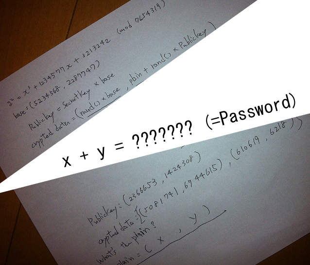

[EN](./ecc.md) | [ZH](./ecc-zh.md)


# ETC


## Overview


ECC is called elliptic curve encryption, EllipseCurve Cryptography, which is a public key cryptography based on elliptic curve mathematics. Unlike traditional encryption methods based on the difficulty of large-scale factorization, ECC relies on the difficulty of solving the discrete logarithm problem of elliptic curves. Its main advantage is that it can maintain the same password strength while using a shorter key length than other methods. Currently, the finite field mainly used in the elliptic curve has


- The integer field GF(p), which is modulo prime, is usually more efficient on general purpose processors.
- The Galois Field GF (2^m) with a feature of 2 can be designed with dedicated hardware.


## basic knowledge


Let us first look at the elliptic curve on the finite field. The elliptic curve on the finite field is the definition of the elliptic curve.


$y^2+axy+by=x^3+cx^2+dx+e$


All coefficients in the finite element GF(p) are elements, where p is a large prime number.


Of course, not all elliptic curves are suitable for encryption. The most common equations are as follows


$y^2=x^3+ax+b$


Where $4a^3+27b^2 \bmod p \neq 0$


We call all the solutions (x, y), ($x\in Fp, y \in Fp$) of the equation, and a set called &quot;infinity point&quot; (O) as an ellipse defined on Fp. The curve is denoted as E(Fp).


Generally defining elliptic curve passwords requires the following conditions


Suppose E(Fp) for the point operation $\oplus$ forms a possible group (commutative group, inverse element existence, closure, etc.), set $p\in E(Fq)$, and the t satisfying the following conditions is very large


$ p \ oplus p \ oplus ... \ oplus p = O $


There are a total of t p participating in the operation. Here we call t the period of p. In addition, for $Q\in E(Fq)$ , there is a positive integer m such that the following formula holds, defining $m=log_pq$


$Q=m\cdot p =p \oplus p \oplus ... \oplus p$ (m p participating in the operation)


In addition, suppose G is the generator of the $E_q (a,b)$, that is, all the elements in it can be generated, and the order is the smallest positive integer n satisfying $nG=O$.


##ElGamal in ECC


Here we assume that User B wants to encrypt the message and pass it to User A.


### Key Generation


User A first selects an elliptic curve $E_q (a,b)$ and then selects a generator G on it, assuming its order is n, and then selects a positive integer $n_a$ as the key, and calculates $P_a=n_aG $.


Among them, $E_q(a,b), q,G$ will be made public.


The public key is $P_a$ and the private key is $n_a $.


### Encryption


User B is sending a message m to User A, assuming that message m has been encoded as a point on the elliptic curve, the encryption steps are as follows


1. Query user A&#39;s public key $E_q(a,b), q, P_a,G$.
2. Select the random number k in the interval of (1, q-1).
3. Calculate the point $(x_1,y_1)=kG$ based on A&#39;s public key.
4. Calculate the point $(x_2,y_2)=kP_a$. If it is O, restart from the second step.
5. Calculate $C=m+(x_2,y_2)$
6. Send $((x_1,y_1),C)$ to A.


### Decryption


The decryption steps are as follows


1. Calculate the point $n_a(x_1,y_1)=n_akG=kP_a=(x_2,y_2)$ using the private key.
2. Calculate the message $m=C-(x_2,y_2)$ .


### key point


The key point here is that even if we know $(x_1,y_1)$, it is difficult to know k, which is determined by the difficulty of the discrete logarithm problem.


## 2013 SECCON CTF quals Cryptanalysis


Here we take Cryptanalysis in SECCON CTF quals in 2013 as an example. The topics are as follows:





Here, we know the elliptic curve equation and the corresponding generator element base, and also know the corresponding modulus and public key and the encrypted result.


But we can see that our modulus is too small, we violently enumerate the results.


Here directly refer to the sage program on github, violently ran out of the secret key. Then you can decrypt it.


```python


a = 1234577

b = 3213242

n = 7654319


E = EllipticCurve(GF(n), [0, 0, 0, a, b])


base = E ([5234568, 2287747])
pub = E ([2366653, 1424308])


c1 = E ([5081741, 6744615])
c2 = E ([610619, 6218])


X = base


for i in range(1, n):

    if X == pub:

        secret = i

        print "[+] secret:", i

        break

    else:

        X = X + base

        print i


m = c2 - (c1 * secret)


print "[+] x:", m[0]

print &quot;[+] y:&quot;, m [1]
print "[+] x+y:", m[0] + m[1]

```


Violence ran out of results


```shell

[+] secret: 1584718

[+] x: 2171002

[+] and: 3549912
[+] x+y: 5720914

```


## Reference

- https://github.com/sonickun/ctf-crypto-writeups/tree/master/2013/seccon-ctf-quals/cryptanalysis
