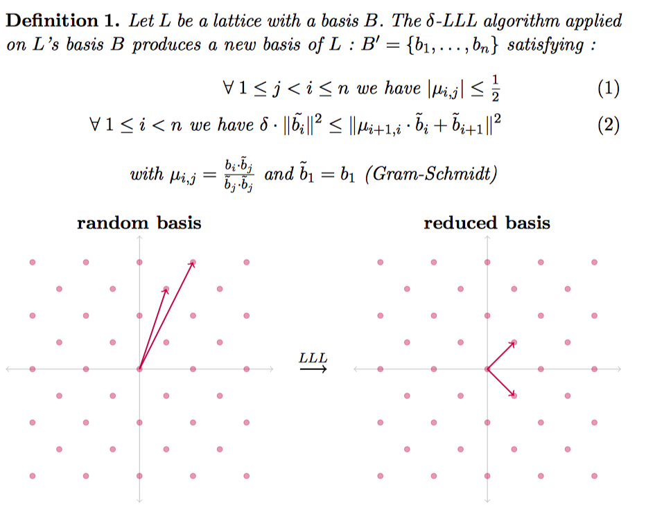
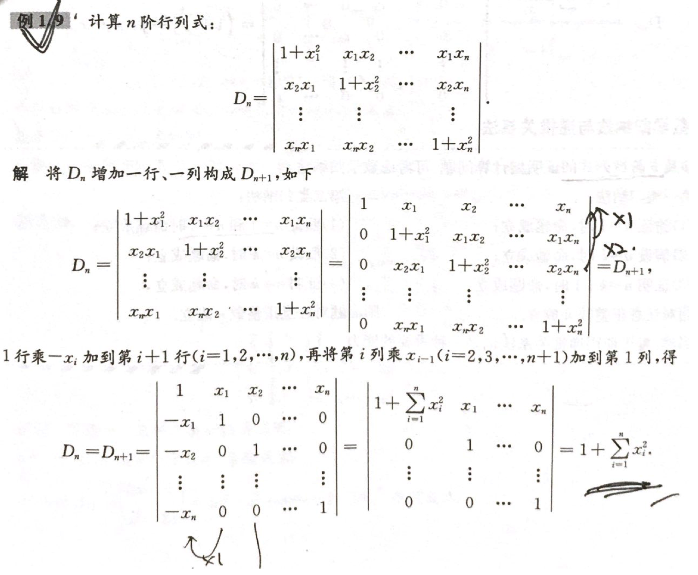

[EN](./lattice-reduction.md) | [ZH](./lattice-reduction-zh.md)
---
typora-root-url: ../../../
---

# 格基规约算法

## Lenstra–Lenstra–Lovasz

### 基本介绍

LLL 算法就是在格上找到一组基，满足如下效果

而且，这种方法生成的基所具有的如下性质是非常有用的

### 简单应用

这里我举一下 LLL paper 中给的第二个例子。给定 n 个实数 $\alpha_i,...,\alpha_n$，找到这 n 个数的有理线性逼近，即找到 n 个数 $m_i$，使得 $\sum\limits_{i=1}^{n}m_i\alpha_i$ 尽可能等于 0。 我们可以构造这样的矩阵，这里 $a_i$ 为 $\alpha_i$ 的有理逼近。

$$ A = \left[ \begin{matrix} 1   & 0 & 0     & \cdots & 0 & ca_1     \\ 0   & 1  & 0    & \cdots & 0 & c a_2  \\ 0   & 0   & 1   & \cdots & 0 & c a_3 \\\vdots & \vdots & \vdots & \ddots & \vdots \\ 0   & 0   &0   & \cdots & 1 & c a_n     \\ \end{matrix} \right]$$

矩阵为 n*(n+1) 的，我们可以根据格求行列式的方法来求一下这个格对应的行列式。

$det(L)=\sqrt{AA^T}$

我们进一步考虑这样的矩阵

$$ A = \left[ \begin{matrix} 1   & 0 & 0     & \cdots & 0 & a_1     \\ 0   & 1  & 0    & \cdots & 0 & a_2  \\ 0   & 0   & 1   & \cdots & 0 & a_3 \\\vdots & \vdots & \vdots & \ddots & \vdots \\ 0   & 0   &0   & \cdots & 1 & a_n     \\ \end{matrix} \right]$$

那么

$$ AA^T = \left[ \begin{matrix} 1+a_1^2   & a_1a_2   & a_1a_3 & \cdots  & a_1a_n     \\ a_2a_1   & 1+a_2^2  & a_2a_3 & \cdots & a_2a_n  \\ a_3a_1   & a_3a_2   & 1+a_3^2   & \cdots  & a_3a_n \\ \vdots & \vdots & \vdots & \ddots & \vdots \\ a_na_1   & a_na_2   &a_na_3   & \cdots  & 1+a_n^2     \\ \end{matrix} \right]$$

进一步我们从低维到高维大概试一试（严格证明，可以考虑添加一行和一列，左上角为1），得到格的行列式为

$\sqrt{1+\sum\limits_{i=1}^n\alpha_i^2}$

可以参见考研宇哥的如下证明

那么经过 LLL 算法后，我们可以获得

$||b_1|| \leq 2^{\frac{n-1}{4}} (1+\sum\limits_{i=1}^n\alpha_i^2)^{\frac{1}{2(n+1)}}$

一般来说后一项在开 n 次方时趋向于1，因为 $a_i$ 都是常数，一般不会和 n 相关，所以

$||b_1|| \leq 2^{\frac{n-1}{4}}*k$

k 比较小。此外，$b_1$ 又是原向量的线性组合，那么

$b_1[n]=\sum\limits_{i=1}^{n}m_ic*a_i=c\sum\limits_{i=1}^{n}m_i*a_i$

显然如果 c 足够大，那么后面的求和必须足够小，才可以满足上面的约束。

## 参考

- Survey: Lattice Reduction Attacks on RSA
