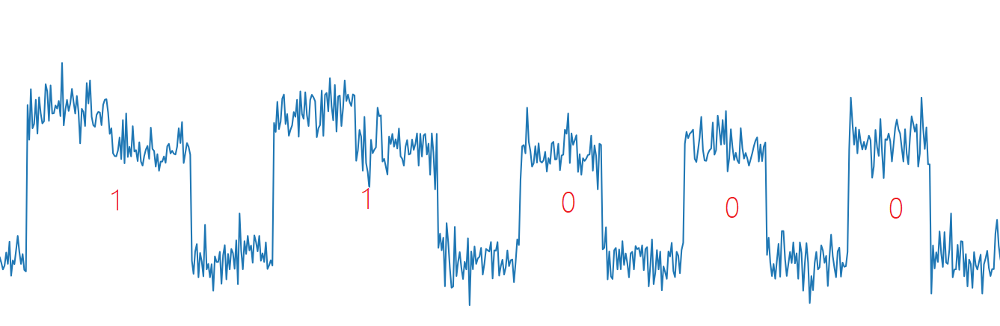

[EN](./rsa_side_channel.md) | [ZH](./rsa_side_channel-zh.md)
# RSA 侧信道攻击

能量分析攻击（侧信道攻击）是一种能够从密码设备中获取秘密信息的密码攻击方法．与其
他攻击方法不同：这种攻击利用的是密码设备的能量消耗特征，而非密码算法的数学特性．能量分析攻击是一种非入侵式攻击，攻击者可以方便地购买实施攻击所需要的设备：所以这种攻击对智能卡之类的密码设备的安全性造成了严重威胁。

能量分析攻击是安全领域内非常重要的一个部分，我们只在这里简单讨论下。

能量分析攻击分为：
- 简单能量分析攻击（SPA），即对能量迹进行直观分析，肉眼看即可。
- 差分能量分析攻击（DPA），基于能量迹之间的相关系数进行分析。

## 攻击条件

攻击者可获取与加解密相关的侧信道信息，例如能量消耗、运算时间、电磁辐射等等。

## 例子
这里我们以 HITB 2017 的 Hack in the card I 作为例子。

题目给出了公钥文件 `publickey.pem`，密文，测量智能卡功率的电路图，和**解密**过程中智能卡消耗的功率变化（通过在线网站给出 [trace](http://47.74.147.53:20015/index.html)）。


密文：
```
014b05e1a09668c83e13fda8be28d148568a2342aed833e0ad646bd45461da2decf9d538c2d3ab245b272873beb112586bb7b17dc4b30f0c5408d8b03cfbc8388b2bd579fb419a1cac38798da1c3da75dc9a74a90d98c8f986fd8ab8b2dc539768beb339cadc13383c62b5223a50e050cb9c6b759072962c2b2cf21b4421ca73394d9e12cfbc958fc5f6b596da368923121e55a3c6a7b12fdca127ecc0e8470463f6e04f27cd4bb3de30555b6c701f524c8c032fa51d719901e7c75cc72764ac00976ac6427a1f483779f61cee455ed319ee9071abefae4473e7c637760b4b3131f25e5eb9950dd9d37666e129640c82a4b01b8bdc1a78b007f8ec71e7bad48046
```

### 分析
由于网站只给出了一条能量迹，所以可以断定这是 Simple channel analysis（SPA）攻击。那么我们可以直接通过观察能量迹的高低电平来获得 RSA 解密过程的密钥 d。
RSA 可被 SPA 攻击的理论基础来自于 RSA 中包含的快速幂取余算法。


快速幂算法如下

1. b 为偶数时，$a^b \bmod c = ({a^2}^{b/2}) \bmod c$。
2. b 为奇数时，$a^b \bmod c = ({a^2}^{b/2} \times a) \bmod c$。

相应的 C 代码实现为：
```c
int PowerMod(int a, int b, int c)
{
    int ans = 1;
    a = a % c;
    while(b>0) {
        if(b % 2 == 1) // 当b为奇数时会多执行下面的指令
	        ans = (ans * a) % c;
        b = b/2;
        a = (a * a) % c;
    }
    return ans;
}
```

由于快速幂的计算过程中会逐位判断指数的取值，并会采取不同的操作，所以可从能量迹中还原出 d 的取值（从上面可知，直接得到的值是 d 的二进制取值的**逆序**）。

**注意**：

> 有时候模乘也可能会从高位向低位进行模乘。这里是从低位向高位模乘。



由此可给出还原 d 的脚本如下：

```python
f = open('./data.txt')
data = f.read().split(",")
print('point number:', len(data))

start_point = 225   # 开始分析的点
mid = 50            # 采样点间隔
fence = 228         # 高低电平分界线

bin_array = []

for point_index in range(start_point, len(data), mid):
    if float(data[point_index]) > fence:
        bin_array.append(1)
    else:
        bin_array.append(0)

bin_array2 = []
flag1 = 0
flag2 = 0
for x in bin_array:
    if x:
        if flag1:
            flag2 = 1
        else:
            flag1 = 1
    else:
        if flag2:
            bin_array2.append(1)
        else:
            bin_array2.append(0)
        flag1 = 0
        flag2 = 0

# d_bin = bin_array2[::-1]
d_bin = bin_array2
d = "".join(str(x) for x in d_bin)[::-1]
print(d)
d_int = int(d,2)
print(d_int)
```
## 参考资料
1. Mangard, S., Oswald, E., Popp, T., 冯登国, 周永彬, & 刘继业. (2010). 能量分析攻击.
