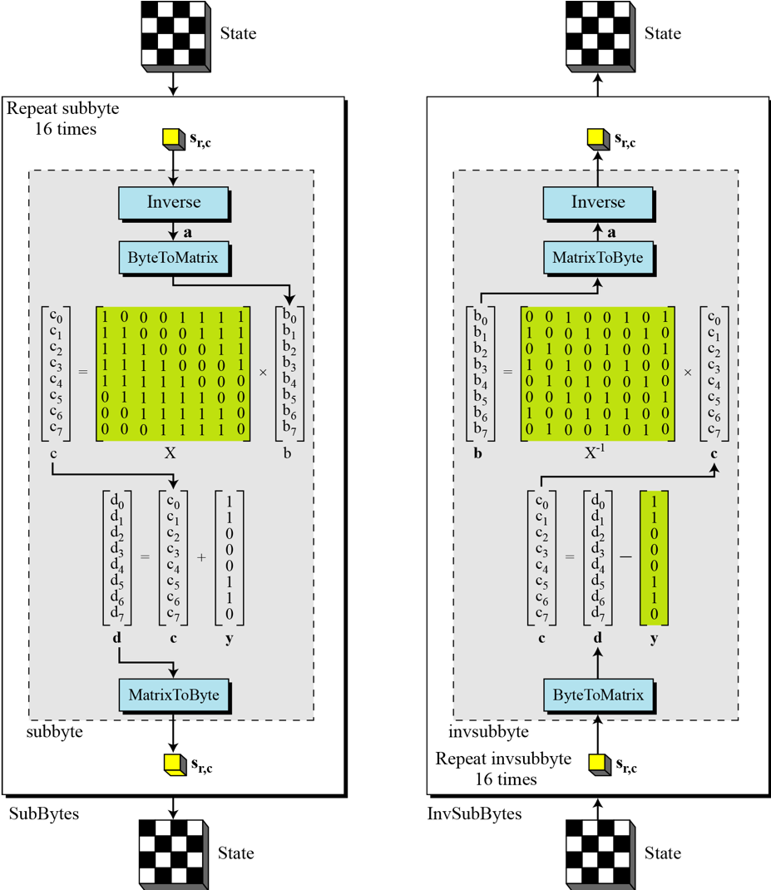

[EN](./aes.md) | [ZH](./aes-zh.md)
---
typora-root-url: ../../
---

# AES

## 基本介绍

Advanced Encryption Standard（AES），高级加密标准，是典型的块加密，被设计来取代 DES，由 Joan Daemen 和 Vincent Rijmen 所设计。其基本信息如下

- 输入：128 比特。
- 输出：128 比特。
- SPN 网络结构。

其迭代轮数与密钥长度有关系，如下

| 密钥长度（比特） | 迭代轮数 |
| :--------------: | :------: |
|       128        |    10    |
|       192        |    12    |
|       256        |    14    |

## 基本流程

### 基本概念

在 AES 加解密过程中，每一块都是 128 比特，所以我们这里明确一些基本概念。


在 AES 中，块与 State 之间的转换过程如下


所以，可以看出，每一个 block 中的字节是按照列排列进入到状态数组的。

而对于明文来说，一般我们会选择使用其十六进制进行编码。


### 加解密过程

这里给个看雪上比较好的 [图例](http://bbs.pediy.com/thread-90722.htm) ，以便于介绍基本的流程，每一轮主要包括

- 轮密钥加，AddRoundKey
- 字节替换，SubBytes
- 行移位，ShiftRows
- 列混淆，MixColumns


上面的列混淆的矩阵乘法等号左边的列向量应该在右边。

这里再给一张其加解密的全图，其解密算法的正确性很显然。


我们这里重点关注一下以下。

#### 字节替换

在字节替换的背后，其实是有对应的数学规则来定义对应的替换表的，如下



这里的运算均定义在 $GF(2^8)$ 内。

#### 列混淆

这里的运算也是定义在 $GF(2^8)$ 上，使用的模多项式为 $x^8+x^4+x^3+1$。

#### 密钥扩展


## 等价解密算法

简单分析一下，我们可以发现

- 交换逆向行移位和逆向字节代替并不影响结果。
- 交换轮密钥加和逆向列混淆并不影响结果，关键在于
  - 首先可以把异或看成域上的多项式加法
  - 然后多项式中乘法对加法具有分配率。

## 攻击方法

- 积分攻击

## 2018 国赛 Crackmec

通过简单分析这个算法，我们可以发现这个算法是一个简化版的 AES，其基本操作为

- 9 轮迭代
    - 行移位
    - 变种字节替换

如下

```c
  memcpy(cipher, plain, 0x10uLL);
  for ( i = 0LL; i <= 8; ++i )
  {
    shift_row(cipher);
    for ( j = 0LL; j <= 3; ++j )
      *(_DWORD *)&cipher[4 * j] =
        box[((4 * j + 3 + 16 * i) << 8) + (unsigned __int8)cipher[4 * j + 3]] ^
        box[((4 * j + 2 + 16 * i) << 8) + (unsigned __int8)cipher[4 * j + 2]] ^
        box[((4 * j + 1 + 16 * i) << 8) + (unsigned __int8)cipher[4 * j + 1]] ^
        box[((4 * j + 16 * i) << 8) + (unsigned __int8)cipher[4 * j]];
  }
  result = shift_row(cipher);
  for ( k = 0LL; k <= 0xF; ++k )
  {
    result = subbytes[256 * k + (unsigned __int8)cipher[k]];
    cipher[k] = result;
  }
  return result;
```

根据程序流程，我们已知程序加密的结果，而 subbytes 和 shift_row 又是可逆的，所以我们可以获取最后一轮加密后的结果。此时，我们还知道 box 对应的常数，我们只是不知道上一轮中 `cipher[4*j]` 对应的值，一共 32 位，如果我们直接爆破的话，显然不可取，因为每一轮都需要这么爆破，时间不可接受。那么有没有其它办法呢？其实有的，我们可以考虑中间相遇攻击，即首先枚举所有的 `cipher[4*j]` 与`cipher[4*j+1]` 的字节组合，一共256\*256 种。在枚举剩下两个字节时，我们可以先计算出其与密文的异或值，然后去之前的组合中找，如果找到的话，我们就认为是正确的。这样复杂度瞬间降到 $O(2^{16})$。

代码如下

```python
encflag = [
    0x16, 0xEA, 0xCA, 0xCC, 0xDA, 0xC8, 0xDE, 0x1B, 0x16, 0x03, 0xF8, 0x84,
    0x69, 0x23, 0xB2, 0x25
]
subbytebox = eval(open('./subbytes').read())
box = eval(open('./box').read())
print subbytebox[-1], box[-1]


def inv_shift_row(now):
    tmp = now[13]
    now[13] = now[9]
    now[9] = now[5]
    now[5] = now[1]
    now[1] = tmp

    tmp = now[10]
    now[10] = now[2]
    now[2] = tmp
    tmp = now[14]
    now[14] = now[6]
    now[6] = tmp

    tmp = now[15]
    now[15] = now[3]
    now[3] = now[7]
    now[7] = now[11]
    now[11] = tmp

    return now


def byte2num(a):
    num = 0
    for i in range(3, -1, -1):
        num = num * 256
        num += a[i]
    return num


def getbytes(i, j, target):
    """
    box[((4 * j + 3 + 16 * i) << 8) + a2[4 * j + 3]]
    box[((4 * j + 2 + 16 * i) << 8 )+ a2[4 * j + 2]]
    box[((4 * j + 1 + 16 * i) << 8) + a2[4 * j + 1]]
    box[((4 * j + 16 * i) << 8) + a2[4 * j]];
    """
    box01 = dict()
    for c0 in range(256):
        for c1 in range(256):
            num0 = ((4 * j + 16 * i) << 8) + c0
            num1 = ((4 * j + 1 + 16 * i) << 8) + c1
            num = box[num0] ^ box[num1]
            box01[num] = (c0, c1)
    for c2 in range(256):
        for c3 in range(256):
            num2 = ((4 * j + 2 + 16 * i) << 8) + c2
            num3 = ((4 * j + 3 + 16 * i) << 8) + c3
            num = box[num2] ^ box[num3]
            calc = num ^ target
            if calc in box01:
                c0, c1 = box01[calc]
                return c0, c1, c2, c3
    print 'not found'
    print i, j, target, calc
    exit(0)


def solve():
    a2 = [0] * 16
    """
      for ( k = 0LL; k <= 0xF; ++k )
      {
        result = subbytesbox[256 * k + a2[k]];
        a2[k] = result;
      }
    """
    for i in range(15, -1, -1):
        tag = 0
        for j in range(256):
            if subbytebox[256 * i + j] == encflag[i]:
                # j = a2[k]
                tag += 1
                a2[i] = j
                if tag == 2:
                    print 'two number', i
                    exit(0)
    """
      result = shift_row(a2);
    """
    a2 = inv_shift_row(a2)
    """
      for ( i = 0LL; i <= 8; ++i )
      {
        shift_row(a2);
        for ( j = 0LL; j <= 3; ++j )
          *(_DWORD *)&a2[4 * j] = box[((4 * j + 3 + 16 * i) << 8) + a2[4 * j + 3]] ^ box[((4 * j + 2 + 16 * i) << 8)
                                                                                       + a2[4 * j + 2]] ^ box[((4 * j + 1 + 16 * i) << 8) + a2[4 * j + 1]] ^ box[((4 * j + 16 * i) << 8) + a2[4 * j]];
      }
    """
    for i in range(8, -1, -1):
        tmp = [0] * 16
        print 'round ', i
        for j in range(0, 4):
            num = byte2num(a2[4 * j:4 * j + 4])
            #print num, a2[4 * j:4 * j + 4]
            tmp[4 * j
               ], tmp[4 * j + 1], tmp[4 * j + 2], tmp[4 * j + 3] = getbytes(
                   i, j, num
               )
        a2 = inv_shift_row(tmp)
    print a2
    print ''.join(chr(c) for c in a2)


if __name__ == "__main__":
    solve()
```

运行结果

```shell
➜  cracemec git:(master) ✗ python exp.py
211 3549048324
round  8
round  7
round  6
round  5
round  4
round  3
round  2
round  1
round  0
[67, 73, 83, 67, 78, 98, 35, 97, 100, 102, 115, 64, 70, 122, 57, 51]
CISCNb#adfs@Fz93
```

## 题目

- 2018 强网杯 决赛 revolver

## 参考文献

- https://zh.wikipedia.org/wiki/%E9%AB%98%E7%BA%A7%E5%8A%A0%E5%AF%86%E6%A0%87%E5%87%86
- Cryptography and Network Security， Advanced Encryption Standard  ppt
