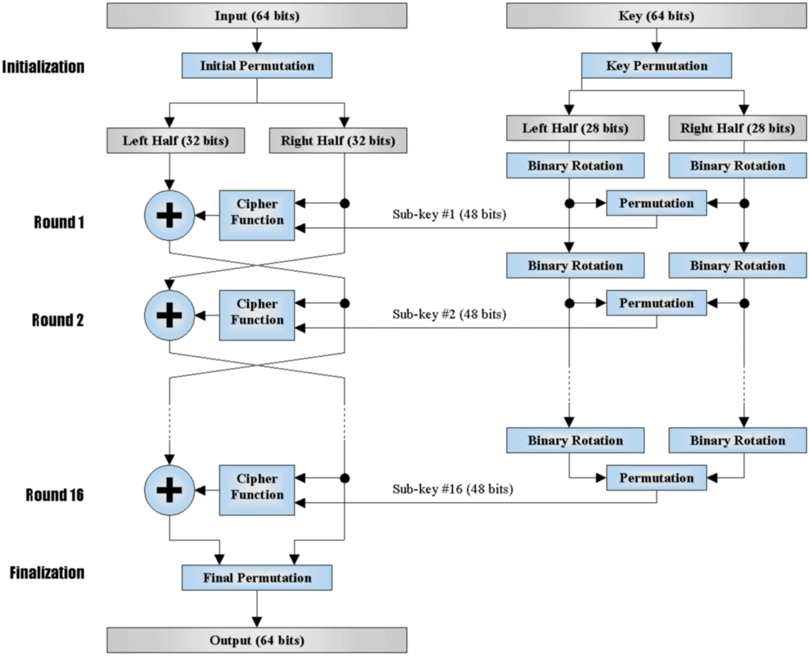
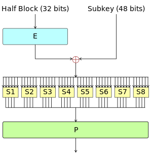

# DES

## 基本介绍

Data Encryption Standard(DES)，数据加密标准，是典型的块加密，其基本信息如下

- 输入 64 位。
- 输出 64 位。
- 密钥 64 位，使用 64 位密钥中的 56 位，剩余的 8 位要么丢弃，要么作为奇偶校验位。
- Feistel 迭代结构
    - 明文经过 16 轮迭代得到密文。
    - 密文经过类似的 16 轮迭代得到明文。

## 基本流程

给出一张简单的 [DES 流程图](http://homepage.usask.ca/~dtr467/400/) 。



### 加密

我们可以考虑一下每一轮的加密过程

$L_{i+1}=R_i$

$R_{i+1}=L_i\oplus F(R_i,K_i)$

那么在最后的 Permutation 之前，对应的密文为$(R_{n+1},L_{n+1})$。

### 解密

那么解密如何解密呢？首先我们可以把密文先进行逆置换，那么就可以得到最后一轮的输出。我们这时考虑每一轮

$R_i=L_{i+1}$

$L_i=R_{i+1}\oplus F(L_{i+1},K_i)$

因此，$(L_0,R_0)$ 就是加密时第一次置换后的明文。我们只需要再执行逆置换就可以获得明文了。

可以看出，DES 加解密使用同一套逻辑，只是密钥使用的顺序不一致。

## 核心部件

DES 中的核心部件主要包括（这里只给出加密过程的）

- 初始置换
- F 函数
    - E 扩展函数
    - S 盒，设计标准未给出。
    - P 置换
- 最后置换

其中 F 函数如下



如果对 DES 更加感兴趣，可以进行更加仔细地研究。欢迎提供 PR。

## 衍生

在 DES 的基础上，衍生了以下两种加密方式

- 双重 DES
- 三种 DES

### 双重 DES

双重 DES 使用两个密钥，长度为 112 比特。加密方式如下

$C=E_{k2}(E_{k1}(P))$

但是双重 DES 不能抵抗中间相遇攻击，我们可以构造如下两个集合

$I={E_{k1}(P)}$

$J=D_{k2}(C)$

即分别枚举 K1 和 K2 分别对 P 进行加密和对 C 进行解密。

在我们对 P 进行加密完毕后，可以对加密结果进行排序，这样的复杂度为$2^nlog(2^n)=O(n2^n)$

当我们对 C 进行解密时，可以每解密一个，就去对应的表中查询。

总的复杂度为还是$O(n2^n)$。

### 三重 DES

三重 DES 的加解密方式如下

$C=E_{k3}(D_{k2}(E_{k1}(P)))$

$P=D_{k1}(E_{k2}(D_{k3}(C)))$

在选择密钥时，可以有两种方法

- 3 个不同的密钥，k1，k2，k3 互相独立，一共 168 比特。
- 2 个不同的密钥，k1 与 k2 独立，k3=k1，112 比特。

## 攻击方法

- 差分攻击
- 线性攻击

## 2018 N1CTF N1ES

基本代码如下

```python
# -*- coding: utf-8 -*-
def round_add(a, b):
    f = lambda x, y: x + y - 2 * (x & y)
    res = ''
    for i in range(len(a)):
        res += chr(f(ord(a[i]), ord(b[i])))
    return res

def permutate(table, block):
	return list(map(lambda x: block[x], table))

def string_to_bits(data):
    data = [ord(c) for c in data]
    l = len(data) * 8
    result = [0] * l
    pos = 0
    for ch in data:
        for i in range(0,8):
            result[(pos<<3)+i] = (ch>>i) & 1
        pos += 1
    return result

s_box = [54, 132, 138, 83, 16, 73, 187, 84, 146, 30, 95, 21, 148, 63, 65, 189, 188, 151, 72, 161, 116, 63, 161, 91, 37, 24, 126, 107, 87, 30, 117, 185, 98, 90, 0, 42, 140, 70, 86, 0, 42, 150, 54, 22, 144, 153, 36, 90, 149, 54, 156, 8, 59, 40, 110, 56,1, 84, 103, 22, 65, 17, 190, 41, 99, 151, 119, 124, 68, 17, 166, 125, 95, 65, 105, 133, 49, 19, 138, 29, 110, 7, 81, 134, 70, 87, 180, 78, 175, 108, 26, 121, 74, 29, 68, 162, 142, 177, 143, 86, 129, 101, 117, 41, 57, 34, 177, 103, 61, 135, 191, 74, 69, 147, 90, 49, 135, 124, 106, 19, 8
9, 38, 21, 41, 17, 155, 83, 38, 159, 179, 19, 157, 68, 105, 151, 166, 171, 122, 179, 114, 52, 183, 89, 107, 113, 65, 161, 141, 18, 121, 95, 4, 95, 101, 81, 156,
 17, 190, 38, 84, 9, 171, 180, 59, 45, 15, 34, 89, 75, 164, 190, 140, 6, 41, 188, 77, 165, 105, 5, 107, 31, 183, 107, 141, 66, 63, 10, 9, 125, 50, 2, 153, 156, 162, 186, 76, 158, 153, 117, 9, 77, 156, 11, 145, 12, 169, 52, 57, 161, 7, 158, 110, 191, 43, 82, 186, 49, 102, 166, 31, 41, 5, 189, 27]

def generate(o):
    k = permutate(s_box,o)
    b = []
    for i in range(0, len(k), 7):
        b.append(k[i:i+7] + [1])
    c = []
    for i in range(32):
        pos = 0
        x = 0
        for j in b[i]:
            x += (j<<pos)
            pos += 1
        c.append((0x10001**x) % (0x7f))
    return c


class N1ES:
    def __init__(self, key):
        if (len(key) != 24 or isinstance(key, bytes) == False ):
            raise Exception("key must be 24 bytes long")
        self.key = key
        self.gen_subkey()

    def gen_subkey(self):
        o = string_to_bits(self.key)
        k = []
        for i in range(8):
	        o = generate(o)
        	k.extend(o)
        	o = string_to_bits([chr(c) for c in o[0:24]])
        self.Kn = []
        for i in range(32):
            self.Kn.append(map(chr, k[i * 8: i * 8 + 8]))
        return

    def encrypt(self, plaintext):
        if (len(plaintext) % 16 != 0 or isinstance(plaintext, bytes) == False):
            raise Exception("plaintext must be a multiple of 16 in length")
        res = ''
        for i in range(len(plaintext) / 16):
            block = plaintext[i * 16:(i + 1) * 16]
            L = block[:8]
            R = block[8:]
            for round_cnt in range(32):
                L, R = R, (round_add(L, self.Kn[round_cnt]))
            L, R = R, L
            res += L + R
        return res
```

显然，我们可以将其视为一个 Feistel 加密的方式，解密函数如下

```python
    def decrypt(self,ciphertext):
        res = ''
        for i in range(len(ciphertext) / 16):
            block = ciphertext[i * 16:(i + 1) * 16]
            L = block[:8]
            R = block[8:]
            for round_cnt in range(32):
                L, R =R, (round_add(L, self.Kn[31-round_cnt]))
            L,R=R,L
            res += L + R
        return res
```

最后结果为

```shell
➜  baby_N1ES cat challenge.py
from N1ES import N1ES
import base64
key = "wxy191iss00000000000cute"
n1es = N1ES(key)
flag = "N1CTF{*****************************************}"
cipher = n1es.encrypt(flag)
#print base64.b64encode(cipher)  # HRlgC2ReHW1/WRk2DikfNBo1dl1XZBJrRR9qECMNOjNHDktBJSxcI1hZIz07YjVx
cipher = 'HRlgC2ReHW1/WRk2DikfNBo1dl1XZBJrRR9qECMNOjNHDktBJSxcI1hZIz07YjVx'
cipher = base64.b64decode(cipher)
print n1es.decrypt(cipher)
➜  baby_N1ES python challenge.py
N1CTF{F3istel_n3tw0rk_c4n_b3_ea5i1y_s0lv3d_/--/}
```

## 参考

- 清华大学研究生数据安全课程课件
- https://en.wikipedia.org/wiki/Data_Encryption_Standard
