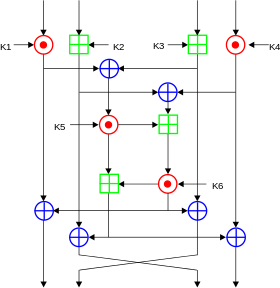

# IDEA

## 概述

**国际数据加密算法**（International Data Encryption Algorithm，IDEA），最早称为**改良建议加密标准**（Improved Proposed Encryption Standard，IPES），是密码学上一种对称密钥分组密码，由 James Massey 与来学嘉设计，在1991年首次提出。这个算法的提出，是为了取代旧有的数据加密标准 DES。（来自维基百科）

## 基本流程

### 密钥生成

IDEA 在加密的每轮中使用 6个密钥，然后最后输出轮使用4个密钥。所以一共有52个。

1. 前8个密钥来自与该算法最初的密钥，K1 取自密钥的高16比特，K8 取自密钥的低16比特。
2. 将密钥循环左移 25 位获取下一轮密钥，然后再次分为8组。

### 加密流程

IDEA 加密的数据块的大小为 64 比特，其使用的密钥长度为128 比特。该算法会对输入的数据块进行8次相同的变换，只是每次使用的密钥不同，最后会进行一次输出变换。每一轮的操作

可以输入和输出都是 16 比特位一组。每一轮的主要执行的运算有

- 按位异或，⊕
- 模加，模数为 $2^{16}$ ，⊞
- 模乘，模数为 $2^{16}+1$ ，⊙。但是需要注意的是 0x0000 的输入会被修改为 $2^{16}$ ，$2^{16}$ 的输出结果会被修改为0x0000。

这里我们称由 K5，K6 构成的中间那个方格的加密方式为MA。这也是 IDEA 算法中重要的一部分，此外，我们称 MA_L 为该部分加密后的左侧结果，其最后会和最左边的 16 比特操作；MA_R 为该部分加密后的右半部分的结果，其最后会和第三个 16 比特操作。

在最后输出轮的操作如下

### 解密流程

解密流程与加密流程相似，主要在于其密钥的选取

- 第 i(1-9) 轮的解密的密钥的前 4 个子密钥由加密过程中第10-i 轮的前 4 个子密钥得出
  - 其中第 1 个和第 4 个解密子密钥为相应的子密钥关于 $2^{16}+1$ 的乘法逆元。
  - 第 2 个和第 3 个子密钥的取法为
    - 当轮数为2，...，8时，取相应的第3个和第2个的子密钥的$2^{16}$ 的加密逆元。
    - 当轮数为 1 或 9 时，取相应的第 2 个和第 3 个子密钥对应的$2^{16}$ 的加密逆元。
- 第 5 和第 6 个密钥不变。

### 总体流程

我们来证明一下算法的正确性，这里我们关注于解密算法的第一轮，首先我们先看一下$Y_i$ 是如何得到的

$Y_1 = W_{81} \odot Z_{49}$

$Y_2=W_{83}\boxplus Z_{50}$

$Y_3=W_{82}\boxplus Z_{51}$

$Y_4=W_{83}\odot Z_{52}$

解密时，第一轮直接进行的变换为

$J_{11}=Y_1 \odot U_1=Y_1 \odot Z_{49}^{-1}=W_{81}$

$J_{12}=Y_2 \boxplus U2=Y_2\boxplus Z_{50}^{-1}=W_{83}$

$J_{13}=Y_3 \boxplus U3=Y_3\boxplus Z_{51}^{-1}=W_{82}$

$J_{14}=Y_4 \odot U_4=Y_4 \odot Z_{52}^{-1}=W_{84}$

可以看出得到的结果只有中间的两个16位加密结果恰好相反。我们进一步看一下$W_{8i}$ 是如何得到的。

$W_{81}=I_{81} \oplus MA_R(I_{81}\oplus I_{83},I_{82}\oplus I_{84})$

$W_{82}=I_{83} \oplus MA_R(I_{81}\oplus I_{83},I_{82}\oplus I_{84})$

$W_{83}=I_{82} \oplus MA_L(I_{81}\oplus I_{83},I_{82}\oplus I_{84})$

$W_{84}=I_{84} \oplus MA_L(I_{81}\oplus I_{83},I_{82}\oplus I_{84})$

那么对于V11来说

$V_{11}=J_{11} \oplus MA_R(J_{11}\oplus J_{13},J_{12}\oplus J_{14})$

通过简单带入已有的值，显然

$V_{11}=W_{81} \oplus MA_R(I_{81}\oplus I_{83},I_{82} \oplus I_{84})=I_{81}$

对于其他的元素也类似，那么其实我们会发现第一轮解密后的结果恰好是$I_{81},I_{83},I_{82},I_{84}$。

类似地，这个关系可以一直满足直到

$V_{81}=I_{11},V_{82}=I_{13},V_{83}=I_{12},V_{84}=I_{14}$

那么最后再经过一次简单的输出变换，恰好得到最初加密的数值。

## 题目

- 2017 HITCON seccomp
