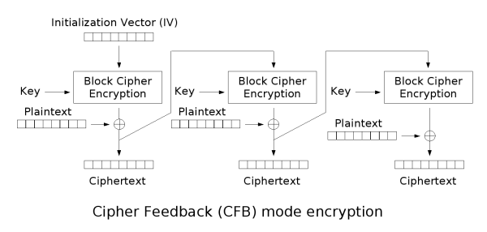
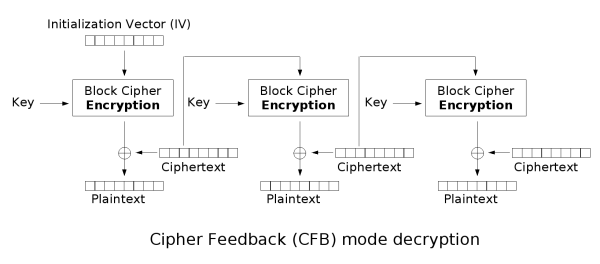

[EN](./cfb.md) | [ZH](./cfb-zh.md)
# CFB

The CFB is called the Cipher feedback.

## Encryption

## decryption

## Advantages and disadvantages

### Advantages

- Adapt to different data format requirements
- Limited error propagation
- Self synchronization

### Disadvantages

- Encryption cannot be parallelized, decryption cannot be parallel

## Application Scenario

This mode is suitable for database encryption, wireless communication encryption and other encryption environments that have special requirements on data formats.

## topic

- HITCONCTF-Quals-2015-Simple- (Crypto-100)

