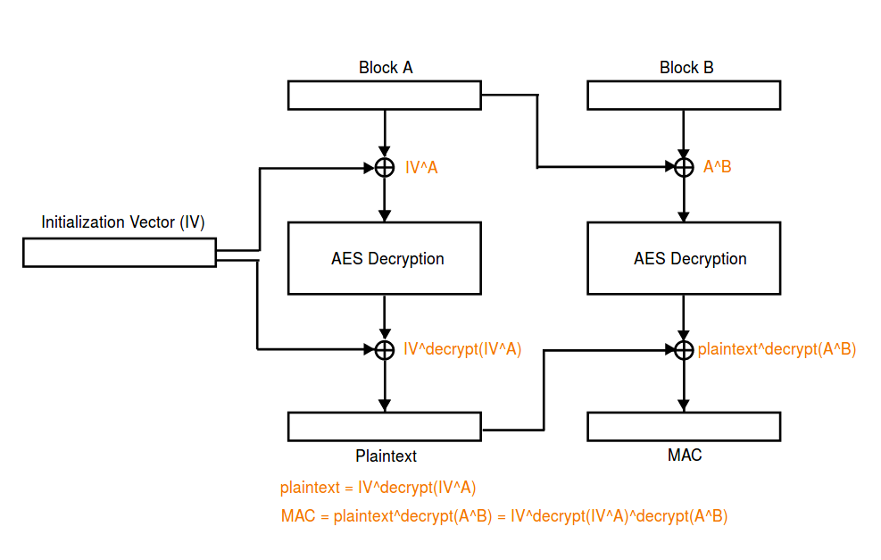

[EN](./padding-oracle-attack.md) | [ZH](./padding-oracle-attack-zh.md)
# Padding Oracle Attack


## Introduction


Padding Oracle Attack attacks generally need to meet the following conditions


- Encryption Algorithm
- Encryption algorithm using PKCS5 Padding. Of course, the way OAEP is filled in asymmetric encryption may also be affected.
- The grouping mode is CBC mode.
- Attacker ability
- An attacker can intercept messages encrypted by the above encryption algorithm.
- The attacker can interact with the padding oracle (the server): the client sends the ciphertext to the server, and the server will use some kind of return information to inform the client whether the padding is normal.


Padding Oracle Attack can achieve the following effects


- Decrypt any given ciphertext without knowing the key and IV.


## Principle


The basic principles of the Padding Oracle Attack attack are as follows


- Decrypt a very long message piece by piece.
- For each message, first decrypt the last byte of the message, then decrypt the second to last byte, and so on.


Here we review the CBC


- Encryption


$$

C_i=E_K(P_i \oplus C_{i-1})\\

IV = C_0
$$


- Decryption


$$

P_{i}=D_{K}(C_{i})\oplus C_{i-1}\\ C_{0}=IV

$$


We mainly focus on decryption, we don&#39;t know IV and key here. Here we assume that the length of the ciphertext block is n bytes.


Suppose we intercepted ciphertext Y to obtain the last byte of ciphertext Y as an example for analysis. In order to obtain the content of Y, we first need to forge a piece of ciphertext F so that the last byte of the plaintext corresponding to Y can be modified. This is because if we construct the ciphertext `F|Y`, then the decryption Y is specifically
$$

P = D_K (Y) \ oplus F
$$

So modify the last byte of ciphertext F, $F_{n}$, to modify the last byte of the plaintext corresponding to Y. The process of getting the last byte of P is given below.


1. i=0, set each byte of F to be **random byte**.
2. Set $F_n=i \oplus 0x01$
3. Send F|Y to the server. If the last byte of P is i, then the last padding is 0x01 and no error will occur. Otherwise, only the last $P_n \oplus i \oplus 0x01$ bytes of P are $P_n \oplus i \oplus 0x01$ and no error will be reported. ** Also, note that the padding bytes can only be 0 to n. ** Therefore, if you want to make the error in the case of F randomly and satisfy the padding byte size, the probability is small**. So in the case of no error on the server side, we can think that we did get the correct bytes.
4. In the event of an error, i=i+1, jump to 2.


After getting the last byte of P, we can continue to get the second-to-last byte of P. In this case, we need to set $F_n=P_n\oplus 0x02$ and set $F_{n-1}=i \oplus 0x02$ to enumerate i.


So, in summary, Padding Oracle Attack is actually a method of attack with a high probability of success.


However, it&#39;s important to note that some of the real-world problems that are often encountered are not the standard Padding Oracle Attack mode, and we often need to make some changes.


## 2017 HITCON Secret Server


### Analysis


The encryption used in the program is AES CBC, which uses padding similar to PKCS5.


```python

def pad(msg):

    pad_length = 16-len(msg)%16

    return msg+chr(pad_length)*pad_length


def unpad (msg):
    return msg[:-ord(msg[-1])]

```


However, in each unpad, no detection is performed, but the unpad is directly executed.


Among them, it should be noted that the function that interacts with the user each time is


- `send_msg` , accepts the user&#39;s plaintext, encrypts it with a fixed `2jpmLoSsOlQrqyqE`, and outputs the encrypted result.
- `recv_msg` , accepts the user&#39;s IV and ciphertext, decrypts the ciphertext, and returns. There will be different actions depending on the results returned.


```python

            msg = recv_msg().strip()

            if msg.startswith('exit-here'):

                exit(0)

            elif msg.startswith('get-flag'):

                send_msg(flag)

            elif msg.startswith('get-md5'):

                send_msg(MD5.new(msg[7:]).digest())

            elif msg.startswith('get-time'):

                send_msg(str(time.time()))

            elif msg.startswith('get-sha1'):

                send_msg(SHA.new(msg[8:]).digest())

            elif msg.startswith('get-sha256'):

                send_msg(SHA256.new(msg[10:]).digest())

            elif msg.startswith('get-hmac'):

                send_msg(HMAC.new(msg[8:]).digest())

            else:

                send_msg('command not found')

```


### Main Vulnerabilities


Here we briefly summarize the parts we have.


- Encryption
- The IV when encrypting is fixed and known.
- &#39;Welcome!!&#39; Encrypted result.
- Decryption
- We can control IV.


First of all, since we know the result of the `Welcome!!` encryption, we can also control the IV in recv_msg, then according to the decryption process
$$

P_{i}=D_{K}(C_{i})\oplus C_{i-1}\\ C_{0}=IV

$$

If we enter the encrypted result of `Welcome!!` into recv_msg, the result of direct decryption is `(Welcome!!+&#39;\x07&#39;*7) xor iv`, if we ** properly control the decryption process In the iv** passed, then we can control the decrypted result. In other words, we can execute any of the commands described above**. Thus, we can also know the result of the `flag` decryption.


Secondly, on the above basis, if we add the custom IV and Welcome encrypted result after any ciphertext C and pass it to recv_msg as input, then we can control the last byte of the message after decryption. **So due to the unpad operation, we can control the length of the decrypted message to be reduced from 0 to 255**.


### Using ideas


Basic use ideas are as follows


Bypass proof of work
2. Obtain the encrypted flag according to the way you execute any command.
3. Since the beginning of the flag is `hitcon{`, there are 7 bytes in total, so we can still control the iv to make the first 7 bytes after decryption the specified byte. This allows us to execute the `get-md5` command on the decrypted message. According to the unpad operation, we can control the decrypted message exactly at the first few bytes of the message. So we can start controlling the decrypted message as `hitcon{x`, that is, only one byte after `hitcon{`. This will result in an encrypted result with a one-byte hash. Similarly, we can also get the result of the encryption with a byte hash.
4. In this case, we can blast locally byte by byte, calculate the corresponding `md5`, and then use the arbitrary command execution mode to control the decrypted plaintext to any specified command. If the control is unsuccessful, it means that the byte is incorrect. , need to blast again; if it is correct, then you can directly execute the corresponding command.

The specific code is as follows


```python

#coding=utf-8

from pwn import *

import base64, time, random, string

from Crypto.Cipher import AES

from Crypto.Hash import SHA256, MD5

#context.log_level = 'debug'

if args['REMOTE']:

    p = remote('52.193.157.19', 9999)

else:

    p = remote('127.0.0.1', 7777)


def strxor(str1, str2):

    return ''.join([chr(ord(c1) ^ ord(c2)) for c1, c2 in zip(str1, str2)])


def pad(msg):

    pad_length = 16 - len(msg) % 16

    return msg + chr(pad_length) * pad_length


def unpad (msg):
Return msg[:-ord(msg[-1])] # Remove the pad


def flipplain(oldplain, newplain, iv):

    """flip oldplain to new plain, return proper iv"""

    return strxor(strxor(oldplain, newplain), iv)


def bypassproof():

    p.recvuntil('SHA256(XXXX+')

    lastdata = p.recvuntil(')', drop=True)

    p.recvuntil(' == ')

    digest = p.recvuntil('\nGive me XXXX:', drop=True)


    def proof(s):

        return SHA256.new(s + lastdata).hexdigest() == digest


data = pwnlib.util.iters.mbruteforce (
        proof, string.ascii_letters + string.digits, 4, method='fixed')

    p.sendline(data)

    p.recvuntil('Done!\n')


iv_encrypt = '2jpmLoSsOlQrqyqE'


def getmd5enc(i, cipher_flag, cipher_welcome):

    """return encrypt( md5( flag[7:7+i] ) )"""

    ## keep iv[7:] do not change, so decrypt won't change

new_iv = flipplain (&quot;hitcon {&quot;. bright (16, &quot;x00&quot;), &quot;get-md5&quot; .light (
        16, '\x00'), iv_encrypt)

    payload = new_iv + cipher_flag

    ## calculate the proper last byte number

    last_byte_iv = flipplain(

        pad("Welcome!!"),

        "a" * 15 + chr(len(cipher_flag) + 16 + 16 - (7 + i + 1)), iv_encrypt)

    payload += last_byte_iv + cipher_welcome

    p.sendline(base64.b64encode(payload))

    return p.recvuntil("\n", drop=True)


def main():

    bypassproof()


    # result of encrypted Welcome!!

    cipher = p.recvuntil('\n', drop=True)

    cipher_welcome = base64.b64decode(cipher)[16:]

    log.info("cipher welcome is : " + cipher_welcome)


    # execute get-flag

    get_flag_iv = flipplain(pad("Welcome!!"), pad("get-flag"), iv_encrypt)

    payload = base64.b64encode(get_flag_iv + cipher_welcome)

    p.sendline(payload)

    cipher = p.recvuntil('\n', drop=True)

    cipher_flag = base64.b64decode(cipher)[16:]

    flaglen = len(cipher_flag)

    log.info("cipher flag is : " + cipher_flag)


    # get command not found cipher

    p.sendline(base64.b64encode(iv_encrypt + cipher_welcome))

    cipher_notfound = p.recvuntil('\n', drop=True)


    flag = ""

    # brute force for every byte of flag

    for i in range(flaglen - 7):

        md5_indexi = getmd5enc(i, cipher_flag, cipher_welcome)

md5_indexi = base64.b64decode (md5_indexi) [16:]
        log.info("get encrypt(md5(flag[7:7+i])): " + md5_indexi)

        for guess in range(256):

            # locally compute md5 hash

            guess_md5 = MD5.new(flag + chr(guess)).digest()

            # try to null out the md5 plaintext and execute a command

            payload = flipplain(guess_md5, 'get-time'.ljust(16, '\x01'),

                                iv_encrypt)

            payload += md5_indexi

            p.sendline(base64.b64encode(payload))

            res = p.recvuntil("\n", drop=True)

            # if we receive the block for 'command not found', the hash was wrong

            if res == cipher_notfound:

                print 'Guess {} is wrong.'.format(guess)

            # otherwise we correctly guessed the hash and the command was executed

            else:

                print 'Found!'

                flag += chr(guess)

                print 'Flag so far:', flag

                break


if __name__ == "__main__":

    main()


```


The final result is as follows


```Shell

Flag so far: Paddin9_15_ve3y_h4rd__!!}\x10\x10\x10\x10\x10\x10\x10\x10\x10\x10\x10\x10\x10\x10\x10\x10

```


## 2017 HITCON Secret Server Revenge


### Description

```

The password of zip is the flag of "Secret Server"

```


### Analysis


This program continues with the above program, but this time a simple modification


- The iv of the encryption algorithm is unknown, but can be derived from the message encrypted by Welcome.
- The program has a 56-byte token.
- The program can perform up to 340 operations, so the above blasting is naturally not feasible


The general process of the program is as follows


After proof of work
2. Send &quot;Welcome!!&quot; encrypted message
3. In 340 operations, you need to guess the value of the token and then automatically output the flag.


### Vulnerability


Of course, the loopholes in the previous topic still exist in this topic, namely


1. Execute the given command arbitrarily
2. Length truncation


### Using ideas


Due to the limitation of the number of 340, although we can still get the value of `md5(token[:i])` encrypted (** here we need to pay attention to this part of the encryption is exactly 32 bytes, the first 16 bytes are The value after md5 is encrypted, the next 16 bytes are completely filled with encrypted bytes.** Here `md5(token[:i])` refers specifically to the first 16 bytes.). However, we can&#39;t blast 256 times again in order to get a character.


Since it is not possible to blast, is it possible to get the size of one byte at a time? Here, let&#39;s take a look at the information that the program may leak.


1. The encrypted value of the md5 value of some messages. Here we can get the encrypted value of `md5(token[:i])`.
2. Unpad will unmap the decrypted message each time. This byte is determined based on the last byte of the decrypted message. If we can calculate the size of this byte, then we may know the value of a byte.


Here we delve into the information leak of unpad. If we put the encryption IV and `encrypt(md5(token[:i]))` after a ciphertext C to form `C|IV|encrypt(md5(token[:i]))`, then decrypt The last plaintext block of the outgoing message is `md5(token[:i])`. Furthermore, in the unpad, the last byte (0-255) of `md5(token[:i])` is used for unpad, and then the specified command (such as md5) is executed on the string after the unpad. Then, if we ** pre-configure some hashed samples after the message hash, and then compare the results of the above execution with the sample, if they are the same, then we can basically determine the `md5(token[:i]) ` * * Last byte**. However, if the last byte of `md5(token[:i])` is less than 16, then some values in md5 will be used in unpad, and this part of the value, due to `token[:i] for different lengths ` Almost all will not be the same. So special handling may be required.


We already know the key to this problem, which is to generate a sample of the encrypted result corresponding to the size of the unpad byte, in order to facilitate the lookup table.


The specific use ideas are as follows


1. Bypass proof of work.
2. Get the token encrypted result `token_enc` , which will add 7 bytes `&quot;token: &quot;` in front of the token. Therefore, the length after encryption is 64.
3. Get the result of `encrypt(md5(token[:i]))`, which is a total of 57, including the padding of the last token.
4. Construct a sample that corresponds to the size of the unpad. Here we construct the ciphertext `token_enc|padding|IV_indexi|welcome_enc`. Since `IV_indexi` is to modify the last byte of the last plaintext block, the byte is in the process of being changed. If we want to get some fixed byte hashes, this part can&#39;t be added naturally. Therefore, the size of the unpad ranges from 17 to 255 when the sample is generated here. If the last byte of `md5(token[:i])` is less than 17 at the end of the test, there will be some unknown samples. A natural idea is that we directly get 255-17+1 such multiple samples, however, if we do this, according to the number of times above 340 (255-17+1+57+56&gt;340), we obviously can&#39;t Get all the bytes to the token. So here we need to find ways to reuse some content, here we choose to reuse the result of `encrypt(md5(token[:i]))`. Then we need to ensure that the number of times is sufficient on the one hand, and on the other hand, the previous results can be reused. Here we set the unpad loop to 17 to 208, and make the unpad more than 208 when we just unpad to where we can reuse. It should be noted here that when the last byte of `md5(token[:i])` is 0, all decrypted plaintext unpad will be dropped, so the ciphertext of command not found will appear.
5. Construct the ciphertext `token_enc|padding|IV|encrypt(md5(token[:i])) ` again, then use the last byte of `md5(token[:i])` for unpad when decrypting. If this byte is not less than 17 or 0, it can be processed. If this byte is less than 17, then obviously, the result of the last md5 returned to the user is not within the sample range, then we modify the highest bit of its last byte so that it can fall within the sample range after the unpad. In this way, we can guess the last byte of `md5(token[:i]) `.
6. After guessing the last byte of `md5(token[:i]) `, we can brute 256 times locally and find out that all hashes are at the end of `md5(token[:i]) ` The last byte of the character.
7. However, in the sixth step, for a `md5(token[:i]) ` we may find multiple alternative characters because we only need to make the last byte of the given byte.
8. So, the question is, how do you delete some extra candidate strings? Here I chose a small trick, which enumerates the padding of the token at the same time as the byte-by-byte enumeration. Since padding is fixed at 0x01, we only need to filter out all tokens that are not 0x01 at the end.


Here, the `sleep` in the code is commented out during the test. In order to speed up the interaction. Use the code as follows


```python

from pwn import *

import base64, time, random, string

from Crypto.Cipher import AES

from Crypto.Hash import SHA256, MD5

#context.log_level = 'debug'


p = remote('127.0.0.1', 7777)


def strxor(str1, str2):

    return ''.join([chr(ord(c1) ^ ord(c2)) for c1, c2 in zip(str1, str2)])


def pad(msg):

    pad_length = 16 - len(msg) % 16

    return msg + chr(pad_length) * pad_length


def unpad (msg):
    return msg[:-ord(msg[-1])]  # remove pad


def flipplain(oldplain, newplain, iv):

    """flip oldplain to new plain, return proper iv"""

    return strxor(strxor(oldplain, newplain), iv)


def bypassproof():

    p.recvuntil('SHA256(XXXX+')

    lastdata = p.recvuntil(')', drop=True)

    p.recvuntil(' == ')

    digest = p.recvuntil('\nGive me XXXX:', drop=True)


    def proof(s):

        return SHA256.new(s + lastdata).hexdigest() == digest


data = pwnlib.util.iters.mbruteforce (
        proof, string.ascii_letters + string.digits, 4, method='fixed')

    p.sendline(data)


def sendmsg(iv, cipher):

    payload = iv + cipher

    payload = base64.b64encode(payload)

    p.sendline(payload)


def recvmsg():

    data = p.recvuntil("\n", drop=True)

    data = base64.b64decode(data)

    return data[:16], data[16:]


def getmd5enc(i, cipher_token, cipher_welcome, iv):

    """return encrypt( md5( token[:i+1] ) )"""

    ## keep iv[7:] do not change, so decrypt msg[7:] won't change

get_md5_iv = flipplain (&quot;token:&quot; .lit (16, &quot;x00&quot;), &quot;get-md5&quot;.
        16, '\x00'), iv)

    payload = cipher_token

    ## calculate the proper last byte number

    last_byte_iv = flipplain(

        pad("Welcome!!"),

        "a" * 15 + chr(len(cipher_token) + 16 + 16 - (7 + i + 1)), iv)

    payload += last_byte_iv + cipher_welcome

    sendmsg(get_md5_iv, payload)

    return recvmsg()


def get_md5_token_indexi(iv_encrypt, cipher_welcome, cipher_token):

    md5_token_idxi = []

    for i in range(len(cipher_token) - 7):

        log.info("idx i: {}".format(i))

        _, md5_indexi = getmd5enc(i, cipher_token, cipher_welcome, iv_encrypt)

assert (only (md5_indexi) == 32)        # remove the last 16 byte for padding

        md5_token_idxi.append(md5_indexi[:16])

    return md5_token_idxi


def doin(unpadcipher, md5map, candidates, flag):

    if unpadcipher in md5map:

        lastbyte = md5map[unpadcipher]

    else:

        lastbyte = 0

    if flag == 0:

        lastbyte ^= 0x80

    newcandidates = []

    for x in candidates:

        for c in range(256):

            if MD5.new(x + chr(c)).digest()[-1] == chr(lastbyte):

                newcandidates.append(x + chr(c))

    candidates = newcandidates

    print candidates

    return candidates


def main():

    bypassproof()


    # result of encrypted Welcome!!

    iv_encrypt, cipher_welcome = recvmsg()

    log.info("cipher welcome is : " + cipher_welcome)


    # execute get-token

    get_token_iv = flipplain(pad("Welcome!!"), pad("get-token"), iv_encrypt)

    sendmsg(get_token_iv, cipher_welcome)

    _, cipher_token = recvmsg()

token_len = only (cipher_token)
    log.info("cipher token is : " + cipher_token)


    # get command not found cipher

    sendmsg(iv_encrypt, cipher_welcome)

    _, cipher_notfound = recvmsg()


    # get encrypted(token[:i+1]),57 times

    md5_token_idx_list = get_md5_token_indexi(iv_encrypt, cipher_welcome,

                                              cipher_token)

    # get md5map for each unpadsize, 209-17 times

    # when upadsize>208, it will unpad ciphertoken

    # then we can reuse

md5map = dict ()
    for unpadsize in range(17, 209):

        log.info("get unpad size {} cipher".format(unpadsize))

get_md5_iv = flipplain (&quot;token:&quot; .lit (16, &quot;x00&quot;), &quot;get-md5&quot;.
            16, '\x00'), iv_encrypt)

        ## padding 16*11 bytes

        padding = 16 * 11 * "a"

        ## calculate the proper last byte number, only change the last byte

        ## set last_byte_iv = iv_encrypted[:15] | proper byte

        last_byte_iv = flipplain(

            pad("Welcome!!"),

            pad("Welcome!!")[:15] + chr(unpadsize), iv_encrypt)

        cipher = cipher_token + padding + last_byte_iv + cipher_welcome

        sendmsg(get_md5_iv, cipher)

        _, unpadcipher = recvmsg()

        md5map[unpadcipher] = unpadsize


    # reuse encrypted(token[:i+1])

    for i in range(209, 256):

        target = md5_token_idx_list[56 - (i - 209)]

        md5map[target] = i


    candidates = [""]

    # get the byte token[i], only 56 byte

    for i in range(token_len - 7):

        log.info("get token[{}]".format(i))

get_md5_iv = flipplain (&quot;token:&quot; .lit (16, &quot;x00&quot;), &quot;get-md5&quot;.
            16, '\x00'), iv_encrypt)

        ## padding 16*11 bytes

        padding = 16 * 11 * "a"

        cipher = cipher_token + padding + iv_encrypt + md5_token_idx_list[i]

        sendmsg(get_md5_iv, cipher)

        _, unpadcipher = recvmsg()

        # already in or md5[token[:i]][-1]='\x00'

        if unpadcipher in md5map or unpadcipher == cipher_notfound:

            candidates = doin(unpadcipher, md5map, candidates, 1)

        else:

log.info (&quot;unpad size 1-16&quot;)
            # flip most significant bit of last byte to move it in a good range

            cipher = cipher[:-17] + strxor(cipher[-17], '\x80') + cipher[-16:]

            sendmsg(get_md5_iv, cipher)

            _, unpadcipher = recvmsg()

            if unpadcipher in md5map or unpadcipher == cipher_notfound:

                candidates = doin(unpadcipher, md5map, candidates, 0)

            else:

                log.info('oh my god,,,, it must be in...')

                exit()

    print len(candidates)

    # padding 0x01

    candidates = filter(lambda x: x[-1] == chr(0x01), candidates)

    # only 56 bytes

    candidates = [x[:-1] for x in candidates]

    print len(candidates)

    assert (len(candidates[0]) == 56)


    # check-token

    check_token_iv = flipplain(

        pad("Welcome!!"), pad("check-token"), iv_encrypt)

    sendmsg(check_token_iv, cipher_welcome)

    p.recvuntil("Give me the token!\n")

    p.sendline(base64.b64encode(candidates[0]))

    print p.recv()


    p.interactive()


if __name__ == "__main__":

    main()

```


The effect is as follows


```shell

...

79

1

hitcon {uNp @ d_M3th0D_i5_am4Z1n9!}
```


## Teaser Dragon CTF 2018 AES-128-TSB


This topic is still very interesting, the title is described as follows


```

Haven't you ever thought that GCM mode is overcomplicated and there must be a simpler way to achieve Authenticated Encryption? Here it is!


Server: aes-128-tsb.hackable.software 1337


server.py

```


The attachment and the final exp are found by the ctf-challenge repository.


The basic process of the topic is


- Continuously receive two strings a and b, where a is plaintext and b is ciphertext, note
- b needs to satisfy the tail just equal to iv after decryption.
- if a and b are equal, then
- a is `gimme_flag` and the encrypted flag is output.
- Otherwise, output a string of randomly encrypted strings.
- Otherwise output a string of plain text.


In addition, we can also find that there is a problem with the unpad in the title, and the specified length can be truncated.


```python

def unpad (msg):
    if not msg:

        return ''

    return msg[:-ord(msg[-1])]

```


In the beginning, the very straightforward idea is to enter 0 for the lengths of a and b, then you can bypass the `a==b` check to get a string of random ciphertext encrypted strings. However, it does not seem to have any effect, let&#39;s analyze the encryption process.


```python

def tsb_encrypt(aes, msg):

    msg = pad(msg)

    iv = get_random_bytes(16)

prev_pt = iv
    prev_ct = iv

    ct = ''

    for block in split_by(msg, 16) + [iv]:

        ct_block = xor(block, prev_pt)

        ct_block = aes.encrypt(ct_block)

        ct_block = xor(ct_block, prev_ct)

        ct += ct_block

        prev_pt = block

        prev_ct = ct_block

    return iv + ct

```


Let&#39;s assume that $P_0=iv, C_0=iv$, then


 $C_i=C_{i-1}\oplus E(P_{i-1} \oplus P_i)$


So, assuming the message length is 16, similar to the length of the `gimme_flag` padding we want to get, then


$ C_1 = IV \ oplus E (IV \ oplus P_1) $


 $C_2=C_1 \oplus E(P_1 \oplus IV)$


It is easy to find $C_2=IV$.


([Pirates] (https://github.com/pberba/ctf-solutions/tree/master/20180929_teaser_dragon/aes_128_tsb), the picture below is clearer





Conversely, if we send `iv+c+iv` to the server, we can always bypass the `tsb_decrypt` mac check.


```python

def tsb_decrypt(aes, msg):

    iv, msg = msg[:16], msg[16:]

prev_pt = iv
    prev_ct = iv

pt = &#39;&#39;
    for block in split_by(msg, 16):

        pt_block = xor(block, prev_ct)

        pt_block = aes.decrypt(pt_block)

        pt_block = xor(pt_block, prev_pt)

        pt += pt_block

        prev_pt = pt_block

        prev_ct = block

pt, mac = pt [: - 16], pt [-16:]
    if mac != iv:

        raise CryptoError()

return unpad (pt)
```


Then at this point, the message decrypted by the server is


$ unpad (IV \ oplus D (C_1 \ oplus IV)) $


### Get the last byte of the plaintext


We can consider controlling the D decrypted message as a constant value, such as all zeros, ie `C1=IV`, then we can enumerate the last byte of the IV from 0 to 255, get $IV \oplus D(C_1 \oplus IV) The last byte of $ is also 0~255. Only when it is 1~15, after the `unpad` operation, the message length is not 0. Therefore, we can count which numbers cause the length to be non-zero and enumerate as 1 and the remaining flags to 0.


```python

def getlast_byte(iv, block):

iv_pre = iv [: 15]
iv_last = words (iv [-1])
    tmp = []

    print('get last byte')

    for i in range(256):

        send_data('')

iv = iv_pre + chr (i)
        tmpblock = block[:15] + chr(i ^ ord(block[-1]) ^ iv_last)

        payload = iv + tmpblock + iv

        send_data(payload)

        length, data = recv_data()

        if 'Looks' in data:

            tmp.append(1)

        else:

            tmp.append(0)

    last_bytes = []

    for i in range(256):

        if tmp == xor_byte_map[i][0]:

            last_bytes.append(xor_byte_map[i][1])

    print('possible last byte is ' + str(last_bytes))

    return last_bytes

```


In addition, we can get all the possible cases of the last byte at the beginning of the table, recorded in xor_byte_map.


```python

"""

every item is a pair [a,b]

a is the xor list

b is the idx which is zero when xored

"""
xor_byte_map = []

for i in range(256):

    a = []

    b = 0

    for j in range(256):

        tmp = i ^ j

        if tmp > 0 and tmp <= 15:

            a.append(1)

        else:

            a.append(0)

        if tmp == 0:

            b = j

    xor_byte_map.append([a, b])

```


By comparing this table, we can know what is possible with the last byte.


### Decrypt any encrypted block


After obtaining the last byte of the plaintext, we can use the unpad vulnerability to get the corresponding plaintext content from length 1 to length 15.


```python

def dec_block(iv, block):

    last_bytes = getlast_byte(iv, block)


iv_pre = iv [: 15]
iv_last = words (iv [-1])
    print('try to get plain')

plain0 = &#39;&#39;
    for last_byte in last_bytes:

plain0 = &#39;&#39;
        for i in range(15):

            print 'idx:', i

tag = false
            for j in range(256):

                send_data(plain0 + chr(j))

                pad_size = 15 - i

                iv = iv_pre + chr(pad_size ^ last_byte)

                tmpblock = block[:15] + chr(

                    pad_size ^ last_byte ^ ord(block[-1]) ^ iv_last

                )

                payload = iv + tmpblock + iv

                send_data(payload)

                length, data = recv_data()

                if 'Looks' not in data:

                    # success

plain0 + = chr (j)
                    tag = True

                    break

            if not tag:

                break

        # means the last byte is ok

        if plain0 != '':

            break

    plain0 += chr(iv_last ^ last_byte)

    return plain0

```


### Decrypt the specified plaintext


This is relatively simple, we hope to use this to get the ciphertext of `gimme_flag`


```python

    print('get the cipher of flag')

    gemmi_iv1 = xor(pad('gimme_flag'), plain0)

    gemmi_c1 = xor(gemmi_iv1, cipher0)

    payload = gemmi_iv1 + gemmi_c1 + gemmi_iv1

    send_data('gimme_flag')

    send_data(payload)

    flag_len, flag_cipher = recv_data()

```


Where plain0 and cipher0 are the clear ciphertext pairs we obtained for AES encryption, excluding the two exclusive ORs before and after.


### Decrypt flag


This point is actually achieved by the function of decrypting any encrypted block, as follows


```python

    print('the flag cipher is ' + flag_cipher.encode('hex'))

    flag_cipher = split_by(flag_cipher, 16)


    print('decrypt the blocks one by one')

    plain = ''

    for i in range(len(flag_cipher) - 1):

        print('block: ' + str(i))

        if i == 0:

            plain += dec_block(flag_cipher[i], flag_cipher[i + 1])

        else:

iv = plain [-16:]
            cipher = xor(xor(iv, flag_cipher[i + 1]), flag_cipher[i])

            plain += dec_block(iv, cipher)

            pass

        print('now plain: ' + plain)

    print plain

```


Think about why the ciphertext operation after the second block will be different.


The complete code references the ctf-challenge repository.


## References


- [Packet Encryption Mode] (https://en.wikipedia.org/wiki/%E5%88%86%E7%BB%84%E5%AF%86%E7%A0%81%E5%B7%A5% E4%BD%9C%E6%A8%A1%E5%BC%8F)
- https://en.wikipedia.org/wiki/Padding_oracle_attack

- http://netifera.com/research/poet/PaddingOraclesEverywhereEkoparty2010.pdf

- https://ctftime.org/writeup/7975

- https://ctftime.org/writeup/7974