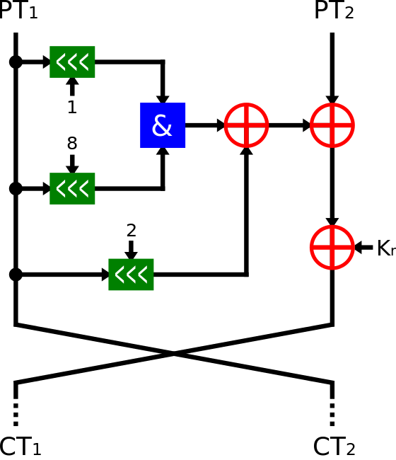

[EN](./simon-speck.md) | [ZH](./simon-speck-zh.md)
# Simon and Speck Block Ciphers


This is a set of sister lightweight encryption.


## Simon Block Cipher


### basic introduction


The Simon block encryption algorithm was released by the NSA in June 2013 and was optimized primarily on the **Hardware Implementation**.


Simon Block Cipher is a balanced [Feistel cipher] (https://en.wikipedia.org/wiki/Feistel_cipher) encryption. There are two blocks. If the size of each block is n bits, the size of the plaintext is 2n bits. Further, in general, the key length used in the encryption is an integer multiple of the block length, such as 2n, 4n, and the like. Common Simon encryption algorithms are available


In general, the Simon algorithm is called Simon 2*n*/nm, where n is the block size and m is the multiple between the block size and the key. For example, Simon 48/96 means that the text is 48 bits and the key is a 96-bit encryption algorithm.


In addition, for the Simon block encryption algorithm, the encryption process is the same for each round, as follows





Of course, the keys will be different for each round and for different m.


Where $z_j$ is generated by the Linear Feedback Shift Register (LFSR), although the logic for the different $z_j$ is different, the initial vector is fixed.


|                 Constant                 |

| :--------------------------------------: |

| $ z_ {0} $ = 11111010001001010110000111001101111101000100101011000011100110 |
| $ z_ {1} $ = 10001110111110010011000010110101000111011111001001100001011010 |
| $ z_ {2} $ = 10101111011100000011010010011000101000010001111110010110110011 |
| $ z_ {3} $ = 11011011101011000110010111100000010010001010011100110100001111 |
| $ z_ {4} $ = 11010001111001101011011000100000010111000011001010010011101111 |


### 2017 SECCON Simon and Speck Block Ciphers


The title is described below


```

Simon and Speck Block Ciphers


https://eprint.iacr.org/2013/404.pdf Simon_96_64, ECB, key="SECCON{xxxx}", plain=0x6d564d37426e6e71, cipher=0xbb5d12ba422834b5

```


It can be seen from the name that the key is 96 bits (12 bytes), the plaintext is 64 bits (8 bytes), and the key has been given 8 bytes, leaving only four bytes unknown. Then we can use the method of brute force. Here is a simon encryption algorithm from https://github.com/bozhu/NSA-ciphers/blob/master/simon.py.


details as follows


```python

from pwn import *

from simon import SIMON


plain = 0x6d564d37426e6e71

cipher = 0xbb5d12ba422834b5


def compare(key):

    key = "SECCON{" + key + "}"

    key = key.encode('hex')

    key = int(key, 16)

    my_simon = SIMON(64, 96, key)

    test = my_simon.encrypt(plain)

    if test == cipher:

        return True

    else:

        return False


def solve():

    visible = string.uppercase + string.lowercase + string.digits + string.punctuation + " "

key = pwnlib.util.iters.mbruteforce (compare, visible, 4, method = &quot;fixed&quot;)
    print key


if __name__ == "__main__":

    solve()

```


Results are as follows


```shell

➜  2017_seccon_simon_and_speck_block_ciphers git:(master) python exp.py

[+] MBruteforcing: Found key: "6Pz0"

```


## references


- https://en.wikipedia.org/wiki/Simon_(cipher)
