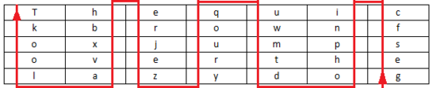

## 培根密码

### 原理

培根密码使用两种不同的字体，代表 A 和 B，结合加密表进行加解密。

| a   | AAAAA | g   | AABBA | n   | ABBAA | t   | BAABA |
| --- | ----- | --- | ----- | --- | ----- | --- | ----- |
| b   | AAAAB | h   | AABBB | o   | ABBAB | u-v | BAABB |
| c   | AAABA | i-j | ABAAA | p   | ABBBA | w   | BABAA |
| d   | AAABB | k   | ABAAB | q   | ABBBB | x   | BABAB |
| e   | AABAA | l   | ABABA | r   | BAAAA | y   | BABBA |
| f   | AABAB | m   | ABABB | s   | BAAAB | z   | BABBB |

上面的是常用的加密表。还有另外的一种加密表，可认为是将 26 个字母从 0 到 25 排序，以二进制表示，A 代表 0，B 代表 1。

下面这一段内容就是明文 steganography 加密后的内容，正常字体是 A，粗体是 B：

**T**o en**co**de **a** mes**s**age e**ac**h letter **of** the **pl**a**i**nt**ex**t **i**s replaced b**y a g**rou**p of f**i**ve** of **th**e lett**ers** **'A'** o**r 'B'**.

可以看到，培根密码主要有以下特点

- 只有两种字符
- 每一段的长度为 5
- 加密内容会有特殊的字体之分，亦或者大小写之分。

### 工具

- http://rumkin.com/tools/cipher/baconian.php

## 栅栏密码

### 原理

栅栏密码把要加密的明文分成 N 个一组，然后把每组的第 1 个字连起来，形成一段无规律的话。这里给出一个例子

```
明文：THERE IS A CIPHER
```

去掉空格后变为

```
THEREISACIPHER
```

分成两栏，两个一组得到

```
TH ER EI SA CI PH ER
```

先取出第一个字母，再取出第二个字母

```
TEESCPE
HRIAIHR
```

连在一起就是

```
TEESCPEHRIAIHR
```

上述明文也可以分为2栏。

```
THEREIS ACIPHER
```

组合得到密文

```
TAHCEIRPEHIESR
```

### 工具

待补充。

## 曲路密码

### 原理

曲路密码（Curve Cipher）是一种换位密码，需要事先双方约定密钥（也就是曲路路径）。下面给出一个例子

```
明文：The quick brown fox jumps over the lazy dog
```

填入 5 行 7 列表（事先约定填充的行列数）


加密的回路线（事先约定填充的行列数）



```
密文：gesfc inpho dtmwu qoury zejre hbxva lookT
```

## 列移位加密

### 原理

列移位密码（Columnar Transposition Cipher）是一种比较简单，易于实现的换位密码，通过一个简单的规则将明文打乱混合成密文。下面给出一个例子。

我们以明文 `The quick brown fox jumps over the lazy dog`，密钥 `how are u` 为例：

将明文填入 5 行 7 列表（事先约定填充的行列数，如果明文不能填充完表格可以约定使用某个字母进行填充）


密钥： `how are u`，按 `how are u` 在字母表中的出现的先后顺序进行编号，我们就有 a 为 1，e 为 2，h 为 3，o 为 4，r 为 5，u 为 6，w 为 7，所以先写出 a 列，其次 e 列，以此类推写出的结果便是密文：


密文： `qoury inpho Tkool hbxva uwmtd cfseg erjez`

### 工具

- http://www.practicalcryptography.com/ciphers/classical-era/columnar-transposition/ 行列数相等


## 01248 密码

### 原理

该密码又称为云影密码，使用 0，1，2，4，8 四个数字，其中 0 用来表示间隔，其他数字以加法可以表示出 如：28=10，124=7，18=9，再用 1->26 表示 A->Z。

可以看出该密码有以下特点

- 只有 0，1，2，4，8

### 例子

这里我们以CFF 2016 影之密码为例进行介绍，题目

> 8842101220480224404014224202480122

我们按照0来进行分割，如下

| 内容   | 数字           | 字符 |
| ------ | -------------- | ---- |
| 88421  | 8+8+4+2+1=23   | W    |
| 122    | 1+2+2=5        | E    |
| 48     | 4+8=12         | L    |
| 2244   | 2+2+4+4=12     | L    |
| 4      | 4              | D    |
| 142242 | 1+4+2+2+4+2=15 | O    |
| 248    | 2+4+8=14       | N    |
| 122    | 1+2+2=5        | E    |

所以最后的 flag 为 WELLDONE。

## JSFuck

### 原理

JSFuck 可以只用 6 个字符 `[]()!+` 来编写 JavaScript 程序。比如我们想用 JSFuck 来实现 `alert(1)` 代码如下

```javascript
[][(![]+[])[+[[+[]]]]+([][[]]+[])[+[[!+[]+!+[]+!+[]+!+[]+!+[]]]]+(![]+[])[+[[!+[]+!+[]]]]+(!![]+[])[+[[+[]]]]+(!![]+[])[+[[!+[]+!+[]+!+[]]]]+(!![]+[])[+[[+!+[]]]]][([][(![]+[])[+[[+[]]]]+([][[]]+[])[+[[!+[]+!+[]+!+[]+!+[]+!+[]]]]+(![]+[])[+[[!+[]+!+[]]]]+(!![]+[])[+[[+[]]]]+(!![]+[])[+[[!+[]+!+[]+!+[]]]]+(!![]+[])[+[[+!+[]]]]]+[])[+[[!+[]+!+[]+!+[]]]]+([][(![]+[])[+[[+[]]]]+([][[]]+[])[+[[!+[]+!+[]+!+[]+!+[]+!+[]]]]+(![]+[])[+[[!+[]+!+[]]]]+(!![]+[])[+[[+[]]]]+(!![]+[])[+[[!+[]+!+[]+!+[]]]]+(!![]+[])[+[[+!+[]]]]]+[])[+[[!+[]+!+[]+!+[]+!+[]+!+[]+!+[]]]]+([][[]]+[])[+[[+!+[]]]]+(![]+[])[+[[!+[]+!+[]+!+[]]]]+(!![]+[])[+[[+[]]]]+(!![]+[])[+[[+!+[]]]]+([][[]]+[])[+[[+[]]]]+([][(![]+[])[+[[+[]]]]+([][[]]+[])[+[[!+[]+!+[]+!+[]+!+[]+!+[]]]]+(![]+[])[+[[!+[]+!+[]]]]+(!![]+[])[+[[+[]]]]+(!![]+[])[+[[!+[]+!+[]+!+[]]]]+(!![]+[])[+[[+!+[]]]]]+[])[+[[!+[]+!+[]+!+[]]]]+(!![]+[])[+[[+[]]]]+([][(![]+[])[+[[+[]]]]+([][[]]+[])[+[[!+[]+!+[]+!+[]+!+[]+!+[]]]]+(![]+[])[+[[!+[]+!+[]]]]+(!![]+[])[+[[+[]]]]+(!![]+[])[+[[!+[]+!+[]+!+[]]]]+(!![]+[])[+[[+!+[]]]]]+[])[+[[!+[]+!+[]+!+[]+!+[]+!+[]+!+[]]]]+(!![]+[])[+[[+!+[]]]]]((![]+[])[+[[+!+[]]]]+(![]+[])[+[[!+[]+!+[]]]]+(!![]+[])[+[[!+[]+!+[]+!+[]]]]+(!![]+[])[+[[+!+[]]]]+(!![]+[])[+[[+[]]]]+([][(![]+[])[+[[+[]]]]+([][[]]+[])[+[[!+[]+!+[]+!+[]+!+[]+!+[]]]]+(![]+[])[+[[!+[]+!+[]]]]+(!![]+[])[+[[+[]]]]+(!![]+[])[+[[!+[]+!+[]+!+[]]]]+(!![]+[])[+[[+!+[]]]]]+[])[+[[+!+[]]]+[[!+[]+!+[]+!+[]+!+[]+!+[]]]]+[+!+[]]+([][(![]+[])[+[[+[]]]]+([][[]]+[])[+[[!+[]+!+[]+!+[]+!+[]+!+[]]]]+(![]+[])[+[[!+[]+!+[]]]]+(!![]+[])[+[[+[]]]]+(!![]+[])[+[[!+[]+!+[]+!+[]]]]+(!![]+[])[+[[+!+[]]]]]+[])[+[[+!+[]]]+[[!+[]+!+[]+!+[]+!+[]+!+[]+!+[]]]])()
```

其他一些基本的表达：

```javascript
false       =>  ![]
true        =>  !![]
undefined   =>  [][[]]
NaN         =>  +[![]]
0           =>  +[]
1           =>  +!+[]
2           =>  !+[]+!+[]
10          =>  [+!+[]]+[+[]]
Array       =>  []
Number      =>  +[]
String      =>  []+[]
Boolean     =>  ![]
Function    =>  []["filter"]
eval        =>  []["filter"]["constructor"]( CODE )()
window      =>  []["filter"]["constructor"]("return this")()
```

### 工具

- [JSFuck 在线加密网站](http://www.jsfuck.com/)

## BrainFuck

### 原理

Brainfuck，是一种极小化的计算机语言，它是由 Urban Müller 在 1993 年创建的。我们举一个例子，如果我们想要一个在屏幕上打印Hello World！，那么对应的程序如下。对于其中的原理，感兴趣的可以自行网上搜索。

```
++++++++++[>+++++++>++++++++++>+++>+<<<<-]
>++.>+.+++++++..+++.>++.<<+++++++++++++++.
>.+++.------.--------.>+.>.
```

与其对应的还有 ook。

### 工具

- https://www.splitbrain.org/services/ook

## 猪圈密码

### 原理

猪圈密码是一种以格子为基础的简单替代式密码，格子如下


我们举一个例子，如明文为 `X marks the spot` ，那么密文如下


### 工具

- http://www.simonsingh.net/The_Black_Chamber/pigpen.html

## 舞动的小人密码

### 原理

这种密码出自于福尔摩斯探案集。每一个跳舞的小人实际上对应的是英文二十六个字母中的一个，而小人手中的旗子则表明该字母是单词的最后一个字母，如果仅仅是一个单词而不是句子，或者是句子中最后的一个单词，则单词中最后一个字母不必举旗。


## 键盘密码

所谓键盘密码，就是采用手机键盘或者电脑键盘进行加密。

### 手机键盘密码

手机键盘加密方式，是每个数字键上有 3-4 个字母，用两位数字来表示字母，例如：ru 用手机键盘表示就是：7382，那么这里就可以知道了，手机键盘加密方式不可能用 1 开头，第二位数字不可能超过 4，解密的时候参考此


关于手机键盘加密还有另一种方式，就是「音的」式（这一点可能根据手机的不同会有所不同），具体参照手机键盘来打，例如：「数字」表示出来就是：748 94。在手机键盘上面按下这几个数，就会出：「数字」的拼音。

### 电脑键盘棋盘

电脑键盘棋盘加密，利用了电脑的棋盘方阵。


### 电脑键盘坐标

电脑键盘坐标加密，利用键盘上面的字母行和数字行来加密，例：bye 用电脑键盘 XY 表示就是：351613


### 电脑键盘 QWE

电脑键盘 QWE 加密法，就是用字母表替换键盘上面的排列顺序。


### 键盘布局加密

简单地说就是根据给定的字符在键盘上的样子来进行加密。

### 0CTF 2014 classic

> 小丁丁发现自己置身于一个诡异的房间，面前只有一扇刻着奇怪字符的门。 他发现门边上还有一道密码锁，似乎要输入密码才能开门。。4esxcft5 rdcvgt 6tfc78uhg 098ukmnb

发现这么乱，还同时包括数字和字母猜想可能是键盘密码，试着在键盘上按照字母顺序描绘一下，可得到0ops字样，猜测就是flag了。

### 2017年xman选拔赛——一二三，木头人

> 我数123木头人，再不行动就要被扣分。
>
> 23731263111628163518122316391715262121
>
> 密码格式xman{flag}

题目中有很明显的提示123，那么就自然需要联想到键盘密码中电脑键盘坐标密码，可以发现前几个数字第二个数字都是1-3范围内的，也验证了我们的猜测。于是

> 23-x
>
> 73-m
>
> 12-a
>
> 63-n
>
> 11-q

不对呀，密码格式是 `xman{`，第四个字符是 `{`，于是看了看 `{` 的位置，其并没有对应的横坐标，但是如果我们手动把它视为 11 的话，那么111就是 `{`。然后依次往后推，发现确实可行，，最后再把 121 视为 `}` 即可得到 flag。

```
xman{hintisenough}
```

从这里我们可以看出，我们还是要注意迁移性，不能单纯地照搬一些已有的知识。

### 题目

- 实验吧 奇怪的短信
