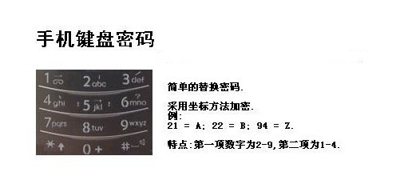

[EN](./others.md) | [ZH](./others-zh.md)
## Bacon Password


### Principle


The Bacon password uses two different fonts, representing A and B, combined with an encryption table for encryption and decryption.


| a | AAAAA | g | AABBA | n | ABBAA | t | BAABA |
| --- | ----- | --- | ----- | --- | ----- | --- | ----- |

| b AAAAB | h. | AABBB | o | ABBAB | uv | BAABB |
| c | AAABA | ij | ABAAA | p | ABBBA | w | BABAA |
| d | AAABB | k | ABAAB | q | ABBBB | x | BABAB |
| e | AABAA | l | ABABA | r | BAAAA | y | BABBA |
| f AABAB m ABABB | s BAAAB z BABBB


The above is a commonly used encryption table. There is another type of encryption table that can be thought of as sorting 26 letters from 0 to 25, expressed in binary, with A representing 0 and B representing 1.


The following paragraph is the encrypted content of plain text steganography, the normal font is A, and the bold is B:


**T**o en**co**de **a** mes**s**age e**ac**h letter **of** the **pl**a**i**nt**ex**t **i**s replaced b**y a g**rou**p of f**i**ve** of **th**e lett**ers** **'A'** o**r 'B'**.


It can be seen that the Bacon password mainly has the following characteristics.


- only two characters
- the length of each segment is 5
- Encrypted content will have a special font, or case.


### Tools


- http://rumkin.com/tools/cipher/baconian.php


## fence password


### Principle


The fence password divides the plaintext to be encrypted into N groups, and then connects the first word of each group to form an irregular word. Here is an example


```

明文：THERE IS A CIPHER

```


Changed after removing the space


```

THEREISACIPHER

```


Divided into two columns, two groups get


```

TH IS EI SA CI PH ER
```


First take the first letter and then take the second letter


```

TEESCPE

HRIAIHR
```


Connected together


```

TEESCPEHRIAIHR

```


The above plain text can also be divided into 2 columns.


```

THEREIS ACIPHER

```


Combine to get ciphertext


```

TAHCEIRPEHIESR

```


### Tools


To be added.


## 曲路密码


### Principle


Curve Cipher is a transposition password that requires the two parties to agree on the key (that is, the path of the curve). An example is given below


```

明文：The quick brown fox jumps over the lazy dog

```


Fill in 5 rows and 7 lists (pre-agreed the number of rows and columns filled)


Encrypted loop line (pre-agreed the number of rows and columns filled)


```

密 文: gesfc inpho dtmwu qoury zejre hbxva lookT
```


## Column Shift Encryption


### Principle


Column Transposition Cipher is a relatively simple and easy-to-implement transposition cipher that mixes plaintext into ciphertext through a simple rule. An example is given below.


We use the clear text `The quick brown fox jumps over the lazy dog`, the key `how are u` as an example:


Fill in the clear line with 5 rows and 7 lists (pre-agreed the number of rows and columns to be filled in. If the plain text cannot be filled in, the form can be filled with a letter)


Key: `how are u`, press `how are u` to number in the order in which the alphabet appears. We have a for 1, e for 2, h for 3, o for 4, and r for 5. u is 6, and w is 7, so write a column first, followed by column e, and so on. The result is cipher text:


密 文: `qoury inpho takool hbxva uwmtd cfseg erjez`


### Tools


- http://www.practicalcryptography.com/ciphers/classical-era/columnar-transposition/ The number of rows and columns is equal


## 01248 Password

### Principle


This password, also known as cloud shadow password, uses 0, 1, 2, 4, 8 four digits, where 0 is used to indicate the interval, and other numbers can be expressed by addition: 28=10,124=7,18=9 Then use 1-&gt;26 to indicate A-&gt;Z.


It can be seen that the password has the following characteristics


- only 0, 1, 2, 4, 8


### Examples


Here we take CFF 2016 shadow password as an example, the topic


> 8842101220480224404014224202480122


We divide by 0, as follows


| Content | Numbers | Characters |
| ------ | -------------- | ---- |

| 88421 | 8 + 8 + 4 + 2 + 1 = 23 W |
| 122 | 1 + 2 + 2 = 5 | E |
| 48 | 4 + 8 = 12 | L |
| 2244 | 2 + 2 + 4 + 4 = 12 | L |
| 4      | 4              | D    |

| 142242 | 1 + 4 + 2 + 2 + 4 + 2 = 15 | O |
| 248    | 2+4+8=14       | N    |

| 122 | 1 + 2 + 2 = 5 | E |


So the final flag is WELLDONE.


## JSFuck


### Principle


JSFuck can write JavaScript programs with only 6 characters `[]()!+`. For example, we want to use JSFuck to implement the `alert(1)` code as follows


```javascript

[][(![]+[])[+[[+[]]]]+([][[]]+[])[+[[!+[]+!+[]+!+[]+!+[]+!+[]]]]+(![]+[])[+[[!+[]+!+[]]]]+(!![]+[])[+[[+[]]]]+(!![]+[])[+[[!+[]+!+[]+!+[]]]]+(!![]+[])[+[[+!+[]]]]][([][(![]+[])[+[[+[]]]]+([][[]]+[])[+[[!+[]+!+[]+!+[]+!+[]+!+[]]]]+(![]+[])[+[[!+[]+!+[]]]]+(!![]+[])[+[[+[]]]]+(!![]+[])[+[[!+[]+!+[]+!+[]]]]+(!![]+[])[+[[+!+[]]]]]+[])[+[[!+[]+!+[]+!+[]]]]+([][(![]+[])[+[[+[]]]]+([][[]]+[])[+[[!+[]+!+[]+!+[]+!+[]+!+[]]]]+(![]+[])[+[[!+[]+!+[]]]]+(!![]+[])[+[[+[]]]]+(!![]+[])[+[[!+[]+!+[]+!+[]]]]+(!![]+[])[+[[+!+[]]]]]+[])[+[[!+[]+!+[]+!+[]+!+[]+!+[]+!+[]]]]+([][[]]+[])[+[[+!+[]]]]+(![]+[])[+[[!+[]+!+[]+!+[]]]]+(!![]+[])[+[[+[]]]]+(!![]+[])[+[[+!+[]]]]+([][[]]+[])[+[[+[]]]]+([][(![]+[])[+[[+[]]]]+([][[]]+[])[+[[!+[]+!+[]+!+[]+!+[]+!+[]]]]+(![]+[])[+[[!+[]+!+[]]]]+(!![]+[])[+[[+[]]]]+(!![]+[])[+[[!+[]+!+[]+!+[]]]]+(!![]+[])[+[[+!+[]]]]]+[])[+[[!+[]+!+[]+!+[]]]]+(!![]+[])[+[[+[]]]]+([][(![]+[])[+[[+[]]]]+([][[]]+[])[+[[!+[]+!+[]+!+[]+!+[]+!+[]]]]+(![]+[])[+[[!+[]+!+[]]]]+(!![]+[])[+[[+[]]]]+(!![]+[])[+[[!+[]+!+[]+!+[]]]]+(!![]+[])[+[[+!+[]]]]]+[])[+[[!+[]+!+[]+!+[]+!+[]+!+[]+!+[]]]]+(!![]+[])[+[[+!+[]]]]]((![]+[])[+[[+!+[]]]]+(![]+[])[+[[!+[]+!+[]]]]+(!![]+[])[+[[!+[]+!+[]+!+[]]]]+(!![]+[])[+[[+!+[]]]]+(!![]+[])[+[[+[]]]]+([][(![]+[])[+[[+[]]]]+([][[]]+[])[+[[!+[]+!+[]+!+[]+!+[]+!+[]]]]+(![]+[])[+[[!+[]+!+[]]]]+(!![]+[])[+[[+[]]]]+(!![]+[])[+[[!+[]+!+[]+!+[]]]]+(!![]+[])[+[[+!+[]]]]]+[])[+[[+!+[]]]+[[!+[]+!+[]+!+[]+!+[]+!+[]]]]+[+!+[]]+([][(![]+[])[+[[+[]]]]+([][[]]+[])[+[[!+[]+!+[]+!+[]+!+[]+!+[]]]]+(![]+[])[+[[!+[]+!+[]]]]+(!![]+[])[+[[+[]]]]+(!![]+[])[+[[!+[]+!+[]+!+[]]]]+(!![]+[])[+[[+!+[]]]]]+[])[+[[+!+[]]]+[[!+[]+!+[]+!+[]+!+[]+!+[]+!+[]]]])()

```


Some other basic expressions:


```javascript

false       =>  ![]

true        =>  !![]

undefined   =>  [][[]]

NaN =&gt; + [! []]
0           =>  +[]

1           =>  +!+[]

2           =>  !+[]+!+[]

10          =>  [+!+[]]+[+[]]

Array       =>  []

Number      =>  +[]

String      =>  []+[]

Boolean     =>  ![]

Function    =>  []["filter"]

eval        =>  []["filter"]["constructor"]( CODE )()

window      =>  []["filter"]["constructor"]("return this")()

```


### Tools


- [JSFuck Online Encryption Website] (http://www.jsfuck.com/)


## BrainFuck


### Principle


Brainfuck, a minimal computer language, was created in 1993 by Urban Müller. Let&#39;s take an example if we want to print Hello World on the screen! , then the corresponding program is as follows. For the principles, you can search online for your own interest.


```

++++++++++[>+++++++>++++++++++>+++>+<<<<-]

>++.>+.+++++++..+++.>++.<<+++++++++++++++.

>.+++.------.--------.>+.>.

```


Corresponding to it is ook.


### Tools


- https://www.splitbrain.org/services/ook


## Pigsty password


### Principle


The pigsty password is a simple alternative password based on the grid. The grid is as follows


![Pig password comparison table] (./figure/pigpen.png)


Let&#39;s take an example, such as the plain text is `X marks the spot`, then the ciphertext is as follows


![pig password example] (./figure/pigpen_example.png)


### Tools


- http://www.simonsingh.net/The_Black_Chamber/pigpen.html


## Dancing villain password


### Principle


This password comes from the Sherlock Holmes collection. Each dancing villain actually corresponds to one of the twenty-six letters in English, while the flag in the hand of the villain indicates that the letter is the last letter of the word, if it is just a word instead of a sentence, or a sentence The last word in the word, the last letter in the word does not have to be raised.


![Dancing Man&#39;s Password] (./figure/dancingman.jpg)


## Keyboard password


The so-called keyboard password is encrypted using a mobile phone keyboard or a computer keyboard.


### Mobile keyboard password


The phone keyboard encryption method is that there are 3-4 letters on each number key, and the two-digit number is used to represent the letter. For example: ru is represented by the phone keypad: 7382, then you can know here, the phone keyboard encryption method is impossible. Start with 1, the second digit cannot exceed 4, refer to this when decrypting





Another way to encrypt your phone&#39;s keyboard is the &quot;sound&quot; style (this may vary depending on the phone). Refer to the phone keypad for details. For example, &quot;Number&quot; means: 748 94. Pressing these numbers on the phone keypad will bring out the pinyin of &quot;number&quot;.


### Computer keyboard board


The computer keyboard is encrypted and uses the square of the computer&#39;s board.


### Computer keyboard coordinates

Encryption of the computer keyboard coordinates, using the letter lines and numbers on the keyboard to encrypt, for example: bye using the computer keyboard XY means: 351613


![Computer keyboard coordinate encryption] (./figure/computer-xy.jpg)


### Computer keyboard QWE


Computer keyboard QWE encryption method is to replace the order of the keyboard with the alphabet.


### Keyboard layout encryption


Simply put, it is encrypted according to how the given character looks on the keyboard.


### 0CTF 2014 classic


&gt; Xiaoding Ding found himself in a strange room with only a door with strange characters in front of him. He found a password lock on the side of the door, which seemed to require a password to open the door. . 4esxcft5 rdcvgt 6tfc78uhg 098ukmnb


Found so chaotic, but also including the number and letter guess may be the keyboard password, try to draw in the alphabetical order on the keyboard, you can get 0ops, guess is the flag.


### 2017 xman trials - one two three, wood people


&gt; I count 123 wood people, and I will be deducted if I don&#39;t act.
>

> 23731263111628163518122316391715262121

>

&gt; password format xman{flag}


There are obvious hints 123 in the title, then it is natural to think of the computer keyboard coordinate password in the keyboard password. You can find that the second digits of the first few digits are in the range of 1-3, which also verifies our guess. then


> 23-x

>

> 73-m

>

> 12-a

>

> 63-n

>

> 11-q


No, the password format is `xman{`, the fourth character is `{`, so I look at the position of `{`, which does not have a corresponding abscissa, but if we manually treat it as 11, then 111 is `{`. Then push back in turn and find that it is feasible. Finally, treat 121 as `}` to get the flag.


```

xman{hintisenough}

```


From here we can see that we still have to pay attention to mobility, and we cannot simply copy some existing knowledge.


### Title


- Experiment with strange text messages