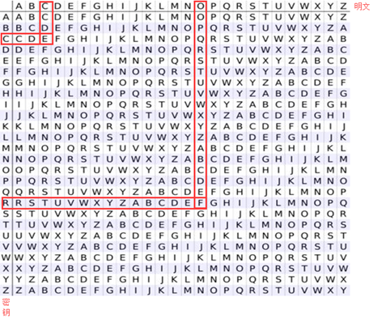

对于多表替换加密来说，加密后的字母几乎不再保持原来的频率，所以我们一般只能通过寻找算法实现对应的弱点进行破解。

## Playfair

### 原理

Playfair 密码（Playfair cipher or Playfair square）是一种替换密码，1854 年由英国人查尔斯·惠斯通（Charles Wheatstone）发明，基本算法如下：

1.  选取一串英文字母，除去重复出现的字母，将剩下的字母逐个逐个加入 5 × 5 的矩阵内，剩下的空间由未加入的英文字母依 a-z 的顺序加入。注意，将 q 去除，或将 i 和 j 视作同一字。
2.  将要加密的明文分成两个一组。若组内的字母相同，将 X（或 Q）加到该组的第一个字母后，重新分组。若剩下一个字，也加入 X 。
3.  在每组中，找出两个字母在矩阵中的地方。
    - 若两个字母不同行也不同列，在矩阵中找出另外两个字母（第一个字母对应行优先），使这四个字母成为一个长方形的四个角。
    - 若两个字母同行，取这两个字母右方的字母（若字母在最右方则取最左方的字母）。
    - 若两个字母同列，取这两个字母下方的字母（若字母在最下方则取最上方的字母）。

新找到的两个字母就是原本的两个字母加密的结果。

以 playfair example 为密匙，得

```
P L A Y F
I R E X M
B C D G H
K N O Q S
T U V W Z
```

要加密的讯息为 Hide the gold in the tree stump

```
HI DE TH EG OL DI NT HE TR EX ES TU MP
```

就会得到

```
BM OD ZB XD NA BE KU DM UI XM MO UV IF
```

### 工具

- CAP4

## Polybius

### 原理

Polybius密码又称为棋盘密码，其一般是将给定的明文加密为两两组合的数字，其常用密码表

|      | 1   | 2   | 3   | 4   | 5    |
| :--- | --- | --- | --- | --- | :--- |
| 1    | A   | B   | C   | D   | E    |
| 2    | F   | G   | H   | I/J | K    |
| 3    | L   | M   | N   | O   | P    |
| 4    | Q   | R   | S   | T   | U    |
| 5    | V   | W   | X   | Y   | Z    |

举个例子，明文 HELLO，加密后就是 23 15 31 31 34。

另一种密码表

|     | A   | D   | F   | G   | X   |
| --- | --- | --- | --- | --- | --- |
| A   | b   | t   | a   | l   | p   |
| D   | d   | h   | o   | z   | k   |
| F   | q   | f   | v   | s   | n   |
| G   | g   | j   | c   | u   | x   |
| X   | m   | r   | e   | w   | y   |

注意，这里字母的顺序被打乱了。

A D F G X 的由来：

> 1918 年，第一次世界大战将要结束时，法军截获了一份德军电报，电文中的所有单词都由 A、D、F、G、X 五个字母拼成，因此被称为 ADFGX 密码。ADFGX 密码是 1918 年 3 月由德军上校 Fritz Nebel 发明的，是结合了 Polybius 密码和置换密码的双重加密方案。

举个例子，HELLO，使用这个表格加密，就是 DD XF AG AG DF。

### 工具

- CrypTool

### 例子

这里以安恒杯 9 月 Crypto 赛题 Go 为例，题目为：

> 密文：ilnllliiikkninlekile

> 压缩包给了一行十六进制：546865206c656e677468206f66207468697320706c61696e746578743a203130

> 请对密文解密

首先对十六进制进行 hex 解码，得到字符串："The length of this plaintext: 10"

密文长度为 20 ，而明文长度为 10 ，密文只有 " l "," i "," n "," k "," e " 这五个字符，联想到棋盘密码。

首先试一下五个字符按字母表顺序排列：

|      | e   | i   | k   | l   | n    |
| :--- | --- | --- | --- | --- | :--- |
| e    | A   | B   | C   | D   | E    |
| i    | F   | G   | H   | I/J | K    |
| k    | L   | M   | N   | O   | P    |
| l    | Q   | R   | S   | T   | U    |
| n    | V   | W   | X   | Y   | Z    |

根据密文解密得：iytghpkqmq。

这应该不是我们想要的 flag 答案。

看来这五个字符排列不是这么排列的，一共有 5! 种情况，写脚本爆破：

```python
import itertools

key = []
cipher = "ilnllliiikkninlekile"

for i in itertools.permutations('ilnke', 5):
    key.append(''.join(i))

for now_key in key:
    solve_c = ""
    res = ""
    for now_c in cipher:
        solve_c += str(now_key.index(now_c))
    for i in range(0,len(solve_c),2):
        now_ascii = int(solve_c[i])*5+int(solve_c[i+1])+97
        if now_ascii>ord('i'):
            now_ascii+=1
        res += chr(now_ascii)
    if "flag" in res:
        print now_key,res
```
脚本其实就是实现棋盘密码这个算法，只是这五个字符的顺序不定。

跑出下面两个结果：

> linke flagishere

> linek flagkxhdwd

显然第一个是我们想要的答案。

附上正确的密码表：

|      | l   | i   | n   | k   | e    |
| :--- | --- | --- | --- | --- | :--- |
| l    | A   | B   | C   | D   | E    |
| i    | F   | G   | H   | I/J | K    |
| n    | L   | M   | N   | O   | P    |
| k    | Q   | R   | S   | T   | U    |
| e    | V   | W   | X   | Y   | Z    |

## Vigenere 维吉尼亚密码

### 原理

维吉尼亚密码（Vigenere）是使用一系列凯撒密码组成密码字母表的加密算法，属于多表密码的一种简单形式。


下面给出一个例子

```
明文：come greatwall
密钥：crypto
```

首先，对密钥进行填充使其长度与明文长度一样。

| 明文 | c   | o   | m   | e   | g   | r   | e   | a   | t   | w   | a   | l   | l   |
| ---- | --- | --- | --- | --- | --- | --- | --- | --- | --- | --- | --- | --- | --- |
| 密钥 | c   | r   | y   | p   | t   | o   | c   | r   | y   | p   | t   | o   | c   |

其次，查表得密文



```
明文：come greatwall
密钥：crypto
密文：efkt zferrltzn
```
### 破解

对包括维吉尼亚密码在内的所有多表密码的破译都是以字母频率为基础的，但直接的频率分析却并不适用，这是因为在维吉尼亚密码中，一个字母可以被加密成不同的密文，因而简单的频率分析在这里并没有用。

**破译维吉尼亚密码的关键在于它的密钥是循环重复的。** 如果我们知道了密钥的长度，那密文就可以被看作是交织在一起的凯撒密码，而其中每一个都可以单独破解。关于密码的长度，我们可以 使用卡西斯基试验和弗里德曼试验来获取。

卡西斯基试验是基于类似 the 这样的常用单词有可能被同样的密钥字母进行加密，从而在密文中重复出现。例如，明文中不同的 CRYPTO 可能被密钥 ABCDEF 加密成不同的密文：

```
密钥：ABCDEF AB CDEFA BCD EFABCDEFABCD
明文：CRYPTO IS SHORT FOR CRYPTOGRAPHY
密文：CSASXT IT UKSWT GQU GWYQVRKWAQJB
```

此时明文中重复的元素在密文中并不重复。然而，如果密钥相同的话，结果可能便为（使用密钥 ABCD）：

```
密钥：ABCDAB CD ABCDA BCD ABCDABCDABCD
明文：CRYPTO IS SHORT FOR CRYPTOGRAPHY
密文：CSASTP KV SIQUT GQU CSASTPIUAQJB
```

此时卡西斯基试验就能产生效果。对于更长的段落此方法更为有效，因为通常密文中重复的片段会更多。如通过下面的密文就能破译出密钥的长度：

```
密文：DYDUXRMHTVDVNQDQNWDYDUXRMHARTJGWNQD
```

其中，两个 DYDUXRMH 的出现相隔了 18 个字母。因此，可以假定密钥的长度是 18 的约数，即长度为 18、9、6、3 或 2。而两个 NQD 则相距 20 个字母，意味着密钥长度应为 20、10、5、4 或 2。取两者的交集，则可以基本确定密钥长度为 2。接下来就是进行进一步的操作了。

关于更加详细的破解原理，这里暂时不做过多的介绍。可以参考http://www.practicalcryptography.com/cryptanalysis/stochastic-searching/cryptanalysis-vigenere-cipher/。

### 工具

-   已知密钥
    - Python 的 pycipher 库
    - [在线解密 Vigenère cipher](http://planetcalc.com/2468/)
    - CAP4
-   未知密钥
    - [Vigenère Cipher Codebreaker](http://www.mygeocachingprofile.com/codebreaker.vigenerecipher.aspx)
    - [Vigenere Solver](https://www.guballa.de/vigenere-solver) ，不够完善。

## Nihilist

### 原理

Nihilist密码又称关键字密码：明文 + 关键字 = 密文。以关键字 helloworld 为例。

首先利用密钥构造棋盘矩阵（类似 Polybius 密码）
- 新建一个 5 × 5 矩阵
- 将字符不重复地依次填入矩阵
- 剩下部分按字母顺序填入
- 字母 i 和 j 等价

|     | 1   | 2   | 3     | 4   | 5   |
| --- | --- | --- | ----- | --- | --- |
| 1   | h   | e   | l     | o   | w   |
| 2   | r   | d   | a     | b   | c   |
| 3   | f   | g   | i / j | k   | m   |
| 4   | n   | p   | q     | s   | t   |
| 5   | u   | v   | x     | y   | z   |

对于加密过程参照矩阵 M 进行加密：

```
a -> M[2,3] -> 23
t -> M[4,5] -> 45
```
对于解密过程

参照矩阵 M 进行解密：

```
23 -> M[2,3] -> a
45 -> M[4,5] -> t
```
可以看出，密文的特征有如下几点

- 纯数字
- 只包含 1 到 5
- 密文长度偶数。

## Hill

### 原理

希尔密码（Hill）使用每个字母在字母表中的顺序作为其对应的数字，即A=0，B=1，C=2 等，然后将明文转化为 n 维向量，跟一个 n × n 的矩阵相乘，再将得出的结果模 26。注意用作加密的矩阵（即密匙）在 $\mathbb{Z}_{26}^{n}$ 必须是可逆的，否则就不可能解码。只有矩阵的行列式和 26 互质，才是可逆的。下面举一个例子

```
明文：ACT
```

将明文化为矩阵。

$$
\begin{bmatrix}
0\\
2\\
19
\end{bmatrix}
$$

假设密钥为：

$$
\begin{bmatrix}
6 & 24 & 1\\
13 & 16 & 10\\
20 & 17 & 15
\end{bmatrix}
$$

加密过程为：

$$
\begin{bmatrix}
6 & 24 & 1\\
13 & 16 & 10\\
20 & 17 & 15
\end{bmatrix}
\begin{bmatrix}
0\\
2\\
19
\end{bmatrix}
\equiv
\begin{bmatrix}
67\\
222\\
319
\end{bmatrix}
\equiv
\begin{bmatrix}
15\\
14\\
7
\end{bmatrix}
\bmod 26
$$

密文即为

```
密文：POH
```

### 工具

- http://www.practicalcryptography.com/ciphers/hill-cipher/
- CAP4
- Cryptool

### 例子

这里我们以ISCC 2015 base decrypt 150为例进行介绍，题目为

> 密文： 22,09,00,12,03,01,10,03,04,08,01,17 （wjamdbkdeibr）
>
> 使用的矩阵是 1 2 3 4 5 6 7 8 10
>
> 请对密文解密.

首先，矩阵是 3 × 3 的。说明每次加密3个字符。我们直接使用 Cryptool，需要注意的是，这个矩阵是按照列来排布的。即如下

```
1 4 7
2 5 8
3 6 10
```

最后的结果为 `overthehillx`。

## AutokeyCipher

### 原理

自动密钥密码（Autokey Cipher）也是多表替换密码，与维吉尼亚密码密码类似，但使用不同的方法生成密钥。通常来说它要比维吉尼亚密码更安全。自动密钥密码主要有两种，关键词自动密钥密码和原文自动密钥密码。下面我们以关键词自动密钥为例：

```
明文：THE QUICK BROWN FOX JUMPS OVER THE LAZY DOG
关键词：CULTURE
```

自动生成密钥：

```
CULTURE THE QUICK BROWN FOX JUMPS OVER THE
```

接下来的加密过程和维吉尼亚密码类似，从相应的表格可得：

密文

```
VBP JOZGD IVEQV HYY AIICX CSNL FWW ZVDP WVK
```

### 工具

-   已知关键词
    - Python 的 pycipher 库
-   未知关键词
    - http://www.practicalcryptography.com/cryptanalysis/stochastic-searching/cryptanalysis-autokey-cipher/
    - **tools 文件夹下 break_autokey.py，待完成。**
