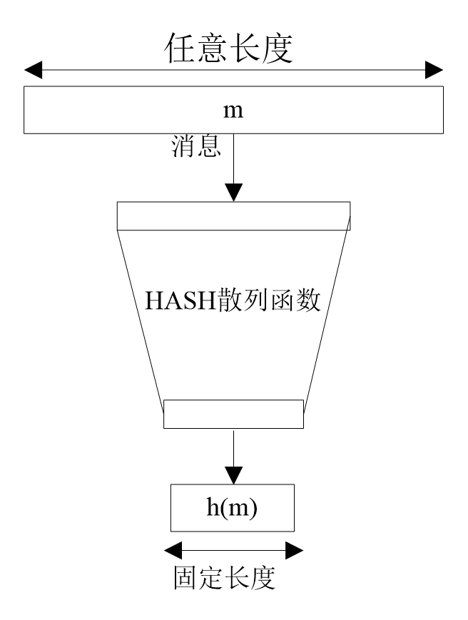

[EN](./introduction.md) | [ZH](./introduction-zh.md)
# hash function

A hash function compresses a message or data into a digest, making the amount of data smaller. Its general model is as follows

Obviously for any hash value, there are theoretically several messages corresponding to it, namely collisions.

The basic requirements of the hash function are as follows

| Requirements | Description|
| ------ | ---------------------------------------- |

| Input length variable | hash function can be applied to data of any length |
| Output length fixed | The output length of the hash function is fixed |
| Efficiency | For any message $x$, calculating $H(x)$ is easy |
| Unidirectional | For any hash value h, it is computationally infeasible to find x that satisfies $H(x)=h$. |
| Weak Collision Resistance | For any message x, finding another message y that satisfies $H(x)=H(y)$ is not computationally feasible. |
| Strong Collision Resistance | Finding any pair of messages x and y that satisfy $H(x)=H(y)$ is not computationally feasible. |
| Pseudo-randomness | The output of the hash function satisfies the pseudo-randomness test criteria. |

The purpose of the hash value is as follows

- Ensuring the integrity of the message, ie ensuring that the data received is exactly the same as it was sent (ie no modification, insertion, deletion or replay) to prevent tampering by the intermediary.
- Redundancy check
- One-way password file, such as the password of the Linux system
- Signature detection in intrusion detection and virus detection

The current Hash functions mainly include MD5, SHA1, SHA256, and SHA512. Most of the current hash functions are iterative, that is, using the same hash function and performing multiple iterations with different parameters.

| Algorithm Type | Output Hash Value Length |
| ------ | ----------------- |

| MD5    | 128 bit / 256 bit |

| SHA1   | 160 bit           |

| SHA256 | 256 bit           |

| SHA512 | 512 bit           |
