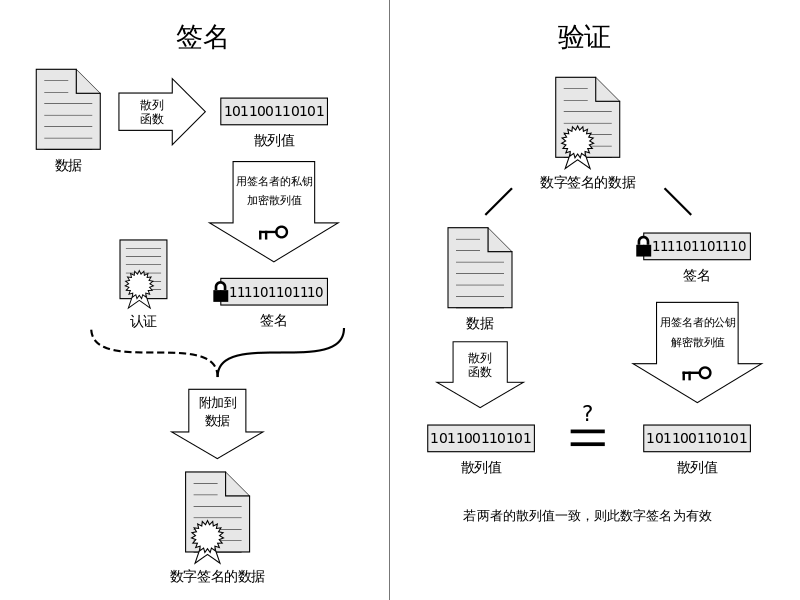

[EN](./introduction.md) | [ZH](./introduction-zh.md)
# 数字签名

在日常生活中，我们在参加某个活动的时候，可能会需要签名，以便于证明我们确实到场了，，，防止导员啥的，你懂得。。。但其实吧，这种签名很容易被伪造，随便找一个人代签一下，或者说找一个会模仿别人字迹的人帮忙签一下。在计算机世界中，我们可能会需要电子签名，因为我们大多数情况下会使用电子文件，那这时候怎么办呢？当然，我们仍然可以选择使用自己的名字。但其实还有另外一种方式，那就是采用数字签名，这种签名更加难以伪造，可信程度更高。数字签名的主要用处是确保消息确实来自于声称产生该消息的人。

数字签名（digital signature）主要用于对数字消息（digital message）进行签名，以防消息的冒名伪造或篡改，亦可以用于通信双方的身份鉴别。

数字签名依赖于非对称密码，因为我们必须确保一方能够做的事情，而另一方不能够做出这样的事情。其基本原理如下

数字签名应当具有以下几个特性：

(1) 签名是可信的：任何人都可以验证签名的有效性。

(2) 签名是不可伪造的：除了合法的签名者之外，任何其他人伪造其签名是困难的。

(3) 签名是不可复制的：对一个消息的签名不能通过复制变为另一个消息的签名。如果对一个消息的签名是从别处复制得到的，则任何人都可以发现消息与签名之间的不一致性，从而可以拒绝签名的消息。

(4) 签名的消息是不可改变的：经签名的消息不能被篡改。一旦签名的消息被篡改，则任何人都可以发现消息与签名之间的不一致性。

(5) 签名是不可抵赖的：签名者事后不能否认自己的签名。