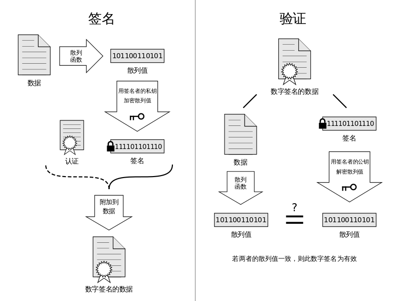

# 数字签名

在日常生活中，我们在参加某个活动的时候，可能会需要签名，以便于证明我们确实到场了，，，防止导员啥的，你懂得。。。但其实吧，这种签名很容易被伪造，随便找一个人代签一下，或者说找一个会模仿别人字迹的人帮忙签一下。在计算机世界中，我们可能会需要电子签名，因为我们大多数情况下会使用电子文件，那这时候怎么办呢？当然，我们仍然可以选择使用自己的名字。但其实还有另外一种方式，那就是采用数字签名，这种签名更加难以伪造，可信程度更高。数字签名的主要用处是确保消息确实来自于声称产生该消息的人。

数字签名依赖于非对称密码，因为我们必须确保一方能够做的事情，而另一方不能够做出这样的事情。其基本原理如下

