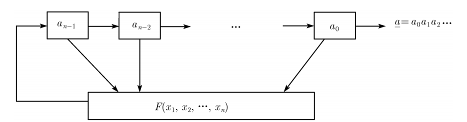

[EN](./intro.md) | [ZH](./intro-zh.md)
# Feedback shift register

In general, an n-level feedback shift register is shown below

among them

- $a_0$, $a_1$,..., $a_{n-1}$, as initial.
- F is the feedback function or feedback logic. If F is a linear function, then we call it a linear feedback shift register (LFSR), otherwise we call it a nonlinear feedback shift register (NFSR).
- $a_{i+n}=F(a_i,a_{i+1},...,a_{i+n-1})$ 。

In general, the feedback shift register is defined on a finite field to avoid the problem of too large and too small numbers. So we can think of it as a transformation in the same space, ie

$(a_i,a_{i+1},...,a_{i+n-1}) \rightarrow (a_{i+1},...,a_{i+n-1},a_{i+n})$

.

For a sequence, we generally define the sum of the power series whose generator function corresponds to its sequence.