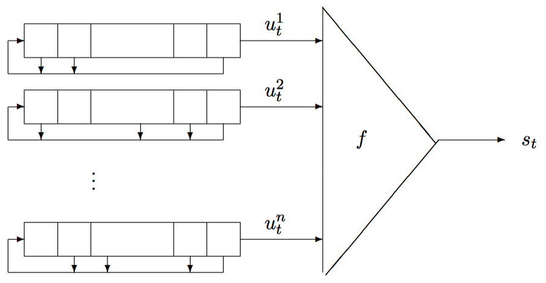

# 非线性反馈移位寄存器

## 介绍

为了使得密钥流输出的序列尽可能复杂，会使用非线性反馈移位寄存器，常见的有三种

- 非线性组合生成器，对多个 LFSR 的输出使用一个非线性组合函数
- 非线性滤波生成器，对一个 LFSR 的内容使用一个非线性组合函数
- 钟控生成器，使用一个（或多个）LFSR 的输出来控制另一个（或多个）LFSR 的时钟 

## 非线性组合生成器

### 简介

组合生成器一般如下图所示。



###  Geffe

这里我们以 Geffe 为例进行介绍。Geffe 包含 3 个线性反馈移位寄存器，非线性组合函数为

$F(x_1,x_2,x_3)=(x_1 \and x_2) \oplus (\urcorner x_1 \and x_3)=(x_1 \and x_2) \oplus ( x_1 \and x_3)\oplus x_3$

#### 2018 强网杯 streamgame3

简单看一下题目

```python
from flag import flag
assert flag.startswith("flag{")
assert flag.endswith("}")
assert len(flag)==24

def lfsr(R,mask):
    output = (R << 1) & 0xffffff
    i=(R&mask)&0xffffff
    lastbit=0
    while i!=0:
        lastbit^=(i&1)
        i=i>>1
    output^=lastbit
    return (output,lastbit)


def single_round(R1,R1_mask,R2,R2_mask,R3,R3_mask):
    (R1_NEW,x1)=lfsr(R1,R1_mask)
    (R2_NEW,x2)=lfsr(R2,R2_mask)
    (R3_NEW,x3)=lfsr(R3,R3_mask)
    return (R1_NEW,R2_NEW,R3_NEW,(x1*x2)^((x2^1)*x3))

R1=int(flag[5:11],16)
R2=int(flag[11:17],16)
R3=int(flag[17:23],16)
assert len(bin(R1)[2:])==17
assert len(bin(R2)[2:])==19
assert len(bin(R3)[2:])==21
R1_mask=0x10020
R2_mask=0x4100c
R3_mask=0x100002


for fi in range(1024):
    print fi
    tmp1mb=""
    for i in range(1024):
        tmp1kb=""
        for j in range(1024):
            tmp=0
            for k in range(8):
                (R1,R2,R3,out)=single_round(R1,R1_mask,R2,R2_mask,R3,R3_mask)
                tmp = (tmp << 1) ^ out
            tmp1kb+=chr(tmp)
        tmp1mb+=tmp1kb
    f = open("./output/" + str(fi), "ab")
    f.write(tmp1mb)
    f.close()
```

可以看出，该程序与 Geffe 生成器非常类似，这里我们使用相关攻击方法进行攻击，我们可以统计一下在三个 LFSR 输出不同的情况下，最后类 Geffe 生成器的输出，如下

| $x_1$ | $x_2$ | $x_3$ | $F(x_1,x_2,x_3)$ |
| ----- | ----- | ----- | ---------------- |
| 0     | 0     | 0     | 0                |
| 0     | 0     | 1     | 1                |
| 0     | 1     | 0     | 0                |
| 0     | 1     | 1     | 0                |
| 1     | 0     | 0     | 0                |
| 1     | 0     | 1     | 1                |
| 1     | 1     | 0     | 1                |
| 1     | 1     | 1     | 1                |

可以发现

- Geffe 的输出与 $x_1$ 相同的概率为 0.75
- Geffe 的输出与 $x_2$ 相同的概率为 0.5
- Geffe 的输出与 $x_3$ 相同的概率为 0.75

这说明输出与第一个和第三个的关联性非常大。 因此，我们可以暴力去枚举第一个和第三个 LFSR 的输出判断其与 类 Geffe 的输出相等的个数，如果大约在 75% 的话，就可以认为是正确的。第二个就直接暴力枚举了。

脚本如下

```python
#for x1 in range(2):
#    for x2 in range(2):
#        for x3 in range(2):
#            print x1,x2,x3,(x1*x2)^((x2^1)*x3)
#n = [17,19,21]

#cycle = 1
#for i in n:
#    cycle = cycle*(pow(2,i)-1)
#print cycle


def lfsr(R, mask):
    output = (R << 1) & 0xffffff
    i = (R & mask) & 0xffffff
    lastbit = 0
    while i != 0:
        lastbit ^= (i & 1)
        i = i >> 1
    output ^= lastbit
    return (output, lastbit)


def single_round(R1, R1_mask, R2, R2_mask, R3, R3_mask):
    (R1_NEW, x1) = lfsr(R1, R1_mask)
    (R2_NEW, x2) = lfsr(R2, R2_mask)
    (R3_NEW, x3) = lfsr(R3, R3_mask)
    return (R1_NEW, R2_NEW, R3_NEW, (x1 * x2) ^ ((x2 ^ 1) * x3))


R1_mask = 0x10020
R2_mask = 0x4100c
R3_mask = 0x100002
n3 = 21
n2 = 19
n1 = 17


def guess(beg, end, num, mask):
    ansn = range(beg, end)
    data = open('./output/0').read(num)
    data = ''.join(bin(256 + ord(c))[3:] for c in data)
    now = 0
    res = 0
    for i in ansn:
        r = i
        cnt = 0
        for j in range(num * 8):
            r, lastbit = lfsr(r, mask)
            lastbit = str(lastbit)
            cnt += (lastbit == data[j])
        if cnt > now:
            now = cnt
            res = i
            print now, res
    return res


def bruteforce2(x, z):
    data = open('./output/0').read(50)
    data = ''.join(bin(256 + ord(c))[3:] for c in data)
    for y in range(pow(2, n2 - 1), pow(2, n2)):
        R1, R2, R3 = x, y, z
        flag = True
        for i in range(len(data)):
            (R1, R2, R3,
             out) = single_round(R1, R1_mask, R2, R2_mask, R3, R3_mask)
            if str(out) != data[i]:
                flag = False
                break
        if y % 10000 == 0:
            print 'now: ', x, y, z
        if flag:
            print 'ans: ', hex(x)[2:], hex(y)[2:], hex(z)[2:]
            break


R1 = guess(pow(2, n1 - 1), pow(2, n1), 40, R1_mask)
print R1
R3 = guess(pow(2, n3 - 1), pow(2, n3), 40, R3_mask)
print R3
R1 = 113099
R3 = 1487603

bruteforce2(R1, R3)
```

运行结果如下

```shell
➜  2018-CISCN-start-streamgame3 git:(master) ✗ python exp.py
161 65536
172 65538
189 65545
203 65661
210 109191
242 113099
113099
157 1048576
165 1048578
183 1048580
184 1049136
186 1049436
187 1049964
189 1050869
190 1051389
192 1051836
194 1053573
195 1055799
203 1060961
205 1195773
212 1226461
213 1317459
219 1481465
239 1487603
1487603
now:  113099 270000 1487603
now:  113099 280000 1487603
now:  113099 290000 1487603
now:  113099 300000 1487603
now:  113099 310000 1487603
now:  113099 320000 1487603
now:  113099 330000 1487603
now:  113099 340000 1487603
now:  113099 350000 1487603
now:  113099 360000 1487603
ans:  1b9cb 5979c 16b2f3
```

从而 flag 为 flag{01b9cb05979c16b2f3}。

## 题目

- 2017 WHCTF Bornpig
- 2018 Google CTF 2018 Betterzip

## 参考

- https://www.rocq.inria.fr/secret/Anne.Canteaut/MPRI/chapter3.pdf
- http://data.at.preempted.net/INDEX/articles/Correlation_Attacks_Geffe.pdf