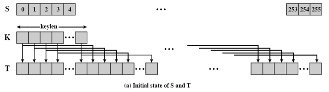
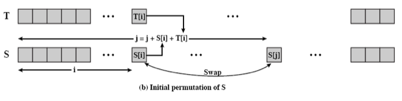
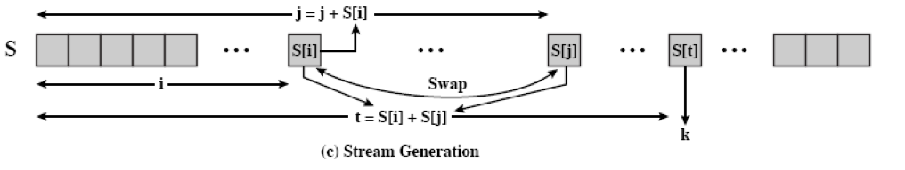

[EN](./rc4.md) | [ZH](./rc4-zh.md)
# RC4

## 基本介绍

RSA 由 Ron Rivest 设计，最初隶属于 RSA 安全公司，是一个专利密码产品。它是面向字节的流密码，密钥长度可变，非常简单，但也很有效果。RC4 算法广泛应用于 SSL/TLS 协议和 WEP/WPA 协议。

## 基本流程

RC4 主要包含三个流程

- 初始化 S 和 T 数组。
- 初始化置换 S。
- 生成密钥流。

### 初始化 S 和 T 数组 

初始化 S 和 T 的代码如下

```c
for i = 0 to 255 do
	S[i] = i
	T[i] = K[i mod keylen])
```

 

### 初始化置换 S

```c
j = 0
for i = 0 to 255 do 
	j = (j + S[i] + T[i]) (mod 256) 
	swap (S[i], S[j])
```



### 生成流密钥

```c
i = j = 0 
for each message byte b
	i = (i + 1) (mod 256)
	j = (j + S[i]) (mod 256)
	swap(S[i], S[j])
	t = (S[i] + S[j]) (mod 256) 
	print S[t]
```



我们一般称前两部分为 KSA ，最后一部分是 PRGA。

## 攻击方法

待补充。

