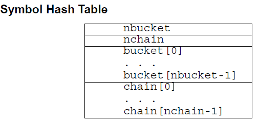
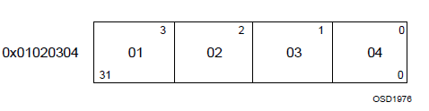

# ELF 文件

> 本部分内容来源于 ELF 1.2 标准，内容经过一定的修改与整理，主要参考文献如下
>
> 1. ELF 文件格式分析，北京大学，滕启明
> 2. ELF-摧毁圣诞

## 简介

ELF （Executable and Linkable Format）文件，也就是在 Linux 中的目标文件，主要有以下三种类型

- 可重定位文件（Relocatable File），包含由编译器生成的代码以及数据。链接器会将它与其它目标文件链接起来从而创建可执行文件或者共享目标文件。在 Linux 系统中，这种文件的后缀一般为 `.o` 。
- 可执行文件（Executable File），就是我们通常在 Linux 中执行的程序。


- 共享目标文件（Shared Object File），包含代码和数据，这种文件是我们所称的库文件，一般以 `.so` 结尾。一般情况下，它有以下两种使用情景：
	- 链接器（Link eDitor, ld）可能会处理它和其它可重定位文件以及共享目标文件，生成另外一个目标文件。
	- 动态链接器（Dynamic Linker）将它与可执行文件以及其它共享目标组合在一起生成进程镜像。

> 关于Link eDitor的命名，https://en.wikipedia.org/wiki/GNU_linker

目标文件由汇编器和链接器创建，是文本程序的二进制形式，可以直接在处理器上运行。那些需要虚拟机才能够执行的程序(Java)不属于这一范围。

这里我们主要关注于 ELF 的文件格式。

### 文件格式

目标文件既会参与程序链接又会参与程序执行。出于方便性和效率考虑，根据过程的不同，目标文件格式提供了其内容的两种并行视图，如下


首先，我们来**关注一下链接视图**。

文件开始处是 ELF 头部（ **ELF  Header**），它给出了整个文件的组织情况。

如果程序头部表（Program Header Table）存在的话，它会告诉系统如何创建进程。用于生成进程的目标文件必须具有程序头部表，但是重定位文件不需要这个表。

节区部分包含在链接视图中要使用的大部分信息：指令、数据、符号表、重定位信息等等。

节区头部表（Section Header Table）包含了描述文件节区的信息，每个节区在表中都有一个表项，会给出节区名称、节区大小等信息。用于链接的目标文件必须有节区头部表，其它目标文件则无所谓，可以有，也可以没有。

这里给出一个关于链接视图比较形象的展示


对于**执行视图**来说，其主要的不同点在于没有了section，而有了多个segment。其实这里的 segment 大都是来源于链接视图中的 section。

注意:

> 尽管图中是按照 ELF 头，程序头部表，节区，节区头部表的顺序排列的。但实际上除了 ELF  头部表以外，其它部分都没有严格的的顺序。

### 数据形式

ELF 文件格式支持 8 位/32 位体系结构。当然，这种格式是可以扩展的，也可以支持更小的或者更大位数的处理器架构。因此，目标文件会包含一些控制数据，这部分数据表明了目标文件所使用的架构，这也使得它可以被通用的方式来识别和解释。目标文件中的其它数据采用目的处理器的格式进行编码，与在何种机器上创建没有关系。这里其实想表明的意思目标文件可以进行交叉编译，我们可以在 x86 平台生成 arm 平台的可执行代码。

目标文件中的所有数据结构都遵从“自然”大小和对齐规则。如下

| 名称            |  长度  | 对齐方式 |   用途    |
| :------------ | :--: | :--: | :-----: |
| Elf32_Addr    |  4   |  4   | 无符号程序地址 |
| Elf32_Half    |  2   |  2   | 无符号半整型  |
| Elf32_Off     |  4   |  4   | 无符号文件偏移 |
| Elf32_Sword   |  4   |  4   | 有符号大整型  |
| Elf32_Word    |  4   |  4   | 无符号大整型  |
| unsigned char |  1   |  1   | 无符号小整型  |

如果必要，数据结构可以包含显式地补齐来确保 4 字节对象按 4 字节对齐，强制数据结构的大小是 4 的整数倍等等。数据同样适用是对齐的。因此，包含一个 Elf32_Addr 类型成员的结构体会在文件中的 4 字节边界处对齐。

为了具有可移植性，ELF 文件不使用位域。

### 字符表示

待。

**注：在下面的介绍中，我们以 32 位为主进行介绍。**

## ELF Header

ELF Header 描述了 ELF 文件的概要信息，利用这个数据结构可以索引到 ELF 文件的全部信息，数据结构如下：

```c
#define EI_NIDENT	16

typedef struct {
	unsigned char	e_ident[EI_NIDENT];
	ELF32_Half		e_type;
	ELF32_Half		e_machine;
	ELF32_Word		e_version;
	ELF32_Addr		e_entry;
	ELF32_Off		e_phoff;
	ELF32_Off		e_shoff;
	ELF32_Word		e_flags;
	ELF32_Half		e_ehsize;
	ELF32_Half		e_phentsize;
	ELF32_Half		e_phnum;
	ELF32_Half		e_shentsize;
	ELF32_Half		e_shnum;
	ELF32_Half		e_shstrndx;
} Elf32_Ehdr;
```

其中每个成员都是 e 开头的，它们应该都是 ELF 的缩写。每个成员具体的说明如下。

### e_ident

正如之前所说，ELF 提供了一个目标文件框架，以便于支持多种处理器，多种编码格式的机器。该变量给出了用于解码和解释文件中与机器无关的数据的方式。这个数组对于不同的下标的含义如下

| 宏名称     | 下标 | 目的           |
| ---------- | ---- | -------------- |
| EI_MAG0    | 0    | 文件标识       |
| EI_MAG1    | 1    | 文件标识       |
| EI_MAG2    | 2    | 文件标识       |
| EI_MAG3    | 3    | 文件标识       |
| EI_CLASS   | 4    | 文件类         |
| EI_DATA    | 5    | 数据编码       |
| EI_VERSION | 6    | 文件版本       |
| EI_PAD     | 7    | 补齐字节开始处 |

其中，

`e_ident[EI_MAG0]`  到 `e_ident[EI_MAG3]`，即文件的头4个字节，被称作“魔数”，标识该文件是一个ELF目标文件。**至于开头为什么是0x7f，并没有仔细去查过**。

| 名称      | 值    | 位置               |
| ------- | ---- | ---------------- |
| ELFMAG0 | 0x7f | e_ident[EI_MAG0] |
| ELFMAG1 | ‘E’  | e_ident[EI_MAG1] |
| ELFMAG2 | ‘L’  | e_ident[EI_MAG2] |
| ELFMAG3 | ‘F’  | e_ident[EI_MAG3] |

`e_ident[EI_CLASS]` 为 `e_ident[EI_MAG3]`的下一个字节，标识文件的类型或容量。

| 名称           | 值    | 意义    |
| ------------ | ---- | ----- |
| ELFCLASSNONE | 0    | 无效类型  |
| ELFCLASS32   | 1    | 32位文件 |
| ELFCLASS64   | 2    | 64位文件 |

ELF 文件的设计使得它可以在多种字节长度的机器之间移植，而不需要强制规定机器的最长字节长度和最短字节长度。`ELFCLASS32`类型支持文件大小和虚拟地址空间上限为 4GB 的机器；它使用上述定义中的基本类型。

`ELFCLASS64` 类型用于 64 位架构。

`e_ident[EI_DATA]`字节给出了目标文件中的特定处理器数据的编码方式。下面是目前已定义的编码：

| 名称          | 值    | 意义     |
| ----------- | ---- | ------ |
| ELFDATANONE | 0    | 无效数据编码 |
| ELFDATA2LSB | 1    | 小端     |
| ELFDATA2MSB | 2    | 大端     |

其它值被保留，在未来必要时将被赋予新的编码。

文件数据编码方式表明了文件内容的解析方式。正如之前所述，`ELFCLASS32`类型文件使用了具有1，2 和 4 字节的变量类型。对于已定义的不同的编码方式，其表示如下所示，其中字节号在左上角。

`ELFDATA2LSB`编码使用补码，最低有效位（Least Significant Byte）占用最低地址。


`ELFDATA2MSB`编码使用补码，最高有效位（Most Significant Byte）占用最低地址。


`e_ident[EI_DATA]` 给出了 ELF 头的版本号。目前这个值必须是`EV_CURRENT`，即之前已经给出的`e_version`。

`e_ident[EI_PAD]` 给出了 `e_ident` 中未使用字节的开始地址。这些字节被保留并置为0；处理目标文件的程序应该忽略它们。如果之后这些字节被使用，EI_PAD的值就会改变。

### e_type

`e_type` 标识目标文件类型。

| 名称      | 值     | 意义           |
| --------- | ------ | -------------- |
| ET_NONE   | 0      | 无文件类型     |
| ET_REL    | 1      | 可重定位文件   |
| ET_EXEC   | 2      | 可执行文件     |
| ET_DYN    | 3      | 共享目标文件   |
| ET_CORE   | 4      | 核心转储文件   |
| ET_LOPROC | 0xff00 | 处理器指定下限 |
| ET_HIPROC | 0xffff | 处理器指定上限 |

虽然核心转储文件的内容没有被详细说明，但 `ET_CORE` 还是被保留用于标志此类文件。从 `ET_LOPROC` 到 `ET_HIPROC` (包括边界)被保留用于处理器指定的场景。其它值在未来必要时可被赋予新的目标文件类型。

### e_machine

这一项指定了当前文件可以运行的机器架构。

| 名称       | 值    | 意义             |
| -------- | ---- | -------------- |
| EM_NONE  | 0    | 无机器类型          |
| EM_M32   | 1    | AT&T WE 32100  |
| EM_SPARC | 2    | SPARC          |
| EM_386   | 3    | Intel 80386    |
| EM_68K   | 4    | Motorola 68000 |
| EM_88K   | 5    | Motorola 88000 |
| EM_860   | 7    | Intel 80860    |
| EM_MIPS  | 8    | MIPS RS3000    |

其中 EM 应该是 `ELF Machine` 的简写。

其它值被在未来必要时用于新的机器。 此外，特定处理器的ELF名称使用机器名称来进行区分，一般标志会有个前缀`EF_` （ELF Flag）。例如，在`EM_XYZ`机器上名叫 `WIDGET` 的标志将被称为 `EF_XYZ_WIDGET`。

### e_version

标识目标文件的版本。

| 名称         | 值    | 意义   |
| ---------- | ---- | ---- |
| EV_NONE    | 0    | 无效版本 |
| EV_CURRENT | 1    | 当前版本 |

1 表示初始文件格式；未来扩展新的版本的时候(extensions)将使用更大的数字。虽然在上面值`EV_CURRENT`为1，但是为了反映当前版本号，它可能会改变，**比如ELF到现在也就是1.2版本。**

### e_entry

这一项为系统转交控制权给 ELF 中相应代码的虚拟地址。如果没有相关的入口项，则这一项为0。

### e_phoff

这一项给出**程序头部表**在文件中的字节偏移（**Program Header table OFFset**）。如果文件中没有程序头部表，则为0。

### e_shoff

这一项给出**节头表**在文件中的字节偏移（ **Section Header table OFFset** ）。如果文件中没有节头表，则为0。

### e_flags

这一项给出文件中与特定处理器相关的标志，这些标志命名格式为`EF_machine_flag`。

### e_ehsize

这一项给出 ELF 文件头部的字节长度（ELF Header Size）。

### e_phentsize

这一项给出程序头部表中每个表项的字节长度（**Program Header ENTry SIZE**）。每个表项的大小相同。

### e_phnum

这一项给出程序头部表的项数（ **Program Header entry NUMber** ）。因此，`e_phnum` 与 `e_phentsize` 的乘积即为程序头部表的字节长度。如果文件中没有程序头部表，则该项值为0。

### e_shentsize

这一项给出节头的字节长度（**Section Header ENTry SIZE**）。一个节头是节头表中的一项；节头表中所有项占据的空间大小相同。

### e_shnum

这一项给出节头表中的项数（**Section Header NUMber**）。因此， `e_shnum` 与 `e_shentsize` 的乘积即为节头表的字节长度。如果文件中没有节头表，则该项值为0。

### e_shstrndx

这一项给出节头表中与节名字符串表相关的表项的索引值（**Section Header table InDeX related with section  name STRing table**）。如果文件中没有节名字符串表，则该项值为`SHN_UNDEF`。关于细节的介绍，请参考后面的“节”和“字符串表”部分。


## Program Header Table

### 概述

Program Header Table 是一个结构体数组，每一个元素的类型是 `Elf32_Phdr`，描述了一个段或者其它系统在准备程序执行时所需要的信息。其中，ELF 头中的 `e_phentsize` 和 `e_phnum` 指定了该数组每个元素的大小以及元素个数。一个目标文件的段包含一个或者多个节。**程序的头部只有对于可执行文件和共享目标文件有意义。**

可以说，Program Header Table 就是专门为 ELF 文件运行时中的段所准备的。

`Elf32_Phdr` 的数据结构如下

```c++
typedef struct {
	ELF32_Word	p_type;
	ELF32_Off	p_offset;
	ELF32_Addr	p_vaddr;
	ELF32_Addr	p_paddr;
	ELF32_Word	p_filesz;
	ELF32_Word	p_memsz;
	ELF32_Word	p_flags;
	ELF32_Word	p_align;
} Elf32_Phdr;
```

每个字段的说明如下

| 字段     | 说明                                                         |
| -------- | ------------------------------------------------------------ |
| p_type   | 该字段为段的类型，或者表明了该结构的相关信息。               |
| p_offset | 该字段给出了从文件开始到该段开头的第一个字节的偏移。         |
| p_vaddr  | 该字段给出了该段第一个字节在内存中的虚拟地址。               |
| p_paddr  | 该字段仅用于物理地址寻址相关的系统中， 由于”System V”忽略了应用程序的物理寻址，可执行文件和共享目标文件的该项内容并未被限定。 |
| p_filesz | 该字段给出了文件镜像中该段的大小，可能为0。                  |
| p_memsz  | 该字段给出了内存镜像中该段的大小，可能为0。                  |
| p_flags  | 该字段给出了与段相关的标记。                                 |
| p_align  | 可加载的程序的段的 p_vaddr 以及 p_offset 的大小必须是 page 的整数倍。该成员给出了段在文件以及内存中的对齐方式。如果该值为 0 或 1 的话，表示不需要对齐。除此之外，p_align 应该是 2 的整数指数次方，并且 p_vaddr 与 p_offset 在模 p_align 的意义下，应该相等。 |

### 段类型

可执行文件中的段类型如下

| 名字                | 取值                    | 说明                                                         |
| ------------------- | ----------------------- | ------------------------------------------------------------ |
| PT_NULL             | 0                       | 表明段未使用，其结构中其他成员都是未定义的。                 |
| PT_LOAD             | 1                       | 此类型段为一个可加载的段，大小由 p_filesz 和 p_memsz  描述。文件中的字节被映射到相应内存段开始处。如果 p_memsz  大于  p_filesz，“剩余”的字节都要被置为0。p_filesz 不能大于 p_memsz。可加载的段在程序头部中按照 p_vaddr 的升序排列。 |
| PT_DYNAMIC          | 2                       | 此类型段给出动态链接信息。                                   |
| PT_INTERP           | 3                       | 此类型段给出了一个以 NULL  结尾的字符串的位置和长度，该字符串将被当作解释器调用。这种段类型仅对可执行文件有意义（也可能出现在共享目标文件中）。此外，这种段在一个文件中最多出现一次。而且这种类型的段存在的话，它必须在所有可加载段项的前面。 |
| PT_NOTE             | 4                       | 此类型段给出附加信息的位置和大小。                           |
| PT_SHLIB            | 5                       | 该段类型被保留，不过语义未指定。而且，包含这种类型的段的程序不符合ABI标准。 |
| PT_PHDR             | 6                       | 该段类型的数组元素如果存在的话，则给出了程序头部表自身的大小和位置，既包括在文件中也包括在内存中的信息。此类型的段在文件中最多出现一次。**此外，只有程序头部表是程序的内存映像的一部分时，它才会出现**。如果此类型段存在，则必须在所有可加载段项目的前面。 |
| PT_LOPROC~PT_HIPROC | 0x70000000  ~0x7fffffff | 此范围的类型保留给处理器专用语义。                           |

### 基地址-Base Address

程序头部的虚拟地址可能并不是程序内存镜像中实际的虚拟地址。通常来说，可执行程序都会包含绝对地址的代码。为了使得程序可以正常执行，段必须在相应的虚拟地址处。另一方面，共享目标文件通常来说包含与地址无关的代码。这可以使得共享目标文件可以被多个进程加载，同时保持程序执行的正确性。尽管系统会为不同的进程选择不同的虚拟地址，但是它仍然保留段的相对地址，**因为地址无关代码使用段之间的相对地址来进行寻址，内存中的虚拟地址之间的差必须与文件中的虚拟地址之间的差相匹配**。内存中任何段的虚拟地址与文件中对应的虚拟地址之间的差值对于任何一个可执行文件或共享对象来说是一个单一常量值。这个差值就是基地址，基地址的一个用途就是在动态链接期间重新定位程序。

可执行文件或者共享目标文件的基地址是在执行过程中由以下三个数值计算的

- 虚拟内存加载地址
- 最大页面大小
- 程序可加载段的最低虚拟地址

要计算基地址，首先要确定可加载段中 p_vaddr 最小的内存虚拟地址，之后把该内存虚拟地址缩小为与之最近的最大页面的整数倍即是基地址。根据要加载到内存中的文件的类型，内存地址可能与 p_vaddr 相同也可能不同。

### 段权限-p_flags

被系统加载到内存中的程序至少有一个可加载的段。当系统为可加载的段创建内存镜像时，它会按照 p_flags 将段设置为对应的权限。可能的段权限位有


其中，所有在 PF_MASKPROC 中的比特位都是被保留用于与处理器相关的语义信息。

如果一个权限位被设置为 0，这种类型的段是不可访问的。实际的内存权限取决于相应的内存管理单元，不同的系统可能操作方式不一样。尽管所有的权限组合都是可以的，但是系统一般会授予比请求更多的权限。在任何情况下，除非明确说明，一个段不会有写权限。下面给出了所有的可能组合。


例如，一般来说，.text 段一般具有读和执行权限，但是不会有写权限。数据段一般具有写，读，以及执行权限。

### 段内容

一个段可能包括一到多个节区，但是这并不会影响程序的加载。尽管如此，我们也必须需要各种各样的数据来使得程序可以执行以及动态链接等等。下面会给出一般情况下的段的内容。对于不同的段来说，它的节的顺序以及所包含的节的个数有所不同。此外，与处理相关的约束可能会改变对应的段的结构。

如下所示，代码段只包含只读的指令以及数据。当然这个例子并没有给出所有的可能的段。


数据段包含可写的数据以及以及指令，通常来说，包含以下内容


程序头部的 PT_DYNAMIC 类型的元素指向指向 .dynamic 节。其中，got 表和 plt 表包含与地址无关的代码相关信息。尽管在这里给出的例子中，plt 节出现在代码段，但是对于不同的处理器来说，可能会有所变动。

.bss 节的类型为 SHT_NOBITS，这表明它在 ELF 文件中不占用空间，但是它却占用可执行文件的内存镜像的空间。通常情况下，没有被初始化的数据在段的尾部，因此，`p_memsz` 才会比 `p_filesz` 大。

注意：

-   不同的段来说可能会有所重合，即不同的段包含相同的节。

## Section Header Table

其实这个数据结构是在 ELF 文件的尾部（ **为什么要放在文件尾部呢？？** ），但是为了讲解方便，这里将这个表放在这里进行讲解。

该结构用于定位 ELF 文件中的每个节区的具体位置。

首先，ELF头中的 `e_shoff` 项给出了从文件开头到节头表位置的字节偏移。`e_shnum` 告诉了我们节头表包含的项数；`e_shentsize` 给出了每一项的字节大小。

其次，节头表是一个数组，每个数组的元素的类型是 `ELF32_Shdr` ，每一个元素都描述了一个节区的概要内容。

### ELF32_Shdr

每个节区头部可以用下面的数据结构进行描述：

```c
typedef struct {
	ELF32_Word		sh_name;
	ELF32_Word		sh_type;
	ELF32_Word		sh_flags;
	ELF32_Addr		sh_addr;
	ELF32_Off		sh_offset;
	ELF32_Word		sh_size;
	ELF32_Word		sh_link;
	ELF32_Word		sh_info;
	ELF32_Word		sh_addralign;
	ELF32_Word		sh_entsize;
} Elf32_Shdr;
```

每个字段的含义如下

| 成员         | 说明                                                         |
| :----------- | ------------------------------------------------------------ |
| sh_name      | 节名称，是节区头字符串表节区中（Section Header String Table Section）的索引，因此该字段实际是一个数值。在字符串表中的具体内容是以 NULL 结尾的字符串。 |
| sh_type      | 根据节的内容和语义进行分类，具体的类型下面会介绍。           |
| sh_flags     | 每一比特代表不同的标志，描述节是否可写，可执行，需要分配内存等属性。 |
| sh_addr      | 如果节区将出现在进程的内存映像中，此成员给出节区的第一个字节应该在进程镜像中的位置。否则，此字段为 0。 |
| sh_offset    | 给出节区的第一个字节与文件开始处之间的偏移。SHT_NOBITS 类型的节区不占用文件的空间，因此其 sh_offset 成员给出的是概念性的偏移。 |
| sh_size      | 此成员给出节区的字节大小。除非节区的类型是 SHT_NOBITS ，否则该节占用文件中的 sh_size  字节。类型为SHT_NOBITS 的节区长度可能非零，不过却不占用文件中的空间。 |
| sh_link      | 此成员给出节区头部表索引链接，其具体的解释依赖于节区类型。   |
| sh_info      | 此成员给出附加信息，其解释依赖于节区类型。                   |
| sh_addralign | 某些节区的地址需要对齐。例如，如果一个节区有一个 doubleword 类型的变量，那么系统必须保证整个节区按双字对齐。也就是说，$sh\_addr \% sh\_addralign$=0。目前它仅允许为 0，以及 2 的正整数幂数。 0 和 1 表示没有对齐约束。 |
| sh_entsize   | 某些节区中存在具有固定大小的表项的表，如符号表。对于这类节区，该成员给出每个表项的字节大小。反之，此成员取值为0。 |

 正如之前所说，索引为零（SHN_UNDEF）的节区头也存在，此索引标记的是未定义的节区引用。这一项的信息如下

| 字段名称         | 取值        | 说明    |
| ------------ | --------- | ----- |
| sh_name      | 0         | 无名称   |
| sh_type      | SHT_NULL  | 限制    |
| sh_flags     | 0         | 无标志   |
| sh_addr      | 0         | 无地址   |
| sh_offset    | 0         | 无文件偏移 |
| sh_size      | 0         | 无大小   |
| sh_link      | SHN_UNDEF | 无链接信息 |
| sh_info      | 0         | 无辅助信息 |
| sh_addralign | 0         | 无对齐要求 |
| sh_entsize   | 0         | 无表项   |

### 特殊下标

节头表中比较特殊的几个下标如下

| 名称            | 值      | 含义                                       |
| ------------- | ------ | ---------------------------------------- |
| SHN_UNDEF     | 0      | 标志未定义的，丢失的，不相关的或者其它没有意义的节引用。例如，与节号SHN_UNDEF相关的“定义"的符号就是一个未定义符号。**注：虽然0号索引被保留用于未定义值，节头表仍然包含索引0的项。也就是说，如果ELF头的e_shnum为6，那么索引应该为0~5。更加详细的内容在后面会说明。** |
| SHN_LORESERVE | 0xff00 | 保留索引值范围的下界。                              |
| SHN_LOPROC    | 0xff00 | 处理器相关的下界                                 |
| SHN_HIPROC    | 0xff1f | 处理器相关的上界                                 |
| SHN_ABS       | 0xfff1 | 相关引用的绝对值。例如与节号SHN_ABS相关的符号拥有绝对值，它们不受重定位的影响 |
| SHN_COMMON    | 0xfff2 | 这一节区相定义的符号是通用符号，例如FORTRAN COMMON，C语言中未分配的外部变量。 |
| SHN_HIRESERVE | 0xffff | 保留索引值范围的上界。                              |

**系统保留在`SHN_LORESERVE`到`SHN_HIRESERVE`之间(包含边界)的索引值，这些值不在节头表中引用。也就是说，节头表不包含保留索引项。没特别理解。**

### 部分节头字段

#### sh_type

节类型目前有下列可选范围，其中 SHT 是**Section Header Table** 的简写。

| 名称           | 取值         | 说明                                       |
| ------------ | ---------- | ---------------------------------------- |
| SHT_NULL     | 0          | 该类型节区是非活动的，这种类型的节头中的其它成员取值无意义。           |
| SHT_PROGBITS | 1          | 该类型节区包含程序定义的信息，它的格式和含义都由程序来决定。           |
| SHT_SYMTAB   | 2          | 该类型节区包含一个符号表（**SYMbol TABle**）。目前目标文件对每种类型的节区都只  能包含一个，不过这个限制将来可能发生变化。  一般，SHT_SYMTAB 节区提供用于链接编辑（指 ld  而言） 的符号，尽管也可用来实现动态链接。 |
| SHT_STRTAB   | 3          | 该类型节区包含字符串表（ **STRing TABle** ）。         |
| SHT_RELA     | 4          | 该类型节区包含显式指定位数的重定位项（ **RELocation entry with Addends** ），例如，32 位目标文件中的 Elf32_Rela 类型。此外，目标文件可能拥有多个重定位节区。 |
| SHT_HASH     | 5          | 该类型节区包含符号哈希表（ **HASH table** ）。          |
| SHT_DYNAMIC  | 6          | 该类型节区包含动态链接的信息（ **DYNAMIC linking** ）。   |
| SHT_NOTE     | 7          | 该类型节区包含以某种方式标记文件的信息（**NOTE**）。           |
| SHT_NOBITS   | 8          | 该类型节区不占用文件的空间，其它方面和SHT_PROGBITS相似。尽管该类型节区不包含任何字节，其对应的节头成员sh_offset 中还是会包含概念性的文件偏移。 |
| SHT_REL      | 9          | 该类型节区包含重定位表项（**RELocation entry without Addends**），不过并没有指定位数。例如，32位目标文件中的 Elf32_rel 类型。目标文件中可以拥有多个重定位节区。 |
| SHT_SHLIB    | 10         | 该类型此节区被保留，不过其语义尚未被定义。                    |
| SHT_DYNSYM   | 11         | 作为一个完整的符号表，它可能包含很多对动态链接而言不必  要的符号。因此，目标文件也可以包含一个 SHT_DYNSYM  节区，其中保存动态链接符号的一个最小集合，以节省空间。 |
| SHT_LOPROC   | 0X70000000 | 此值指定保留给处理器专用语义的下界（ **LOw PROCessor-specific semantics** ）。 |
| SHT_HIPROC   | OX7FFFFFFF | 此值指定保留给处理器专用语义的上界（ **HIgh PROCessor-specific semantics** ）。 |
| SHT_LOUSER   | 0X80000000 | 此值指定保留给应用程序的索引下界。                        |
| SHT_HIUSER   | 0X8FFFFFFF | 此值指定保留给应用程序的索引上界。                        |

#### sh_flags

节头中 `sh_flags`  字段的每一个比特位都可以给出其相应的标记信息，其定义了对应的节区的内容是否可以被修改、被执行等信息。如果一个标志位被设置，则该位取值为1，未定义的位都为0。目前已定义值如下，其他值保留。

| 名称            | 值          | 说明                                       |
| ------------- | ---------- | ---------------------------------------- |
| SHF_WRITE     | 0x1        | 这种节包含了进程运行过程中可以被写的数据。                    |
| SHF_ALLOC     | 0x2        | 这种节在进程运行时占用内存。对于不占用目标文件的内存镜像空间的某些控制节，该属性处于关闭状态(off)。 |
| SHF_EXECINSTR | 0x4        | 这种节包含可执行的机器指令（**EXECutable INSTRuction**）。 |
| SHF_MASKPROC  | 0xf0000000 | 所有在这个掩码中的比特位用于特定处理器语义。                   |

#### sh_link & sh_info

当节区类型的不同的时候，sh_link 和 sh_info 也会具有不同的含义。

| sh_type               | sh_link                                                      | sh_info                    |
| --------------------- | ------------------------------------------------------------ | -------------------------- |
| SHT_DYNAMIC           | 节区中使用的字符串表的节头索引                               | 0                          |
| SHT_HASH              | 此哈希表所使用的符号表的节头索引                             | 0                          |
| SHT_REL/SHT_RELA      | 与符号表相关的的节头索引                                     | 重定位应用到的节的节头索引 |
| SHT_SYMTAB/SHT_DYNSYM | 操作系统特定信息，Linux 中的 ELF 文件中该项指向符号表中符号所对应的字符串节区在 Section Header Table 中的偏移。 | 操作系统特定信息           |
| other                 | `SHN_UNDEF`                                                  | 0                          |

## Sections

节区包含目标文件中除了 ELF 头部、程序头部表、节区头部表的所有信息。节区满足以下条件

- 每个节区都有对应的节头来描述它。但是反过来，节区头部并不一定会对应着一个节区。
- 每个节区在目标文件中是连续的，但是大小可能为 0。
- 任意两个节区不能重叠，即一个字节不能同时存在于两个节区中。
- 目标文件中可能会有闲置空间（inactive space），各种头和节不一定会覆盖到目标文件中的所有字节，**闲置区域的内容未指定**。

许多在 ELF 文件中的节都是预定义的，它们包含程序和控制信息。这些节被操作系统使用，但是对于不同的操作系统，同一节区可能会有不同的类型以及属性。

可执行文件是由链接器将一些单独的目标文件以及库文件链接起来而得到的。其中，链接器会解析引用（不同文件中的子例程的引用以及数据的引用，调整对象文件中的绝对引用）并且重定位指令。加载与链接过程需要目标文件中的信息，并且会将处理后的信息存储在一些特定的节区中，比如 `.dynamic` 。

每一种操作系统都会支持一组链接模型，但这些模型都大致可以分为两种

| 类型     | 描述                                                         |
| -------- | ------------------------------------------------------------ |
| 静态链接 | 静态链接的文件中所使用的库文件或者第三方库都被静态绑定了，其引用已经被解析了。 |
| 动态链接 | 动态链接的文件中所使用的库文件或者第三方库只是单纯地被链接到可执行文件中。当可执行文件执行时使用到相应函数时，相应的函数地址才会被解析。 |

有一些特殊的节可以支持调试，比如说 .debug 以及 .line 节；支持程序控制的节有 .bss，.data， .data1， .rodata， .rodata1。

| 名称      | 类型         | 属性                 | 含义                                                         |
| :-------- | :----------- | :------------------- | :----------------------------------------------------------- |
| .comment  | SHT_PROGBITS |                      | 包含版本控制信息。                                           |
| .debug    | SHT_PROGBITS |                      | 此节区包含用于符号调试的信息。                               |
| .dynamic  | SHT_DYNAMIC  | SHF_ALLOC  SHF_WRITE | 此节区包含动态链接信息。SHF_WRITE 位设置与否是否被设置取决于具体的处理器。 |
| .dynstr   | SHT_STRTAB   | SHF_ALLOC            | 此节区包含用于动态链接的字符串，大多数 情况下这些字符串代表了与符号表项相关的名称。 |
| .dynsym   | SHT_DYNSYM   | SHF_ALLOC            | 此节区包含动态链接符号表。                                   |
| .got      | SHT_PROGBITS |                      | 此节区包含全局偏移表。                                       |
| .line     | SHT_PROGBITS |                      | 此节区包含符号调试的行号信息，描述了源程序与机器指令之间的对应关系，其内容是未定义的。 |
| .plt      | SHT_PROGBITS |                      | 此节区包含过程链接表（procedure  linkage  table）。          |
| .relname  | SHT_REL      |                      | 这些节区中包含重定位信息。如果文件中包含可加载的段，段中有重定位内容，节区的属性将包含SHF_ALLOC位，否则该位置 0。传统上 name 根据重定位所适用的节区给定。例如 .text 节区的重定位节区名字将是：.rel.text 或者 .rela.text。 |
| .relaname | SHT_RELA     |                      |                                                              |
| .shstrtab | SHT_STRTAB   |                      | 此节区包含节区名称。                                         |

注意：

- 以 “.” 开头的节区名称是系统保留的，当然应用程序也可以使用这些节区。为了避免与系统节区冲突，应用程序应该尽量使用没有前缀的节区名称。
- 目标文件格式允许定义不在上述列表中的节区，可以包含多个名字相同的节区。
- 保留给处理器体系结构的节区名称一般命名规则为：处理器体系结构名称简写+ 节区名称。其中，处理器名称应该与 e_machine 中使用的名称相同。例如 .FOO.psect 节区是 FOO 体系结构中的 psect 节区。

这里我们主要以链接视图中的分类即段类型进行介绍，同时也会加上自己的一些简单分类。

### Note related sections

有时候生产厂商或者系统构建者可能需要使用一些特殊的信息来标记ELF文件，从而其它程序可以来检查该ELF文件的一致性以及兼容性。节区类型为 SHT_NOTE 或者程序头部类型为 PT_NOTE 的元素用于来实现这个目的，它们中对象的表项可能包含一到多个，每一个表项都是目标处理器格式的 4 字节数组。下面给出了一些可能的注释信息。但是这并不在 ELF 文件的规范内。


-   namesz与name
    -   name的前namesz字节包含了一个以NULL结尾的字符串，这表示该项的拥有者或者发起人。但是目前并没有避免冲突的格式化的命名机制。一般来说，生产厂商会使用他们自己公司的名字，例如“XYZ Computer Company”来当做对应的标志。如果没有任何名字的话，namesz应该是0。那么在name的地方应该填充到4字节对齐。
-   descsz与desc
    -   desc的前descsz字节包含了注释的描述。ELF文件对于描述的内容没有任何约束。如果没有任何描述的话，descsz应该为0。当然，应该在desc处填充到4字节对齐。
-   type
    -   这个字段给出了描述的解释，对于不同那个的发起者来说，他们都必须控制自己的类型，对于同一类型来说，有可能有多个描述与其对应。因此，发起者必须能够识别名字以及类型以便于来理解对应的描述。目前来说，类型不能够为非负值，ELF文件的规范里并不定义描述符的意思。这也是为什么type在前面。

下面给出一个简单的例子来说明一下


这里包含了两个表项。

在 Linux 中，与 Note 相关的节包含了 ELF 文件中的一些注释信息，主要包含两个节

-   .note.ABI-tag
-   .note.gnu.build-id

#### 例子

### version releated sections

ELF 文件不仅可以导入外部的符号，而且还可以导入指定版本的符号。例如，当我们可以从 GLIBC_2.2.5 中导入其中的一些标准库函数，比如 printf。其中，.gnu.version_r 保存了版本的定义，对应的结构体是 Elf_Verdef。

如下

-   .gnu.version，Versions of symbols.
-   .gnu.version_d，Version definitions of symbols.
-   .gnu.version_r，Version references (version needs) of symbols.


#### 例子


### .strtab: String Table

该节区描述默认的字符串表，包含了一系列的以 NULL 结尾的字符串。ELF 文件使用这些字符串来存储程序中的符号名，包括

-   变量名
-   函数名

该节在运行的过程中不需要加载，只需要加载对应的子集 .dynstr 节。

一般通过对字符串的首个字母在字符串表中的下标来索引字符串。

字符串表的首尾字节都是NULL。此外，索引为0的字符串要么没有名字，要么就是名字为空，其解释依赖于上下文。字符串表也可以为空，相应的，其节区头部的 sh_size 成员将为0。在空字符串表中索引大于 0 的下标显然是非法的。

一个节区头部的 sh_name 成员的值为其相应的节区头部字符串表节区的索引，此节区由 ELF 头的 e_shstrndx 成员给出。下图给出了一个包含 25 个字节的字符串表，以及与不同索引相关的字符串。

| 索引 | +0   | +1   | +2   | +3   | +4   | +5   | +6   | +7   | +8   | +9   |
| ---- | ---- | ---- | ---- | ---- | ---- | ---- | ---- | ---- | ---- | ---- |
| 0    | \0   | n    | a    | m    | e    | .    | \0   | V    | a    | r    |
| 10   | i    | a    | b    | l    | e    | \0   | a    | b    | l    | e    |
| 20   | \0   | \0   | x    | x    | \0   |      |      |      |      |      |

其中包含的字符串有

| 索引 | 字符串   |
| ---- | -------- |
| 0    | none     |
| 1    | name.    |
| 7    | Variable |
| 11   | able     |
| 16   | able     |
| 24   | 空字符串 |

可以看出

-   字符串表索引可以引用节区中任意字节。
-   字符串可以出现多次。
-   可以存在对子字符串的引用。
-   同一个字符串可以被引用多次。
-   字符串表中也可以存在未引用的字符串。

这部分信息在进行 `strip` 后就会消失。

### .shstrtab: Section Header String Table

该节区与 `.strtab` 的存储结构类似，不过该节区存储的是节区名的字符串。

### .symtab: Symbol Table

#### 概述

每个目标文件都会有一个符号表，熟悉编译原理的就会知道，在编译程序时，必须有相应的结构来管理程序中的符号以便于对函数和变量进行重定位。

此外，链接本质就是把多个不同的目标文件相互“粘”在一起，实际上，目标文件相互粘合是目标文件之间对地址的引用，即函数和变量的地址的相互引用。而在粘合的过程中，符号就是其中的粘合剂。

目标文件中的符号表包含了**一些通用的符号**，这部分信息在进行了 `strip` 操作后就会消失。包括

-   变量名
-   函数名

符号表其实是一个数组，数组中的每一个元素都是一个结构体，具体如下

```c
typedef struct {
    Elf32_Word      st_name;
    Elf32_Addr      st_value;
    Elf32_Word      st_size;
    unsigned char   st_info;
    unsigned char   st_other;
    Elf32_Half      st_shndx;
} Elf32_Sym;
```

每个字段的含义如下

| 字段     | 说明                                                         |
| -------- | ------------------------------------------------------------ |
| st_name  | 符号在字符串表中对应的索引。如果该值非 0，则它表示了给出符号名的字符串表索引，否则符号表项没有名称。  注：外部  C  符号在 C 语言和目标文件的符号表中具有相同的名称。 |
| st_value | 给出与符号相关联的数值，具体取值依赖于上下文，可能是一个正常的数值、一个地址等等。 |
| st_size  | 给出对应符号所占用的大小。如果符号没有大小或者大小未知，则此成员为0。 |
| st_info  | 给出符号的类型和绑定属性。之后会给出若干取值和含义的绑定关系。 |
| st_other | 目前为0，其含义没有被定义。                                  |
| st_shndx | 如果符号定义在该文件中，那么该成员为符号所在节在节区头部表中的下标；如果符号不在本目标文件中国，或者对于某些特殊的符号，该成员具有一些特殊含义。 |

其中，符号表中下标 0 存储了符号表的一个元素，同时这个元素也相对比较特殊，作为所有未定义符号的索引，具体如下

| 名称     | 取值 | 说明             |
| -------- | ---- | ---------------- |
| st_name  | 0    | 无名称           |
| st_value | 0    | 0 值             |
| st_size  | 0    | 无大小           |
| st_info  | 0    | 无类型，局部绑定 |
| st_other | 0    | 无附加信息       |
| st_shndx | 0    | 无节区           |

#### st_value

在 Linux 的 ELF 文件中，具体说明如下

1.  该符号对应着一个变量，那么表明该变量在内存中的偏移。我们可由这个值获取其文件偏移
    1.  获取该符号对应的 `st_shndx`，进而获取到相关的节区。
    2.  根据节区头元素可以获取节区的虚拟基地址和文件基地址。
    3.  value-内存基虚拟地址=文件偏移-文件基地址
2.  该符号对应着一个函数，那么表明该函数在文件中的起始地址。

#### st_info

st_info 中包含符号类型和绑定信息，这里给出了控制它的值的方式具体信息如下

```
#define ELF32_ST_TYPE(i)    ((i)&0xf)
#define ELF32_ST_INFO(b, t) (((b)<<4) + ((t)&0xf))
```

##### Symbol Type

可以看出 st_info 的低 4 位表示符号的类型，具体定义如下

| 名称                       | 取值  | 说明                                                         |
| -------------------------- | ----- | ------------------------------------------------------------ |
| STT_NOTYPE                 | 0     | 符号的类型没有定义。                                         |
| STT_OBJECT                 | 1     | 符号与某个数据对象相关，比如一个变量、数组等等。             |
| STT_FUNC                   | 2     | 符号与某个函数或者其他可执行代码相关。                       |
| STT_SECTION                | 3     | 符号与某个节区相关。这种类型的符号表项主要用于重定位，通常具有 STB_LOCAL 绑定。 |
| STT_FILE                   | 4     | 一般情况下，符号的名称给出了生成该目标文件相关的源文件的名称。如果存在的话，该符号具有 STB_LOCAL  绑定，其节区索引是 SHN_ABS 且优先级比其他`STB_LOCAL`符号高。 |
| `STT_LOPROC`～`STT_HIPROC` | 13~15 | 保留用于特定处理器                                           |

共享目标文件中的函数符号有比较特殊，当另一个目标文件从共享目标文件中引用一个函数时，链接器自动为被引用符号创建过程链接表项。共享目标中除了`STT_FUNC` ， 其它符号将不会通过过程链接表自动被引用。

如果一个符号的值指向节内的特定位置，则它的节索引号 `st_shndx`，包含了它在节头表中的索引。当一个节在重定位过程中移动时，该符号值也做相应改变，对该符号的引用继续指向程序中的相同位置。有些特定节索引值具有其他语义。

##### Symbol Binding

根据 `#define ELF32_ST_BIND(i)	((i)>>4)` 可以看出 st_info 的高 4 位表示符号绑定的信息。而这部分信息确定了符号的链接可见性以及其行为，具体的取值如下

| 名称                    | 取值 | 说明                                                         |
| ----------------------- | ---- | ------------------------------------------------------------ |
| STB_LOCAL               | 0    | 表明该符号为局部符号，在包含该符号定义的目标文件以外不可见。相同名称的局部符号可以存在于多个文件中，互不影响。 |
| STB_GLOBAL              | 1    | 表明该符号为全局符号，对所有将被组合在一起的目标文件都是可见的。一个文件中对某个全局符号的定义将满足另一个文件对相同全局符号的未定义引用。我们称初始化非零变量的全局符号为强符号，只能定义一次。 |
| STB_WEAK                | 2    | 弱符号与全局符号类似，不过它们的定义优先级比较低。           |
| STB_LOPROC  ~STB_HIPROC | 13   | 这个范围的取值是保留给处理器专用语义的。                     |

在每个符号表中，所有具有 STB_LOCAL 绑定的符号都优先于弱符号和全局符号。符号表节区中的 sh_info 项所对应的头部的成员包含第一个非局部符号的符号表索引。

此外，全局符号与弱符号的主要区别如下：

-   当链接器在链接多个可重定位目标文件时，不允许定义多个相同名字的 `STB_GLOBAL` 符号。另一方面，如果存在一个已定义全局符号，则同名的弱符号的存在不会引起错误。链接器会优先选择全局定义，忽略弱符号定义。类似的，如果一个公共符号存在(`st_shndx`域为`SHN_COMMON`的符号)，则同名的弱符号的存在不会引起错误。链接器会选择公共定义，忽略弱符号定义。
-   当链接器寻找文件库时，它会提取包含未定义全局符号的成员，可能是一个全局符号或者弱符号。链接器不会为了解决未定义的弱符号问题而提取文件，未定义的弱符号的值为0。

#### 符号取值

不同的目标文件类型对符号表项中 st_value 成员的解释不同：

-   在可重定位文件中，st_value 保存了节区索引为 SHN_COMMON 的符号的对齐约束。
-   在可重定位文件中，st_value 保存了已定义符号的节区偏移。也就是说，st_value保留了st_shndx 所标识的节区的头部到符号位置的偏移。
-   在可执行和共享目标文件中，st_value 包含一个虚地址。为了使得这些文件的符号对动态链接器更有用，节区偏移（针对文件的解释）给出了与节区号无关的虚拟地址（针对内存的解释）。

符号表取值在不同的目标文件中具有相似的含义，可以有适当的程序可以采取高效的方法来访问数据。

#### st_shndx

特殊的索引及其意义如下

-   SHN_ABS： 符号的取值具有绝对性，不会因为重定位而发生变化。
-   SHN_COMMON：  符号标记了一个尚未分配的公共块。符号的取值给出了对齐约束，与节区的 sh_addralign 成员类似。就是说，链接编辑器将在地址位于 st_value 的倍数处为符号分配空间。符号的大小给出了所需要的字节数。
-   SHN_UNDEF：  此索引值表示符号没有定义。当链接编辑器将此目标文件与其他定义了该符号的目标文件进行组合时，此文件中对该符号的引用将被链接到实际定义的位置。

#### 如何定位

那么对于一个符号来说如何定位其对应字符串的地址呢？具体步骤如下

1.  根据 Section Header Table 中符号节头中的 `sh_link` 获取该符号节中对应符号字符串节在 `Section Header Table` 中的下标。进而我们就可以获取对应符号节的地址。
2.  根据该符号的定义中的 st_name 获取该符号的偏移，即在对应符号节中的偏移。
3.  根据上述两者就可以定位一个符号对应的字符串的地址了。

### .gnu.hash

注：本部分主要参考https://blogs.oracle.com/ali/gnu-hash-elf-sections。

在 ELF 良好地可扩展性的帮助下， GNU 为 ELF 对象添加了一个新的哈希节，这个节的性能相比于原有的 `SYSV hash` 会好很多。该节用于快速根据符号名获取对应符号表中的索引。

更多内容请参考 https://blogs.oracle.com/ali/entry/gnu_hash_elf_sections。 **有待进一步学习。**


#### ELF 标准

ELF文件中的哈希表由 Elf32_Word 对象构成，用来支持符号表访问。下面的符号可以用来辅助解释符号表的组织情况，但是他们并不是 ELF 文件说明的一部分。



bucket数组包含了nbucket个元素，chain数组包含了nchain个元素，所有的数组的下标都是以0开始。bucket和chain都包含符号表索引。chain数组中的元素是和符号表中的元素一一对应的，因此符号表的元素个数必须和nchain的大小相同，故而符号表的索引同样可以作为chain表的索引。下面展示的哈希函数接受一个符号名作为输入，然后返回一个值，这个值可能被用于计算bucket的索引。因此，如果哈希函数针对于某个名字返回值x，那么`bucket[x%nbucket] ` 给出了一个索引y，可以用来索引符号表，也可以用来索引chain表。如果符号表的对应索引并不是所想要的哪一个，那么chain[y]就会给出给出同一个哈希值的下一个符号表中表项的位置，即可以用来防止出现哈希值一样的情况。因此我们可以跟着chain链一直搜索直到遇到所想要的符号，或者遇到值为`STN_UNDEF` 的chain的表项。


### Data Related Sections

#### BSS Section

未初始化的全局变量对应的节。此节区不占用 ELF 文件空间，但占用程序的内存映像中的空间。当程序开始执行时，系统将把这些数据初始化为 0。bss其实是block started by symbol的简写，说明该节区中单纯地说明了有哪些变量。

#### .data Section

这些节区包含初始化了的数据，会在程序的内存映像中出现。

#### .rodata Section

这些节区包含只读数据，这些数据通常参与进程映像的不可写段。

### Common Code Section

#### 概述

在动态链接器创建了进程镜像，并且执行了重定位后，每一个共享目标文件都有机会去执行一些初始化的代码。所有的共享目标文件会在可执行文件获得权限之前进行初始化。

在调用目标文件 A 的初始化代码之前，会首先调用所有 A 依赖的共享目标文件的初始化代码。比如说，如果目标文件 A 依赖于另外一个目标文件 B，那么 B 就会在 A 的依赖列表中，这会被记录在动态结构的 DT_NEEDED 中。循环依赖的初始化是未被定义的。

目标文件的初始化通过递归每一个被依赖的表项来完成。只有当一个目标文件依赖的所有的目标文件都处理完自己的依赖后，这个目标文件才会执行初始化代码。

下面的例子解释了两种正确的可以用来生成给定例子的顺序。在这个例子中，a.out 依赖于b，d 以及 e。b依赖于d 和 f，并且 d 依赖于 e 和 g。根据这个信息，我们可以画出如下的依赖图。那么我们上面所说的算法，将允许我们按照如下的顺序进行初始化。


类似的，共享目标文件也会有结束的函数，这些函数在进程完成自己的终止序列时通过 atexit 机制来执行。动态链接器调用终止函数的顺序恰好与上面初始化的顺序相反。动态链接器将会确保它只会执行初始化或者终止函数最多一次。

共享目标文件通过动态结构中的 DT_INIT 和 DT_FINI 来指定它们的初始化以及结束函数。在一般情况下，这些函数在.init节与.fini节中。

注意：

>   尽管ateixt终止处理函数通常来说会被执行，但它并不会保证在程序消亡时被执行。更特殊的是，如果程序调用了_exit函数或者进程由于接收到一个信号后消亡了，那么它将不会执行对应的函数。

动态链接器并不负责调用可执行文件的 .init 节或者利用 atexit 注册可执行文件的 .fini 节。由用户通过 atexit 机制指定的终止函数必须在所有共享目标文件的结束函数前执行。

#### .init & .init_array

此节区包含可执行指令，是进程初始化代码的一部分。程序开始执行时，系统会在开始调用主程序入口（通常指 C 语言的 main 函数）前执行这些代码。

#### .text

此节区包含程序的可执行指令。

#### .fini & .fini_array

此节区包含可执行的指令，是进程终止代码的一部分。程序正常退出时，系统将执行这里的代码。


### Dynamic Related Sections

#### .interp section

一般来说，可执行文件具有一个 PT_INTERP 类型的程序头元素，以便于来加载程序中的段。这个节包含了程序对应的解释器。在 exec (BA_OS) 过程中，系统会从该节中提取对应解释器的路径，并根据解释器文件的段创建初始时的程序镜像。也就是说，系统并不使用给定的可执行文件的镜像，而会首先为解释器构造独立的内存镜像。因此，解释器需要从系统处获取控制权，然后为应用程序提供执行环境。

解释器可能有两种方式获取控制权。

1.  它可以接收一个指向文件头的文件描述符，以便于读取可执行文件。它可以使用这个文件描述符来读取并将可执行文件的段映射到内存中。
2.  有时候根据可执行文件格式的不同，系统有可能不会把文件描述符给解释器，而是会直接将可执行文件加载到内存中。虽然文件描述符可能会出现异常，但是解释器的初始状态仍然会与可执行文件的收到的相匹配，解释器本身不需要再有一个解释器。解释器本身可能是一个共享目标文件或者是一个可执行文件。

需要注意以下问题

- 共享目标文件（正常情况下）被加载为地址独立的，也就是说，对于不同的进程来说，它的地址会有所不同。系统通过 mmap (KE_OS) 以及一些相关的操作来创建动态段中的内容。因此，共享目标文件的地址通常来说不会和原来的可执行文件的原有地址冲突。
- 可执行文件一般会被加载到固定的地址。系统通过程序头部表的虚拟地址来创建对应的段。因此，一个可执行文件的解释器的虚拟地址可能和第一个可执行文件冲突。解释器有责任来解决相应的冲突。

#### .dynamic

如果一个目标文件参与到动态链接的过程中，那么它的程序头部表将会包含一个类型为 PT_DYNAMIC 的元素。这个段包含了 .dynamic 节，其实这个段就是一个单纯的键值对。

动态节一般保存了 ELF 文件的如下信息

-   依赖于哪些动态库
-   动态符号节信息
-   动态字符串节信息

我们一般使用 _DYNAMIC 符号来标记这个节，它的结构如下

```
typedef struct {
    Elf32_Sword     d_tag;
    union {
        Elf32_Word  d_val;
        Elf32_Addr  d_ptr;
    } d_un;
} Elf32_Dyn;
extern Elf32_Dyn_DYNAMIC[];
```

其中，d_tag 的取值决定了该如何解释 d_un。

-   d_val
    -   这个字段表示一个整数值，可以有多种意思。
-   d_ptr
    -   这个字段表示程序的虚拟地址。正如之前所说的，一个文件的虚拟地址在执行的过程中可能和内存的虚拟地址不匹配。当解析动态结构中的地址时，动态链接器会根据原始文件的值以及内存的基地址来计算真正的地址。为了保持一致性，文件中并不会包含重定位入口来"纠正"动态结构中的地址。

**下表总结了可执行文件以及共享目标文件中的 d_tag 的需求**。如果一个 tag 被标记为"mandatory"，那么对于一个 TIS ELF conforming 的文件来说，其动态链接数组必须包含对应入口的类型。同样的，“optional”意味着可以有，也可以有没有。

| 名称                  | 数值                   | d_un   | 可执行 | 共享 目标 | 说明                                                         |
| --------------------- | ---------------------- | ------ | ------ | --------- | ------------------------------------------------------------ |
| DT_NULL               | 0                      | 忽略   | 必需   | 必需      | 标志着 _DYNAMIC 数组的末端。                                 |
| DT_NEEDED             | 1                      | d_val  | 可选   | 可选      | 包含以NULL 结尾的字符串的字符串表偏移，该字符串给出某个需要的库的名称。所使用的索引为DT_STRTAB的下标。动态数组中可以包含很多个这种类型的标记。这些项在这种类型标记中的相对顺序比较重要。但是与其它的标记之前的顺序倒无所谓。对应的段为.gnu.version_r。 |
| DT_PLTRELSZ           | 2                      | d_val  | 可选   | 可选      | 给出与过程链接表相关的重定位项的总的大小。如果存在DT_JMPREL类型的项，那么DT_PLTRELSZ也必须存在。 |
| DT_PLTGOT             | 3                      | d_ptr  | 可选   | 可选      | 给出与过程链接表或者全局偏移表相关联的地址，对应的段.got.plt |
| DT_HASH               | 4                      | d_ptr  | 必需   | 必需      | 此类型表项包含符号哈希表的地址。此哈希表指的是被 DT_SYMTAB 引用的符号表。 |
| DT_STRTAB             | 5                      | d_ptr  | 必需   | 必需      | 此类型表项包含动态字符串表的地址。符号名、库名、和其它字符串都包含在此表中。对应的节的名字应该是.dynstr。 |
| DT_SYMTAB             | 6                      | d_ptr  | 必需   | 必需      | 此类型表项包含动态符号表的地址。对 32 位的文件而言，这个符号表中的条目的类型为 Elf32_Sym。 |
| DT_RELA               | 7                      | d_ptr  | 必需   | 可选      | 此类型表项包含重定位表的地址。此表中的元素包含显式的补齐，例如 32 位文件中的 Elf32_Rela。目标文件可能有多个重定位节区。在为可执行文件或者共享目标文件创建重定位表时，链接编辑器将这些节区连接起来，形成一个表。尽管在目标文件中这些节区相互独立，但是动态链接器把它们视为一个表。在动态链接器为可执行文件创建进程映像或者向一个进程映像中添加某个共享目标时，要读取重定位表并执行相关的动作。如果此元素存在，动态结构体中也必须包含 DT_RELASZ 和 DT_RELAENT 元素。如果对于某个文件来说，重定位是必需的话，那么 DT_RELA 或者 DT_REL 都可能存在。 |
| DT_RELASZ             | 8                      | d_val  | 必需   | 可选      | 此类型表项包含 DT_RELA 重定位表的总字节大小。                |
| DT_RELAENT            | 9                      | d_val  | 必需   | 可选      | 此类型表项包含 DT_RELA 重定位项的字节大小。                  |
| DT_STRSZ              | 10                     | d_val  | 必需   | 必需      | 此类型表项给出字符串表的字节大小，按字节数计算。             |
| DT_SYMENT             | 11                     | d_val  | 必需   | 必需      | 此类型表项给出符号表项的字节大小。                           |
| DT_INIT               | 12                     | d_ptr  | 可选   | 可选      | 此类型表项给出初始化函数的地址。                             |
| DT_FINI               | 13                     | d_ptr  | 可选   | 可选      | 此类型表项给出结束函数（Termination Function）的地址。       |
| DT_SONAME             | 14                     | d_val  | 忽略   | 可选      | 此类型表项给出一个以 NULL 结尾的字符串的字符串表偏移，对应的字符串是某个共享目标的名称。该偏移实际上是 DT_STRTAB 中的索引。 |
| DT_RPATH              | 15                     | d_val  | 可选   | 忽略      | 此类型表项包含以 NULL 结尾的字符串的字符串表偏移，对应的字符串是搜索库时使用的搜索路径。该偏移实际上是 DT_STRTAB 中的索引。 |
| DT_SYMBOLIC           | 16                     | 忽略   | 忽略   | 可选      | 如果这种类型表项出现在共享目标库中，那么这将会改变动态链接器的符号解析算法。动态连接器将首先选择从共享目标文件本身开始搜索符号，只有在搜索失败时，才会选择从可执行文件中搜索相应的符号。 |
| DT_REL                | 17                     | d_ptr  | 必需   | 可选      | 此类型表项与 DT_RELA类型的表项类似，只是其表格中包含隐式的补齐，对 32 位文件而言，就是 Elf32_Rel。如果ELF文件中包含此元素，那么动态结构中也必须包含 DT_RELSZ 和 DT_RELENT 类型的元素。 |
| DT_RELSZ              | 18                     | d_val  | 必需   | 可选      | 此类型表项包含 DT_REL 重定位表的总字节大小。                 |
| DT_RELENT             | 19                     | d_val  | 必需   | 可选      | 此类型表项包含 DT_REL 重定位项的字节大小。                   |
| DT_PLTREL             | 20                     | d_val  | 可选   | 可选      | 此类型表项给出过程链接表所引用的重定位项的地址。根据具体情况， d_val 对应的地址可能包含 DT_REL 或者  DT_RELA。过程链接表中的所有重定位都必须采用相同的重定位方式。 |
| DT_DEBUG              | 21                     | d_ptr  | 可选   | 忽略      | 此类型表项用于调试。ABI 未规定其内容，访问这些条目的程序可能与 ABI 不兼容。 |
| DT_TEXTREL            | 22                     | 忽略   | 可选   | 可选      | 如果文件中不包含此类型的表项，则表示没有任何重定位表项能够造成对不可写段的修改。如果存在的话，则可能存在若干重定位项请求对不可写段进行修改，因此，动态链接器可以做相应的准备。 |
| DT_JMPREL             | 23                     | d_ptr  | 可选   | 可选      | 该类型的条目的 d_ptr 成员包含了过程链接表的地址，并且索引时应该会把该地址强制转换为对应的重定位表项类型的指针。把重定位表项分开有利于让动态链接器在进程初始化时忽略它们（开启了延迟绑定）。如果存在此成员，相关的 DT_PLTRELSZ 和  DT_PLTREL 必须也存在。 |
| DT_BIND_NOW           | 24                     | 忽略   | 可选   | 可选      | 如果可执行文件或者共享目标文件中存在此类型的表项的话，动态链接器在将控制权转交给程序前，应该将该文件的所有需要重定位的地址都进行重定位。这个表项的优先权高于延迟绑定，可以通过环境变量或者dlopen(BA_LIB)来设置。 |
| DT_LOPROC  ~DT_HIPROC | 0x70000000 ~0x7fffffff | 未指定 | 未指定 | 未指定    | 这个范围的表项是保留给处理器特定的语义的。                   |

没有出现在此表中的标记值是保留的。此外，除了数组末尾的 DT_NULL 元素以及 DT_NEEDED 元素的相对顺序约束以外， 其他表项可以以任意顺序出现。

#### .dynstr

#### .dynsym

##### 概述

动态链接的 ELF 文件具有专门的动态符号表，其使用的结构就是 Elf32_Sym，但是其存储的节为 .dynsym。这里再次给出 Elf32_Sym 的结构

```
typedef struct
{
  Elf32_Word    st_name;   /* Symbol name (string tbl index) */
  Elf32_Addr    st_value;  /* Symbol value */
  Elf32_Word    st_size;   /* Symbol size */
  unsigned char st_info;   /* Symbol type and binding */
  unsigned char st_other;  /* Symbol visibility under glibc>=2.2 */
  Elf32_Section st_shndx;  /* Section index */
} Elf32_Sym;
```

需要注意的是 `.dynsym` 是运行时所需的，ELF 文件中 export/import 的符号信息全在这里。但是，`.symtab` 节中存储的信息是编译时的符号信息，它们在 `strip` 之后会被删除掉。

我们主要关注动态符号中的两个成员

-   st_name， 该成员保存着动态符号在 .dynstr 表（动态字符串表）中的偏移。
-   st_value，如果这个符号被导出，这个符号保存着对应的虚拟地址。

##### 符号版本

动态符号与指向它的 Elf_Verdef 保存在 .gnu.version 段中，其中，由 Elf_Verneed 结构体构成的数组的每个元素对应动态符号表的一项。其实，这个结构体就只有一个域：那就是一个16位的整数，表示 gnu.verion_r 段中的下标。

在这样的情况下，动态链接器使用 Elf_Rel 结构体成员 r_info 中的下标同时作为 .dynsym 段和 gnu.version 段的下标。这样就可以一一对应到每一个符号到底是那个版本的了。


### Relocation Related Sections

链接器在处理目标文件时，需要对目标文件中的某些位置进行重定位，即将符号指向恰当的位置，确保程序正常执行。例如，当程序调用了一个函数时，相关的调用指令必须把控制流交给适当的目标执行地址。

在 ELF 文件中，对于每一个需要重定位的 ELF 节都有对应的重定位表，比如说 .text 节如果需要重定位，那么其对应的重定位表为 .rel.text。

举个例子，当一个程序导入某个函数时，.dynstr 就会包含对应函数名称的字符串，.dynsym 中就会包含一个具有相应名称的动态字符串表的符号（Elf_Sym），在 rel.dyn 中就会包含一个指向这个符号的的重定位表项。

#### .rel(a).dyn & .rel(a).plt

.rel.dyn 包含了动态链接的二进制文件中需要重定位的变量的信息，这些信息在加载的时候必须完全确定。而 .rel.plt 包含了需要重定位的函数的信息。这两类重定位节都使用如下的结构

```
typedef struct {
    Elf32_Addr        r_offset;
    Elf32_Word       r_info;
} Elf32_Rel;

typedef struct {
    Elf32_Addr     r_offset;
    Elf32_Word    r_info;
    Elf32_Sword    r_addend;
} Elf32_Rela;
```

Elf32_Rela 类型的表项包含明确的补齐信息。 Elf32_Rel 类型的表项在将被修改的位置保存隐式的补齐信息。由于处理器体系结构的原因，这两种形式都存在，甚至是必需的。因此，对特定机器的实现可以仅使用一种形式，也可以根据上下文使用两种形式。

**一般来说，32 位程序只使用 Elf32_Rel，64 位程序只使用 Elf32_Rela。**

其中，每个字段的说明如下

| 成员     | 说明                                                         |
| -------- | ------------------------------------------------------------ |
| r_offset | **此成员给出了需要重定位的位置。**对于一个可重定位文件而言，此值是从需要重定位的符号所在节区头部开始到将被重定位的位置之间的字节偏移。对于可执行文件或者共享目标文件而言，其取值是需要重定位的**虚拟地址**，一般而言，也就是说我们所说的 GOT 表的地址。 |
| r_info   | **此成员给出需要重定位的符号的符号表索引，以及相应的重定位类型。**  例如一个调用指令的重定位项将包含被调用函数的符号表索引。如果索引是 STN_UNDEF，那么重定位使用 0 作为“符号值”。此外，重定位类型是和处理器相关的。 |
| r_addend | 此成员给出一个常量补齐，用来计算将被填充到可重定位字段的数值。 |

当程序代码引用一个重定位项的重定位类型或者符号表索引时，这个索引是对表项的 r_info 成员应用 ELF32_R_TYPE 或者 ELF32_R_SYM 的结果。 也就是说 r_info 的高三个字节对应的值表示这个动态符号在.dynsym符号表中的位置。

```c
#define ELF32_R_SYM(i)    ((i)>>8)
#define ELF32_R_TYPE(i)   ((unsigned char)(i))
#define ELF32_R_INFO(s,t) (((s)<<8)+(unsigned char)(t))
```

重定位节区会引用两个其它节区：**符号表、要修改的节区**。节区头部的 sh_info 和 sh_link 成员给出相应的关系。

#### 重定位类型

重定位表项描述了如何修改相关的指令与数据域，其对应的比特位如下


其中，word32 指定了一个 32 比特的变量，占用 4 个字节，对齐方式任意。这些值使用和 Intel 架构中其它字类似的字节序，一般都是小端序。



在下面的计算中，我们假设是把一个可重定位文件转换为可执行文件或者共享目标文件。从概念上讲，链接器会把一个或者多个可重定位文件合并起来得到输出文件。它首先要决定如何结合并放置这些输入文件，然后更新符号表的值，最后才进行重定位。可执行文件或者共享目标文件的重定位方法是相似的，并且结果几乎一样。在后面的描述中我们将会采用如下记号。

-   A(addend) 用来计算可重定位字段的取值的补齐。
-   B(base)  表示共享目标文件在执行过程中被加载到内存中的基地址。一般来说，共享目标文件的虚拟基地址为0，但是在执行时，其地址却会发生改变。
-   G(Global) 表示在执行时重定位项的符号在全局偏移表中的偏移。
-   GOT (global offset table) 表示全局偏移表（GOT）的地址。
-   L (linkage) 表示过程链接表项中一个符号的节区偏移或者地址。过程链接表项会把函数调用重定位到正确的目标位置。链接编辑器会构造初始的过程链接表，然后动态链接器在执行过程中会修改这些项目。
-   P (place) 表示被重定位（用 r_offset 计算）的存储单元的位置（节区偏移或者地址）。
-   S  (symbol) 表示索引位于重定位项中的符号的取值。

重定位项的 r_offset 取值为受影响的存储单元的第一个字节的偏移或者虚拟地址。重定位类型给出需要修改的比特位以及如何计算它们的值。其中，Intel 架构只使用 ELF32_REL 重定位表项，将要被重定位的成员保留对应的补齐数值。在所有的情况下，补齐的数值与计算的结果使用相同的字节序。

重定位类型以及部分含义如下

| 名称           | 值   | 域     | 计算        | 含义                                                         |
| -------------- | ---- | ------ | ----------- | ------------------------------------------------------------ |
| R_386_NONE     | 0    | 无     | 无          |                                                              |
| R_386_32       | 1    | word32 | S + A       |                                                              |
| R_386_PC32     | 1    | word32 | S + A - P   |                                                              |
| R_386_GOT32    | 1    | word32 | G + A - P   | 该重定位类型计算从全局偏移表基址到符号的全局偏移表项的距离。另外，它还命令链接器创建一个全局偏移表。 |
| R_386_PLT32    | 1    | word32 | L + A - P   | 该重定位类型计算符号的过程链接表项地址。另外，它还命令链接器创建一个过程链接表。 |
| R_386_COPY     | 5    | 无     | 无          | 该重定位类型由链接器为动态链接过程创建。它的偏移项指向可写段中的位置。符号表规定这种符号应既存在于当前目标文件又该存在于共享目标文件中。在执行过程中，动态链接器将与该共享目标符号相关的数据复制到由上述偏移量指定的位置。 |
| R_386_GLOB_DAT | 6    | word32 | S           | 该重定位类型用于把一个全局偏移表中的符号设置为指定符号的地址。这个特殊的重定位类型允许确定符号和全局偏移表项之间的关系。 |
| R_386_JMP_SLOT | 7    | word32 | S           | 该重定位类型由链接器为动态链接过程创建。它的偏移项给出了相应过程链接表项的位置。动态链接器修改过程链接表，从而把程序控制权转移到上述指出的符号地址。 |
| R_386_RELATIVE | 8    | word32 | B + A       | 该重定位类型由链接器为动态链接过程创建。它的偏移项给出了共享目标中的一个包含了某个代表相对地址的值的位置。动态链接器通过把共享目标文件装载到的虚拟地址与上述相对地址相加来计算对应虚拟地址。这种类型的重定位项设置符号表索引为0。 |
| R_386_GOTOFF   | 9    | word32 | S + A - GOT | 该重定位类型计算符号值与全局偏移表地址之间的差。此外，它还通知链接器创建一个全局偏移表。 |
| R_386_GOTPC    | 10   | word32 | S + A - P   | 该重定位类型与`R_386_PC32` 类似，只不过它在计算时使用全局偏移表的地址。正常情况下，该重定位表项中被引用的符号是`_GLOBAL_OFFSET_TABLE_` ，它会命令链接器创建一个全局偏移表。 |

### Global Offset Table

GOT 表在 ELF 文件中分为两个部分

-   .got，存储全局变量的引用。
-   .got.plt，存储函数的引用。

其相应的值由能够解析.rel.plt 段中的重定位的动态链接器来填写。

通常来说，地址独立代码不能包含绝对虚拟地址。GOT表中包含了隐藏的绝对地址，这使得在不违背位置无关性以及程序代码段兼容的情况下，得到相关符号的绝对地址。一个程序可以使用位置独立代码来引用它的GOT表，然后提取出来绝对的数值，以便于将位置独立的引用重定向到绝对的地址。 这个表对于 System V 环境中的动态链接来说是必要的，但其具体的内容以及形式依赖于处理器。

初始时，got 表中包含重定向入口所需要的信息。当一个系统为可加载的目标文件创建内存段时，动态链接器会处理重定位项，其中的一些项的类型可能是 R_386_GLOB_DAT，这会指向 got 表。动态链接器会决定相关的符号的值，计算它们的绝对地址，然后将合适的内存表项设置为相应的值。尽管在链接器建立目标文件时，绝对地址还处于未知状态，动态链接器知道所有内存段的地址，因为可以计算所包含的符号的绝对地址。

如果一个程序需要直接访问一个符号的绝对地址，那么这个符号将会有一个 got 表项。由于可执行文件以及共享目标文件都有单独的表项，所以一个符号的地址可能会出现在多个表中。动态链接器在把权限给到进程镜像中的代码段前，会处理所有的 got 表中的重定位项，以便于确定所有的绝对地址在执行过程中是可以访问的。

GOT 表中的第 0 项包含动态结构的地址，用符号 _DYNAMIC 来进行引用。这使得一个程序，例如动态链接器，在没有执行其重定向前可以找到对应的动态结构。这对于动态链接器来说是非常重要的，因为它必须在不依赖其它程序的情况下可以重定位自己的内存镜像。

在不同的程序中，系统可能会为同一共享目标文件选择不同的内存段地址；甚至对于同一个程序，在不同的执行过程中，也会有不同的库地址。然而，一旦进程镜像被建立，内存段的地址就不会再改变，只要一个进程还存在，它的内存段地址将处于固定的位置。

GOT 表的形式以及解释依赖于具体的处理器，对于 Intel 架构来说，`_GLOBAL_OFFSET_TABLE_` 符号可能被用来访问这个表。

```
extern Elf32_Addr _GLOBAL_OFFSET_TABLE[];
```

_GLOBAL_OFFSET_TABLE_ 可能会在 .got 节的中间，以便于可以使用正负索引来访问这个表。

在 Linux 的实现中，.got.plt 的前三项的具体的含义如下

-   GOT[0]，.dynamic 的地址。
-   GOT[1]，指向内部类型为 link_map 的指针，只会在动态装载器中使用，包含了进行符号解析需要的当前 ELF对象的信息。每个 link_map 都是一条双向链表的一个节点，而这个链表保存了所有加载的 ELF 对象的信息。
-   GOT[2]，指向动态装载器中 _dl_runtime_resolve 函数的指针。

.got.plt 后面的项则是程序中不同 .so 中函数的引用地址。下面给出一个相应的关系。


### Procedure Linkage Table

GOT 表用来将位置独立的地址重定向为绝对地址，与此类似，PLT表将位置独立的函数重定向到绝对地址。主要包括两部分

-   **.plt**，与常见导入的函数有关，如 read 等函数。
-   **.plt.got**，与动态链接有关系。

在动态链接下，程序模块之间包含了大量的函数引用，程序开始执行前，动态链接会耗费不少时间用于解决模块之间的函数引用的符号查找以及重定位。但是，在一个程序运行过程中，可能很多函数在程序执行完时都不会用到，因此一开始就把所有函数都链接好是一种浪费，所以 ELF 采用了一种延迟绑定的做法，其基本思想是函数第一次被用到时才进行绑定（符号查找，重定位等），如果没有用则不进行绑定。所以程序开始执行前，模块间的函数调用都没有进行绑定，而是需要用到时才由动态链接器负责绑定。

链接编辑器不能够解析执行流转换（比如程序调用），即从一个可执行文件或者共享目标文件到另一个文件。链接器安排程序将控制权交给过程链接表中的表项。在 Intel 架构中，过程链接表存在于共享代码段中，但是他们会使用在 GOT 表中的数据。动态链接器会决定目标的绝对地址，并且会修改相应的 GOT 表中的内存镜像。因此，动态链接器可以在不违背位置独立以及程序代码段兼容的情况下，重定向 PLT 项。可执行文件和共享目标文件都有独立的 PLT 表。

绝对地址的过程链接表如下

```assembly
.PLT0:pushl	got_plus_4
      jmp	*got_plus_8
	  nop; nop
	  nop; nop
.PLT1:jmp	*name1_in_GOT
      pushl	$offset@PC
	  jmp	.PLT0@PC
.PLT2:jmp	*name2_in_GOT
      push	$offset
	  jmp	.PLT0@PC
	  ...
```

位置无关的过程链接表的地址如下

```assembly
.PLT0:pushl	4(%ebx)
      jmp	*8(%ebx)
	  nop; nop
	  nop; nop
.PLT1:jmp	*name1_in_GOT(%ebx)
      pushl	$offset
	  jmp	.PLT0@PC
.PLT2:jmp	*name2_in_GOT(%ebx)
      push	$offset
	  jmp	.PLT0@PC
	  ...
```

可以看出过程链接表针对于绝对地址以及位置独立的代码的处理不同。但是动态链接器处理它们时，所使用的接口是一样的。

动态链接器和程序按照如下方式解析过程链接表和全局偏移表的符号引用。

1.  当第一次建立程序的内存镜像时，动态链接器将全局偏移表的第二个和第三个项设置为特殊的值，下面的步骤会仔细解释这些数值。
2.  如果过程链接表是位置独立的话，那么 GOT 表的地址必须在 ebx 寄存器中。每一个进程镜像中的共享目标文件都有独立的 PLT 表，并且程序只在同一个目标文件将控制流交给 PLT 表项。因此，调用函数负责在调用 PLT表项之前，将全局偏移表的基地址设置为寄存器中。
3.  这里举个例子，假设程序调用了name1，它将控制权交给了 lable .PLT1。
4.  那么，第一条指令将会跳转到全局偏移表中 name1的地址。初始时，全局偏移表中包含 PLT 中下一条 pushl指令的地址，并不是 name1的实际地址。
5.  因此，程序将一个重定向偏移（reloc_index）压到栈上。重定位偏移是 32 位的，并且是非负的数值。此外，重定位表项的类型为 R\_386\_JMP_SLOT，并且它将会说明在之前 jmp 指令中使用的全局偏移表项在 GOT 表中的偏移。重定位表项也包含了一个符号表索引，因此告诉动态链接器什么符号目前正在被引用。在这个例子中，就是 name1了。
6.  在压入重定位偏移后，程序会跳转到 .PLT0，这是过程链接表的第一个表项。pushl 指令将 GOT 表的第二个表项(got_plus_4 或者4(%ebx)，**当前ELF对象的信息**)压到栈上，然后给动态链接器一个识别信息。此后，程序会跳转到第三个全局偏移表项(got_plus\_8 或者8(%ebx)，**指向动态装载器中\_dl_runtime_resolve函数的指针**) 处，这将会将程序流交给动态链接器。
7.  当动态链接器接收到控制权后，他将会进行出栈操作，查看重定位表项，找到对应的符号的值，将 name1 的地址存储在全局偏移表项中，然后将控制权交给目的地址。
8.  过程链接表执行之后，程序的控制权将会直接交给 name1 函数，而且此后再也不会调用动态链接器来解析这个函数。也就是说，在 .PLT1 处的 jmp 指令将会直接跳转到 name1 处，而不是再次执行 pushl 指令。

总体流程如下图所示，蓝线表示首次执行的流程图，红线表示第二次以后调用的流程图：


LD_BIND_NOW 环境变量可以改变动态链接器的行为。如果它的值非空的话，动态链接器在将控制权交给程序之前会执行 PLT 表项。也就是说，动态链接器在进程初始化过程中执行类型为 R\_3862\_JMP_SLOT 的重定位表项。否则的话，动态链接表会对过程链接表项进行延迟绑定，直到第一次执行对应的表项时，才会今次那个符号解析以及重定位。

注意

>   惰性绑定通常来说会提高应用程序的性能，因为没有使用的符号并不会增加动态链接的负载。然而，有以下两种情况将会使得惰性绑定出现未预期的情况。首先，对于一个共享目标文件的函数的初始引用一般来说会超过后续调用的时间，因为动态链接器需要拦截调用以便于去解析符号。一些应用并不能够忍受这种不可预测性。其次，如果发生了错误，并且动态链接器不能够解析符号。动态链接器将会终止程序。在惰性绑定的情况下，这种情况可能随时发生。当关闭了惰性绑定的话，动态链接器在进程初始化的过程中就不会出现相应的错误，因为这些都是在应用获得控制权之前执行的。

在 Linux 的设计中，第一个之后的 PLT 条目进行了如下的函数调用

```c
_dl_runtime_resolve(link_map_obj, reloc_index)
```

这里以 32 位为例（64位类似），具体的过程如下

-   根据 reloc_index 计算相应的重定位表项：**Elf32_Rel *reloc = JMPREL + index**
-   根据得到的重定位表项的r_info得到对应的符号在符号表中的索引：**(reloc->r_info)>>8**
-   继而得到对应的符号：**Elf32_Sym *sym = &SYMTAB[((reloc->r_info)>>8)]**
-   判断符号的类型是否为 R\_386\_JMP_SLOT：**assert (((reloc->r_info)&0xff) == 0x7 )**
-   **if ((ELFW(ST_VISIBILITY) (sym->st_other), 0) == 0)**
    -   if (sym->st_other) & 3 == 0 )
    -   判断该符号是否已经解析过了，如果解析过，就不会再去执行 lookup 操作。
-   得到符号的版本，如果 ndx 为 0 的话，会直接使用 local symbol。
    -   **uint16_t ndx = VERSYM[ (reloc->r_info) >> 8]**
    -   **r_found_version *version = &l->l_version[ndx]**
-   根据 name 来寻找相应函数在库中的地址。
    -   name = STRTAB + sym->st_name

### .eh_frame related

.eh_frame_hdr

.eh_frame

## 例子

这里给出一个elf文件比较经典的例子。


**有时间会结合具体的程序，给出一个更好的例子。**

## 参考文献

-   https://blogs.oracle.com/ali/gnu-hash-elf-sections
-   https://bbs.pediy.com/thread-204642.htm
