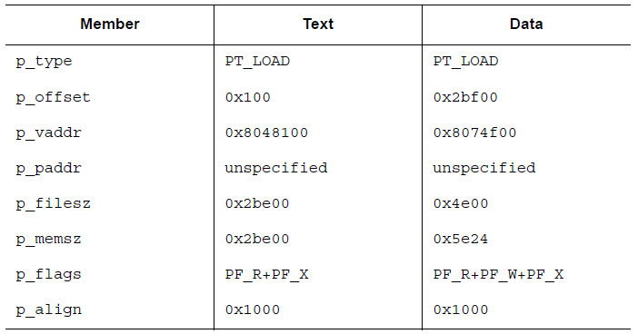
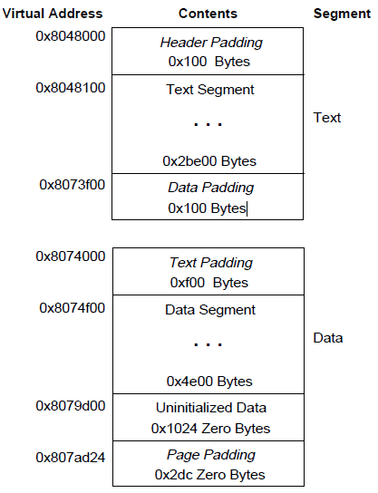
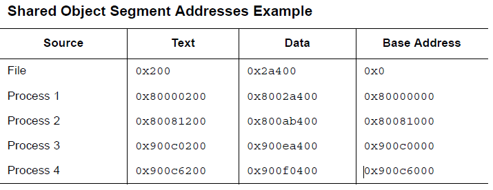

[EN](./program-loading.md) | [ZH](./program-loading-zh.md)
## Loading

The program loading process is actually the process of creating or expanding the process mirror. It simply copies the segments of the file into the virtual memory segment according to certain rules. The process will apply for the corresponding physical page only if the corresponding logical page is used in the process of execution. In general, many pages in a process are not referenced. Therefore, delaying physical reads and writes can improve system performance. In order to achieve such efficiency, the executable file and the file offset and virtual address of the segment owned by the shared object file must be appropriate, that is, they must be integer multiples of the page size.

In the Intel architecture, the virtual address and file offset must be 4KB integers, or a larger integer multiple of 2.

Below is an example of an executable file loaded into memory layout

The corresponding code segment and the data segment are explained as follows

In this example, although the code segment and the data segment are equal in the sense of modulo 4KB, there are still up to 4 pages containing impure code or data. Of course, in practice it will depend on the page size or the block size of the file system.

- The first page of the code snippet contains the ELF header, the program header table, and other information.
- The last page of the code segment contains a copy of the beginning of the data segment.
- The last page of the data segment contains a copy of the last part of the code segment. As for how much, it has not been explained yet.
- The last part of the data segment may contain information that is not relevant to the program&#39;s operation.

Logically speaking, the system will force the control of memory permissions, just like the permissions of each segment are completely independent; the segment address will be adjusted to ensure that each logical page in memory has only one type of permission. . In the example given above, the last part of the code segment of the file and the beginning of the data segment are mapped twice: the virtual address of the data segment and the virtual address of the code segment.

The end of the data segment needs to deal with the data that has not been initialized. Generally, the system requires them to start with 0. Therefore, if the last page of a file contains information that is not in the logical page, the remaining data must be initialized to zero. The impurity data in the remaining three pages is not logically part of the process image, and the system can choose to delete them. The virtual memory image corresponding to this file is as follows (assuming each page is 4KB in size)

When you load a segment, the executable is different from the shared object. Executable files usually contain absolute code. In order to be able to make the program execute correctly, each segment should be at the virtual address used to build the executable. Therefore, the system directly uses p_vaddr as a virtual address.

On the other hand, shared object files usually contain address-independent code. This makes the virtual address of the same segment different in different processes, but this does not affect the execution behavior of the program. Although the system chooses different virtual addresses for different processes, it still maintains the relative addresses of the segments. Because the address independent code uses relative addresses in different segments, the difference between the virtual addresses in virtual memory is definitely the same as the difference between the corresponding virtual addresses in the file. The following is a list of possible different processes for the same shared object file, describing relative address addressing, and this table also gives a calculation of the base address.

