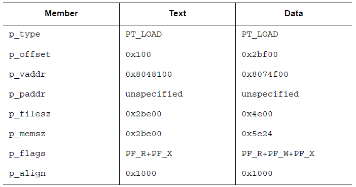
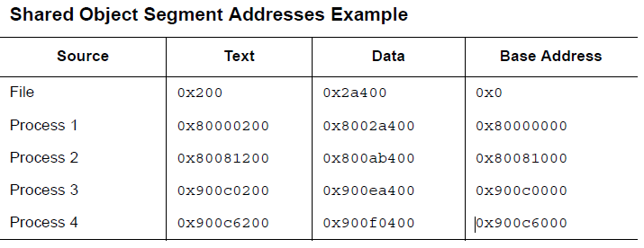

## 加载

程序加载过程其实就是系统创建或者或者扩充进程镜的过程。它只是按照一定的规则把文件的段拷贝到虚拟内存段中。进程只有在执行的过程中使用了对应的逻辑页面时，才会申请相应的物理页面。通常来说，一个进程中有很多页是没有被引用的。因此，延迟物理读写可以提高系统的性能。为了达到这样的效率，可执行文件以及共享目标文件所拥有的段的文件偏移以及虚拟地址必须是合适的，也就是说他们必须是页大小的整数倍。

在Intel架构中，虚拟地址以及文件偏移必须是4KB的整数，或者说是更大的2的整数倍。

下面是一个可执行文件加载到内存中布局的例子

对应的代码段以及数据段的解释如下

在这个例子中，尽管代码段和数据段在模4KB的意义下相等，但是仍然最多有4个页面包含有不纯的代码或者数据。当然，实际中会取决于页大小或者文件系统的块大小。

- 代码段的第一个页包含了ELF头，程序头部表，以及其他信息。
- 代码段的最后一页包含了数据段开始部分的副本。
- 数据段的最后一页包含了代码段的最后部分的副本。至于多少，暂未说明。
- 数据段的最后一部分可能会包含与程序运行无关的信息。

逻辑上说，系统会对强制控制内存的权限，就好比每一个段的权限都是完全独立的；段的地址会被调整，以便于确保内存中的每一个逻辑页都只有一组类型的权限。在上面给出的例子中，文件的代码段的最后一部分和数据段的开始部分都会被映射两次：分别在数据段的虚拟地址以及代码段的虚拟地址。

数据段的结尾需要好好处理没有被初始化的数据，一般来说，系统要求它们以0开始。因此，如果一个文件的最后一页包含不在逻辑页中的信息，那么剩下的数据必须被初始化为0。剩下的三个页中的杂质数据在逻辑上说并不是进程镜像的一部分，系统可以选择删除它们。该文件对应的虚拟内存镜像如下（假设每一页大小为4KB）

在加载段时，可执行文件与共享目标文件有所区别。可执行文件通常来说包含绝对代码。为了能够使得程序正确执行，每一个段应该在用于构建可执行文件的虚拟地址处。因此，系统直接使用p_vaddr作为虚拟地址。

另一方面，共享目标文件通常包含地址独立代码。这使得在不同的进程中，同一段的虚拟地址可能会有所不同，但这并不会影响程序的执行行为。尽管系统会为不同的进程选择不同的虚拟地址，但是它仍旧维持了段的相对地址。因为地址独立代码在不同的段中使用相对地址，因此在虚拟内存中的虚拟地址之间的差肯定和在文件中的相应的虚拟地址的差相同。下面给出了可能的对于同一共享目标文件不同进程的情况，描述了相对地址寻址，此外这个表还给出了基地址的计算方法。

