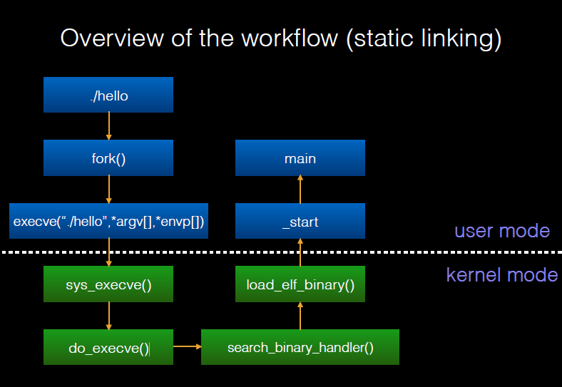
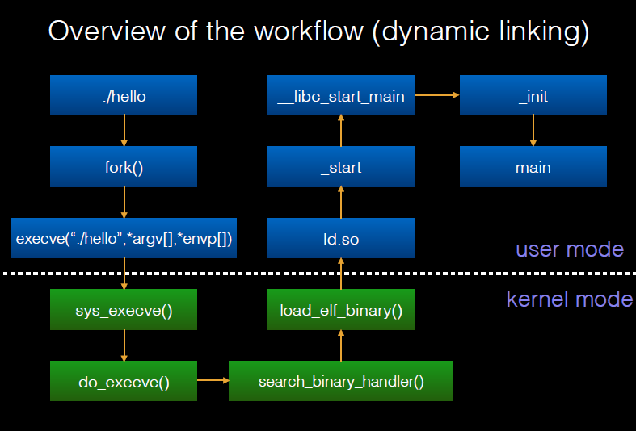
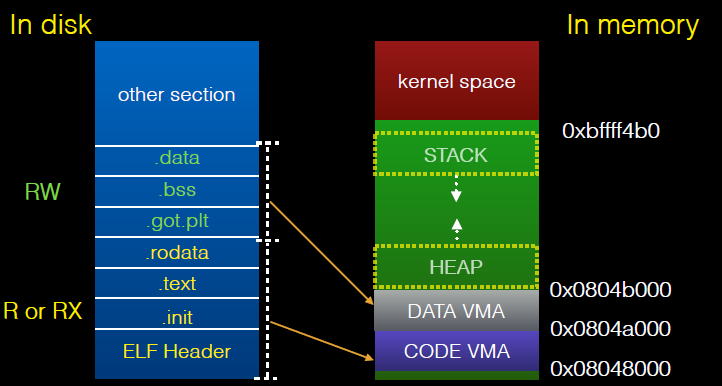

## 程序执行流程

**参考 Execution Angleboye@Bamboofox 。**

## 基本概述

### 静态执行

这里给出程序静态执行的基本过程。

### 动态执行

这里给出另外一张更加细节的图片。

### 基本操作说明

#### sys_execve

该函数主要用于执行一个新的程序，即执行我们想要执行的程序，会检查相应的argv以及envp等参数。

#### do_execve

该函数打开目标映像文件，并从目标文件的开始处读入指定长度的（目前为128）字节来获取相应目标文件的基本信息。

#### search_binary_handler

该函数会搜索支持处理当前类型的二进制文件类型队列，以便于让各种可执行程序的处理程序进行相应的处理。

#### load_elf_binary

该函数的主要处理流程如下

- 检查并获取elf文件的头部信息。

- 如果目标文件采用动态链接，则使用.interp 节来确定loader的路径。

- 将program header 中记录的相应的段映射到内存中。program header中有以下重要信息

  - 每一个段需要映射到的地址
  - 每一个段相应的权限。
  - 记录哪些节属于哪些段。

  具体的映射如下

  

  分情况处理

  - 动态链接情况下，将sys_execve的返回地址改为loader(ld.so)的entry point。
  - 静态链接情况下，将sys_execve的返回地址改为程序的入口点。

#### ld.so

该文件有以下功能

- 主要用于载入ELF文件中DT_NEED中记录的共享库。
- 初始化工作
  - 初始化GOT表。
  - 将symbol table合并到global symbol table。

#### _start

_start函数会将以下项目交给libc_start_main

- 环境变量起始地址
- .init
  - 启动main函数前的初始化工作
- fini
  - 程序结束前的收尾工作。
