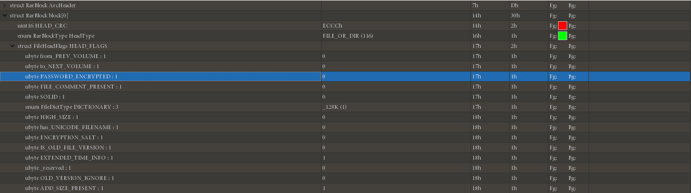

[EN](./rar.md) | [ZH](./rar-zh.md)
## file format

The RAR file is mainly composed of a mark block, a compressed file header block, a file header block, and a trailing block.

Each of its blocks is roughly divided into the following fields:

| Name | Size | Description |
| ---------- | ---- | --------------------- |

| HEAD_CRC | 2 | CRC for all blocks or block parts |
| HEAD_TYPE | 1 | Block Type |
| HEAD_FLAGS | 2 | Blocking Flags |
| HEAD_SIZE | 2 | Block Size |
| ADD_SIZE | 4 | Optional Fields - Add Block Size |

The file header of the Rar archive is `0x 52 61 72 21 1A 07 00`.

Following the file header (0x526172211A0700) is the marker block (MARK_HEAD) followed by the File Header.

| Name | Size | Description |
| ------------- | --------------- | ------------------------------------------------------------------------------------------------------------------------ |

| HEAD_CRC      | 2               | CRC of fields from HEAD_TYPE to FILEATTR and file name                                                                   |

| HEAD_TYPE     | 1               | Header Type: 0x74                                                                                                        |

| HEAD_FLAGS    | 2               | Bit Flags (Please see ‘Bit Flags for File in Archive’ table for all possibilities)（伪加密）                           |

| HEAD_SIZE     | 2               | File header full size including file name and comments                                                                   |

| PACK_SIZE     | 4               | Compressed file size                                                                                                     |

| UNP_SIZE      | 4               | Uncompressed file size                                                                                                   |

| HOST_OS       | 1               | Operating system used for archiving (See the ‘Operating System Indicators’ table for the flags used)                   |

| FILE_CRC      | 4               | File CRC                                                                                                                 |

| FTIME         | 4               | Date and time in standard MS DOS format                                                                                  |

| UNP_VER       | 1               | RAR version needed to extract file (Version number is encoded as 10 * Major version + minor version.)                    |

| METHOD        | 1               | Packing method (Please see ‘Packing Method’ table for all possibilities                                                |

| NAME_SIZE     | 2               | File name size                                                                                                           |

| ATTR          | 4               | File attributes                                                                                                          |

| HIGH_PACK_SIZ | 4               | High 4 bytes of 64-bit value of compressed file size. Optional value, presents only if bit 0x100 in HEAD_FLAGS is set.   |

| HIGH_UNP_SIZE | 4               | High 4 bytes of 64-bit value of uncompressed file size. Optional value, presents only if bit 0x100 in HEAD_FLAGS is set. |

| FILE_NAME     | NAME_SIZE bytes | File name - string of NAME_SIZE bytes size                                                                               |

| SALT          | 8               | present if (HEAD_FLAGS & 0x400) != 0                                                                                     |

| EXT_TIME      | variable size   | present if (HEAD_FLAGS & 0x1000) != 0                                                                                    |

The end of each RAR file is fixed (Terminator).

| Field Name | Size (bytes) | Possibilities       |

| ---------- | ------------ | ------------------- |

| HEAD_CRC   | 2            | Always 0x3DC4       |

| HEAD_TYPE  | 1            | Header type: 0x7b   |

| HEAD_FLAGS | 2            | Always 0x4000       |

| HEAD_SIZE  | 2            | Block size = 0x0007 |

See more details <http://www.forensicswiki.org/wiki/RAR>

## Main attack

### Blasting

- [RarCrack] under Linux (http://rarcrack.sourceforge.net/)

### Pseudo encryption

The pseudo-encryption of the RAR file is visible on the bit-marker field in the header of the file. This bit can be clearly seen with the 010 Editor. Modifying this bit can cause pseudo-encryption.

The rest of the plaintext attacks are still the same as those described in the ZIP.