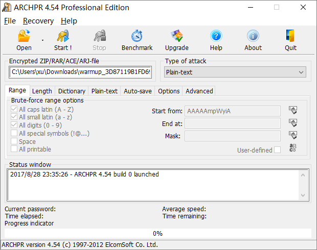
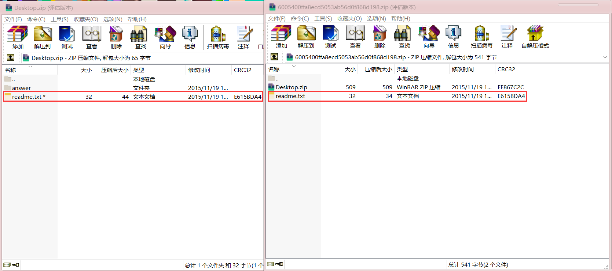
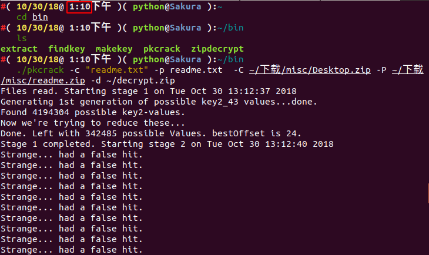
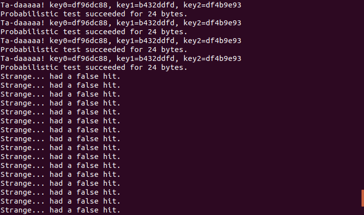
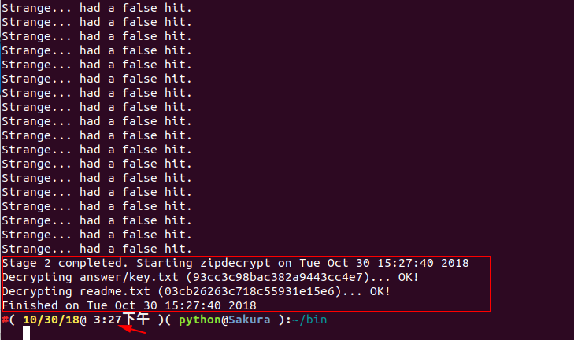
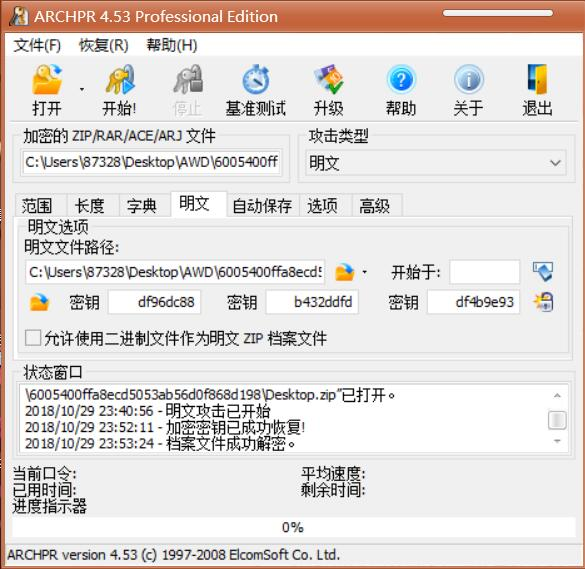
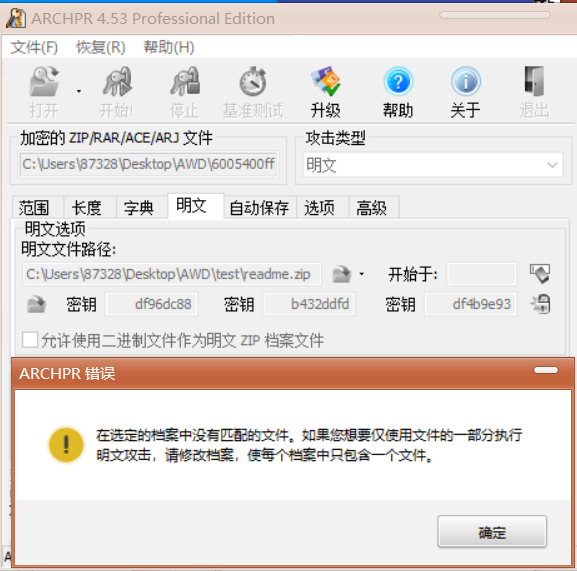
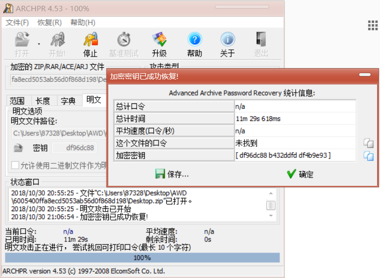
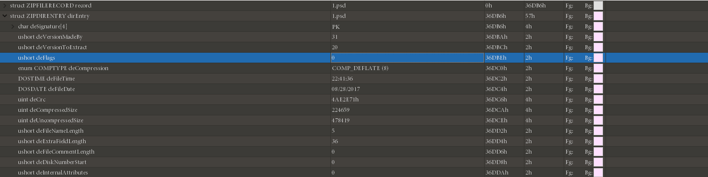
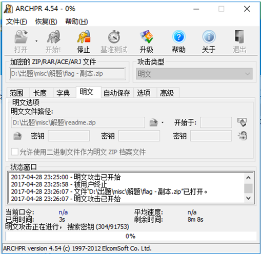

[EN](./zip.md) | [ZH](./zip-zh.md)
## 文件结构

`ZIP` 文件主要由三部分构成，分别为

| 压缩源文件数据区                                | 核心目录          | 目录结束                        |
| ----------------------------------------------- | ----------------- | ------------------------------- |
| local file header + file data + data descriptor | central directory | end of central directory record |

-   压缩源文件数据区中每一个压缩的源文件或目录都是一条记录，其中
    -   `local file header` ：文件头用于标识该文件的开始，记录了该压缩文件的信息，这里的文件头标识由固定值 `50 4B 03 04` 开头，也是 `ZIP` 的文件头的重要标志
    -   `file data` ：文件数据记录了相应压缩文件的数据
    -   `data descriptor` ：数据描述符用于标识该文件压缩结束，该结构只有在相应的 `local file header` 中通用标记字段的第 `3 bit` 设为 `1` 时才会出现，紧接在压缩文件源数据后
- `Central directory` 核心目录

  -   记录了压缩文件的目录信息，在这个数据区中每一条纪录对应在压缩源文件数据区中的一条数据。

      | Offset | Bytes | Description                                          | 译                                      |
      | ------ | ----- | ---------------------------------------------------- | --------------------------------------- |
      | 0      | 4     | Central directory file header signature = 0x02014b50 | 核心目录文件 header标识 =（0x02014b50） |
      | 4      | 2     | Version made by                                      | 压缩所用的 pkware 版本                  |
      | 6      | 2     | Version needed to extract (minimum)                  | 解压所需 pkware 的最低版本              |
      | 8      | 2     | General purpose bit flag                             | 通用位标记伪加密                        |
      | 10     | 2     | Compression method                                   | 压缩方法                                |
      | 12     | 2     | File last modification time                          | 文件最后修改时间                        |
      | 14     | 2     | File last modification date                          | 文件最后修改日期                        |
      | 16     | 4     | CRC-32                                               | CRC-32 校验码                           |
      | 20     | 4     | Compressed size                                      | 压缩后的大小                            |
      | 24     | 4     | Uncompressed size                                    | 未压缩的大小                            |
      | 28     | 2     | File name length (n)                                 | 文件名长度                              |
      | 30     | 2     | Extra field length (m)                               | 扩展域长度                              |
      | 32     | 2     | File comment length (k)                              | 文件注释长度                            |
      | 34     | 2     | Disk number where file starts                        | 文件开始位置的磁盘编号                  |
      | 36     | 2     | Internal file attributes                             | 内部文件属性                            |
      | 38     | 4     | External file attributes                             | 外部文件属性                            |
      | 42     | 4     | relative offset of local header                      | 本地文件头的相对位移                    |
      | 46     | n     | File name                                            | 目录文件名                              |
      | 46+n   | m     | Extra field                                          | 扩展域                                  |
      | 46+n+m | k     | File comment                                         | 文件注释内容                            |

- `End of central directory record(EOCD)` 目录结束标识

  -   目录结束标识存在于整个归档包的结尾，用于标记压缩的目录数据的结束。每个压缩文件必须有且只有一个 `EOCD` 记录。

更加详细参见 [官方文档](https://pkware.cachefly.net/webdocs/APPNOTE/APPNOTE-6.2.0.txt)。

## 主要攻击

### 爆破

这里主要介绍两款爆破使用的工具

-   `Windows`下的神器 [ARCHPR](http://www.downcc.com/soft/130539.html)

    

    暴力枚举，跑字典，明文攻击，应有尽有。

-   `Linux` 下的命令行工具 [fcrackzip](https://github.com/hyc/fcrackzip)

    ```shell
    # －b 指定模式为暴破，-c1指定密码类型为纯数字，其它类型可以rtfm,-u这个参数非常重要不然不显示破解出来的密码,-l 5-6可以指定长度
    root@kali:fcrackzip -b -c1 -u test.zip
    ```

### CRC32

#### 原理

`CRC` 本身是「冗余校验码」的意思，`CRC32` 则表示会产生一个 `32 bit` ( `8`  位十六进制数)的校验值。由于 `CRC32` 产生校验值时源数据块的每一个 `bit` (位)都参与了计算，所以数据块中即使只有一位发生了变化，也会得到不同的 `CRC32` 值。

`CRC32` 校验码出现在很多文件中比如 `png` 文件，同样 `zip` 中也有 `CRC32` 校验码。值得注意的是 `zip` 中的 `CRC32` 是未加密文件的校验值。

这也就导致了基于 `CRC32` 的攻击手法。

- 文件内内容很少(一般比赛中大多为 `4` 字节左右)
- 加密的密码很长

我们不去爆破压缩包的密码，而是直接去直接爆破源文件的内容(一般都是可见的字符串)，从而获取想要的信息。

比如我们新建一个 `flag.txt`，其中内容为 `123`，使用密码 `!QAZXSW@#EDCVFR$` 去加密。


而我们去计算文件的 `CRC32` 值发现和上图中的 `CRC32` 值吻合。

```shell
文件: flag.txt
大小: 3
时间: Tue, 29 Aug 2017 10:38:10 +0800
MD5: 202cb962ac59075b964b07152d234b70
SHA1: 40bd001563085fc35165329ea1ff5c5ecbdbbeef
CRC32: 884863D2
```

!!! note
​    在爆破时我们所枚举的所有可能字符串的 `CRC32` 值是要与压缩源文件数据区中的 `CRC32` 值所对应

```python
# -*- coding: utf-8 -*-

import binascii
import base64
import string
import itertools
import struct

alph = 'abcdefghijklmnopqrstuvwxyzABCDEFGHIJKLMNOPQRSTUVWXYZ0123456789+/='

crcdict = {}
print "computing all possible CRCs..."
for x in itertools.product(list(alph), repeat=4):
    st = ''.join(x)
    testcrc = binascii.crc32(st)
    crcdict[struct.pack('<i', testcrc)] = st
print "Done!"

f = open('flag.zip')
data = f.read()
f.close()
crc = ''.join(data[14:18])
if crc in crcdict:
    print crcdict[crc]
else:
    print "FAILED!"
```

#### 例题

> 题目：`Abctf-2016:Zippy`

根据每个压缩包内的文件大小可以推断使用 `CRC32` 攻击手法，获得每个压缩包内的内容后连在一起 `Base64` 解码后是一个加密的压缩包，爆破获得 `flag`。

### 明文攻击

#### 原理

- 一个加密的压缩文件
- 压缩文件的压缩工具，比如 `2345` 好压， `WinRAR` ， `7z` 。 `zip` 版本号等，可以通过文件属性了解。如果是 `Linux` 平台，用 `zipinfo -v` 可以查看一个 `zip` 包的详细信息，包括加密算法等
- 知道压缩包里某个文件的部分连续内容(至少 `12` 字节)

如果你已经知道加密文件的部分内容，比如在某个网站上发现了它的 `readme.txt` 文件，你就可以开始尝试破解了。

首先，将这个明文文件打包成 `zip` 包，比如将 `readme.txt` 打包成 `readme.zip` 。

打包完成后，需要确认二者采用的压缩算法相同。一个简单的判断方法是用 `WinRAR` 打开文件，同一个文件压缩后的体积是否相同。如果相同，基本可以说明你用的压缩算法是正确的。如果不同，就尝试另一种压缩算法。

#### 工具

- Windows下的神器 [ARCHPR](http://www.downcc.com/soft/130539.html)
- Linux下的 [PKCrack](http://www.unix-ag.uni-kl.de/~conrad/krypto/pkcrack.html)

!!! note
​    建议使用 `Windows` 的 `ARCHPR`，一是速度较快，二是较稳定（之前出题时遇到过用 `PKCrack` 爆不出来的情况）。

#### 例题

> 2015广州强网杯：爆破？
>
> WP：https://www.cnblogs.com/ECJTUACM-873284962/p/9884416.html

首先我们拿到这样一道题，题目标题为**爆破?**，很明显这题肯定是要用到一个破解工具，很暴力的说。

**第一步、分析压缩包文件**

我们下载了这个压缩包以后，我们看到文件名是 ***.zip** 结尾，我们可以立即想到破解压缩包常用的几种方式，我们将其压缩包解压出来，发现里面有两个文件，分别为 `Desktop.zip` 和 `readme.txt` ，我们看看 `readme.txt` 里面写了什么？


打开以后竟然是`qianwanbuyaogeixuanshoukandao!!!` ，出题人不想让选手看到，这出题人还是有点意思。我们再看看那个 `Desktop.zip` ，我们可以看到里面有个 `readme.txt` 文件和 `answer` 文件夹， `answer` 文件夹下有 `key.txt` 文件， `flag` 应该就藏在这里了。

**第二步、分析破解方式**

这题目拿到手上，我们首先发现解压出来的文件和 `Desktop.zip` 压缩包中都含有同样一个文件 `readme.txt` ，而且并没有给出其他相关信息，且文件大小大于 `12Byte` ，我们再对比压缩包中的 `readme.txt` 和原压缩包中的 `readme.txt` 的 `CRC32` 的值，我们发现两个值相同，这说明解压出的 `readme.txt` 是加密压缩包里的 `readme.txt` 的明文，于是我们可以大胆地猜测这极可能是个明文加密。



**第三步、尝试明文攻击**

既然我们已经知道了它是明文攻击的话，我们将对其压缩包进行破解，由于解压出的readme.txt是加密压缩包里的 `readme.txt` 的明文，将 `readme.txt` 压缩成 **.zip** 文件，然后在软件中填入相应的路径即可开始进行明文攻击，这里我们将介绍 `Windows` 和 `Ubuntu` 下使用不同的方式进行明文攻击。

方法一、 `pkcrack` 进行明文攻击

`pkcrack` 下载链接：https://www.unix-ag.uni-kl.de/~conrad/krypto/pkcrack.html

我们可以直接写个 `shell` 脚本下载就好了：

```shell
#!/bin/bash -ex

wget https://www.unix-ag.uni-kl.de/~conrad/krypto/pkcrack/pkcrack-1.2.2.tar.gz
tar xzf pkcrack-1.2.2.tar.gz
cd pkcrack-1.2.2/src
make

mkdir -p ../../bin
cp extract findkey makekey pkcrack zipdecrypt ../../bin
cd ../../
```

把文件保存，改为 `pkcrack-install.sh` ，然后跑到当前目录下，给它加一个执行权限 `x` 。

```shell
chmod 777 install.sh
```

或者直接可以：

```shell
chmod u+x install.sh
```

然后运行 `./pkcrack-install.sh` 


然后当前目录下会生成一个 `bin` 的文件夹，我们直接进入 `bin` 文件夹下，看到有 `pkcrack` 文件，直接对文件进行明文破解。

```shell
./pkcrack -c "readme.txt" -p readme.txt  -C ~/下载/misc/Desktop.zip -P ~/下载/misc/readme.zip -d ~/decrypt.zip
```

我们所用到的参数选项如下：

```shell
-C:要破解的目标文件(含路径)

-c:破解文件中的明文文件的名字(其路径不包括系统路径,从zip文件一层开始)

-P:压缩后的明文文件

-p:压缩的明文文件中明文文件的名字(也就是readme.txt在readme.zip中的位置)
-d:指定文件名及所在的绝对路径，将解密后的zip文件输出
```

至于其他选项参看 `./pkcrack --help` 

解密后的结果如下：








我们可以看到，我们下午 `1:10` 开始跑的，下午 `3:27` 才求解出秘钥。

我们得出了最终的flag为：**`flag{7ip_Fi13_S0m3tim3s_s0_3a5y@}`**

**坑点来了**

看起来一切都很顺利的样子，同样花了两个多小时，为啥我在博客园上写了我跑了两个小时都没跑出来呢？或者说有朋友遇到了和我一样的问题，我明明和你是一样的，为啥我跑不出结果？

你们可能忽略了一些细节问题，有人曾想过原压缩包是通过什么方式压缩的嘛？还有就是我们生成的 `readme.zip` 又该以哪种方式去生成呢？我就是因为这个问题卡了整整三个月没做出来，不信的话我们可以看看第二种方法，在 `Windows` 下用 `ARCHPR` 进行明文攻击。

方法二、 `ARCHPR` 进行明文攻击

首先这题我建议大家下 `ARCHPR 4.53` 版本，我是在这个版本下测试成功的。成功截图如下：



我相信很多朋友在用 `ARCHPR` 的时候遇到以下这种情况：



我当时内心是崩溃的，为啥会出现这种情况。

在后来的学习中发现，用 `7z` 压缩的文件得用 `7z` 来解压缩， `7z` 是一种使用多种压缩算法进行数据压缩的档案格式，和传统的 `zip` ， `rar` 相比，它的压缩比率更大，采用的压缩算法不同，自然而然就可能出现不匹配这种情况，所以我们在解压缩原压缩包和对文件进行加密的时候得先分析出题人是用什么方式进行加解密的，所以这题的问题显而易见就出来了，经过验证，我发现出题人是用 `7z` 进行压缩的。

**再尝试**

我们已经发现了这个问题，我们去官网下载 `7zip` ：https://www.7-zip.org/

然后我们对原压缩文件用 `7z` 进行解压缩，然后将 `readme.txt` 用7z进行压缩即可。然后我们就可以用 `ARCHPR` 进行明文攻击了。

结果如下：



我们将 `Desktop_decrypted.zip` 解压出来，查看 `answer` 目录下的 `key.txt` 即可。

所以最终的flag为：**`flag{7ip_Fi13_S0m3tim3s_s0_3a5y@}`**

### 伪加密

#### 原理

在上文 `ZIP` 格式中的 **核心目录区** 中，我们强调了一个叫做通用位标记 `(General purpose bit flag)` 的 `2` 字节，不同比特位有着不同的含义。

```shell
Bit 0: If set, indicates that the file is encrypted.

(For Method 6 - Imploding)
Bit 1: If the compression method used was type 6,
     Imploding, then this bit, if set, indicates
     an 8K sliding dictionary was used.  If clear,
     then a 4K sliding dictionary was used.
...
Bit 6: Strong encryption.  If this bit is set, you should
     set the version needed to extract value to at least
     50 and you must also set bit 0.  If AES encryption
     is used, the version needed to extract value must
     be at least 51.
...
```

在 `010Editor` 中我们尝试着将这 `1` 位修改 `0 --> 1`。



再打开文件发现已要求输入密码。


修改伪加密的方法：

- `16` 进制下修改通用位标记
- `binwalk -e` 无视伪加密
- 在 `Mac OS` 及部分 `Linux`(如 `Kali` )系统中，可以直接打开伪加密的 `ZIP` 压缩包
- 检测伪加密的小工具 `ZipCenOp.jar`
- 有时候用 `WinRar` 的修复功能（此方法有时有奇效，不仅针对伪加密）

#### 例题

> `SSCTF-2017` ：我们的秘密是绿色的
>
> `WP`：<http://bobao.360.cn/ctf/detail/197.html>

我们在得到两个 `readme.txt`，且一个加密，一个已知，很容易想到明文攻击的手法。

注意在用明文攻击时的操作。



得到密码 `Y29mZmVl` 后，解压缩文件，得到另一个压缩包。

观察通用位标记位，猜测伪加密，修改后解压得到 flag。

这一题，基本涵盖了比赛中 ZIP 的常见考察手法，爆破，伪加密，明文攻击等，都在本题中出现。

### 参考文献

- https://pkware.cachefly.net/webdocs/APPNOTE/APPNOTE-6.2.0.txt
- https://www.cnblogs.com/ECJTUACM-873284962/p/9387711.html
- https://www.cnblogs.com/ECJTUACM-873284962/p/9884416.html
- http://bobao.360.cn/ctf/detail/197.html
