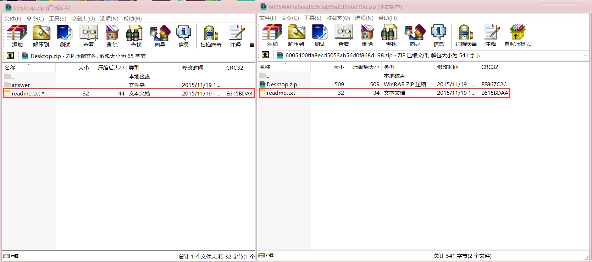
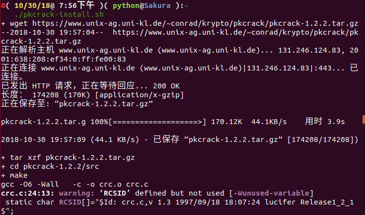
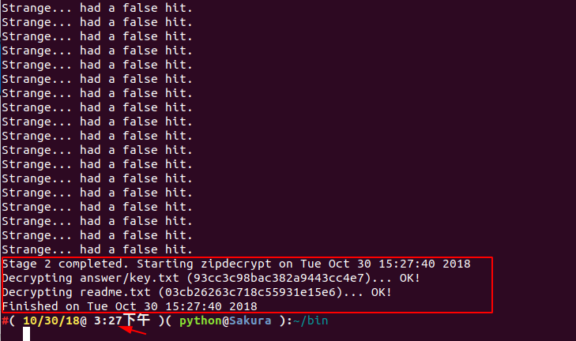
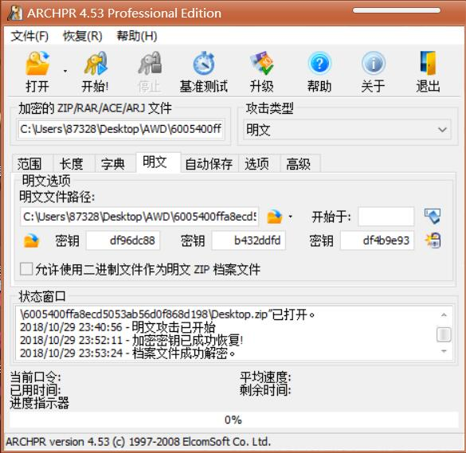
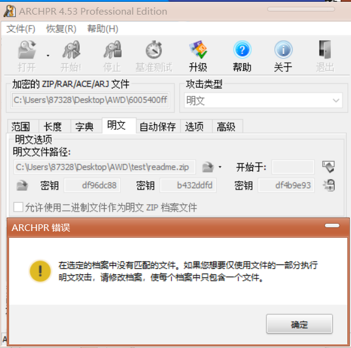
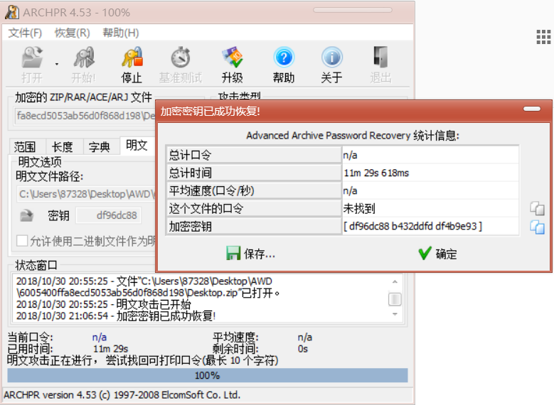
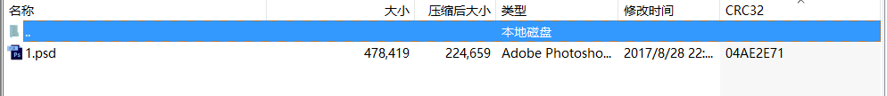
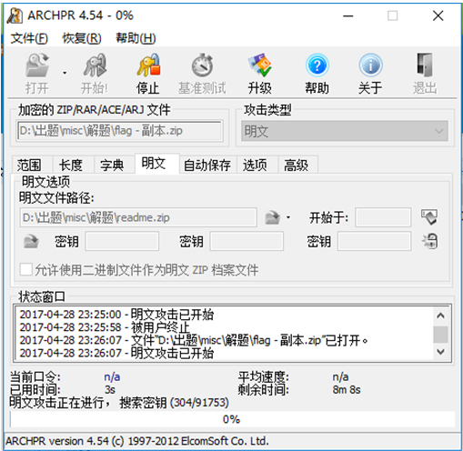

[EN](./zip.md) | [ZH](./zip-zh.md)
## File Structure


The `ZIP` file is mainly composed of three parts, respectively


| Compressed Source File Data Area | Core Directory | Directory End |
| ----------------------------------------------- | ----------------- | ------------------------------- |

| local file header + file data + data descriptor | central directory | end of central directory record |


- Each compressed source file or directory in the compressed source file data area is a record, where
- `local file header` : The file header is used to identify the beginning of the file, and the information of the compressed file is recorded. The file header identifier here starts with a fixed value of `50 4B 03 04` and is also important for the header of `ZIP`. Sign
- `file data` : file data records the data of the corresponding compressed file
- `data descriptor`: The data descriptor is used to identify the end of compression of the file. This structure will only appear if the `3 bit` of the general tag field in the corresponding `local file header` is set to `1`. After compressing the file source data
- `Central directory` core directory


- The directory information of the compressed file is recorded, and each record in the data area corresponds to one piece of data in the compressed source file data area.


      | Offset | Bytes | Description                                          | 译                                      |

      | ------ | ----- | ---------------------------------------------------- | --------------------------------------- |

| 0 | 4 | Central directory file header signature = 0x02014b50 | Core Directory File header Identifier = (0x02014b50) |
| 4 | 2 | Version made by | pkware version used for compression |
6 | 2 | Version needed to extract (minimum) | Unzip the minimum version of pkware required |
| 8 | 2 | General purpose bit flag | Universal bit flag pseudo-encryption |
| 10 | 2 | Compression method | Compression method |
12 | 2 | File last modification time | Last modified file |
| 14 | 2 | File last modification date | Last modified date of the file |
| 16 | 4 | CRC-32 | CRC-32 Check Digit |
| 20 | 4 | Compressed size | Compressed size |
| 24 | 4 | Uncompressed size | Uncompressed size |
| 28 | 2 | File name length (n) | File Name Length |
| 30 | 2 | Extra field length (m) | Extended field length |
| 32 | 2 | File comment length (k) | File comment length |
| 34 | 2 | Disk number where file starts | Disk number at the beginning of the file |
| 36 | 2 | Internal file attributes | Internal file attributes |
| 38 | 4 | External file attributes | External file attributes |
| 42 | 4 | relative offset of local header | Relative displacement of local file headers |
| 46 | n | File name | Directory file name |
| 46+n | m | Extra field | Extended Field |
| 46+n+m | k | File comment | File Comments |


- `End of central directory record(EOCD)` directory end identifier


- The end of directory identifier exists at the end of the entire archive package and is used to mark the end of compressed directory data. Each compressed file must have one and only one `EOCD` record.


See [Official Documentation] (https://pkware.cachefly.net/webdocs/APPNOTE/APPNOTE-6.2.0.txt) for more details.


## Main attack


### Blasting


Here are two tools for blasting.


- Artifact [WindowsPR] under `Windows` (http://www.downcc.com/soft/130539.html)


    


Violent enumeration, running dictionaries, plaintext attacks, everything.


- Command line tool under `Linux` [fcrackzip] (https://github.com/hyc/fcrackzip)


    ```shell

# -b Specifies that the mode is bursting, -c1 specifies the password type as a pure number, other types can be rtfm, -u this parameter is very important or does not display the cracked password, -l 5-6 can specify the length
    root@kali:fcrackzip -b -c1 -u test.zip

    ```


### CRC32


#### Principle


`CRC` itself means &quot;redundant check code&quot;, and `CRC32` means that a check value of `32 bit` ( `8` hexadecimal number) is generated. Since `CRC32` generates a check value, every bit `bit` of the source data block participates in the calculation, so even if only one bit changes in the data block, a different `CRC32&#39; value will be obtained.


The `CRC32` checksum appears in many files such as the `png` file, as well as the `CRC32` checksum in `zip`. It is worth noting that `CRC32` in `zip` is the checksum value of the unencrypted file.


This has led to an attack based on `CRC32`.


- There is very little content in the file (mostly in the game, it is about `4` bytes)
- Encrypted password is very long


Instead of blasting the password of the compressed package, we directly blast the contents of the source file (usually visible strings) to obtain the desired information.


For example, we create a new `flag.txt` with the content `123` and encrypt it with the password `!QAZXSW@#EDCVFR$`.


And we went to calculate the `CRC32&#39; value of the file and found that it matches the `CRC32` value in the above figure.


```shell

File: flag.txt
Size: 3
Time: Tue, 29 Aug 2017 10:38:10 +0800
MD5: 202cb962ac59075b964b07152d234b70
SHA1: 40bd001563085fc35165329ea1ff5c5ecbdbbeef

CRC32: 884863D2

```


!!! note

The `CRC32` value of all possible strings we enumerated during blasting is to correspond to the `CRC32` value in the compressed source file data area.


```python

# -*- coding: utf-8 -*-


import binascii
import base64

import string

import itertools

import struct


alph = 'abcdefghijklmnopqrstuvwxyzABCDEFGHIJKLMNOPQRSTUVWXYZ0123456789+/='


crcdict = {}

print "computing all possible CRCs..."

for x in itertools.product(list(alph), repeat=4):

    st = ''.join(x)

    testcrc = binascii.crc32(st)

    crcdict[struct.pack('<i', testcrc)] = st

print "Done!"


f = open('flag.zip')

data = f.read()

f.close()

crc = ''.join(data[14:18])

if crc in crcdict:

    print crcdict[crc]

else:

    print "FAILED!"

```


#### Example

&gt; Title: `Abctf-2016: Zippy`


According to the file size in each compressed package, it can be inferred that the `CRC32` attack method is used, and the contents of each compressed package are obtained, and then an encrypted compressed package is obtained after the `Base64` decoding, and the blast is obtained by `flag`.


### Clear text attack


#### Principle


- an encrypted compressed file
- Compressed files for compressed files, such as `2345`, pressure, `WinRAR`, `7z`. `zip` version number, etc., can be understood through file attributes. If it is a `Linux` platform, use `zipinfo -v` to view the details of a `zip` package, including encryption algorithms, etc.
- Know some of the contiguous content of a file in the archive (at least `12` bytes)


If you already know part of the encrypted file, such as the `readme.txt` file found on a website, you can start trying to crack it.


First, package this plaintext file into a `zip` package, such as `readme.txt` into `readme.zip`.


After the packaging is complete, you need to confirm that the compression algorithm used by both is the same. A simple way to judge is to open the file with `WinRAR`, and the same file is compressed with the same volume. If they are the same, it basically means that the compression algorithm you are using is correct. If it is different, try another compression algorithm.


#### Tools


- Artifact under Windows [ARCHPR] (http://www.downcc.com/soft/130539.html)
- Linux下的 [PKCrack](http://www.unix-ag.uni-kl.de/~conrad/krypto/pkcrack.html)


!!! note

It is recommended to use the `ARCHPR` of `Windows`. One is faster and the other is more stable (the previous case was encountered when using `PKCrack`).


#### Example


&gt; 2015 Guangzhou Strong Net Cup: Blasting?
>

&gt; WP: https://www.cnblogs.com/ECJTUACM-873284962/p/9884416.html


First of all, we got such a question, the title of the title is **Blasting?**, it is obvious that this problem is definitely to use a cracking tool, very violent.


**First step, analyze the compressed package file**


After we downloaded this tarball, we saw that the file name is ***.zip**. We can immediately think of several ways to crack the zip package. We extract the zip file and find that there are two files. , respectively, `Desktop.zip` and `readme.txt`, let&#39;s see what is written in `readme.txt`?


After opening it turned out to be `qianwanbuyaogeixuanshoukandao!!!`, the questioner did not want the player to see, this question is still a bit interesting. Let&#39;s take a look at the `Desktop.zip`. We can see that there is a `readme.txt` file and a `answer` folder. There is a `key.txt` file in the `answer` folder. `flag` should be Hidden here.


**Step 2, analyze the crack method**


This topic got the hand, we first found that the extracted file and the `Desktop.zip` tarball contain the same file `readme.txt`, and did not give other relevant information, and the file size is greater than `12Byte`, We compare the `readme.txt` in the compressed package with the value of `CRC32` in `readme.txt` in the original compressed package. We find that the two values are the same, which means that the extracted `readme.txt` is encrypted and compressed. The plaintext of `readme.txt` in the package, so we can boldly guess that this is probably a plaintext encryption.





**Step 3, try plaintext attack**


Now that we know that it is a plaintext attack, we will crack the compressed package. Since the extracted readme.txt is the plaintext of `readme.txt` in the encrypted archive, compress `readme.txt` to * *.zip** file, then fill in the corresponding path in the software to start plaintext attack, here we will introduce different methods of clear-text attack under `Windows` and `Ubuntu`.


Method 1, `pkcrack` for plaintext attack


`pkcrack` Download link: https://www.unix-ag.uni-kl.de/~conrad/krypto/pkcrack.html


We can just write a `shell` script to download it:


```shell

#!/bin/bash -ex


wget https://www.unix-ag.uni-kl.de/~conrad/krypto/pkcrack/pkcrack-1.2.2.tar.gz

tar xzf pkcrack-1.2.2.tar.gz
cd pkcrack-1.2.2/src

make


mkdir -p ../../bin

cp extract findkey makekey pkcrack zipdecrypt ../../bin

cd ../../

```


Save the file to `pkcrack-install.sh` and run it to the current directory, giving it an execute permission `x`.


```shell

chmod 777 install.sh

```


Or directly:


```shell

chmod u+x install.sh

```


Then run `./pkcrack-install.sh`





Then a folder of `bin` will be generated in the current directory. We will directly enter the `bin` folder and see the `pkcrack` file, which will directly crack the file.


```shell

./pkcrack -c &quot;readme.txt&quot; -p readme.txt -C ~/download/misc/Desktop.zip -P ~/download/misc/readme.zip -d ~/decrypt.zip
```


The parameter options we used are as follows:


```shell

-C: target file to be cracked (including path)


-c: crack the name of the plaintext file in the file (the path does not include the system path, starting from the zip file level)


-P: compressed plaintext file


-p: the name of the plaintext file in the compressed plaintext file (that is, the location of readme.txt in readme.zip)
-d: Specify the file name and the absolute path where it is located, and output the decrypted zip file.
```


For other options see `./pkcrack --help`


The results after decryption are as follows:





We can see that we started running at 1:1:10 in the afternoon and solved the secret key in the afternoon at `3:27`.


We have come to the final flag: **`flag{7ip_Fi13_S0m3tim3s_s0_3a5y@}`**


**The pit is coming **


It seems that everything is going well. It took more than two hours. Why did I write in the blog garden and I ran for two hours without running out? Or if a friend has encountered the same problem as me, I am obviously the same as you, why can&#39;t I run out of results?

You may have overlooked some details. Someone once thought about how the original compression package was compressed? And what is the way we generate the `readme.zip` and how to generate it? I just didn&#39;t make it because of this problem for three months. If you don&#39;t believe it, we can look at the second method and use `ARCHPR` for plaintext attack under `Windows`.


Method 2, `ARCHPR` for plaintext attack


First of all, I suggest that you have the `ARCHPR 4.53` version. I tested it successfully in this version. The successful screenshots are as follows:





I believe many of my friends encountered the following situation when using `ARCHPR`:





I was in a state of collapse at the time, and this will happen.


In later learning, it was found that files compressed with `7z` were decompressed with `7z`, which is a file format that uses multiple compression algorithms for data compression, and the traditional `zip` , `rar Compared with it, its compression ratio is larger, and the compression algorithm used is different. Naturally, there may be a mismatch. Therefore, we must analyze the original person when decompressing the original compressed package and encrypting the file. What is the way to encrypt and decrypt, so the problem of this question is obvious. After verification, I found out that the subject is compressed with `7z`.


**Try again**


We have found this problem, we go to the official website to download `7zip`: https://www.7-zip.org/


Then we decompress the original compressed file with `7z`, and then compress `readme.txt` with 7z. Then we can use the `ARCHPR` for plaintext attacks.


The results are as follows:





We unzipped `Desktop_decrypted.zip` and checked `key.txt` in the `answer` directory.


So the final flag is: **`flag{7ip_Fi13_S0m3tim3s_s0_3a5y@}`**


### Pseudo encryption


#### Principle


In the **core directory area** in the `ZIP` format above, we emphasize a `2` byte called the general purpose bit flag`, which has different meanings.


```shell

Bit 0: If set, indicates that the file is encrypted.


(For Method 6 - Imploding)

Bit 1: If the compression method used was type 6,

     Imploding, then this bit, if set, indicates

     an 8K sliding dictionary was used.  If clear,

     then a 4K sliding dictionary was used.

...

Bit 6: Strong encryption.  If this bit is set, you should

     set the version needed to extract value to at least

     50 and you must also set bit 0.  If AES encryption

     is used, the version needed to extract value must

     be at least 51.

...

```


In `010Editor` we tried to modify this `1` bit to `0 --&gt; 1`.


Open the file again and find that you have requested a password.





Modify the method of pseudo encryption:


- Modify the universal bit mark in `16`
- `binwalk -e` ignores pseudo encryption
- In the `Mac OS` and some `Linux` (such as `Kali`) systems, you can directly open the pseudo-encrypted `ZIP` package.
- Detect pseudo-encrypted gadget `ZipCenOp.jar`
- Sometimes with the fix function of `WinRar` (this method sometimes has a miraculous effect, not only for pseudo encryption)


#### Example


&gt; `SSCTF-2017` : Our secret is green
>

> `WP`：<http://bobao.360.cn/ctf/detail/197.html>


We are getting two `readme.txt`, and one encryption, one known, it is easy to think of a plaintext attack.


Note the operation when attacking with plain text.





After getting the password `Y29mZmVl`, extract the file and get another compressed package.


Observe the general-purpose bit flag, guess the pseudo-encryption, and decompress it to get the flag.


This question basically covers the common investigation methods of ZIP in the game, blasting, pseudo-encryption, plaintext attack, etc., all appearing in this question.


### references


- https://pkware.cachefly.net/webdocs/APPNOTE/APPNOTE-6.2.0.txt

- https://www.cnblogs.com/ECJTUACM-873284962/p/9387711.html

- https://www.cnblogs.com/ECJTUACM-873284962/p/9884416.html

- http://bobao.360.cn/ctf/detail/197.html