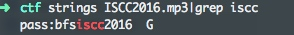

[EN](./introduction.md) | [ZH](./introduction-zh.md)
The audio-related CTF topics mainly use steganographic strategies, which are mainly divided into MP3 steganography, LSB steganography, waveform steganography, spectrum steganography, and so on.


## Common means


Information that can be found through `binwalk` and `strings` is not detailed.


## MP3 steganography


### Principle


MP3 steganography is mainly using the [Mp3Stego] (http://www.petitcolas.net/steganography/mp3stego/) tool for steganography. The basic introduction and usage are as follows:


> MP3Stego will hide information in MP3 files during the compression process. The data is first compressed, encrypted and then hidden in the MP3 bit stream.


```shell

encode -E hidden_text.txt -P pass svega.wav svega_stego.mp3

decode -X -P pass svega_stego.mp3

```


### Example


> ISCC-2016: Music Never Sleep


After the initial observation, no one was found by `strings`, and there was no abnormal guess in listening to the audio. The steganographic software was used to hide the data.





After getting the password, use `Mp3Stego` to decrypt it.


```shell

decode.exe -X ISCC2016.mp3 -P bfsiscc2016

```


Get the file `iscc2016.mp3.txt`:
```

Flag is SkYzWEk0M1JOWlNHWTJTRktKUkdJTVpXRzVSV0U2REdHTVpHT1pZPQ== ???

```


Get flag after Base64 &amp;&amp; Base32.


## Waveform


### Principle


Generally speaking, in the direction of the waveform, after observing the abnormality, the relevant software (Audacity, Adobe Audition, etc.) is used to observe the waveform law, and the waveform is further converted into a 01 string, etc., thereby extracting and converting the final flag.


### Example


> ISCC-2017: Misc-04


In fact, the hidden information in this question is in the first part of the audio. If you don&#39;t listen carefully, you may mistake it for steganography.


The high is 1 low and 0 is converted to get the `01` string.


```

110011011011001100001110011111110111010111011000010101110101010110011011101011101110110111011110011111101

```


Convert to ASCII, decrypt the Morse password and get the flag.


!!! note

Some of the more complicated ones may first perform a series of processing on the audio, such as filtering. For example [JarvisOJ - Voice of God Writeup] (https://www.40huo.cn/blog/jarvisoj-misc-writeup.html)


## Spectrum


### Principle


Spectral steganography in audio hides strings in the spectrum. Such audio usually has a more pronounced feature that sounds a bit murmur or harsh.


### Example


> Su-ctf-quals-2014:hear_with_your_eyes


## LSB audio steganography


### Principle


Similar to the LSB steganography in image steganography, there is also a corresponding LSB steganography in the audio. The [Silenteye] (http://silenteye.v1kings.io/) tool can be used mainly as follows:


> SilentEye is a cross-platform application design for an easy use of steganography, in this case hiding messages into pictures or sounds. It provides a pretty nice interface and an easy integration of new steganography algorithm and cryptography process by using a plug-ins system.


### Example


&gt; 2015 Guangdong Strong Net Cup - Little Apple


Just use `slienteye`.


## Extension


- [LSB in Audio] (https://ethackal.github.io/2015/10/05/derbycon-ctf-wav-steganography/)
- [Stealth Summary] (http://bobao.360.cn/learning/detail/243.html)