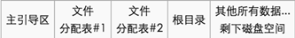

[EN](./introduction.md) | [ZH](./introduction-zh.md)
## Common tools

-   EasyRecovery

- MedAnalyze
- FTK
-   [Elcomsoft Forensic Disk Decryptor](https://ctf-wiki.github.io/ctf-tools/misc/#_6)

-   Volatility

## 磁盘

Common disk partition formats are as follows

-   Windows: FAT12 -> FAT16 -> FAT32 -> NTFS

-   Linux: EXT2 -> EXT3 -> EXT4

- FAT master disk structure

    

- Delete file: The first byte of the file name in the directory table is `e5`.

## VMDK

The VMDK file is essentially a virtual version of the physical hard disk. There are also similar fill areas in the partitions and sectors of the physical hard disk. We can use these filled areas to hide the data we need to hide, so as to avoid hiding. The files increase the size of the VMDK file (such as attaching directly to the file backend), and can also avoid virtual machine errors caused by changes in the size of the VMDK file. And VMDK files are generally large and suitable for hiding large files.

## RAM

- Resolve Windows / Linux / Mac OS X memory structure
- Analysis process, in-memory data
- Find clues and ideas based on the prompts, and extract specific memory data for the specified process

## topic

- Jarvis OJ - MISC - Forensics 2

## Reference

- [Data Hiding Technology] (http://wooyun.jozxing.cc/static/drops/tips-12614.html)