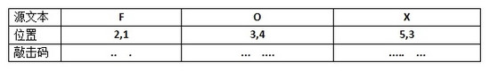

[EN](./communication.md) | [ZH](./communication-zh.md)
## Phone Dialing Code

1-9 uses 1-9 pulses respectively, and 0 means 10 pulses are used.

## Morse Encoding

See [Moors Coding - Wikipedia] (https://en.wikipedia.org/wiki/%E6%91%A9%E5%B0%94%E6%96%AF%E7%94%B5%E7%A0 %81), the corresponding table is as follows

### Features

- only `.` and `-`;
- up to 6 digits;
- It can also be represented by the `01` string.

### Tools

- [Moores Code Online Conversion] (http://www.zhongguosou.com/zonghe/moErSiCodeConverter.aspx)

### Title

- JarvisOJ - Basec - &quot;-.-string&quot;

## tapping code

Tap code is a way to encode text information in a very simple way. Because the code is named after the information is encoded by using a series of click sounds, the hit code is based on a 5 × 5 square Polibiz array, the difference is that the K letter is integrated into C. .

|Tap Code|1|2|3|4|5|

|--|--|--|--|--|--|

|1|A|B|C/K|D|E|

|2|F|G|H|I|J|

|3|L|M|N|O|P|

|4|Q|R|S|T|U|

| 5 | V | W | X | Y | Z |

## Manchester coding

- [Manchester Code - Wikipedia] (https://en.wikipedia.org/wiki/%E6%9B%BC%E5%BD%BB%E6%96%AF%E7%89%B9%E7%BC% 96%E7%A0%81)

## Gray coding

- [Gray Code - Wikipedia] (https://en.wikipedia.org/wiki/%E6%A0%BC%E9%9B%B7%E7%A0%81)