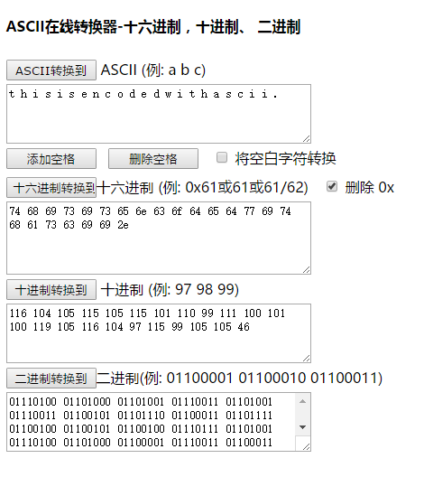
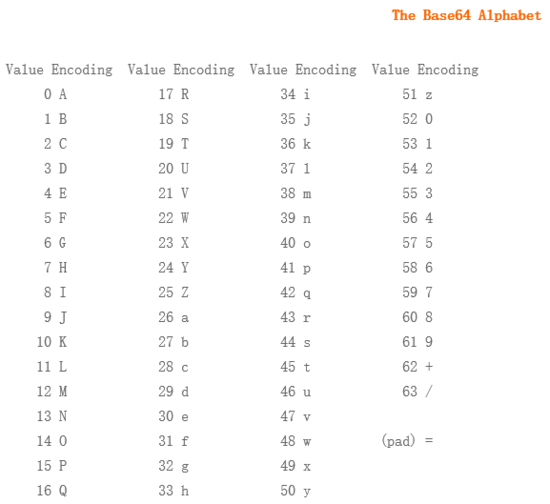
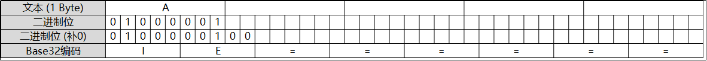

[EN](./computer.md) | [ZH](./computer-zh.md)
---

typora-root-url: ../../

---


This section describes some computer related coding.


## Alphabet Code


- AZ/az corresponds to 1-26 or 0-25


## ASCII encoding


### Features


The ascii encoding we generally use is visible characters, and mainly the following characters


- 0-9, 49-57

- AZ, 65-90
-, 97-122


### 变形


#### Binary code


Replace the number corresponding to the ascii code with a binary representation.


- only 0 and 1
- No more than 8 bits, generally 7 bits are also possible because visible characters are up to 127.
- Actually another ascii code.


#### hex code


Replace the number corresponding to the ascii code with a hexadecimal representation.


- AZ -&gt; 41-5 A
-&gt; 61-7 A


### Tools


- jpk, ascii to number, number to ascii

- http://www.ab126.com/goju/1711.html


### Examples





### 2018 DEFCON Quals ghettohackers: Throwback


The title is described below


```

Anyo!e!howouldsacrificepo!icyforexecu!!onspeedthink!securityisacomm!ditytop!urintoasy!tem!

```


The first point is that we should complete the content of these exclamation marks to get the flag, but after the completion is not enough, then we can divide the source string according to `!`, then the string length 1 corresponds to the letter a, length 2 Corresponding to the letter b, and so on


```shell

ori = 'Anyo!e!howouldsacrificepo!icyforexecu!!onspeedthink!securityisacomm!ditytop!urintoasy!tem!'

sp = ori.split (&#39;!&#39;)
print repr(''.join(chr(97 + len(s) - 1) for s in sp))

```


In turn, you can get assuming that 0 characters are spaces. Because this just makes the original readable.


```shell

dark logic

```


### Title


- Jarvis-basic-German password


## Base encoding


The xx in base xx indicates how many characters are used for encoding. For example, base64 uses the following 64 character encoding. Since the 6th power of 2 is equal to 64, each 6 bits is a unit corresponding to a printable character. . There are 24 bits for 3 bytes, corresponding to 4 Base64 units, ie 3 bytes need to be represented by 4 printable characters. It can be used as a transmission encoding for email. Printable characters in Base64 include the letters AZ, az, numbers 0-9, which have a total of 62 characters, and the two printable symbols differ in different systems.





See [Base64 - Wikipedia] for details (https://en.wikipedia.org/wiki/Base64).


**Code man**


! [base64 MAN MAN] (./ figure / base64_man.png)


If the number of bytes to be encoded cannot be divisible by 3, and there will be 1 or 2 more bytes at the end, you can use the following method: first use the value of 0 to make up at the end, so that it can be divisible by 3, and then Encode base64. Add one or two `=` numbers after the encoded base64 text to represent the number of bytes to complement. That is to say, when the last octet (one byte) remains, the last 6-bit base64 byte block has four bits with a value of 0, and finally two equal signs are appended; if the last two octets remain For a section (2 bytes), the last 6-bit base byte block has two digits of a value of 0, followed by an equal sign. Refer to the table below:


! [base64 补 0] (./figure/base64_0.png)


Since the complement 0 of the decoding does not participate in the operation, the information can be hidden there.


Similar to base64, base32 uses 32 visible characters for encoding, and 2&#39;s 5th power is 32, so 1 packet per 5 bits. The 5 bytes are 40 bits, which corresponds to 8 base32 packets, that is, 5 bytes are represented by 8 base32 characters. However, if it is less than 5 bytes, the first 5 bits smaller than 5 bits will be padded with 5 bits, and the remaining packets will be padded with &quot;=&quot; until the 5 bytes are filled. It can be seen that base32 has only 6 equal signs. E.g:





### Features


- There may be a `=` at the end of base64, but there are up to 2
- base32 may have a `=` at the end, but up to 6
- The character set will be limited depending on the base
- ** It may be necessary to add the equal sign **
- **=that is 3D**
- See [base rfc] for more information (https://tools.ietf.org/html/rfc4648)


### Tools


- http://www1.tc711.com/tool/BASE64.htm

- python library functions
- [Read steganographic information script] (https://github.com/cjcslhp/wheels/tree/master/b64stego)


### Examples


The description of the topic can be found in `ctf-challenge` [base64-stego directory of misc classification] (https://github.com/ctf-wiki/ctf-challenges/tree/master/misc/encode/computer/base64-stego) The data.txt file.


Use a script to read steganographic information.


``` python

import base64


def deStego (stegoFile):    b64table = "ABCDEFGHIJKLMNOPQRSTUVWXYZabcdefghijklmnopqrstuvwxyz0123456789+/"

    with open(stegoFile,'r') as stegoText:

        message = ""

        for line in stegoText:

            try:

                text = line[line.index("=") - 1:-1]

                message += "".join([ bin( 0 if i == '=' else b64table.find(i))[2:].zfill(6) for i in text])[2 if text.count('=') ==2 else 4:6]  

            except:

                pass

    return "".join([chr(int(message[i:i+8],2)) for i in range(0,len(message),8)])


print(deStego("text.txt"))

```


Output:


```

     flag{BASE64_i5_amaz1ng}

```


<!--

The following is the code of the original editor. The small problem with the code is that the search for steganographic characters is written with `last = line[-3]`. This method defaults to a &#39;\n&#39; at the end of each line, and the last line is not. , so the left last character shows an error.


A large series of Base64 ciphertext, try to fill 0 bits of data.


```python

# coding=utf-8

import base64

import re


result = []

with open('text.txt', 'r') as f:

    for line in f.readlines():

        if len(re.findall(r'=', line)) == 2:

            last = line[-4]

            if last.isupper():

num = word (last) - word (&#39;A&#39;)
            elif last.islower():

num = word (last) - word (&#39;a&#39;) + 26
elif last.isdigit ():
Surely = int (last) + 52
elif last == &#39;+&#39;:
num = 62
elif last == &#39;/&#39;:
num = 63
element = &#39;{0: 06b}&#39; format (num)
            result.append(elem[2:])


        elif len(re.findall(r'=', line)) == 1:

            last = line[-3]

            if last.isupper():

num = word (last) - word (&#39;A&#39;)
            elif last.islower():

num = word (last) - word (&#39;a&#39;) + 26
elif last.isdigit ():
Surely = int (last) + 52
elif last == &#39;+&#39;:
num = 62
elif last == &#39;/&#39;:
num = 63
element = &#39;{0: 06b}&#39; format (num)
            result.append(elem[4:])


flag_b = ''.join(result)

split = re.findall(r'.{8}', flag_b)

for i in split:

    print chr(int(i, 2)),

```


It feels like the program is a bit ill, but I can still see the flag.


```

flag{BASE64_i5_amaz1ng~

```

-->


### Title


## Huffman coding


See [Hoffman Coding] (https://en.wikipedia.org/wiki/%E9%9C%8D%E5%A4%AB%E6%9B%BC%E7%BC%96%E7%A0%81 ).


## XXencoding


XXencode encodes the input text in units of every three bytes. If the last remaining data is less than three bytes, the insufficient portion is filled with zeros. These three bytes have a total of 24 Bits and are divided into 4 groups in 6-bit units. Each group is expressed in decimal to indicate that the value that appears will only fall between 0 and 63. Replace with the position character of the corresponding value.


```text

           1         2         3         4         5         6

 0123456789012345678901234567890123456789012345678901234567890123

 |         |         |         |         |         |         |

 +-0123456789ABCDEFGHIJKLMNOPQRSTUVWXYZabcdefghijklmnopqrstuvwxyz

```


See [Wikipedia] for specific information (https://en.wikipedia.org/wiki/Xxencoding)


### Features


- only numbers, uppercase and lowercase letters
- +, -.


### Tools


- http://web.chacuo.net/charsetxxencode


### Title


## URL Encoding


See [URL Encoding - Wikipedia] (https://en.wikipedia.org/wiki/%E7%99%BE%E5%88%86%E5%8F%B7%E7%BC%96%E7%A0% 81).


### Features


- a large number of percent signs


### Tools


### Title


## Unicode encoding


See [Unicode - Wikipedia] (https://en.wikipedia.org/wiki/Unicode).


Note that it has four manifestations.


### Examples

Source text: `The`


&#x [Hex]:  `&#x0054;&#x0068;&#x0065;`


&# [Decimal]:  `&#00084;&#00104;&#00101;`


\U [Hex]:  `\U0054\U0068\U0065`


\U+ [Hex]:  `\U+0054\U+0068\U+0065`


### Tools


### Title


## HTML Entity Encoding