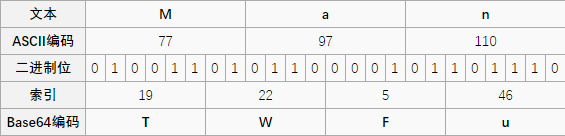
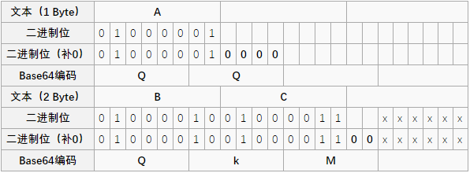

本节介绍一些计算机相关的编码。

## 字母表编码

- A-Z/a-z 对应 1-26 或者 0-25

## ASCII 编码


### 特点

我们一般使用的 ascii 编码的时候采用的都是可见字符，而且主要是如下字符

- 0-9, 49-57
- A-Z, 65-90
- a-z, 97-122

### 变形

#### 二进制编码

将 ascii 码对应的数字换成二进制表示形式。

- 只有 0 和 1
- 不大于 8 位，一般 7 位也可以，因为可见字符到 127。
- 其实是另一种 ascii 编码。

#### 十六进制编码

将 ascii 码对应的数字换成十六进制表示形式。

- A-Z-->41-5 A
- a-z-->61-7 A

### 工具

- jpk, ascii to number, number to ascii
- http://www.ab126.com/goju/1711.html

### 例子


### 2018 DEFCON Quals ghettohackers: Throwback

题目描述如下

```
Anyo!e!howouldsacrificepo!icyforexecu!!onspeedthink!securityisacomm!ditytop!urintoasy!tem!
```

第一直觉应该是我们去补全这些叹号对应的内容，从而得到 flag，但是补全后并不行，那么我们可以把源字符串按照 `!` 分割，然后字符串长度 1 对应字母a，长度 2 对应字母 b，以此类推

```shell
ori = 'Anyo!e!howouldsacrificepo!icyforexecu!!onspeedthink!securityisacomm!ditytop!urintoasy!tem!'
sp = ori.split('!')
print repr(''.join(chr(97 + len(s) - 1) for s in sp))
```

进而可以得到，这里同时需要假设 0 个字符为空格。因为这正好使得原文可读。

```shell
dark logic
```

### 题目

- Jarvis-basic-德军的密码

## Base 编码


base xx 中的 xx 表示的是采用多少个字符进行编码，比如说 base64 就是采用以下 64 个字符编码，由于 2 的 6 次方等于 64，所以每 6 个比特为一个单元，对应某个可打印字符。3个字节就有 24 个比特，对应于 4 个 Base64 单元，即 3 个字节需要用 4 个可打印字符来表示。它可用来作为电子邮件的传输编码。在 Base64 中的可打印字符包括字母 A-Z、a-z、数字 0-9，这样共有 62 个字符，此外两个可打印符号在不同的系统中而不同。


具体介绍参见 [Base64 - 维基百科](https://zh.wikipedia.org/wiki/Base64)。


**编码 man**



如果要编码的字节数不能被 3 整除，最后会多出 1 个或 2 个字节，那么可以使用下面的方法进行处理：先使用 0 值在末尾补足，使其能够被 3 整除，然后再进行 base64 的编码。在编码后的 base64 文本后加上一个或两个 `=` 号，代表补足的字节数。也就是说，当最后剩余一个八位字节（一个 byte）时，最后一个 6 位的 base64 字节块有四位是 0 值，最后附加上两个等号；如果最后剩余两个八位字节（2 个 byte）时，最后一个 6 位的 base 字节块有两位是 0 值，最后附加一个等号。参考下表：



由于解码时补位的 0 并不参与运算，可以在该处隐藏信息。

与 base64 类似，base32 使用 32 个可见字符进行编码，2 的 5 次方为 32，所以每 5 bit 为 1 个分组。5 字节为 40 bit，对应于 8 个 base32 分组，即 5 个字节用 8 个 base32 中字符来表示。但如果不足 5 个字节，则会先对第一个不足 5 bit 的分组用 0 补足了 5 bit ，对后面剩余分组全部使用 “=” 填充，直到补满 5 个字节。由此可知，base32 最多只有 6 个等号出现。例如：


### 特点

- base64 结尾可能会有 `=` 号，但最多有 2 个
- base32 结尾可能会有 `=` 号，但最多有 6 个
- 根据 base 的不同，字符集会有所限制
- **有可能需要自己加等号**
- **=也就是 3D**
- 更多内容请参见 [base rfc](https://tools.ietf.org/html/rfc4648)

### 工具

- http://www1.tc711.com/tool/BASE64.htm
- python 库函数
- [读取隐写信息脚本](https://github.com/cjcslhp/wheels/tree/master/b64stego)


### 例子

题目描述参见 `ctf-challenge`中 [misc 分类的 base64-stego 目录](https://github.com/ctf-wiki/ctf-challenges/tree/master/misc/encode/computer/base64-stego)中的 data.txt 文件。

使用脚本读取隐写信息。

``` python
import base64

def deStego(stegoFile):
    b64table = "ABCDEFGHIJKLMNOPQRSTUVWXYZabcdefghijklmnopqrstuvwxyz0123456789+/"
    with open(stegoFile,'r') as stegoText:
        message = ""
        for line in stegoText:
            try:
                text = line[line.index("=") - 1:-1]
                message += "".join([ bin( 0 if i == '=' else b64table.find(i))[2:].zfill(6) for i in text])[2 if text.count('=') ==2 else 4:6]  
            except:
                pass
    return "".join([chr(int(message[i:i+8],2)) for i in range(0,len(message),8)])

print(deStego("text.txt"))
```

输出:

```
     flag{BASE64_i5_amaz1ng}
```

<!--
下面是原编辑者的代码，代码的小毛病在于查找隐写字符用`last = line[-3]`写死了，这种写法默认每行尾有一个'\n',而最后一行并非如此，因此左后一个字符显示错误。

一大串 Base64 密文，试试补 0 位的数据。

```python
# coding=utf-8
import base64
import re

result = []
with open('text.txt', 'r') as f:
    for line in f.readlines():
        if len(re.findall(r'=', line)) == 2:
            last = line[-4]
            if last.isupper():
                num = ord(last) - ord('A')
            elif last.islower():
                num = ord(last) - ord('a') + 26
            elif last.isdigit():
                num = int(last) + 52
            elif last == '+':
                num = 62
            elif last == '/':
                num = 63
            elem = '{0:06b}'.format(num)
            result.append(elem[2:])

        elif len(re.findall(r'=', line)) == 1:
            last = line[-3]
            if last.isupper():
                num = ord(last) - ord('A')
            elif last.islower():
                num = ord(last) - ord('a') + 26
            elif last.isdigit():
                num = int(last) + 52
            elif last == '+':
                num = 62
            elif last == '/':
                num = 63
            elem = '{0:06b}'.format(num)
            result.append(elem[4:])

flag_b = ''.join(result)
split = re.findall(r'.{8}', flag_b)
for i in split:
    print chr(int(i, 2)),
```

感觉像是程序有点毛病，不过还是能看出来 flag。

```
flag{BASE64_i5_amaz1ng~
```
-->

### 题目


## 霍夫曼编码

参见 [霍夫曼编码](https://zh.wikipedia.org/wiki/%E9%9C%8D%E5%A4%AB%E6%9B%BC%E7%BC%96%E7%A0%81)。

## XXencoding

XXencode 将输入文本以每三个字节为单位进行编码。如果最后剩下的资料少于三个字节，不够的部份用零补齐。这三个字节共有 24 个 Bit，以 6bit 为单位分为 4 个组，每个组以十进制来表示所出现的数值只会落在 0 到 63 之间。以所对应值的位置字符代替。

```text
           1         2         3         4         5         6
 0123456789012345678901234567890123456789012345678901234567890123
 |         |         |         |         |         |         |
 +-0123456789ABCDEFGHIJKLMNOPQRSTUVWXYZabcdefghijklmnopqrstuvwxyz
```

具体信息参见[维基百科](https://en.wikipedia.org/wiki/Xxencoding)

### 特点

- 只有数字，大小写字母
- +号，-号。

### 工具

- http://web.chacuo.net/charsetxxencode

### 题目

## URL 编码

参见[ URL 编码 - 维基百科](https://zh.wikipedia.org/wiki/%E7%99%BE%E5%88%86%E5%8F%B7%E7%BC%96%E7%A0%81)。

### 特点

- 大量的百分号

### 工具

### 题目

## Unicode 编码

参见[ Unicode - 维基百科](https://zh.wikipedia.org/wiki/Unicode)。

注意，它有四种表现形式。

### 例子

源文本： `The`

&#x [Hex]:  `&#x0054;&#x0068;&#x0065;`

&# [Decimal]:  `&#00084;&#00104;&#00101;`

\U [Hex]:  `\U0054\U0068\U0065`

\U+ [Hex]:  `\U+0054\U+0068\U+0065`

### 工具

### 题目

## HTML 实体编码
