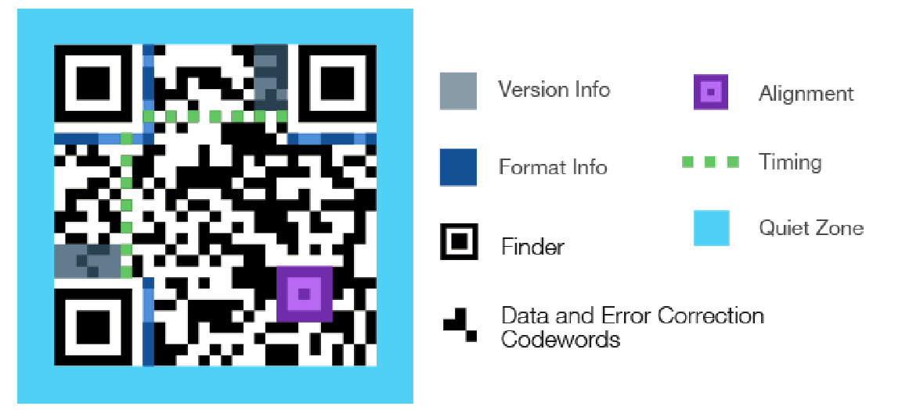

[EN](./modern.md) | [ZH](./modern-zh.md)
## 条形码

-   宽度不等的多个黑条和空白，按照一定的编码规则排列，用以表达一组信息的图形标识符
-   国际标准
-   EAN-13 商品标准，13 位数字
-   Code-39：39 字符
-   Code-128：128 字符
-   [条形码在线识别](https://online-barcode-reader.inliteresearch.com/)

## 二维码

-   用某种特定几何图形按一定规律在平面分步的黑白相间的图形记录数据符号信息
-   堆叠式 / 行排式二维码：Code 16 k、Code 49、PDF417
-   矩阵式二维码：QR CODE

    

    
