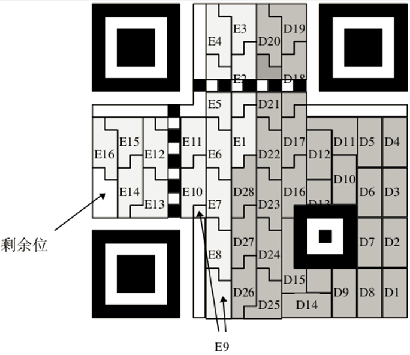

[EN](./modern.md) | [ZH](./modern-zh.md)
## Barcode

- Multiple black bars and spaces of varying width, arranged according to certain coding rules, to represent a graphical identifier of a set of information
- International standards
- EAN-13 product standard, 13 digits
- Code-39:39 characters
- Code-128: 128 characters
- [Barcode Online Identification] (https://online-barcode-reader.inliteresearch.com/)

## QR code

- Recording data symbol information in a black and white pattern in a step-by-step manner with a certain geometry
- Stacked / row type QR code: Code 16 k, Code 49, PDF417
- Matrix QR code: QR CODE

    

    
