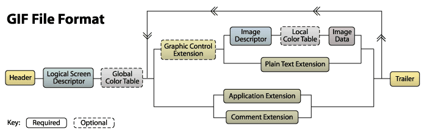
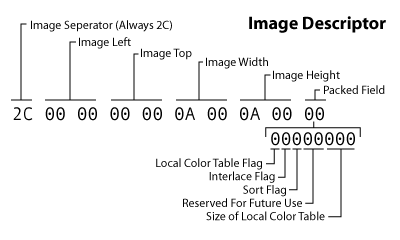

[EN](./gif.md) | [ZH](./gif-zh.md)
## File Structure


The structure of a GIF file can be divided into


- File Header
- GIF file signature (Signature)
- Version number (Version)
- GIF Data Stream
- Control identifier
- Image Block
- Some other extension blocks
- File Terminator (Trailer)


The following table shows the structure of a GIF file:





The big chunk in the middle can be repeated any number of times


### File header


GIF signature (Signature) and version number (Version). The GIF signature is used to confirm whether a file is in GIF format. This part consists of three characters: `GIF`; the file version number is also composed of three bytes, which can be `87a` or `89a`.


### Logical Screen Descriptor


The Logical Screen Descriptor follows the header. This block tells the decoder that the image needs to take up space. It is fixed to 7 bytes in size and starts with canvas width and canvas height.


### Global Color Table


The GIF format can have a global color table or a local color table for each sub-picture set. Each color
The table consists of a list of RGBs (like the one we usually see (255,0,0) red).


### Image Descriptor


A GIF file typically contains multiple images. The previous image rendering mode is generally to draw multiple images to a large (virtual
Canvas) on the virtual canvas, and now these collections are generally used to implement animation.


Each image begins with an image descriptor block, which is fixed to 10 bytes.





### Image Data (Image Data)


Finally arrived at the place where the image data is actually stored. Image Data is made up of a series of output codes that tell the decoder that each color information needs to be drawn on the canvas. These codes are organized in this block in the form of bytecode.


### File Terminator (Trailer)


The block is a single field block that indicates the end of the data stream. Take a fixed value of 0x3b.


See [gif format image detail analysis] (http://www.jianshu.com/p/df52f1511cf8)


## space axis


Since the dynamic characteristics of the GIF are composed of pictures of one frame, the combination of pictures of each frame and multiple frames of pictures becomes a carrier of hidden information.


For GIF files that need to be separated, you can use the `convert` command to separate each frame.


``` sourceCode shell

root in ~/Desktop/tmp λ convert cake.gif cake.png

root in ~/Desktop/tmp λ ls

cake-0.png  cake-1.png  cake-2.png  cake-3.png  cake.gif

```


### Example


> WDCTF-2017:3-2


After opening the gif, the idea is very clear. After separating each frame of the picture, it will be merged to get the complete QR code.


``` sourceCode python

from  PIL import Image


flag = Image.new("RGB",(450,450))


for i in range(2):

    for j in range(2):

        pot = "cake-{}.png".format(j+i*2)

potImage = Image.open (pot)
flag.paste (potImage, (j * 225, i * 225))
flag.save('./flag.png')

```


After scanning the code, get a string of hexadecimal strings


`03f30d0ab8c1aa5 .... 74080006030908`


Start `03f3` as the header of the `pyc` file, restore it to the `python` script and run it directly to get the flag


## Timeline


The time interval between each frame of a GIF file can also serve as a carrier for information hiding.


For example, at the time of the XMan selection contest


> XMAN-2017:100.gif


Clearly print out the time interval of each frame with the `identify` command


```shell

$ identify -format "%s %T \n" 100.gif

0 66

1 66

2 20

3 10

4 20

5 10

6 10

7 20

8 20

9 20

10 20

11 10

12 20

13 20

14 10

15 10

```


Infer that `20 &amp; 10` represent `0 &amp; 1`, extract each frame interval and convert.


```shell

$ cat flag|cut -d ' ' -f 2|tr -d '66'|tr -d '\n'|tr -d '0'|tr '2' '0'

0101100001001101010000010100111001111011001110010011011000110101001101110011010101100010011001010110010101100100001101000110010001100101011000010011000100111000011001000110010101100100001101000011011100110011001101010011011000110100001100110110000101100101011000110110011001100001001100110011010101111101#

```


Finally, the ASCII code is used to get the flag.

## 隐写软件


- [F5-steganography](https://github.com/matthewgao/F5-steganography)
