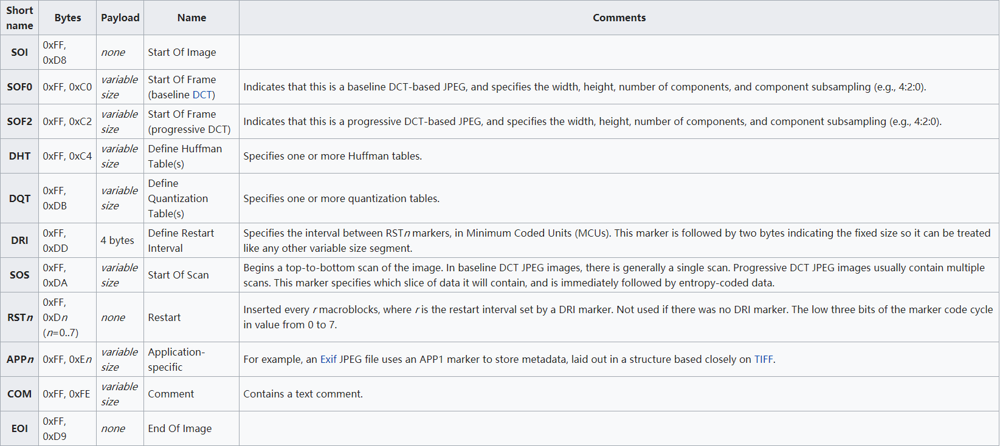

## 文件结构

-   JPEG 是有损压缩格式，将像素信息用 JPEG 保存成文件再读取出来，其中某些像素值会有少许变化。在保存时有个质量参数可在 0 至 100 之间选择，参数越大图片就越保真，但图片的体积也就越大。一般情况下选择 70 或 80 就足够了
-   JPEG 没有透明度信息

JPG 基本数据结构为两大类型：「段」和经过压缩编码的图像数据。

| 名 称   | 字节数 | 数据 | 说明                                        |
| ------- | ------ | ---- | ------------------------------------------- |
| 段 标识 | 1      | FF   | 每个新段的开始标识                          |
| 段类型  | 1      |      | 类型编码（称作标记码）                      |
| 段长 度 | 2      |      | 包括段内容和段长度本身,不包括段标识和段类型 |
| 段内容  | 2      |      | ≤65533字节                                  |

-   有些段没有长度描述也没有内容，只有段标识和段类型。文件头和文件尾均属于这种段。
-   段与段之间无论有多少 `FF` 都是合法的，这些 `FF` 称为「填充字节」，必须被忽略掉。

一些常见的段类型



`0xffd8` 和 `0xffd9`为 JPG 文件的开始结束的标志。

## 隐写软件

### [Stegdetect](https://github.com/redNixon/stegdetect)

通过统计分析技术评估 JPEG 文件的 DCT 频率系数的隐写工具, 可以检测到通过 JSteg、JPHide、OutGuess、Invisible
Secrets、F5、appendX 和 Camouflage 等这些隐写工具隐藏的信息，并且还具有基于字典暴力破解密码方法提取通过 Jphide、outguess 和 jsteg-shell 方式嵌入的隐藏信息。

```shell
-q 仅显示可能包含隐藏内容的图像。
-n 启用检查JPEG文件头功能，以降低误报率。如果启用，所有带有批注区域的文件将被视为没有被嵌入信息。如果JPEG文件的JFIF标识符中的版本号不是1.1，则禁用OutGuess检测。
-s 修改检测算法的敏感度，该值的默认值为1。检测结果的匹配度与检测算法的敏感度成正比，算法敏感度的值越大，检测出的可疑文件包含敏感信息的可能性越大。
-d 打印带行号的调试信息。
-t 设置要检测哪些隐写工具（默认检测jopi），可设置的选项如下：
j 检测图像中的信息是否是用jsteg嵌入的。
o 检测图像中的信息是否是用outguess嵌入的。
p 检测图像中的信息是否是用jphide嵌入的。
i 检测图像中的信息是否是用invisible secrets嵌入的。
```

### [JPHS](http://linux01.gwdg.de/~alatham/stego.html)

JPEG 图像的信息隐藏软件 JPHS，它是由 Allan Latham 开发设计实现在 Windows 和 Linux 系统平台针对有损压缩 JPEG 文件进行信息加密隐藏和探测提取的工具。软件里面主要包含了两个程序 JPHIDE和 JPSEEK。JPHIDE 程序主要是实现将信息文件加密隐藏到 JPEG 图像功能，而 JPSEEK 程序主要实现从用 JPHIDE 程序加密隐藏得到的 JPEG 图像探测提取信息文件，Windows 版本的 JPHS 里的 JPHSWIN 程序具有图形化操作界面且具备 JPHIDE 和 JPSEEK 的功能。

### [SilentEye](http://silenteye.v1kings.io/)

> SilentEye is a cross-platform application design for an easy use of steganography, in this case hiding messages into pictures or sounds. It provides a pretty nice interface and an easy integration of new steganography algorithm and cryptography process by using a plug-ins system.
