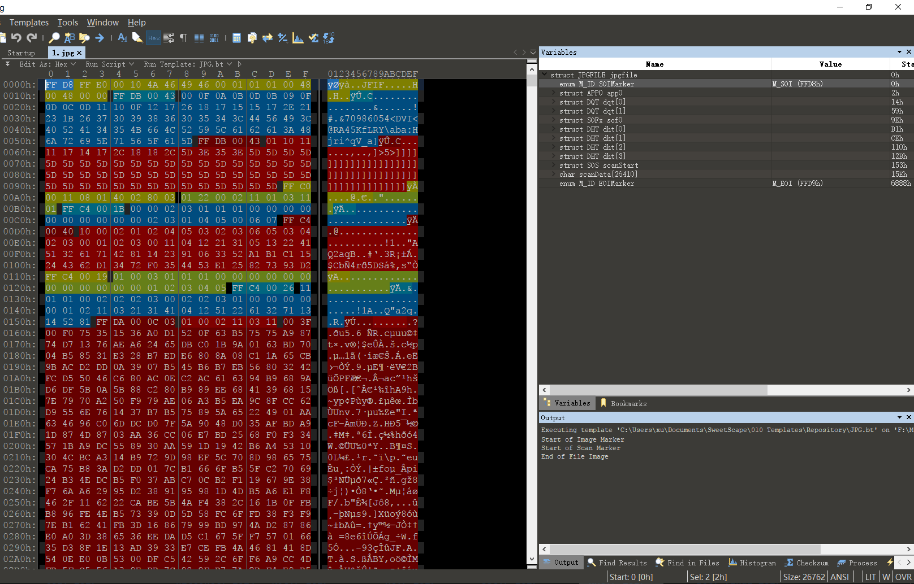

[EN](./prefix.md) | [ZH](./prefix-zh.md)
大部分的 CTF 比赛中，取证及隐写两者密不可分，两者所需要的知识也相辅相成，所以这里也将对两者一起介绍。

任何要求检查一个静态数据文件从而获取隐藏信息的都可以被认为是隐写取证题（除非单纯地是密码学的知识），一些低分的隐写取证又常常与古典密码学结合在一起，而高分的题目则通常用与一些较为复杂的现代密码学知识结合在一起，很好地体现了 Misc 题的特点。

## 前置技能

-   了解常见的编码

    能够对文件中出现的一些编码进行解码，并且对一些特殊的编码（Base64、十六进制、二进制等）有一定的敏感度，对其进行转换并得到最终的 flag。

-   能够利用脚本语言（Python 等）去操作二进制数据
-   熟知常见文件的文件格式，尤其是各类 [文件头](https://en.wikipedia.org/wiki/List_of_file_signatures)、协议、结构等
-   灵活运用常见的工具

## Python 操作二进制数据

### struct 模块

有的时候需要用 Python 处理二进制数据，比如，存取文件，socket 操作时。这时候，可以使用 Python 的 struct 模块来完成。

struct 模块中最重要的三个函数是 `pack()`、`unpack()` 和 `calcsize()`

-   `pack(fmt, v1, v2, ...)` 按照给定的格式（fmt），把数据封装成字符串（实际上是类似于c结构体的字节流）
-   `unpack(fmt, string)` 按照给定的格式（fmt）解析字节流 string，返回解析出来的 tuple
-   `calcsize(fmt)` 计算给定的格式（fmt）占用多少字节的内存

这里打包格式 `fmt` 确定了将变量按照什么方式打包成字节流，其包含了一系列的格式字符串。这里就不再给出不同格式字符串的含义了，详细细节可以参照 [Python Doc](https://docs.python.org/2/library/struct.html)

```python
>>> import struct
>>> struct.pack('>I',16)
'\x00\x00\x00\x10'
```

`pack` 的第一个参数是处理指令，`'>I'` 的意思是：`>` 表示字节顺序是 Big-Endian，也就是网络序，`I` 表示 4 字节无符号整数。

后面的参数个数要和处理指令一致。

读入一个 BMP 文件的前 30 字节，文件头的结构按顺序如下

-   两个字节：`BM` 表示 Windows 位图，`BA` 表示 OS/2 位图
-   一个 4 字节整数：表示位图大小
-   一个 4 字节整数：保留位，始终为 0
-   一个 4 字节整数：实际图像的偏移量
-   一个 4 字节整数：Header 的字节数
-   一个 4 字节整数：图像宽度
-   一个 4 字节整数：图像高度
-   一个 2 字节整数：始终为 1
-   一个 2 字节整数：颜色数

```python
>>> import struct
>>> bmp = '\x42\x4d\x38\x8c\x0a\x00\x00\x00\x00\x00\x36\x00\x00\x00\x28\x00\x00\x00\x80\x02\x00\x00\x68\x01\x00\x00\x01\x00\x18\x00'
>>> struct.unpack('<ccIIIIIIHH',bmp)
('B', 'M', 691256, 0, 54, 40, 640, 360, 1, 24)
```

### bytearray 字节数组

将文件以二进制数组形式读取

```python
data = bytearray(open('challenge.png', 'rb').read())
```

字节数组就是可变版本的字节

```python
data[0] = '\x89'
```

## 常用工具

### [010 Editor](http://www.sweetscape.com/010editor/)

SweetScape 010 Editor 是一个全新的十六进位文件编辑器，它有别于传统的十六进位编辑器在于它可用「范本」来解析二进位文件，从而让你读懂和编辑它。它还可用来比较一切可视的二进位文件。

利用它的模板功能可以非常轻松的观察文件内部的具体结构并且依此快速更改内容。



### `file` 命令

`file` 命令根据文件头（魔法字节）去识别一个文件的文件类型。

```shell
root in ~/Desktop/tmp λ file flag
flag: PNG image data, 450 x 450, 8-bit grayscale, non-interlaced
```

### `strings` 命令

打印文件中可打印的字符，经常用来发现文件中的一些提示信息或是一些特殊的编码信息，常常用来发现题目的突破口。

-   可以配合 `grep` 命令探测指定信息

    ```shell
    strings test|grep -i XXCTF
    ```

-   也可以配合 `-o` 参数获取所有 ASCII 字符偏移

    ```shell
    root in ~/Desktop/tmp λ strings -o flag|head
        14 IHDR
        45 gAMA
        64  cHRM
        141 bKGD
        157 tIME
        202 IDATx
        223 NFdVK3
        361 |;*-
        410 Ge%<W
        431 5duX@%
    ```

### `binwalk` 命令

binwalk 本是一个固件的分析工具，比赛中常用来发现多个文件粘合再在一起的情况。根据文件头去识别一个文件中夹杂的其他文件，有时也会存在误报率（尤其是对Pcap流量包等文件时）。

```shell
root in ~/Desktop/tmp λ binwalk flag

DECIMAL       HEXADECIMAL     DESCRIPTION
--------------------------------------------------------------------------------
0             0x0             PNG image, 450 x 450, 8-bit grayscale, non-interlaced
134           0x86            Zlib compressed data, best compression
25683         0x6453          Zip archive data, at least v2.0 to extract, compressed size: 675, uncompressed size: 1159, name: readme.txt
26398         0x671E          Zip archive data, at least v2.0 to extract, compressed size: 430849, uncompressed size: 1027984, name: trid
457387        0x6FAAB         End of Zip archive
```

配合 `-e` 参数可以进行自动化提取。

也可以结合 `dd` 命令进行手动切割。

```shell
root in ~/Desktop/tmp λ dd if=flag of=1.zip bs=1 skip=25683
431726+0 records in
431726+0 records out
431726 bytes (432 kB, 422 KiB) copied, 0.900973 s, 479 kB/s
```
