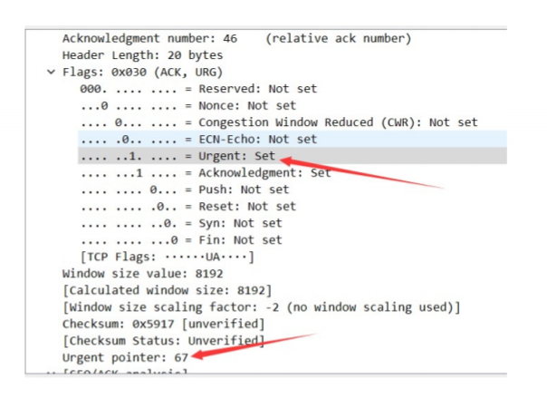

[EN](./data.md) | [ZH](./data-zh.md)
This piece is another key point in the traffic package. Through the analysis of the protocol, the key points of the problem are found. How to extract the data becomes the next key issue.


## wireshark


### wireshark automatic analysis


`file -> export objects -> http`


### Manual Data Extraction


`file->export selected Packet Bytes`


## quotes


As a command-line version of wireshark, tshark is an efficient and fast feature. It can be used flexibly with other command-line tools (awk, grep) to quickly locate and extract data, thus eliminating the need for complicated scripting.


Look at the `Google CTF 2016 Forensic-200` question, you can quickly solve the problem through tshark


`shoe
what@kali:/tmp$ tshark -r capture.pcapng -T fields -e usb.capdata > data2.txt

what@kali:/tmp$ # awk -F: 'function comp(v){if(v>127)v-=256;return v}{x+=comp(strtonum("0x"$2));y+=comp(strtonum("0x"$3))}$1=="01"{print x,y}' data.txt > data3.txt

what@kali:/tmp$ gnuplot

> plot "data3.txt"

```


- Step 1 Data extraction in the mouse protocol
- Step 2 Position coordinate conversion by awk
- Step 3 Forming a graphic


---


### Common methods


> `tshark -r **.pcap –Y ** -T fields –e ** | **** > data`


```

Usage:

  -Y <display filter>      packet displaY filter in Wireshark display filter

                           syntax

  -T pdml|ps|psml|json|jsonraw|ek|tabs|text|fields|?

                           format of text output (def: text)

  -e <field>               field to print if -Tfields selected (e.g. tcp.port,

                           _ws.col.Info)

```


Pass the `-Y` filter (consistent with wireshark), then use `-T filds -e` with the specified data segment (such as usb.capdata)


- `tips`

- The parameter after `-e` is undefined. You can right click on the required data by `wireshark`.


### Example


> 题目：`google-ctf-2016 : a-cute-stegosaurus-100`


The data hiding of this question is very clever, and there is a picture confused and needs to be very familiar with the `tcp` protocol, so there were not many people who made it at the time. There are only `26` teams in the world.


There are 6Bit state control codes in the `tcp` segment, as follows


- URG: Urgent. When URG=1, it indicates that the emergency pointer field is valid, indicating that the packet is an emergency packet. It tells the system that there is urgent data in this segment and should be transmitted as soon as possible (equivalent to high priority data)
- ACK: Acknowledge bit. The acknowledgment number field is valid only when ACK=1, which means that the packet is an acknowledgment packet. When ACK=0, the confirmation number is invalid.
- PSH: (Push function) If it is 1, it means that the other party is required to immediately transmit other corresponding packets in the buffer, without having to wait for the buffer to be full.
- RST: Reset bit (Reset). When RST=1, it indicates that there is a serious error in the TCP connection (such as due to host crash or other reasons), the connection must be released, and then the transport connection is re-established.
- SYN: Synchronous, SYN is set to 1, it means that this is a connection request or connection accept message, usually the packet with the SYN flag means &quot;active&quot; to connect to the other party. .
- FIN: The terminating bit (Final) is used to release a connection. When FIN=1, it indicates that the data of the sender of this segment has been sent and requests to release the transport connection.


And the `tcp.urg` here is





Extract the `tcp.urg` by tshark and then remove the 0 field, the newline is changed to `,` directly into the python list, and the ascii can be used to get the flag.


```

⚡ root@kali:  tshark -r Stego-200_urg.pcap -T fields -e  tcp.urgent_pointer|egrep -vi "^0$"|tr '\n' ','

Running as user "root" and group "root". This could be dangerous.

67,84,70,123,65,110,100,95,89,111,117,95,84,104,111,117,103,104,116,95,73,116,95,87,97,115,95,73,110,95,84,104,101,95,80,105,99,116,117,114,101,125,#

...

&gt;&gt;&gt; print &quot;&quot;.join([chr(x) for x in arr]) #python convert ascii
CTF{And_You_Thought_It_Was_In_The_Picture}

```


&gt; Topic: `stego-150_ears.xz`


**Step 1**


Decompress the `pcap` file with the `file` command


```shell

➜  Desktop file ears

ears: XZ compressed data

➜  Desktop unxz < ears > file_1

➜  Desktop file file_1

file_1: POSIX tar archive

➜  Desktop 7z x file_1


7-Zip [64] 16.02 : Copyright (c) 1999-2016 Igor Pavlov : 2016-05-21

p7zip Version 16.02 (locale=en_US.UTF-8,Utf16=on,HugeFiles=on,64 bits,1 CPU Intel(R) Core(TM) i7-4710MQ CPU @ 2.50GHz (306C3),ASM,AES-NI)


    Scanning the drive for archives:

    1 file, 4263936 bytes (4164 KiB)


    Extracting archive: file_1

    --

    Path = file_1

Type = tar
    Physical Size = 4263936

    Headers Size = 1536

    Code Page = UTF-8


    Everything is Ok


    Size:       4262272

    Compressed: 4263936

```


**Step 2**


Through the `wireshark` found that there is an exception in the response name in `dns`, forming a `16` binary `png` file.


Use `tshark` to extract, extract the data in `dns`, and filter the specific message form `\w{4,}.asis.io`


`tshark -r forensic_175_d78a42edc01c9104653776f16813d9e5 -T fields -e dns.qry.name -e dns.flags|grep 8180|awk '{if ($1~/\w{4,}.asis.io/) print $1}'|awk -F '.' '{print $1}'|tr -d '\n' > png`


**Step 3**


`16` binary restore picture

`xxd -p -r png flag`


## Custom Agreement


There is a special case of extracting data, that is, the transmitted data itself uses a custom protocol. The following two Miscs of `HITCON 2018` are used as an example.


### Example analysis


- [HITCON-2018 : ev3 basic](https://github.com/ctf-wiki/ctf-challenges/tree/master/misc/cap/2018HITCON-ev3-basic)


- [HITCON-2018 : ev3 scanner](https://github.com/ctf-wiki/ctf-challenges/tree/master/misc/cap/2018HITCON-ev3-scanner)


**ev3 basic**


#### Determining data


For such topics, first analyze which packages the valid data is in. Observe the traffic, both sides of the communication are `localhost` and `LegoSystem`. A large number of data packets marked with `PKTLOG` are logs, so there is no need to pay attention to this issue. A brief look at the traffic of the remaining protocols reveals that there are only `data` segments in the `RFCOMM` protocol that are not resolved by `wireshark`, and `RFCOMM` is the [transport layer protocol] used by Bluetooth (https://en.wikipedia) One of .org/wiki/List_of_Bluetooth_protocols#Radio_frequency_communication_(RFCOMM)).


According to the aforementioned `tshark` related introduction, you can extract data by the following command:


`tshark -r .\ev3_basic.pklg -T fields -e data -Y "btrfcomm"`


#### Analysis Protocol


Once the data is found, you need to determine the data format. For information on how to find information, please refer to the section called “Information Collection Technology”, which will not be repeated here. In short, starting with the keyword `ev3`, we finally know that the content transmitted by this communication method is called [Direct Command] (http://ev3directcommands.blogspot.com/2016/01/no-title-specified-page -table-border_94.html), which uses a custom [Simple Application Layer Protocol] (https://le-www-live-s.legocdn.com/sc/media/files/ev3-developer) -kit/lego%20mindstorms%20ev3%20communication%20developer%20kit-f691e7ad1e0c28a4cfb0835993d76ae3.pdf?la=en-us), `Command` itself format by LEGO&#39;s manual [EV3 Firmware Developer Kit] (http://www.lego. Com/en-gb/mindstorms/downloads) Definition. *(The search process is not as simple and intuitive as here, and is one of the key points of this question.)*


In LEGO&#39;s protocol, sending and replying follow different formats. In `ev3 basic`, all reply traffic is the same. According to the manual, the content represents `ok`, which has no actual meaning, and each packet sent contains an instruction. The `Opcode` parsed by the protocol format is `0x84`, which stands for `UI_DRAW` function, and `CMD` is `0x05` for `TEXT`. Then there are four parameters, `Color`, `X0`, `Y0`, `STRING`. It should be noted here that the number of single parameter bytes of LEGO is not fixed. Even if the data type is `DATA16`, it is still possible to use a byte length parameter. You need to refer to the `Parameter encoding` section of the manual and [Related Article] (http://ev3directcommands.blogspot.com/2016/01/ev3-direct-commands-lesson-02-pre.html).


Try analyzing a few commands and find that each instruction prints a character at a specific location on the screen, which matches the image provided.


#### process result


After understanding the data content, extract all the commands and parse the parameters through the script. It is necessary to note that the number of bytes of a single parameter is not fixed.


Once you have the parameters for all the commands, you can draw each character on the screen in coordinates. The simpler method is to press `X` and then press `Y` to sort and output directly.


**ev3 scanner**


The second question is basically the same as the first question. The difficulty increases:


- The command sent is no longer single, including reading sensor information and controlling ev3 motion


- The reply also contains information, mainly what the sensor reads.


- The parameters of the function are more complicated and the resolution is more difficult


- The result of parsing the command requires more processing


`ev3 scanner` No detailed method is provided here, as an exercise to deepen the understanding of this type of topic.


### Python Script


ALL

