[EN](./fix.md) | [ZH](./fix-zh.md)
## PCAP file structure


In general, there are few investigations about the `PCAP` file format, and usually can be directly repaired by means of off-the-shelf tools such as `pcapfix`. Here are some common blocks. For details, you can look at [Here] (http: //www.tcpdump.org/pcap/pcap.html).


- Tools

    - [PcapFix Online](https://f00l.de/hacking/pcapfix.php)

    - [PcapFix](https://github.com/Rup0rt/pcapfix/tree/devel)


General file structure


```shell

    0                   1                   2                   3   

    0 1 2 3 4 5 6 7 8 9 0 1 2 3 4 5 6 7 8 9 0 1 2 3 4 5 6 7 8 9 0 1

   +-+-+-+-+-+-+-+-+-+-+-+-+-+-+-+-+-+-+-+-+-+-+-+-+-+-+-+-+-+-+-+-+

   |                          Block Type                           |

   +-+-+-+-+-+-+-+-+-+-+-+-+-+-+-+-+-+-+-+-+-+-+-+-+-+-+-+-+-+-+-+-+

   |                      Block Total Length                       |

   +-+-+-+-+-+-+-+-+-+-+-+-+-+-+-+-+-+-+-+-+-+-+-+-+-+-+-+-+-+-+-+-+

   /                          Block Body                           /

   /          /* variable length, aligned to 32 bits */            /

   +-+-+-+-+-+-+-+-+-+-+-+-+-+-+-+-+-+-+-+-+-+-+-+-+-+-+-+-+-+-+-+-+

   |                      Block Total Length                       |

   +-+-+-+-+-+-+-+-+-+-+-+-+-+-+-+-+-+-+-+-+-+-+-+-+-+-+-+-+-+-+-+-+

```


The common block types currently defined are


1. Section Header Block: it defines the most important characteristics of the capture file.

2. Interface Description Block: it defines the most important characteristics of the interface(s) used for capturing traffic.

3. Packet Block: it contains a single captured packet, or a portion of it.

4. Simple Packet Block: it contains a single captured packet, or a portion of it, with only a minimal set of information about it.

5. Name Resolution Block: it defines the mapping from numeric addresses present in the packet dump and the canonical name counterpart.

6. Capture Statistics Block: it defines how to store some statistical data (e.g. packet dropped, etc) which can be useful to undestand the conditions in which the capture has been made.


## Common block


### Section Header BlocK (File Header)


Must exist, meaning the beginning of the file


```shell

    0                   1                   2                   3   

    0 1 2 3 4 5 6 7 8 9 0 1 2 3 4 5 6 7 8 9 0 1 2 3 4 5 6 7 8 9 0 1

   +-+-+-+-+-+-+-+-+-+-+-+-+-+-+-+-+-+-+-+-+-+-+-+-+-+-+-+-+-+-+-+-+

   |                Byte-Order Magic (0x1A2B3C4D)                  |

   +-+-+-+-+-+-+-+-+-+-+-+-+-+-+-+-+-+-+-+-+-+-+-+-+-+-+-+-+-+-+-+-+

| Major Version ( major version number) | Minor Version (minor version number) |
   +-+-+-+-+-+-+-+-+-+-+-+-+-+-+-+-+-+-+-+-+-+-+-+-+-+-+-+-+-+-+-+-+

   |                                                               |

   |                          Section Length                       |

   |                                                               |

   +-+-+-+-+-+-+-+-+-+-+-+-+-+-+-+-+-+-+-+-+-+-+-+-+-+-+-+-+-+-+-+-+

   /                                                               /

   /                      Options (variable)                       /

   /                                                               /

   +-+-+-+-+-+-+-+-+-+-+-+-+-+-+-+-+-+-+-+-+-+-+-+-+-+-+-+-+-+-+-+-+

```


### Interface Description Block (interface description)


Must exist, describe interface characteristics


```shell

    0                   1                   2                   3   

    0 1 2 3 4 5 6 7 8 9 0 1 2 3 4 5 6 7 8 9 0 1 2 3 4 5 6 7 8 9 0 1

   +-+-+-+-+-+-+-+-+-+-+-+-+-+-+-+-+-+-+-+-+-+-+-+-+-+-+-+-+-+-+-+-+

   |           LinkType            |           Reserved            |

   +-+-+-+-+-+-+-+-+-+-+-+-+-+-+-+-+-+-+-+-+-+-+-+-+-+-+-+-+-+-+-+-+

| SnapLen (maximum number of bytes per packet) |
   +-+-+-+-+-+-+-+-+-+-+-+-+-+-+-+-+-+-+-+-+-+-+-+-+-+-+-+-+-+-+-+-+

   /                                                               /

   /                      Options (variable)                       /

   /                                                               /

   +-+-+-+-+-+-+-+-+-+-+-+-+-+-+-+-+-+-+-+-+-+-+-+-+-+-+-+-+-+-+-+-+

```


### Packet Block(数据块)


```sh

    0                   1                   2                   3   

    0 1 2 3 4 5 6 7 8 9 0 1 2 3 4 5 6 7 8 9 0 1 2 3 4 5 6 7 8 9 0 1

   +-+-+-+-+-+-+-+-+-+-+-+-+-+-+-+-+-+-+-+-+-+-+-+-+-+-+-+-+-+-+-+-+

   |         Interface ID          |          Drops Count          |

   +-+-+-+-+-+-+-+-+-+-+-+-+-+-+-+-+-+-+-+-+-+-+-+-+-+-+-+-+-+-+-+-+

| Timestamp (High) Standard Unix format |
   +-+-+-+-+-+-+-+-+-+-+-+-+-+-+-+-+-+-+-+-+-+-+-+-+-+-+-+-+-+-+-+-+

   |                        Timestamp (Low)                        |

   +-+-+-+-+-+-+-+-+-+-+-+-+-+-+-+-+-+-+-+-+-+-+-+-+-+-+-+-+-+-+-+-+

| Captured Len |
   +-+-+-+-+-+-+-+-+-+-+-+-+-+-+-+-+-+-+-+-+-+-+-+-+-+-+-+-+-+-+-+-+

| Packet Len |
   +-+-+-+-+-+-+-+-+-+-+-+-+-+-+-+-+-+-+-+-+-+-+-+-+-+-+-+-+-+-+-+-+

   /                          Packet Data                          /

   /          /* variable length, aligned to 32 bits */            /

   +-+-+-+-+-+-+-+-+-+-+-+-+-+-+-+-+-+-+-+-+-+-+-+-+-+-+-+-+-+-+-+-+

   /                      Options (variable)                       /

   +-+-+-+-+-+-+-+-+-+-+-+-+-+-+-+-+-+-+-+-+-+-+-+-+-+-+-+-+-+-+-+-+

```


## Example


&gt; Topic: The first &quot;Baidu Cup&quot; information security attack and defense finals online trial: find the flag
>

&gt; WP: https://www.cnblogs.com/ECJTUACM-873284962/p/9884447.html


First of all, we got the title of such a traffic packet, the title of the title is `find the flag`. This gives a lot of hints, we have to find `flag`.


**First step, search for `flag` lettering**


Let&#39;s first search to see if there is a `flag` in the traffic package. We use the `strings` command to find the traffic package. Friends of `Windows` can use the search function of `notepad++` to find it.


The search command is as follows:


```shell

strings findtheflag.cap | grep flag

```


The search results are as follows:


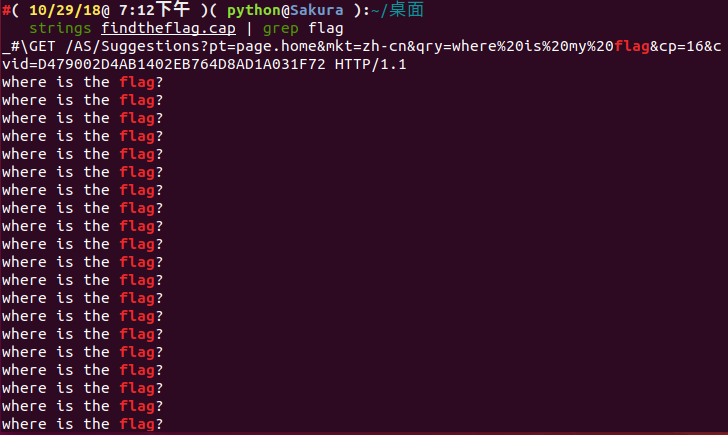


We found out that a lot of things were found. We filtered out the `flag` information through the pipeline, and it didn&#39;t seem to find the answer we needed to find.


**Step 2, Traffic Pack Repair**


We open this traffic packet with `wireshark`

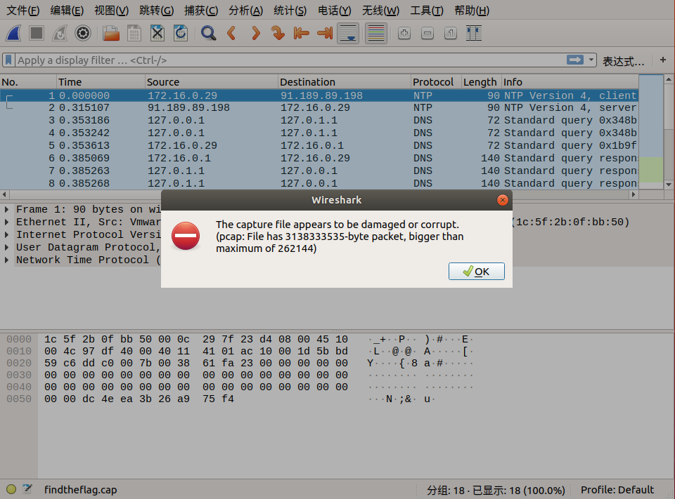


We found this traffic packet to be anomalous, we can fix this traffic packet.


Here we use an online tool: http://f00l.de/hacking/pcapfix.php


This tool helps us quickly fix its traffic package to the `pcap` package.


We will fix it online.


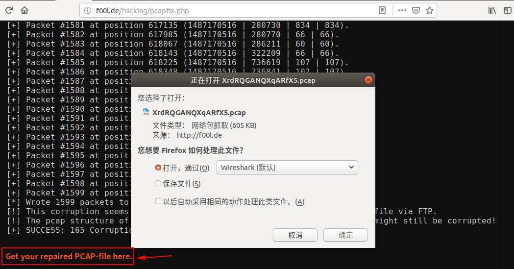


After the repair is complete, click `Get your repaired PCAP-file here.` to download the traffic package, then we open it with `wireshark`.


Since we still have to find `flag`, we can look at this traffic packet first.


**Step 3, Tracking TCP Streams**


Let&#39;s track the TCP stream and see if there is any breakthrough?


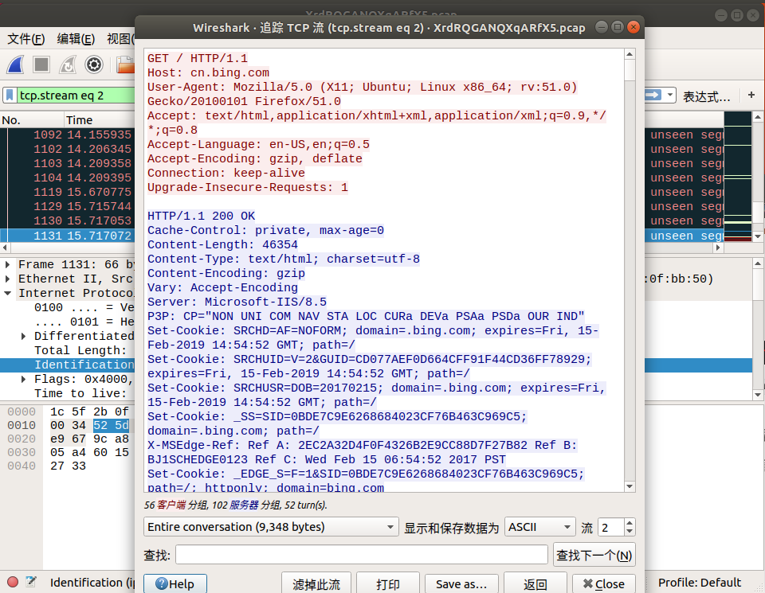


By tracking the `TCP` stream, we can see some version information, `cookie`, etc. We still found something interesting.


From `tcp.stream eq 29` to `tcp.stream eq 41` only shows the words `where is the flag?`, is this the person who is telling us `flag` here?


**Step 4, find the packet byte stream**


When we traced to `tcp.stream eq 29`, we saw the `lf` in `flag` in the `Identification` message. We can continue to track the next stream, `Identification in `tcp.stream eq 30` ` The message sees the `ga` in `flag`, we found that the fields corresponding to the `Identification` information in the two packages are combined from right to left, which is exactly `flag`! So we can boldly guess that `flag` is definitely hidden inside.


We can find the final flag directly by searching -&gt; string search -&gt; packet byte stream -&gt; search keyword `flag`, and connecting the fields corresponding to the `Identification` information of the subsequent connected packets in the same way. !


Here&#39;s a screenshot of the search:


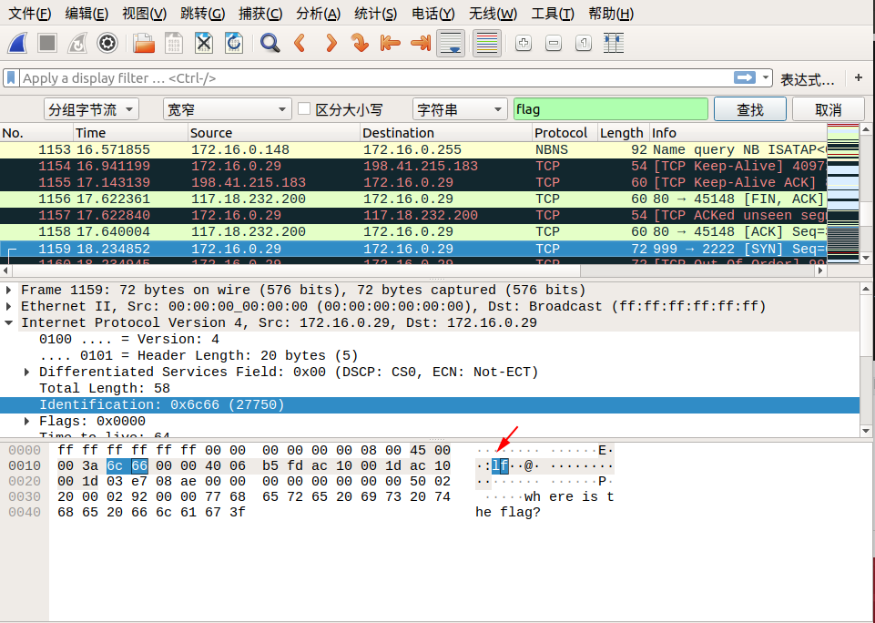


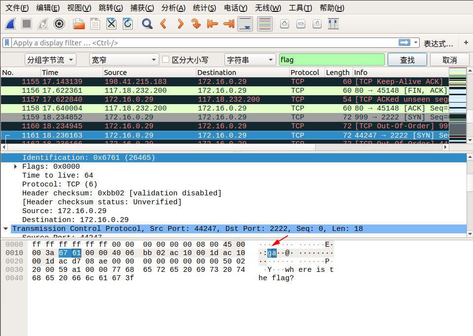


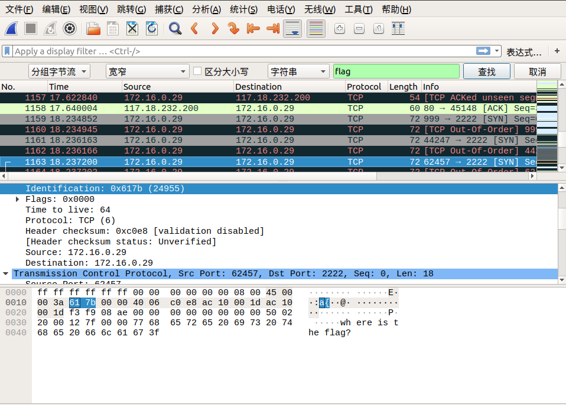


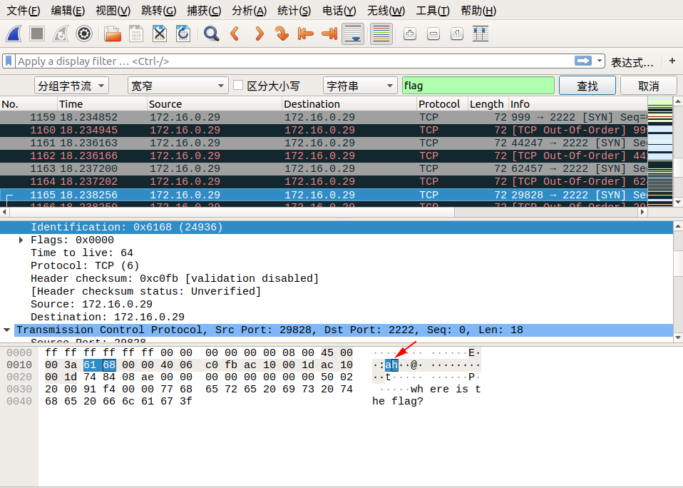


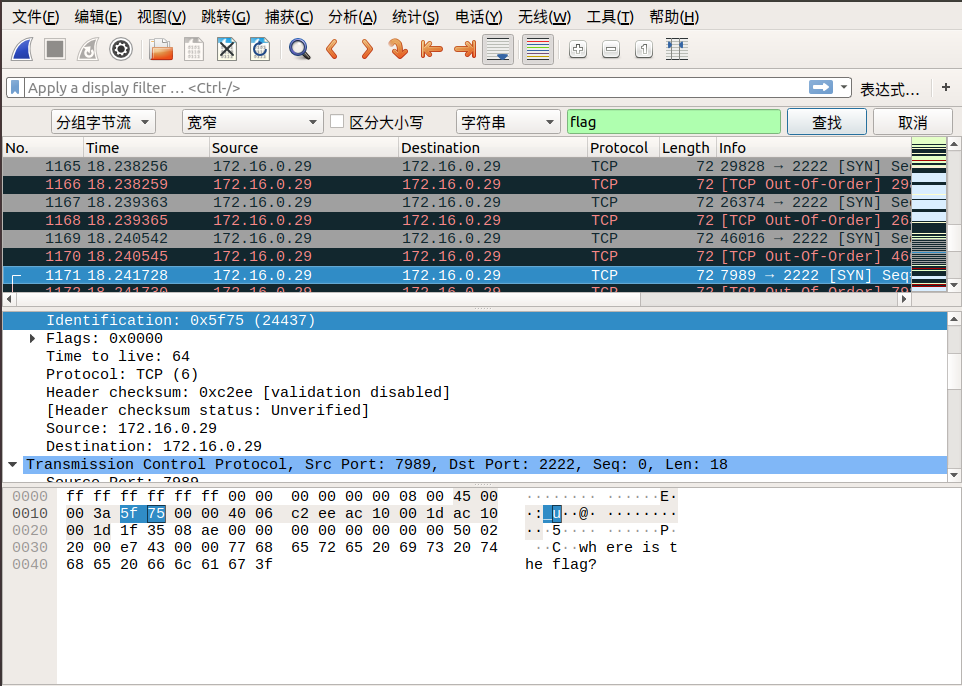


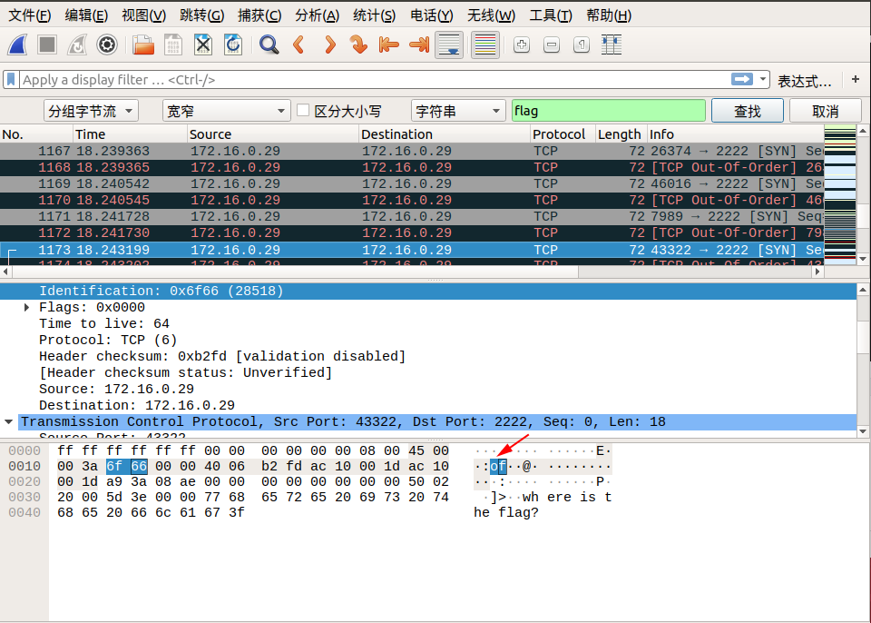


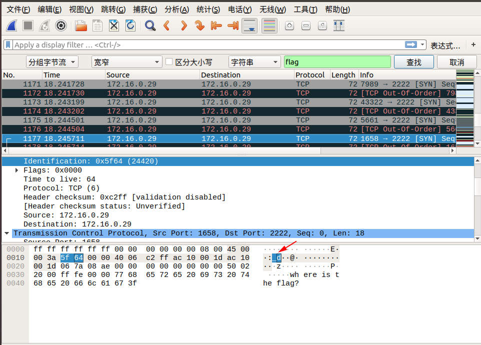


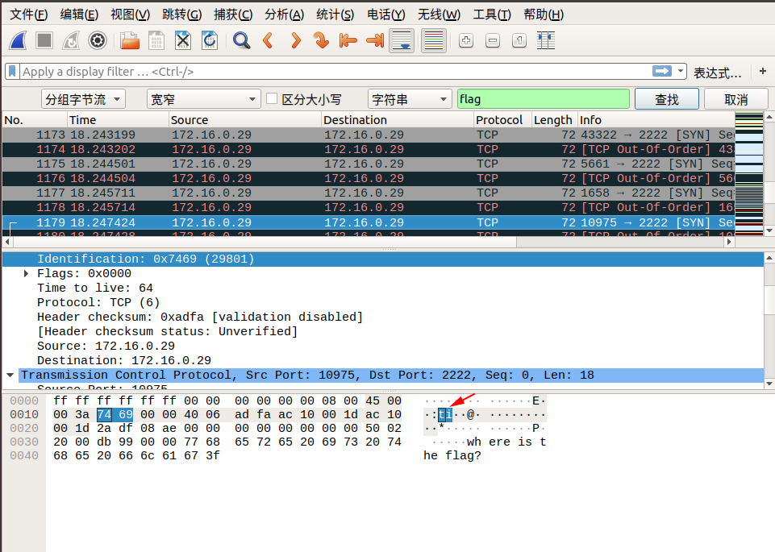


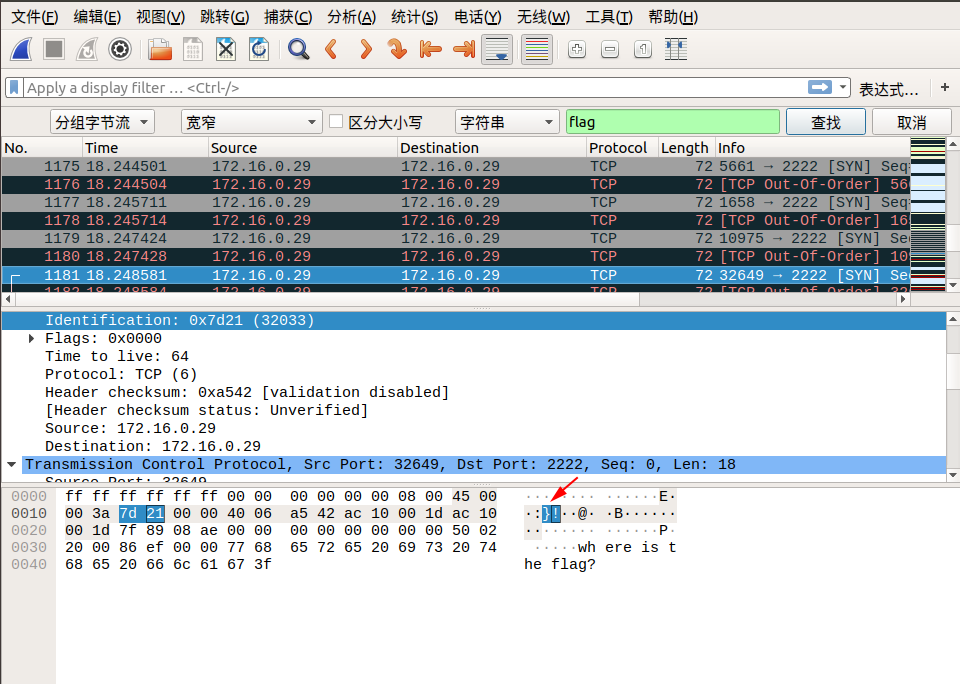


So the final `flag` is: **flag{aha!_you_found_it!}**


## references


- http://www.tcpdump.org/pcap/pcap.html

- https://zhuanlan.zhihu.com/p/27470338

- https://www.cnblogs.com/ECJTUACM-873284962/p/9884447.html


