## Wireshark 常用功能介绍

### 显示过滤器

显示过滤器可以用很多不同的参数来作为匹配标准，比如IP地址、协议、端口号、某些协议头部的参数。此外，用户也用一些条件工具和串联运算符创建出更加复杂的表达式。用户可以将不同的表达式组合起来，让软件显示的数据包范围更加精确。在数据包列表面板中显示的所有数据包都可以用数据包中包含的字段进行过滤。

```
[not] Expression [and|or] [not] Expression
```

经常要用到各种运算符

| 运算符 | 说明      |
| ------ | --------- |
| ==     | 等于      |
| !=     | 不等于    |
| >      | 大于      |
| <      | 小于      |
| >=     | 大于等于  |
| <=     | 小于等于  |
| 与     | and , &&  |
| 或     | or , \|\| |
| 非     | ! , not   |

#### 配置方法

1. 借助于过滤器窗口

    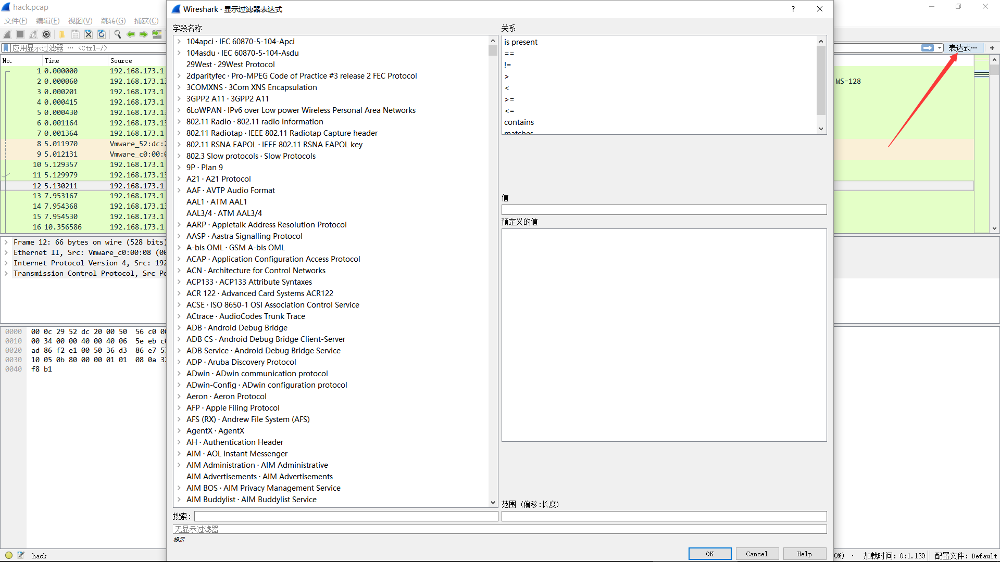

2. 借助于工具条的输入栏

    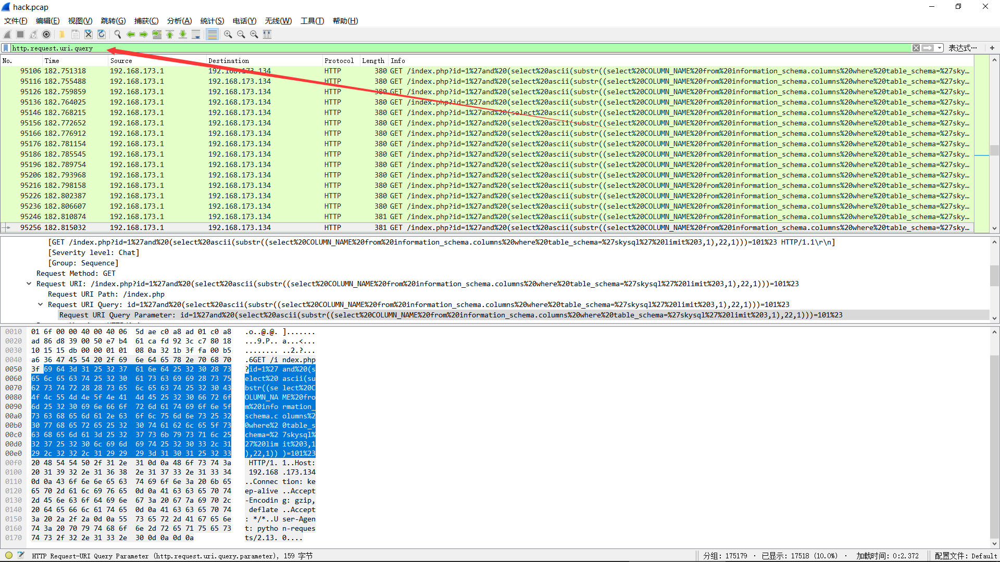

3. 将数据包某个属性值指定为过滤条件

    

!!! note
    复杂的过滤命令可以直接通过第三种方式得到过滤语法

### 信息统计

#### Protocol History(协议分级)

这个窗口现实的是捕捉文件包含的所有协议的树状分支

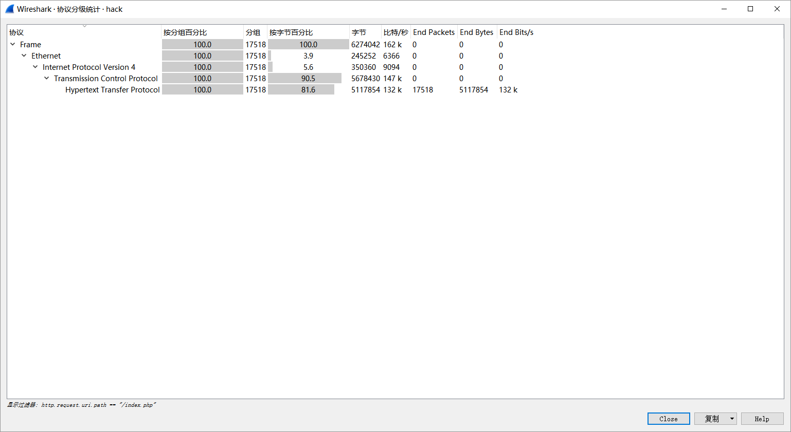

包含的字段

| 名称          | 含义                                           |
| ------------- | ---------------------------------------------- |
| Protocol：    | 协议名称                                       |
| % Packets：   | 含有该协议的包数目在捕捉文件所有包所占的比例   |
| Packets：     | 含有该协议的包的数目                           |
| Bytes：       | 含有该协议的字节数                             |
| Mbit/s：      | 抓包时间内的协议带宽                           |
| End Packets： | 该协议中的包的数目（作为文件中的最高协议层）   |
| End Bytes：   | 该协议中的字节数（作为文件中的最高协议层）     |
| End Mbit/s：  | 抓包时间内的协议带宽（作为文件中的最高协议层） |

这一功能可以为分析数据包的主要方向提供依据

#### Conversation(对话)

发生于一特定端点的IP间的所有流量.


!!! note
    - 查看收发大量数据流的IP地址。如果是你知道的服务器（你记得服务器的地址或地址范围），那问题就解决了；但也有可能只是某台设备正在扫描网络，或仅是一台产生过多数据的PC。
    - 查看扫描模式（scan pattern）。这可能是一次正常的扫描，如SNMP软件发送ping报文以查找网络，但通常扫描都不是好事情

#### EndPoints(端点)

这一工具列出了Wireshark发现的所有endpoints上的统计信息

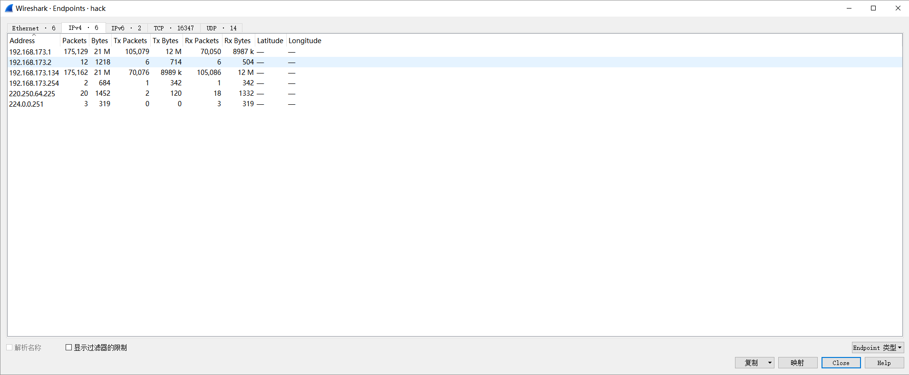

#### HTTP

- Packet Counter

    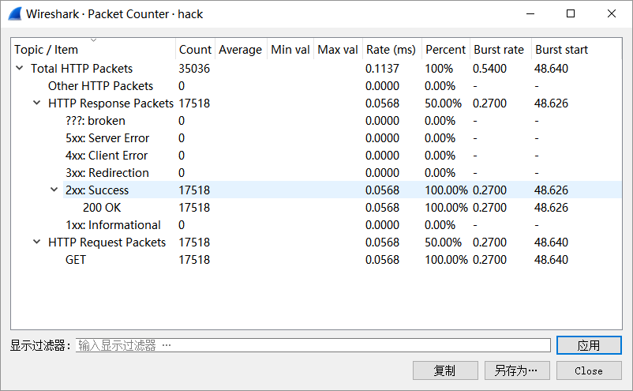


**参考**

- http://blog.jobbole.com/73482/
- http://www.vuln.cn/2103

### 信息统计 进阶版

根据总体信息迅速把握流量包总体特征,搞清楚 **做什么?**

TODO

## 常见协议

### HTTP/HTTPs

主要集中在流量中附件或是总体分析上,搞明白流量在做什么之后,基本可以定位到寻找flag的位置

#### HTTP

**例题**

<a href="file\hack.pcap">江苏省领航杯-2017:hack</a>

总体观察可以得出:

- `HTTP`为主
- `102.168.173.134`为主
- 不存在附件

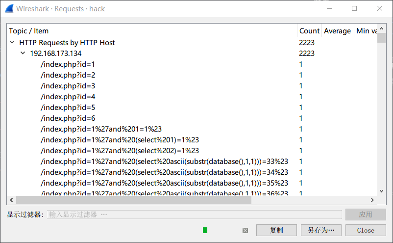

从这张图,基本可以判断初这是一个在`sql注入-盲注时产生的流量包`

到此为止,基本可以判断flag的方向,提取出所有的url后,用`python`辅助即可得到flag

- 提取url: `tshark -r hack.pcap -T fields  -e http.request.full_uri|tr -s '\n'|grep flag > log`

- 得到盲注结果

```python
import re

with open('log') as f:
    tmp = f.read()
    flag = ''
    data = re.findall(r'=(\d*)%23',tmp)
    data = [int(i) for i in data]
    for i,num in enumerate(data):
        try:
            if num > data[i+1]:
                flag += chr(num)
        except Exception:
            pass
    print flag
```


#### HTTPS

`HTTPs = HTTP + SSL / TLS`.服务端和客户端的信息传输都会通过TLS进行加密，所以传输的数据都是加密后的数据

- [wireshark分析HTTPs](http://www.freebuf.com/articles/system/37900.html)

**例题**:  
- [hack-dat-kiwi-ctf-2015:ssl-sniff-2](https://github.com/ctfs/write-ups-2015/tree/master/hack-dat-kiwi-ctf-2015/forensics/ssl-sniff-2)


打开流量包发现是SSL加密过的数据,导入题目提供的`server.key.insecure`,即可解密

```xml
GET /key.html HTTP/1.1
Host: localhost

HTTP/1.1 200 OK
Date: Fri, 20 Nov 2015 14:16:24 GMT
Server: Apache/2.4.7 (Ubuntu)
Last-Modified: Fri, 20 Nov 2015 14:15:54 GMT
ETag: "1c-524f98378d4e1"
Accept-Ranges: bytes
Content-Length: 28
Content-Type: text/html

The key is 39u7v25n1jxkl123
```

### FTP


### DNS

DNS通常为UDP协议,报文格式

```sh
+-------------------------------+
| 报文头                         |
+-------------------------------+
| 问题 (向服务器提出的查询部分)    |
+-------------------------------+
| 回答 (服务器回复的资源记录)      |
+-------------------------------+
| 授权 (权威的资源记录)           |
+-------------------------------+
| 格外的 (格外的资源记录)         |
+-------------------------------+
```

查询包只有头部和问题两个部分，DNS收到查询包后，根据查询到的信息追加回答信息、授权机构、额外资源记录，并且修改了包头的相关标识再返回给客户端。

每个question部分

```
   0  1  2  3  4  5  6  7  8  9  0  1  2  3  4  5
 +--+--+--+--+--+--+--+--+--+--+--+--+--+--+--+--+
 |                                               |
 /                     QNAME                     /
 /                                               /
 +--+--+--+--+--+--+--+--+--+--+--+--+--+--+--+--+
 |                     QTYPE                     |
 +--+--+--+--+--+--+--+--+--+--+--+--+--+--+--+--+
 |                     QCLASS                    |
 +--+--+--+--+--+--+--+--+--+--+--+--+--+--+--+--+
 ```

- QNAME：为查询的域名，是可变长的，编码格式为：将域名用.号划分为多个部分，每个部分前面加上一个字节表示该部分的长度，最后加一个0字节表示结束
- QTYPE：占16位，表示查询类型，共有16种，常用值有：1（A记录，请求主机IP地址）、2（NS，请求授权DNS服务器）、5（CNAME别名查询）


**例题**

- [BSides San Francisco CTF 2017 : dnscap-500](https://github.com/ctfs/write-ups-2017/tree/master/bsidessf-ctf-2017/forensics/dnscap-500)

- Step:

    - wireshark 打开发现全部为DNS协议,查询名为大量字符串`([\w\.]+)\.skullseclabs\.org`

    - `tshark -r dnscap.pcap -T fields -e dns.qry.name > hex`提取后，python转码

```python
import re


find = ""

with open('hex','rb') as f:
    for i in f:
        text = re.findall(r'([\w\.]+)\.skull',i)
        if text:
            find += text[0].replace('.','')
print find
```

- 发现几条关键信息

```
Welcome to dnscap! The flag is below, have fun!!
Welcome to dnscap! The flag is below, have fun!!
!command (sirvimes)
...
IHDR
gAMA
bKGD
        pHYs
IHDR
gAMA
bKGD
        pHYs
tIME
IDATx
...
2017-02-01T21:04:00-08:00
IEND
console (sirvimes)
console (sirvimes)
Good luck! That was dnscat2 traffic on a flaky connection with lots of re-transmits. Seriously,
Good luck! That was dnscat2 traffic on a flaky connection with lots of re-transmits. Seriously, d[
good luck. :)+
```
flag确实包含在其中,但是有大量重复信息,一是应为`question`在dns协议中查询和反馈时都会用到,` -Y "ip.src == 192.168.43.91"`进行过滤后发现还是有不少重复部分
```
%2A}
%2A}
%2A}q
%2A}x
%2A}
IHDR
gAMA
bKGD
        pHYs
tIME
IDATx
HBBH
CxRH!
C1%t
ceyF
i4ZI32
rP@1
ceyF
i4ZI32
rP@1
ceyF
i4ZI32
rP@1
ceyF
i4ZI32
rP@1
```

- 根据发现的`dnscat`找到 https://github.com/iagox86/dnscat2/blob/master/doc/protocol.md 这里介绍了`dnscat`协议的相关信息,这是一种通过DNS传递数据的变种协议,题目文件中应该未使用加密,所以直接看这里的数据块信息

```
MESSAGE_TYPE_MSG: [0x01]
(uint16_t) packet_id
(uint8_t) message_type [0x01]
(uint16_t) session_id
(uint16_t) seq
(uint16_t) ack
(byte[]) data
```

- 在`qry.name`中去除其余字段,只留下`data`快,从而合并数据,再从16进制中检索`89504e.....6082`提取`png`,得到flag

```python
import re


find = []

with open('hex','rb') as f:
    for i in f:
        text = re.findall(r'([\w\.]+)\.skull',i)
        if text:
            tmp =  text[0].replace('.','')
            find.append(tmp[18:])
last = []

for i in find:
    if i not in last:
        last.append(i)


print  ''.join(last)
```

*flag*

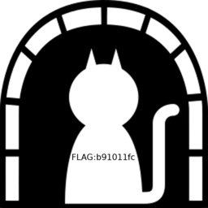


**相关题目**

- [IceCTF-2016:Search](https://mrpnkt.github.io/2016/icectf-2016-search/)
- [EIS-2017:DNS 101](https://github.com/susers/Writeups/blob/master/2017/EIS/Misc/DNS%20101/Write-up.md)

**参考**

- https://github.com/lisijie/homepage/blob/master/posts/tech/dns%E5%8D%8F%E8%AE%AE%E8%A7%A3%E6%9E%90.md
- https://xpnsec.tumblr.com/post/157479786806/bsidessf-ctf-dnscap-walkthrough

### WIFI

> 802.11是现今无线局域网通用的标准,常见认证方式
> - 不启用安全‍‍
> - WEP‍‍
> - WPA/WPA2-PSK（预共享密钥）‍‍
> - PA/WPA2 802.1X （radius认证）

#### WPA-PSK

认证大致过程如下图

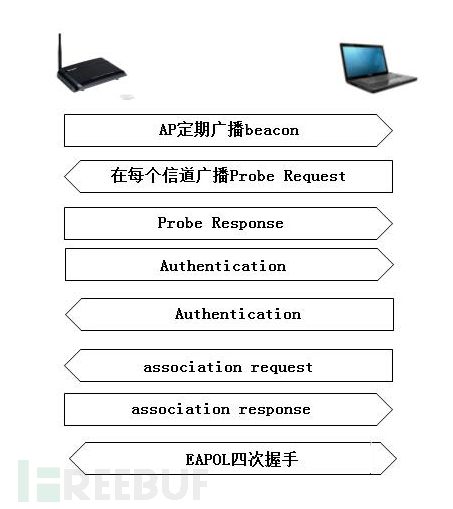

其中四次握手过程

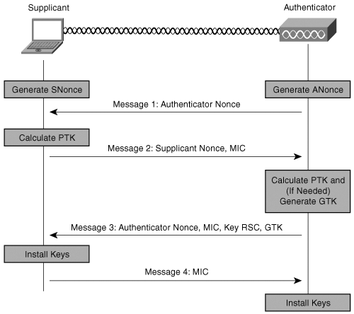

1. 4次握手开始于验证器(AP)，它产生一个随机的值(ANonce)发送给请求者
2. 请求者也产生了它自己的随机SNonce，然后用这两个Nonces以及PMK生成了PTK。请求者回复消息2给验证器,还有一个MIC（message integrity code，消息验证码）作为PMK的验证
3. 它先要验证请求者在消息2中发来的MIC等信息，验证成功后，如果需要就生成GTK。然后发送消息3
4. 请求者收到消息3，验证MIC，安装密钥，发送消息4，一个确认信息。验证器收到消息4，验证MIC，安装相同的密钥

**例题**  

- 实验吧: http://ctf5.shiyanbar.com/misc/shipin.cap

从大量的`Deauth` 攻击基本可以判断是一个破解wifi时的流量攻击

同时也成功发现了握手包信息

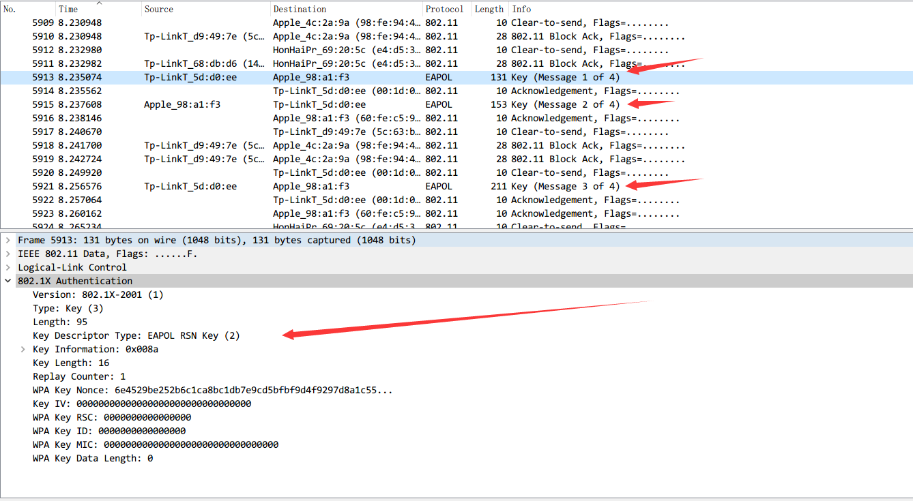

接下来跑密码

- linux: aircrack套件
- windows: wifipr,速度比esaw快,GTX850能将近10w\s  :)

得到密码`88888888`在wireshark中`Edit -> Preferences -> Protocols -> IEEE802.11 -> Edit`以`key:SSID`形式填入即可解密wifi包看到明文流量

> KCARCK相关: https://www.krackattacks.com/

**参考**

- http://www.freebuf.com/articles/wireless/58342.html
- http://blog.csdn.net/keekjkj/article/details/46753883

### USB

**USB详述**: [http://www.usb.org/developers/hidpage/Hut1_12v2.pdf](http://www.usb.org/developers/hidpage/Hut1_12v2.pdf)


- 鼠标协议

鼠标移动时表现为连续性，与键盘击键的离散性不一样，不过实际上鼠标动作所产生的数据包也是离散的，毕竟计算机表现的连续性信息都是由大量离散信息构成的

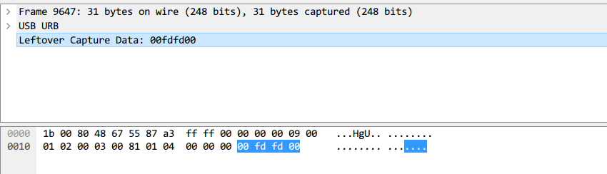

每一个数据包的数据区有四个字节，第一个字节代表按键，当取0x00时，代表没有按键、为0x01时，代表按左键，为0x02时，代表当前按键为右键。第二个字节可以看成是一个signed byte类型，其最高位为符号位，当这个值为正时，代表鼠标水平右移多少像素，为负时，代表水平左移多少像素。第三个字节与第二字节类似，代表垂直上下移动的偏移。

得到这些点的信息后,即可恢复出鼠标移动轨迹

- Tools
    - [UsbMiceDataHacker](https://github.com/WangYihang/UsbMiceDataHacker)

- 键盘协议

键盘数据包的数据长度为8个字节，击键信息集中在第3个字节


根据data值与具体键位的对应关系


可从数据包恢复出键盘的案件信息

- Tools
    - [UsbKeyboardDataHacker](https://github.com/WangYihang/UsbKeyboardDataHacker)

**参考**
- https://www.anquanke.com/post/id/85218
