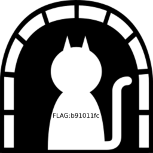

[EN](./DNS.md) | [ZH](./DNS-zh.md)
### DNS

`DNS` 通常为 `UDP` 协议,报文格式

```sh
+-------------------------------+
| 报文头                         |
+-------------------------------+
| 问题 (向服务器提出的查询部分)    |
+-------------------------------+
| 回答 (服务器回复的资源记录)      |
+-------------------------------+
| 授权 (权威的资源记录)           |
+-------------------------------+
| 格外的 (格外的资源记录)         |
+-------------------------------+
```

查询包只有头部和问题两个部分， `DNS` 收到查询包后，根据查询到的信息追加回答信息、授权机构、额外资源记录，并且修改了包头的相关标识再返回给客户端。

每个 `question` 部分

```
   0  1  2  3  4  5  6  7  8  9  0  1  2  3  4  5
 +--+--+--+--+--+--+--+--+--+--+--+--+--+--+--+--+
 |                                               |
 /                     QNAME                     /
 /                                               /
 +--+--+--+--+--+--+--+--+--+--+--+--+--+--+--+--+
 |                     QTYPE                     |
 +--+--+--+--+--+--+--+--+--+--+--+--+--+--+--+--+
 |                     QCLASS                    |
 +--+--+--+--+--+--+--+--+--+--+--+--+--+--+--+--+
```

- `QNAME` ：为查询的域名，是可变长的，编码格式为：将域名用.号划分为多个部分，每个部分前面加上一个字节表示该部分的长度，最后加一个 `0` 字节表示结束
- `QTYPE` ：占 `16` 位，表示查询类型，共有 `16` 种，常用值有：`1` ( `A` 记录，请求主机 `IP` 地址)、`2` ( `NS` ，请求授权 `DNS` 服务器)、`5` ( `CNAME` 别名查询）


### 例题

> 题目：`BSides San Francisco CTF 2017` ： `dnscap.pcap` 

我们通过 `wireshark` 打开发现全部为 `DNS` 协议,查询名为大量字符串`([\w\.]+)\.skullseclabs\.org`

我们通过 `tshark -r dnscap.pcap -T fields -e dns.qry.name > hex`提取后，利用 `python` 转码：

```python
import re


find = ""

with open('hex','rb') as f:
    for i in f:
        text = re.findall(r'([\w\.]+)\.skull',i)
        if text:
            find += text[0].replace('.','')
print find
```

我们发现了几条关键信息：

```
Welcome to dnscap! The flag is below, have fun!!
Welcome to dnscap! The flag is below, have fun!!
!command (sirvimes)
...
IHDR
gAMA
bKGD
        pHYs
IHDR
gAMA
bKGD
        pHYs
tIME
IDATx
...
2017-02-01T21:04:00-08:00
IEND
console (sirvimes)
console (sirvimes)
Good luck! That was dnscat2 traffic on a flaky connection with lots of re-transmits. Seriously,
Good luck! That was dnscat2 traffic on a flaky connection with lots of re-transmits. Seriously, d[
good luck. :)+
```

`flag` 确实包含在其中,但是有大量重复信息,一是应为`question` 。在 `dns` 协议中查询和反馈时都会用到，` -Y "ip.src == 192.168.43.91"`进行过滤后发现还是有不少重复部分。

```
%2A}
%2A}
%2A}q
%2A}x
%2A}
IHDR
gAMA
bKGD
        pHYs
tIME
IDATx
HBBH
CxRH!
C1%t
ceyF
i4ZI32
rP@1
ceyF
i4ZI32
rP@1
ceyF
i4ZI32
rP@1
ceyF
i4ZI32
rP@1
```

根据发现的 `dnscat` 找到 https://github.com/iagox86/dnscat2/blob/master/doc/protocol.md 这里介绍了 `dnscat` 协议的相关信息,这是一种通过 `DNS` 传递数据的变种协议,题目文件中应该未使用加密,所以直接看这里的数据块信息

```
MESSAGE_TYPE_MSG: [0x01]
(uint16_t) packet_id
(uint8_t) message_type [0x01]
(uint16_t) session_id
(uint16_t) seq
(uint16_t) ack
(byte[]) data
```

在`qry.name`中去除其余字段,只留下 `data` 快,从而合并数据,再从 `16` 进制中检索`89504e.....6082`提取`png`,得到 `flag` 。

```python
import re


find = []

with open('hex','rb') as f:
    for i in f:
        text = re.findall(r'([\w\.]+)\.skull',i)
        if text:
            tmp =  text[0].replace('.','')
            find.append(tmp[18:])
last = []

for i in find:
    if i not in last:
        last.append(i)


print  ''.join(last)
```

*flag*




### 相关题目

- [IceCTF-2016:Search](https://mrpnkt.github.io/2016/icectf-2016-search/)
- [EIS-2017:DNS 101](https://github.com/susers/Writeups/blob/master/2017/EIS/Misc/DNS%20101/Write-up.md)

### 参考文献

- https://github.com/lisijie/homepage/blob/master/posts/tech/dns%E5%8D%8F%E8%AE%AE%E8%A7%A3%E6%9E%90.md
- https://xpnsec.tumblr.com/post/157479786806/bsidessf-ctf-dnscap-walkthrough