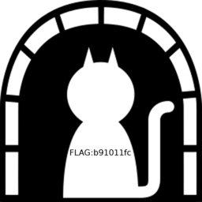

[EN](./DNS.md) | [ZH](./DNS-zh.md)
### DNS


`DNS` is usually `UDP` protocol, message format


```sh

+-------------------------------+

| Message Head |
+-------------------------------+

| Question (part of the query to the server) |
+-------------------------------+

| Answer (resource record of server reply) |
+-------------------------------+

| Authorization (authoritative resource record) |
+-------------------------------+

| Extraordinary (extra resource record) |
+-------------------------------+

```


The query packet has only the header and the problem. After receiving the query packet, `DNS` appends the reply information, the authority, and the additional resource record according to the information that is queried, and modifies the relevant identifier of the packet header and returns it to the client.


Each `question` section


```

   0  1  2  3  4  5  6  7  8  9  0  1  2  3  4  5

 +--+--+--+--+--+--+--+--+--+--+--+--+--+--+--+--+

 |                                               |

 /                     QNAME                     /

 /                                               /

 +--+--+--+--+--+--+--+--+--+--+--+--+--+--+--+--+

 |                     QTYPE                     |

 +--+--+--+--+--+--+--+--+--+--+--+--+--+--+--+--+

 |                     QCLASS                    |

 +--+--+--+--+--+--+--+--+--+--+--+--+--+--+--+--+

```


- `QNAME`: The domain name of the query is variable length. The encoding format is: divide the domain name into multiple parts with a ., each part is preceded by a byte to indicate the length of the part, and finally add one. 0` byte indicates the end
- `QTYPE`: occupies the `16` bit, indicating the query type. There are a total of `16`. Common values are: `1` ( `A` record, request host `IP` address), `2` ( `NS` , Request authorization `DNS` server), `5` ( `CNAME` alias query)


### Example


&gt; Title: `BSides San Francisco CTF 2017` : `dnscap.pcap`


We open all the `DNS` protocols through `wireshark`, and the query name is a large number of strings `([\w\.]+)\.skullseclabs\.org`


We use `tshark -r dnscap.pcap -T fields -e dns.qry.name &gt; hex` to extract and use `python` to transcode:


```python

import re


find = ""


with open('hex','rb') as f:

    for i in f:

        text = re.findall(r'([\w\.]+)\.skull',i)

        if text:

            find += text[0].replace('.','')

print find

```


We found a few key pieces of information:


```

Welcome to dnscap! The flag is below, have fun!!

Welcome to dnscap! The flag is below, have fun!!

! command (browser)
...

IHDR
range
bKGD

        pHYs

IHDR
range
bKGD

        pHYs

tIME

IDATx
...

2017-02-01T21:04:00-08:00

IEND
console
console
Good luck! That was dnscat2 traffic on a flaky connection with lots of re-transmits. Seriously,

Good luck! That was dnscat2 traffic on a flaky connection with lots of re-transmits. Seriously, d[

good luck. :)+

```


`flag` is indeed included, but there is a lot of duplicate information, one should be `question`. It will be used in the query and feedback in the `dns` protocol. `-Y &quot;ip.src == 192.168.43.91&quot;` After filtering, there are still many duplicates.


```

% 2A}
% 2A}
%2A}q

%2A}x

% 2A}
IHDR
range
bKGD

        pHYs

tIME

IDATx
HBBB
CxRH!
C1%t

cheyF
i4ZI32

rP @ 1
cheyF
i4ZI32

rP @ 1
cheyF
i4ZI32

rP @ 1
cheyF
i4ZI32

rP @ 1
```


According to the found `dnscat`, find https://github.com/iagox86/dnscat2/blob/master/doc/protocol.md. Here is the information about the `dnscat` protocol, which is a kind of data passing through `DNS`. Variant protocol, encryption should not be used in the title file, so look directly at the data block information here.


```

MESSAGE_TYPE_MSG: [0x01]

(uint16_t) packet_id

(uint8_t) message_type [0x01]

(uint16_t) session_id
(uint16_t) seq

(uint16_t) ah
(byte[]) data

```


Remove the rest of the fields in `qry.name`, leaving only `data` fast, thus merging the data, then retrieving `89504e.....6082` from the `16` binary to extract `png` and get `flag` .


```python

import re


find = []


with open('hex','rb') as f:

    for i in f:

        text = re.findall(r'([\w\.]+)\.skull',i)

        if text:

            tmp =  text[0].replace('.','')

            find.append(tmp[18:])

last = []


for i in find:

    if i not in last:

        last.append(i)


print  ''.join(last)

```


*flag*





### Related topics


- [IceCTF-2016:Search](https://mrpnkt.github.io/2016/icectf-2016-search/)

- [EIS-2017:DNS 101](https://github.com/susers/Writeups/blob/master/2017/EIS/Misc/DNS%20101/Write-up.md)


### references


- https://github.com/lisijie/homepage/blob/master/posts/tech/dns%E5%8D%8F%E8%AE%AE%E8%A7%A3%E6%9E%90.md

- https://xpnsec.tumblr.com/post/157479786806/bsidessf-ctf-dnscap-walkthrough