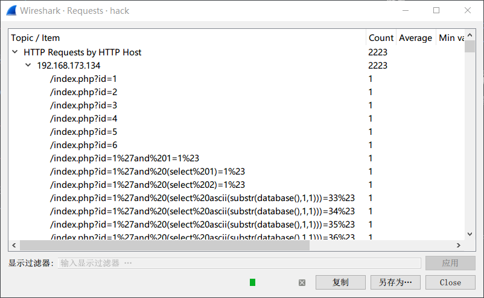

[EN](./HTTP.md) | [ZH](./HTTP-zh.md)
### HTTP

`HTTP` ( `Hyper Text Transfer Protocol` ，也称为超文本传输协议)是一种用于分布式、协作式和超媒体信息系统的应用层协议。 `HTTP` 是万维网的数据通信的基础。

### 例题

> 题目：江苏省领航杯-2017：hack

总体观察可以得出:

- `HTTP`为主
- `192.168.173.134`为主
- 不存在附件



从这张图,基本可以判断初这是一个在`sql注入-盲注时产生的流量包`

到此为止,基本可以判断flag的方向,提取出所有的url后,用`python`辅助即可得到flag

- 提取url: `tshark -r hack.pcap -T fields  -e http.request.full_uri|tr -s '\n'|grep flag > log`
- 得到盲注结果

```python
import re

with open('log') as f:
    tmp = f.read()
    flag = ''
    data = re.findall(r'=(\d*)%23',tmp)
    data = [int(i) for i in data]
    for i,num in enumerate(data):
        try:
            if num > data[i+1]:
                flag += chr(num)
        except Exception:
            pass
    print flag
```
